# 文件和目录

- [文件和目录](#文件和目录)
  - [前言](#前言)
  - [stat、fstat、fstatat 和 lstat](#statfstatfstatat-和-lstat)
  - [文件类型](#文件类型)
    - [example_filedir](#example_filedir)
  - [设置用户 ID 和设置组 ID](#设置用户-id-和设置组-id)
  - [文件访问权限](#文件访问权限)
  - [新文件和目录的所有权](#新文件和目录的所有权)
  - [函数 access 和 faccessat](#函数-access-和-faccessat)
    - [example_access](#example_access)
  - [umask 函数原型](#umask-函数原型)
    - [example_umask](#example_umask)
  - [chmod、fchmod 和 fchmodat 函数原型](#chmodfchmod-和-fchmodat-函数原型)
    - [example_chmod](#example_chmod)
  - [黏着位](#黏着位)
  - [chown、fchown、fchownat 和 lchown 函数原型](#chownfchownfchownat-和-lchown-函数原型)
  - [文件长度](#文件长度)
  - [文件截断](#文件截断)
  - [文件系统](#文件系统)
  - [link 、linkat 、unlink 、unlinkat 和 remove 函数原型](#link-linkat-unlink-unlinkat-和-remove-函数原型)
    - [example_unlink](#example_unlink)
  - [rename 和 renameat 函数原型](#rename-和-renameat-函数原型)
  - [符号链接](#符号链接)
  - [创建和读取符号链接](#创建和读取符号链接)
  - [文件时间](#文件时间)
  - [futimens、utimensat 和 utimes 函数原型](#futimensutimensat-和-utimes-函数原型)
  - [mkdir、mkdirat 和 rmdir 函数原型](#mkdirmkdirat-和-rmdir-函数原型)
  - [读目录](#读目录)
    - [example_ftw8](#example_ftw8)
  - [chdir、fchdir 和 getcwd 函数原型](#chdirfchdir-和-getcwd-函数原型)
    - [example_mycd](#example_mycd)
    - [example_cdpwd](#example_cdpwd)
  - [设备特殊文件](#设备特殊文件)
    - [example_stdev](#example_stdev)

> 注意：文章中使用到的源码都在我的 github 中找到，传送门：[SourceCode](https://github.com/HATTER-LONG/SourceCodeByAPUE3e)

## 前言

本章基于上一章节对文件 I/O 的基础上讲解了文件系统的其他特征与文件特性，详细讲述了文件的描述结构与属性。最后介绍了对目录操作的方法函数。

## stat、fstat、fstatat 和 lstat

函数原型如下：

```cpp
#include <sys/types.h>
#include <sys/stat.h>
#include <unistd.h>

int stat(const char *pathname, struct stat *statbuf);
int fstat(int fd, struct stat *statbuf);
int lstat(const char *pathname, struct stat *statbuf);

#include <fcntl.h>           /* Definition of AT_* constants */
#include <sys/stat.h>

int fstatat(int dirfd, const char *pathname, struct stat *statbuf, int flags);;
//函数的返回：若成功则为 0，若出错则为-1
```

1. stat 用于获取 `pathname` 路径所指向的文件信息，函数执行者不需要文件的读写执行权限，但是要对路径中各级木有拥有搜索权限。
2. fstat 用于获取`已经打开的文件描述符 fd` 的文件信息。
3. lstat 和 stat 类似，但是当路径指向为符号链接时 lstat 返回链接本身信息，而 stat 返回对应的文件信息。
4. fstat 等价于 stat 和 lstat 函数，当 AT_FDCWD 传入 fd 参数（AT_FDCWD 标识标识当前进程执行目录的相对目录）并且路径参数为相对路径时，将会计算基于当前工作目录的文件；如果路径为绝对路径，则 fd 参数被忽略，这个函数实际上是前面几个函数的功能集合版本。

```cpp
 struct stat {
    dev_t     st_dev;         /* ID of device containing file */
    ino_t     st_ino;         /* Inode number */
    mode_t    st_mode;        /* File type and mode */
    nlink_t   st_nlink;       /* Number of hard links */
    uid_t     st_uid;         /* User ID of owner */
    gid_t     st_gid;         /* Group ID of owner */
    dev_t     st_rdev;        /* Device ID (if special file) */
    off_t     st_size;        /* Total size, in bytes */
    blksize_t st_blksize;     /* Block size for filesystem I/O */
    blkcnt_t  st_blocks;      /* Number of 512B blocks allocated */

    /* Since Linux 2.6, the kernel supports nanosecond
        precision for the following timestamp fields.
        For the details before Linux 2.6, see NOTES. */

    struct timespec st_atim;  /* Time of last access */
    struct timespec st_mtim;  /* Time of last modification */
    struct timespec st_ctim;  /* Time of last status change */

#define st_atime st_atim.tv_sec      /* Backward compatibility */
#define st_mtime st_mtim.tv_sec
#define st_ctime st_ctim.tv_sec
};
```

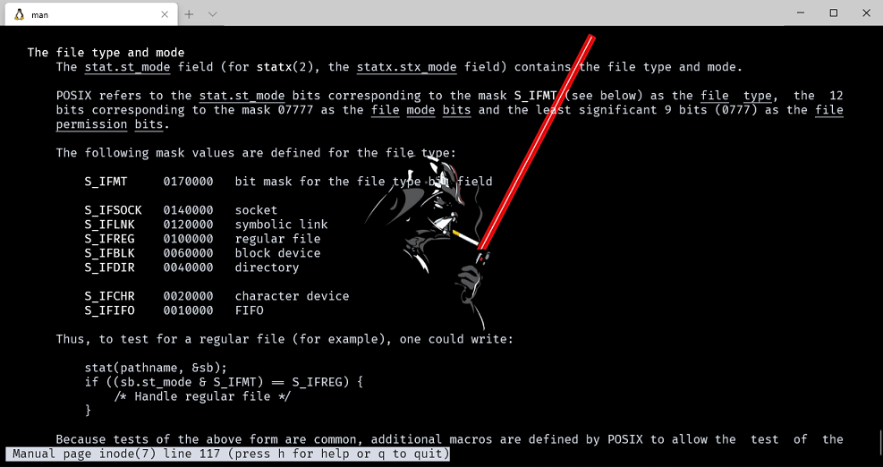

## 文件类型

1. **普通文件 (regular file):** 这是最常见的文件类型，这种文件包含了某种形式的数据。至于这种数据是文本还是二进制数据对于内核而言并无区别。对普通文件内容的解释由处理该文件的应用程序进行。
2. **目录文件 (directory file):** 这种文件包含了其他文件的名字以及指向与这些文件有关信息的指针。对一个目录文件具有读许可权的任一进程都可以读该目录的内容，但只有内核可以写目录文件。
3. **字符特殊文件 (character special file):** 这种文件用于系统中某些类型的设备。
4. **块特殊文件 (block special file):** 这种文件典型地用于磁盘设备。系统中的所有设备或者是字符特殊文件，或者是块特殊文件。
5. **FIFO:** 这种文件用于进程间的通信，有时也将其称为命名管道。 15.5节将对其进行说明。
6. **套接口 (socket):** 这种文件用于进程间的网络通信。套接口也可用于在一台宿主机上的进程之间的非网络通信。第16章将用套接口进行进程间的通信。
7. **符号链接 (symbolic link):** 这种类型的文件指向另一个文件。

文件类型信息包含在 stat 结构的 st_mode 成员中。可以用下图宏确定文件类型，这些宏的参数都是 stat 结构中的 st_mode 成员。
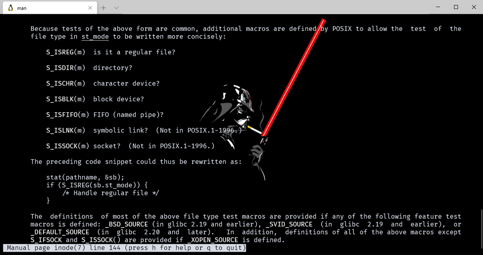

### example_filedir

使用 lstat 获取目标路径文件信息。

```cpp
#include "apue.h"

int main(int argc, char* argv[])
{
    int i;
    struct stat buf;
    char* ptr;

    for (i = 1; i < argc; i++)
    {
        printf("%s: ", argv[i]);
        if (lstat(argv[i], &buf) < 0)
        {
            err_ret("lstat error");
            continue;
        }
        if (S_ISREG(buf.st_mode))
            ptr = "regular";
        else if (S_ISDIR(buf.st_mode))
            ptr = "directory";
        else if (S_ISCHR(buf.st_mode))
            ptr = "character special";
        else if (S_ISBLK(buf.st_mode))
            ptr = "block special";
        else if (S_ISFIFO(buf.st_mode))
            ptr = "fifo";
        else if (S_ISLNK(buf.st_mode))
            ptr = "symbolic link";
        else if (S_ISSOCK(buf.st_mode))
            ptr = "socket";
        else
            ptr = "** unknown mode **";
        printf("%s\n", ptr);
    }

    exit(0);
}
```

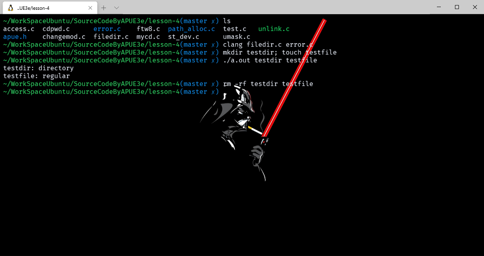

## 设置用户 ID 和设置组 ID

对于一个存在于磁盘上的文件来说，它只有**一个拥有者 uid 和组编号 gid**，分别被保存在 **stat 结构体的 st_uid 和 st_gid 中**，但是对于进程来说关联的 ID 有 6 个或者更多，原著中提到了 6 个 ID。

- 实际用户和组 ID 是在登陆时取自口令文件，在一个会话中是不会改变的; 除了 root 权限进程外，当一个文件的所有者为 root 且设置了文件用户 ID 位，则执行时都具有 root 权限。
- 有效用户 ID 和有效组 ID 是最重要的，因为它们才包含了进程可访问的权限，包括各种文件、端口的打开，等等资源的使用都是依赖有效用户 ID 和有效组 ID，实际用户 ID 和实际组 ID 则是继承于 shell 的会话用户，因为是 shell 启动的进程。
- 至于保存的设置用户 ID 和保存的设置组 ID 则是用于 exec 派生子进程时给子进程的实际用户 ID 和实际组 ID。
  - 通常来说，有效用户 ID 等于实际用户 ID，有效组 ID 等于实际组 ID。除了 rwx 权限以外，还有 s 权限，这就是设置用户 ID 和设置组 ID，它能让进程有效用户 ID 和有效组 ID 等于程序拥有者的 uid 和 gid，当运行一个程序文件时，可是在 st_mode 中设置特殊标识位将执行此文件的进程的有效组 ID 设置为文件的组所有者 ID。

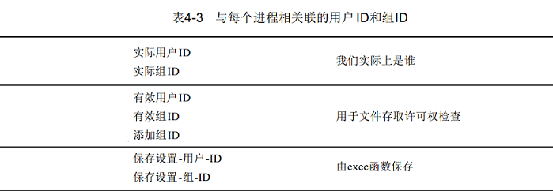

## 文件访问权限

st_mode 值也包含了对文件的存取许可权位，每个文件有 9 个存取许可权位，可将它们分成三类：

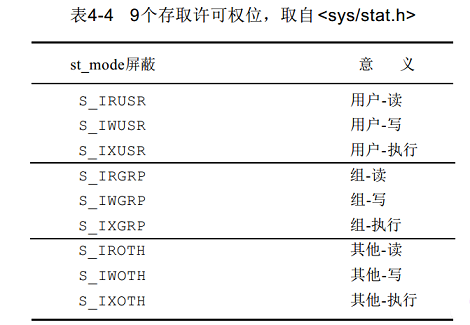

chmod 命令用于修改这 9 个许可权位。该命令允许我们用 u 表示用户(所有者)，用 g 表示组，用 o 表示其他。

> example: 例如给文件添加可执行权限  chmod u+x file 用户标识(u) + 权限(x)

- Unix 对于权限管理有一些规则：
  1. 用名字打开任一类型的文件时，对该名字(路径上)中包含的每一个目录，包括它可能隐含的当前工作目录**都应具有执行许可权**。这就是为什么对于目录其执行许可权位常被称为搜索位的原因。
  2. 对于一个文件的读权限决定了我们能否打开现有文件进行读操作。同理进行写操作也是这样。
  3. 为了在 open 函数中对一个文件指定 O_TRUNC (若文件存在则长度截断为 0，相当于清空文件)标志，必须对该文件具有写许可权。其他对于文件操作的权限规则：
     1. 为了在一个目录中创建一个新文件，必须对该目录具有写许可权和执行许可权。
     2. 为了删除一个文件，必须对包含该文件的目录具有写许可权和执行许可权。对该文件本身则不需要有读、写许可权。
     3. 如果用 7 个 exec 函数（见 8.10 节）中的任何一个执行某个文件，都必须对该文件具有执行许可权。
  4. 进程每次打开、创建或删除一个文件时，内核就进行文件存取许可权测试，
     1. 若进程的有效用户 ID 是 0 (超级用户)，则允许存取。
     2. 若进程的有效用户 ID 等于文件的所有者 ID。
     3. 若进程的有效组 ID 或进程的添加组 ID 之一等于文件的组 ID。
     4. 若适当的其他用户存取许可权位被设置，则允许存取，否则拒绝存取。

## 新文件和目录的所有权

新文件的用户 ID 设置为创建文件进程的有效用户 ID。关于组 ID，POSIX.1 允许选择下列之一作为新文件的组 ID。新文件的组 ID 可以是进程的有效组 ID 也可以是它所在目录的组 ID。
目录的所有权规则与文件相同，`一切皆文件么`😀。

## 函数 access 和 faccessat

当 open 函数打开一个文件时，内核以进程的有效用户 ID 和有效组 ID 来进行权限测试。access 和 faccessat 函数是按照实际用户 ID 和实际组 ID 进行权限访问测试。

```cpp
#include <unistd.h>

int access(const char *pathname, int mode);

#include <fcntl.h>           /* Definition of AT_* constants */
#include <unistd.h>

int faccessat(int dirfd, const char *pathname, int mode, int flags);
```

> faccessat 如果在 pathname 中给定的路径名​​是相对的，则它相对于文件描述符 dirfd 所引用的目录进行解释（而不是相对于调用进程的当前工作目录，如使用相对路径名的access 所做的那样）。如果路径名是相对的并且 dirfd 是特殊值 AT_FDCWD，则路径名将相对于调用进程的当前工作目录进行解释。 如果路径名是绝对的，则dirfd被忽略。 标志是通过对以下零个或多个值进行或运算来构造的：AT_EACCESS使用有效的用户ID和组ID执行访问检查。 默认情况下，faccessat（）使用真实ID（如access（））。 AT_SYMLINK_NOFOLLOW如果路径名是符号链接，请不要取消引用它：而是返回有关链接本身的信息。

faccessat mode 如下：

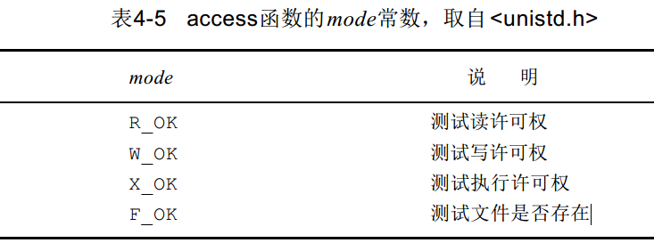

### example_access

使用 access 判断当前目录权限并测试以只读 open 是否成功：

```cpp
#include "apue.h"
#include <fcntl.h>

int main(int argc, char* argv[])
{
    if (argc != 2)
        err_quit("usage: a.out <pathname>");
    if (access(argv[1], R_OK) < 0)
        err_ret("access error for %s", argv[1]);
    else
        printf("read access OK\n");
    if (open(argv[1], O_RDONLY) < 0)
        err_ret("open error for %s", argv[1]);
    else
        printf("open for reading OK\n");
    exit(0);
}
```

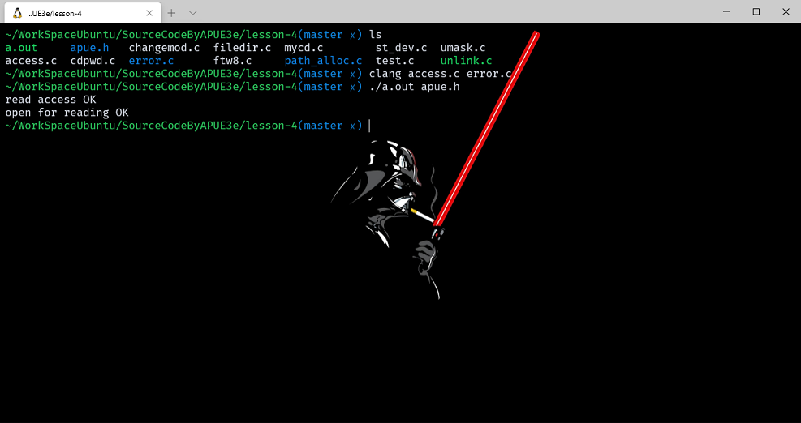

>rwx前一个字符对应文件类型：
> -就是普通的文件，d表示是目录， c表示是字符设备（在linux/unix，所有的设备都是文件），b是块设备文件， s是socket文件，等等。下面给出所有文件类型标识：
>
>1. `-' regular file
>2. `b' block special file
>3. `c'character special file
>4. `C'high performance ("contiguous data") file
>5. `d' directory
>6. `D'door (Solaris 2.5 and up)
>7. `l'symbolic link
>8. `M' off-line ("migrated") file (Cray DMF)
>9. `n'network special file (HP-UX)
>10. `p'FIFO (named pipe)
>11. `P' port (Solaris 10 and up)
>12. `s'socket
>13. `?'some other file type

## umask 函数原型

umask 函数为进程设置文件方式创建屏蔽字，并返回以前的值。 (这是少数几个没有出错返回的函数中的一个。 )

```cpp
#include <sys/types.h>
#include <sys/stat.h>

mode_t umask(mode_t mask);
//返回：以前的文件方式创建屏蔽字
```

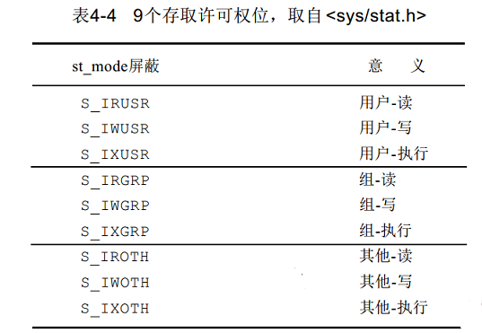

### example_umask

创建文件使用不同的进程 umask 权限

```cpp
#include "apue.h"
#include <fcntl.h>

#define RWRWRW (S_IRUSR | S_IWUSR | S_IRGRP | S_IWGRP | S_IROTH | S_IWOTH)

int main(void)
{
    umask(0);
    if (creat("foo", RWRWRW) < 0)
        err_sys("creat error for foo");
    umask(S_IRGRP | S_IWGRP | S_IROTH | S_IWOTH);
    if (creat("bar", RWRWRW) < 0)
        err_sys("creat error for bar");
    exit(0);
}
```

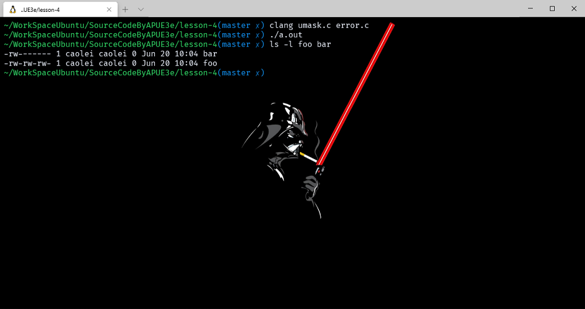

## chmod、fchmod 和 fchmodat 函数原型

这三个函数使我们可以更改现存文件的存取许可权。

```cpp
#include <sys/types.h>
#include <sys/stat.h>
int chmod(const  char * pathname, mode_t  mode) ;
int fchmod(int  filedes, mode_t  mode)
int fchmodat(int fd , const char * pathname ,mode_t mode , int flag);
//三个函数返回：若成功则为 0，若出错则为-1
```

chmod 函数在指定的文件上进行操作，而 fchmod 函数则对已打开的文件进行操作。fchmodat 函数与 chmod 函数在这两种情况下是相通的：1，pathname 参数为绝对路径，2，另一种是 fd 参数取值为 AT_FDCWD 而 pathname 参数为相对路径。

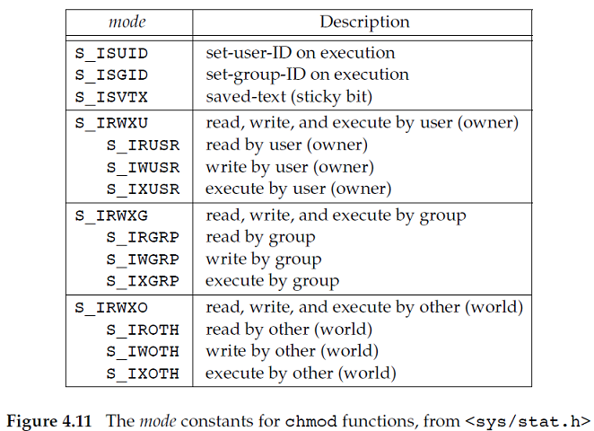

### example_chmod

使用 stat 获取文件信息，通过 chmod 取消掉 foo 文件的 S_IXGRP 权限，并设置 S_ISGID

```cpp
#include "apue.h"

int main(void)
{
    struct stat statbuf;
    /* turn on set-group-ID and turn off group-execute */

    if (stat("foo", &statbuf) < 0)
        err_sys("stat error for foo");
    if (chmod("foo", (statbuf.st_mode & ~S_IXGRP) | S_ISGID) < 0)
        err_sys("chmod error for foo");

    /* set absolute mode to "rw-r--r--" */
    if (chmod("bar", S_IRUSR | S_IWUSR | S_IRGRP | S_IROTH) < 0)
        err_sys("chmod error for bar");

    exit(0);
}
```

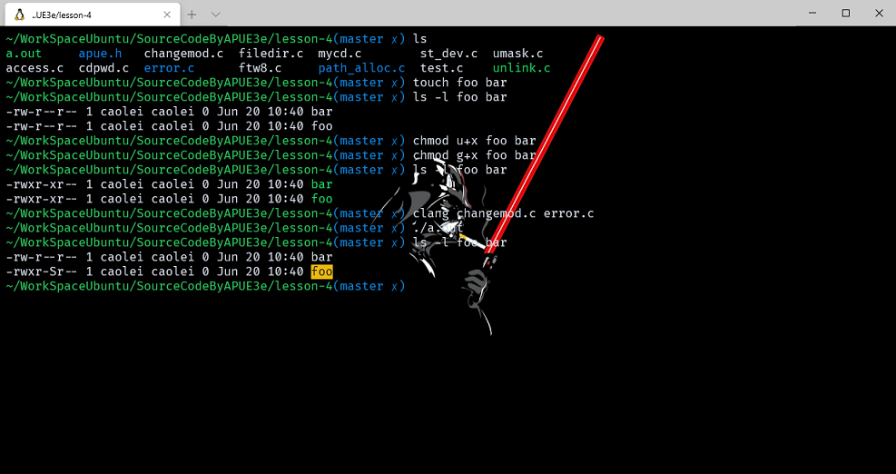

## 黏着位

黏着位是一个很有意思的参数，S_ISVTX 实际上是 save text bit 的缩写，我们知道，一个二进制程序实际上是由**正文段、数据段、bss 段**组成。

其中正文段包含了程序几乎大部分的内容，而且由于正文段的特殊性它是只读的，在早期 Unix 环境资源非常稀少的情况下，为了保证快速加载程序，就出现了保存正文位这一个特殊 bit，如果一个程序的 stx 位被设置了，当程序第一次载入执行，在其终止时，程序正文段依旧会有一个副本被保存在交换区。在现在看来实际上是一种缓存技术，Node.JS 的模块加载机制就与此类似。但是由于现在的Unix 系统虚拟内存技术、预存取技术的存在，这个机制已经被废弃了。

**当黏着位设置在目录上的时候，没有特权的用户就不能删除或者重命名其他用户在这个目录中的文件**。很典型的案例就是 /tmp 和 /var/tmp 目录，tmp 文件夹一般都是rwxrwxrwt 的权限，由 root 用户拥有，只有拥有文件、拥有目录、超级用户的三者之一才能删除或更名文件，这样就能保证了不会对其他用户的文件误操作。

因此如果对一个目录设置了黏着位，则只有对该目录具有写许可权限并且满足下列条件之一的用户才可以删除或者更名目录下的文件：

1. 拥有此文件。
2. 拥有此目录。
3. root 用户。

## chown、fchown、fchownat 和 lchown 函数原型

chown 函数可用于更改文件的用户 ID 和组 ID。

```cpp
#include <unistd.h>
int chown(const char * pathname, uid_to wner, gid_t  group);
int fchown(int   filedes, uid_t  owner, gid_t  group) ;
int fchownat(int fd ,const char * pathname ,uid_t  ower , gid_t  group , int flag);
int lchown(const char * path name, uid_t owner, gid_t  group);

//函数返回：若成功则为 0，若出错则为-1
```

lchown 和 fchownat 更改符号连接本身的所有者，而不是该符号连接所指向的文件。
fchown 函数改变 fd 参数指向的打开文件的所有者，既然他在一个已经打开的文件上操作，就不能用于改变符号链接的所有者。

## 文件长度

- stat 结构中包含着文件的各种信息，其中成员 st_size 包含了以字节为单位的该文件的长度。注意 st_size 中不包含 C 语言结尾字符 Null。此字段只对普通文件、目录文件和符号连接有意义。
  - 普通文件长度可以为 0，在读的时候就会返回末尾指示。
  - 目录文件长度有规定（4.22）节。
  - 符号链接长度则是其文件名称的长度。
  - wc -c 选项是计算文件中的字符数。

在前面的例程中，提到了普通文件存在文件空洞，也解释了文件空洞存在的原因，当文件长度小于所占用的磁盘块大小，就说明存在着文件空洞。当我们使用 cat 命令复制存在空洞的文件，新的文件就不存在空洞了，所有的空洞都会被填满。更有意思的是，使用 od 命令去查看这两个文件的二进制内容，可以发现空洞和新文件被填满的部分都是以 null 的形式( 0 字节)存在。

## 文件截断

用来截取文件末尾的数据，缩短文件长度。并且可以将文件长度截断为0，用O_TRUNC标志可以做到这一点。

```cpp
#include <unistd.h>
int truncate(constchar *path, off_t length);
int ftruncate(int fildes, off_t length);
//两个函数返回；若成功则为 0，若出错则为-1
```

这两个函数可以进行文件截断，如果该文件以前的长度大于 length，则超过 length 以外的数据就不再能存取。如果以前的长度短于 length，文件长度增加，增加部分写入 0。

## 文件系统

文件系统就是一个管理文件的方式，将数据组织成文件的形式展现给用户、程序以及内核。但是不同的文件系统的格式不同，这里就需要一个转换，将文件系统转换成一个通用的文件系统，每个实际文件系统从操作系统和系统服务中分离出来，它们之间通过一个接口层：虚拟文件系统 VFS 来通讯。VFS 使得 Linux 可以支持多个不同的文件系统，每个文件系统表示一个 VFS 的通用接口。由于软件将 Linux 文件系统的所有细节进行了转换，所以 Linux 核心的其它部分及系统中运行的程序将看到统一的文件系统。Linux 的虚拟文件系统允许用户同时能透明地安装许多不同的文件系统。

文件系统有很多部分组成，普遍的实现中，都是将实际文件数据和文件属性分开，分别存放。这就是数据块和索引块，通常也叫 inode 块，还有包含了整个文件系统属性的超级块，为了方便管理，一些文件系统还将块进行分组，形成块组，但是这个概念实际上无关紧要。对于开发者来说重要的是索引块和数据块。对于用户来说，使用 ls 命令查看当前目录下的所有文件就可以了。

为了方便理解，我们可以把一个磁盘分成一个或多个分区。每个分区可以包含一个文件系统。柱面组这个名词是在磁盘的存储原理中的。

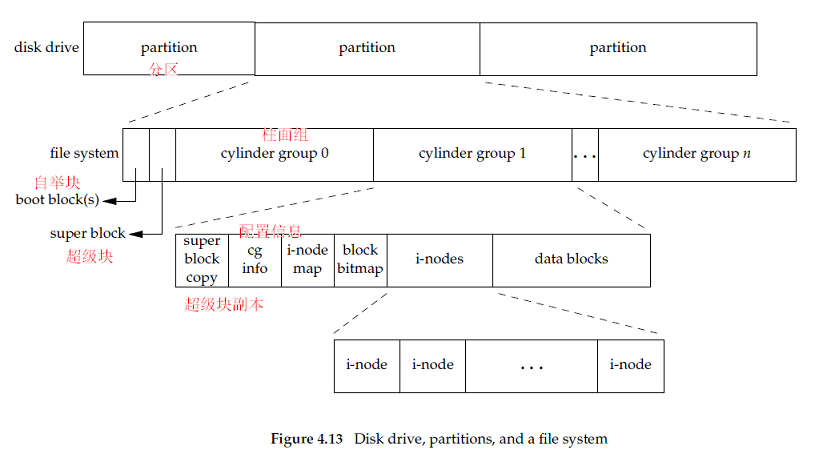

每个 i 节点都包含着各种文件的详细信息。

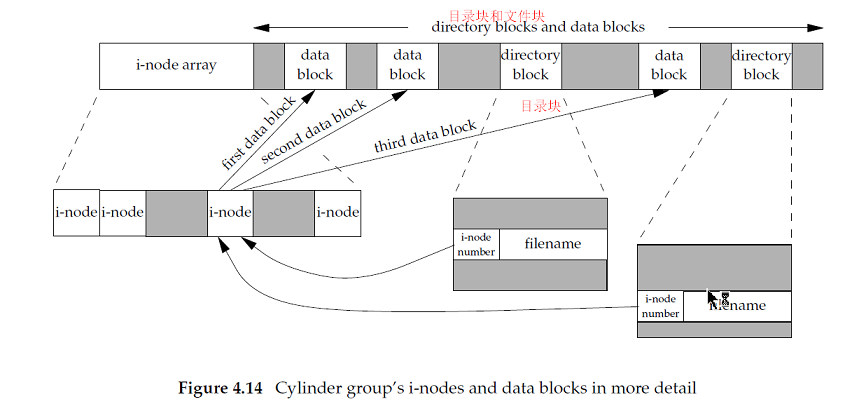

在上图中有两个目录中的文件指向向同一个 i 节点，这个意思就是在这两个目录下有这个 i 节点文件的文件链接存在，每个 i 节点都有一个链接计数，只有当链接计数为 0 时才能删除这个文件，在此之前即使删除文件，它依旧保存在磁盘上，当链接数为 0 之后才被清除。因此删除一个目录下的文件函数为 unlink 而不是 delete 的原因。stat 的结构中链接计数保存在 st_nlink 中，基本数据类型是 nlink_t。

另外一种链接是符号链接，在 i 节点中的文件类型是 S_IFLNK。

因为目录项中的 i 节点编号数指向同一文件系统中的 i 节点，所以不能使一个目录项指向另一个文件系统的 i 节点。这就是为什么 ln(1) 命令（构造一个指向一个现存文件的新目录项），不能跨越文件系统的原因。

当在不更改文件系统的情况下为一个文件更名时，该文件的实际内容并未移动，只需构造一个指向现存 i 节点的新目录项，并删除老的目录项。

目录文件的链接计数方式：

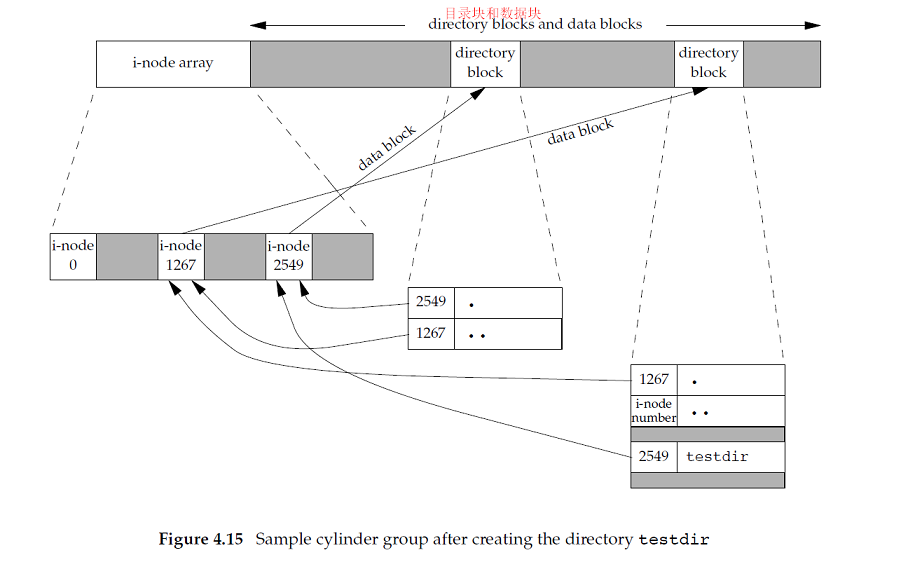

[可以参考的 BLOG](http://c.biancheng.net/cpp/html/2780.html)

> 首先需要知道的是一个文件系统维护了一个索引节点的数组，每个文件或目录都与索引节点数组中的唯一一个元素对应。系统给每个索引节点分配了一个号码，也就是该节点在数组中的索引号，称为索引节点号。linux文件系统将文件索引节点号和文件名同时保存在目录中。所以，目录只是将文件的名称和它的索引节点号结合在一起的一张表，目录中每一对文件名称和索引节点号称为一个连接。

假设就是这个 APUE 目录，他的 i 节点编号为 1267，则其中的 lesson-1 就是 2548 这就能理解上图的内容了。

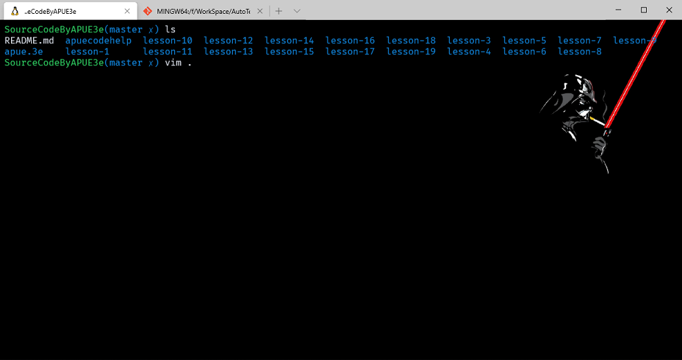

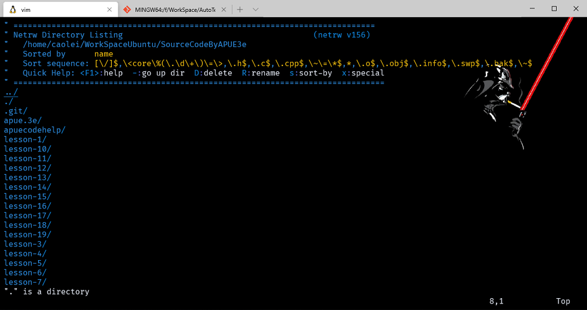

## link 、linkat 、unlink 、unlinkat 和 remove 函数原型

任何一个文件可以有多个目录项指向其 i 节点。创建一个向现存文件连接的方法是使用 link 函数。

```cpp
#include <unistd.h>
int link(const  char *  existingpath, const char  *newpath) ;
int linkat(int  efd , const  char  *existingpath , int  nfd ,  const  *newpath ,int  flag)
//返回：若成功则为0，若出错则为-1
```

函数创建一个新目录项 newpath，它引用现存文件 existingpath。如若 newpath 已经存在，则返回出错。对于 linkat 函数，现有文件是通过 edf 和 existingpath 参数指定的，新的路径名通过 nfd 和 newpath 参数指定。

删除一个现存的目录项，可以调用 unlink函数。

```cpp
int unlink(constchar *path);
int unlinkat(int fd, const char *path, int flag);
//返回：若成功则为0，若出错则为-1
```

- 和其他的 Unix 函数一样，文件描述符可以用 AT_FDCWD 来代替，这代表着路径将以当前工作目录来计算。
  - linkat 函数的 flag 参数只有 AT_SYMLINK_FOLLOW 可用，这和之前我们所遇到的函数都不大一样，当这个参数存在时，函数将创建指向链接目标的链接，否则创建指向符号链接本身的链接。
  - unlinkat 的 flag 则只有 AT_REMOVEDIR 可用，当此参数被传入时，unlinkat 将和 rmdir 一样删除目录。

### example_unlink

首先通过 open 打开个文件，然后再通过 unlink 删除掉。

```cpp
#include "apue.h"
#include <fcntl.h>

int main(void)
{
    if (open("tempfile", O_RDWR) < 0)
        err_sys("open error");
    if (unlink("tempfile") < 0)
        err_sys("unlink error");
    printf("file unlinked\n");
    sleep(15);
    printf("done\n");
    exit(0);
}
```

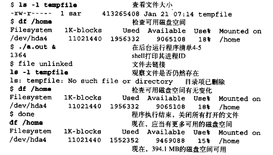

unlink 的这种特性经常被程序用来确保即使在程序崩溃，他所创建的临时文件也不会残留。使用 open 或 creat 创建完成文件立刻调用 unlink，文件被打开数据是不会被删除的，只有当进程结束、或文件描述符关闭后数据得到释放。

如果传给 unlink 的是符号链接则删除的仅仅是符号链接，没有任何函数可以用符号链接删除原文件。

```cpp
#include <stdio.h>

int remove(const char *pathname);
```

新的函数 remove 更加广泛与通用，由于不同的系统文件的机制不同，所以 C 标准中增加了这个函数。

## rename 和 renameat 函数原型

文件或目录可以用这两个函数重命名。

```cpp
#include <stdio.h>
int rename(const char *oldname, const char *newname);
int renameat(int oldfd, const char *oldname, int newfd, const char *newname);
//返回：若成功则为0，若出错则为-1
```

1. 新项目存在时，将先前的删除，然后在将老项目转移为新的名称；
2. 如果文件是符号链接，则只对符号链接本身起作用而不是其对应的文件。

## 符号链接

符号链接，即通常说的软链接，是对一个文件的间接指针。类似 Windows 的快捷方式。

- 硬链接的局限：
  1. 硬连接通常要求连接和文件位于同一文件系统中，
  2. 只有超级用户才能创建到目录的硬连接。对符号连接以及它指向什么没有文件系统限制，任何用户都可创建指向目录的符号连接。符号连接一般用于将一个文件或整个目录结构移到系统中其他某个位置。

- 链接是直接指向索引块，而软链接实际上是一个文件，直接指向文件 i 节点的硬链接不同，直接操作硬链接后果很差，所以引入符号链接就是为了解决硬链接存在的问题。
- 由于符号链接和普通文件几乎一样，所以任何涉及文件的函数，都需要注意是否处理符号链接，一般来说都是以 flag 参数的形式来改变函数的行为，从前面这么多的函数应该了解到了。

- 特点：
  1. ln 命令会保持每一处链接文件的同步性，也就是说，不论你改动了哪一处，其它的文件都会发生相同的变化；
  2. ln 的链接又分软链接和硬链接两种，软链接就是ln –s 源文件 目标文件，它只会在你选定的位置上生成一个文件的镜像，不会占用磁盘空间，硬链接 ln 源文件 目标文件，没有参数-s， 它会在你选定的位置上生成一个和源文件大小相同的文件，无论是软链接还是硬链接，文件都保持同步变化。

ln 指令用在链接文件或目录，如同时指定两个以上的文件或目录，且最后的目的地是一个已经存在的目录，则会把前面指定的所有文件或目录复制到该目录中。若同时指定多个文件或目录，且最后的目的地并非是一个已存在的目录，则会出现错误信息。

- 必要参数:
  - b 删除，覆盖以前建立的链接
  - d 允许超级用户制作目录的硬链接
  - f 强制执行
  - i 交互模式，文件存在则提示用户是否覆盖
  - n 把符号链接视为一般目录
  - s 软链接(符号链接)
  - v 显示详细的处理过程

## 创建和读取符号链接

可以使用 symlink 或 symlinkat 函数关键一个符号链接。

```cpp
#include <unistd.h>
int symlink(const char *path1, const char *path2);
int symlinkat(const char *name1, int fd, const char *name2);
//成功返回0，失败返回-1
```

函数很简单，两个函数就只有相对路径和绝对路径的区别。由于符号链接本身是一个文件，所以也应该可以读写，但是 open 函数是跟随符号链接的，所以 Unix 系统也提供了打开符号链接的函数。

```cpp
#include <unistd.h>
ssize_t readlink(const char *restrict path, char *restrict buf, size_t bufsize);
ssize_t readlinkat(int fd, const char *restrict path, char *restrict buf, size_t bufsize);
//成功返回读取的字节数，出错返回-1
```

这两个函数实际上就是一个相对路径和绝对路径的区别 ，而且这两个函数都整合了open、read、close的操作。
当 pathname 参数指定绝对路径或者 fd 值为 AT_FDCWD 相同。

## 文件时间

每个文件属性所保存的时间精度是由文件系统决定的，有的到纳秒，有的只有秒。

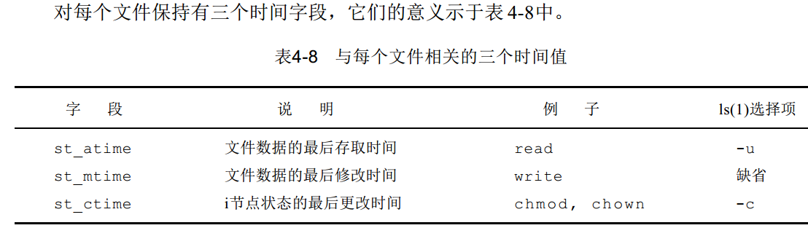

注意修改时间( st_mtime )和更改状态时间( st_ctime )之间的区别。修改时间是文件内容最后一次被修改的时间。更改状态时间是该文件的 i 节点最后一次被修改的时间，如修改了文件的访问权限、更改用户 ID、更改链接数，这些操作不会改变文件内容。

## futimens、utimensat 和 utimes 函数原型

futimens 和 utimensat 函数可以指定纳秒级的时间戳。用到的数据结构是与 stat 函数组相同的 timespec 结构。

```cpp
#include <sys/stat.h>
int   utimes(const  char  *path ,  const struct timeval times[2]);
int   futimes(int  fildes ,  const struct timeval times[2]);
//两个函数的返回值：若成功，返回0；出错，返回-1
```

times 数组参数的第一个元素包含访问时间，第二个元素包含修改时间。时间值都是日历格式。

第三个函数 utime 包含在 XSI 扩展中

```cpp
#include <sys/time.h>
int utime(const char *pathname, const struct timeval times[2]);
//成功，返回0；出错，返回-1
```

## mkdir、mkdirat 和 rmdir 函数原型

函数创建一个新的空目录。 .  和 .. 目录项是自动创建的。所指定的文件存取许可权 mode 由进程的文件方式创建屏蔽字修改。

```cpp
#include <sys/stat.h>
int  mkdir(const  char  *path, mode_t  mode);
int  mkdirat(int  fd, const  char *path, mode_t   mode);
// 返回：    若成功则为0，    若出错则为-1
```

用 rmdir 函数可以删除一个空目录。

```cpp
#include <unistd.h>
int rmdir(const char *path);
//返回值：成功，返回0；出错，返回-1
```

如果此调用使目录的连接计数成为  0，并且也没有其他进程打开此目录，则释放由此目录占用的空间。如果在连接计数达到 0 时，有一个或几个进程打开了此目录，则在此函数返回前删除最后一个连接及 . 和 .. 项。另外，在此目录中不能再创建新文件。但是在最后一个进程关闭它之前并不释放此目录（即使某些进程打开该目录，它们在此目录下，也不能执行其他操作，因为使 rmdir 函数成功执行，该目录必须是空的）。

## 读目录

对于用户来说，目录的读写是透明的，但是实际上只有内核才能写目录，这样就不会出现文件系统的混乱，POSIX 标准定义了一套有关目录的函数。

```cpp
#include <dirent.h>
DIR *opendir(const char *filename);
DIR *fdopendir(int fd);
    //返回：若成功则为指针，若出错则为 NULL

struct dirent *readdir(DIR *dirp);
    //返回：若成功则为指针，若在目录尾或出错则为 NULL

void rewinddir(DIR *dirp);
int closedir(DIR *dirp);
    //返回：若成功则为0，若出错则为-1

long telldir(DIR  *dp);
    //返回值：与dp关联的目录中的当前位置

void  seekdir(DIR  *dp , long loc);
```

### example_ftw8

- 使用以上函数编译一个遍历文件层次结构的程序，实现各类型文件的计数。
  1. myfunc 函数其中定义了各种文件的信息计数，和错误返回的函数数据，是这个程序最基本的功能函数
  2. myftw 函数是为了接受来自 main 函数中传递的参数信息，并将 pathname 封装进入 fullpath 数组空间中，通过 path_alloc 函数来动态调整数组大小来包含跟多的子文件路径名，同时调用 myfunc 函数。
  3. dopath 函数是最重要的功能实现函数，首先读取用户输入的路径文件信息，S_ISDIR 判断其是否为文件，ret = func* 判断是否为目录。

strelen 函数是用来计算字符串的长度，来确定文件名称长度在数组空间中的位置，添加（ NAME_MAX（文件名最大长度，不包括'\0'））判断空间是否足够并自动分配
    fullpath[n++] = '/';
    fullpath[n] = 0;   加入文件子目录
打开子文件夹通过递归调用来循环深入，每当没有子文件夹后 fullpath[n-1] = 0; 通过这个方式返回父目录，完成。

```cpp
#include "apue.h"
#include <dirent.h>
#include <limits.h>

/* function type that is called for each filename */
typedef int Myfunc(const char*, const struct stat*, int);

static Myfunc myfunc;
static int myftw(char*, Myfunc*);
static int dopath(Myfunc*);

static long nreg, ndir, nblk, nchr, nfifo, nslink, nsock, ntot;

int main(int argc, char* argv[])
{
    int ret;

    if (argc != 2)
        err_quit("usage:  ftw  <starting-pathname>");

    ret = myftw(argv[1], myfunc); /* does it all */

    ntot = nreg + ndir + nblk + nchr + nfifo + nslink + nsock;
    if (ntot == 0)
        ntot = 1; /* avoid divide by 0; print 0 for all counts */
    printf("regular files  = %7ld, %5.2f %%\n", nreg, nreg * 100.0 / ntot);
    printf("directories    = %7ld, %5.2f %%\n", ndir, ndir * 100.0 / ntot);
    printf("block special  = %7ld, %5.2f %%\n", nblk, nblk * 100.0 / ntot);
    printf("char special   = %7ld, %5.2f %%\n", nchr, nchr * 100.0 / ntot);
    printf("FIFOs          = %7ld, %5.2f %%\n", nfifo, nfifo * 100.0 / ntot);
    printf("symbolic links = %7ld, %5.2f %%\n", nslink, nslink * 100.0 / ntot);
    printf("sockets        = %7ld, %5.2f %%\n", nsock, nsock * 100.0 / ntot);
    exit(ret);
}

/*
 *  * Descend through the hierarchy, starting at "pathname".
 *   * The caller's func() is called for every file.
 *    */
#define FTW_F 1   /* file other than directory */
#define FTW_D 2   /* directory */
#define FTW_DNR 3 /* directory that can't be read */
#define FTW_NS 4  /* file that we can't stat */

static char* fullpath; /* contains full pathname for every file */
static size_t pathlen;

static int /* we return whatever func() returns */
myftw(char* pathname, Myfunc* func)
{
    fullpath = path_alloc(&pathlen); /* malloc PATH_MAX+1 bytes */
                                     /* ({Prog pathalloc}) */
    if (pathlen <= strlen(pathname))
    {
        pathlen = strlen(pathname) * 2;
        if ((fullpath = realloc(fullpath, pathlen)) == NULL)
            err_sys("realloc failed");
    }
    strcpy(fullpath, pathname);
    return (dopath(func));
}

/*
 *  * Descend through the hierarchy, starting at "fullpath".
 *   * If "fullpath" is anything other than a directory, we lstat() it,
 *    * call func(), and return.  For a directory, we call ourself
 *     * recursively for each name in the directory.
 *      */
static int /* we return whatever func() returns */
dopath(Myfunc* func)
{
    struct stat statbuf;
    struct dirent* dirp;
    DIR* dp;
    int ret, n;

    if (lstat(fullpath, &statbuf) < 0) /* stat error */
        return (func(fullpath, &statbuf, FTW_NS));
    if (S_ISDIR(statbuf.st_mode) == 0) /* not a directory */
        return (func(fullpath, &statbuf, FTW_F));

    /*
     *  * It's a directory.  First call func() for the directory,
     *  * then process each filename in the directory.
     *  */
    if ((ret = func(fullpath, &statbuf, FTW_D)) != 0)
        return (ret);

    n = strlen(fullpath);
    if (n + NAME_MAX + 2 > pathlen)
    { /* expand path buffer */
        pathlen *= 2;
        if ((fullpath = realloc(fullpath, pathlen)) == NULL)
            err_sys("realloc failed");
    }
    fullpath[n++] = '/';
    fullpath[n] = 0;

    if ((dp = opendir(fullpath)) == NULL) /* can't read directory */
        return (func(fullpath, &statbuf, FTW_DNR));

    while ((dirp = readdir(dp)) != NULL)
    {
        if (strcmp(dirp->d_name, ".") == 0 || strcmp(dirp->d_name, "..") == 0)
            continue;                       /* ignore dot and dot-dot */
        strcpy(&fullpath[n], dirp->d_name); /* append name after "/" */
        if ((ret = dopath(func)) != 0)      /* recursive */
            break;                          /* time to leave */
    }
    fullpath[n - 1] = 0; /* erase everything from slash onward */

    if (closedir(dp) < 0)
        err_ret("can't close directory %s", fullpath);
    return (ret);
}

static int myfunc(const char* pathname, const struct stat* statptr, int type)
{
    switch (type)
    {
    case FTW_F:
        switch (statptr->st_mode & S_IFMT)
        {
        case S_IFREG:
            nreg++;
            break;
        case S_IFBLK:
            nblk++;
            break;
        case S_IFCHR:
            nchr++;
            break;
        case S_IFIFO:
            nfifo++;
            break;
        case S_IFLNK:
            nslink++;
            break;
        case S_IFSOCK:
            nsock++;
            break;
        case S_IFDIR: /* directories should have type = FTW_D */
            err_dump("for S_IFDIR for %s", pathname);
        }
        break;
    case FTW_D:
        ndir++;
        break;
    case FTW_DNR:
        err_ret("can't read directory %s", pathname);
        break;
    case FTW_NS:
        err_ret("stat error for %s", pathname);
        break;
    default:
        err_dump("unknown type %d for pathname %s", type, pathname);
    }
    return (0);
}
```

首先 S_IFMT 是一个掩码，它的值是 017000（注意这里用的是八进制）， 可以用来过滤出前四位表示的文件类型。其后的连续七个分别对应套接口文件、符号链接文件、普通文件、块设备、目录、字符设备、管道，它们分别对应一个不同的值。现在假设我们要判断一个文件是不是目录，我们怎么做呢？
很简单，首先通过掩码 S_IFMT 把其他无关的部分置 0，再与表示目录的数值比较，从而判断这是否是一个目录。

## chdir、fchdir 和 getcwd 函数原型

当前工作目录是进程的一个属性，起始目录则是登录名的一个属性。进程调用 chdir 或 fchdir 函数可以更改当前工作目录。

```cpp
#include <unistd.h>
int chdir(const char * pathname) ;
int fchdir(int filedes) ;
//两个函数的返回：若成功则为 0，若出错则为-1
```

一般内核都会维护当前工作目录的信息，但是内核只为每个进程只保存指向该目录 v 节点的指针等目录本身的信息，所以我如果想要获得该目录的完整路径名只能另寻办法。

```cpp
char *getcwd(char *buf, size_t size);
//这个函数可以从 当前目录(.)开始逐级向上直到根目录就可以知道完整路径了。


char *getwd(char *buf);
//函数实际上是一个兼容性函数，不需要提供缓冲区大小指示
```

### example_mycd

```cpp
#include "apue.h"

int main(void)
{
    if (chdir("/tmp") < 0)
        err_sys("chdir failed");
    printf("chdir to /tmp succeeded\n");
    exit(0);
}
```

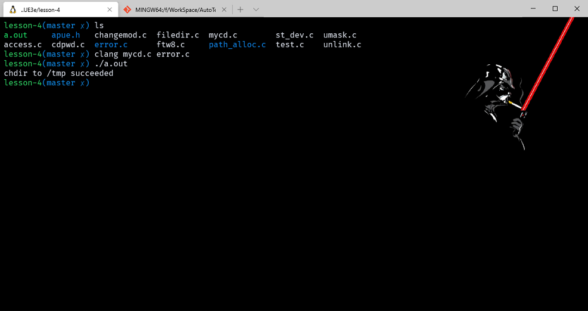

执行 mycd 程序的 shell 的当前工作目录并没有改变，是因为每个程序运行在独立的进程中，shell 的当前目录不会跟随着调用 chdir 而改变。由此可见，shell 为了改变目录，只能直接调用 chdir 函数，因此 cd 命令内建在 shell 中。

### example_cdpwd

```cpp
#include "apue.h"

int main(void)
{
    char* ptr;
    size_t size;

    if (chdir("/home/caolei/") < 0)
        err_sys("chdir failed");

    ptr = path_alloc(&size); /* our own function */
    if (getcwd(ptr, size) == NULL)
        err_sys("getcwd failed");

    printf("cwd = %s\n", ptr);
    exit(0);
}
```

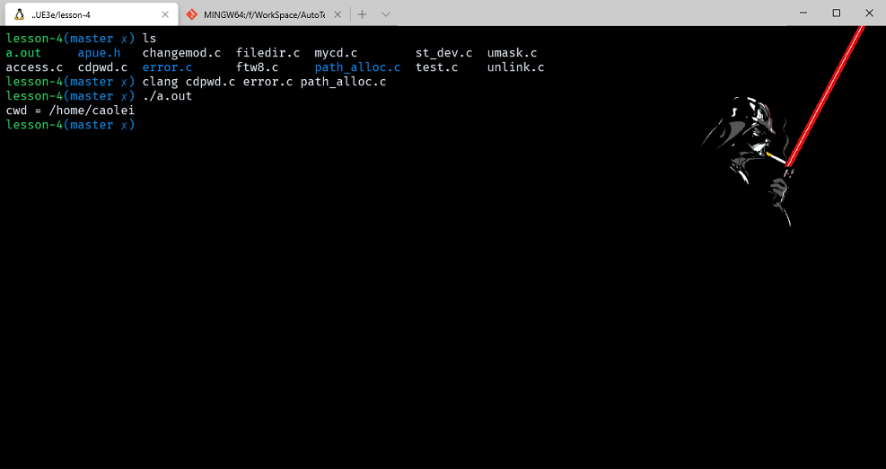

所以可以知道 chdir 是跟随符号链接的，但是当 getcwd 沿着目录向上时，还是会根据实际路径计算。在 getcwd 说明中，系统还有一种简便方法：在更换到其他目录前，直接使用 open 打开当前工作目录 (.) ，然后保存文件描述符，当希望回到原工作目录时，只需要将其传递给 fchdir 就行了。

## 设备特殊文件

- st_dev 和 st_rdev，有关规则：
  1. 每个文件系统所在的存储设备都由其主、次设备号表示。设备号所用的数据类型是基本系统数据类型 dev_t。主设备号标识设备驱动程序，次设备号标识特定的子设备，或者通过次设备号实现多种功能，例如 LDD 中的 scull 驱动。
  2. 我们通常可以使用两个大多数实现都定义的宏： major 和 minor 来存取主、次设备号。这就意味着我们无需关心这两个数是如何存放在 dev_t 对象中的。
  3. 系统中每个文件名的 st_dev 值是文件系统的设备号，该文件系统包含了该文件名和其对应的i节点。
  4. 只有字符特殊文件和块特殊文件才有 st_rdev 值。此值包含该实际设备的设备号。

- Linux 系的 /dev 目录下面的的设备文件是用来表示外设的，如 /dev/sda1 表示第一块硬盘的第一个分区。但是这个 /dev/sda1 仅仅是方便用户观察，linux 内核中表示不同的设备是通过 major 和minor number 实现的，通过 major 和 minor Number 来加载相应的驱动程序。
  - major number：表示不同的设备类型。
  - minor number：表示同一个设备的的不同分区。

### example_stdev

通过 stat 获取设备节点信息，打出相关属性。

```cpp
#include "apue.h"
#include <sys/sysmacros.h>
#include <sys/types.h>
#ifdef SOLARIS
#include <sys/mkdev.h>
#endif

int main(int argc, char* argv[])
{
    int i;
    struct stat buf;

    for (i = 1; i < argc; i++)
    {
        printf("%s: ", argv[i]);
        if (stat(argv[i], &buf) < 0)
        {
            err_ret("stat error");
            continue;
        }

        printf("dev = %d/%d", major(buf.st_dev), minor(buf.st_dev));

        if (S_ISCHR(buf.st_mode) || S_ISBLK(buf.st_mode))
        {
            printf(" (%s) rdev = %d/%d", (S_ISCHR(buf.st_mode)) ? "character" : "block", major(buf.st_rdev),
                   minor(buf.st_rdev));
        }
        printf("\n");
    }

    exit(0);
}
```

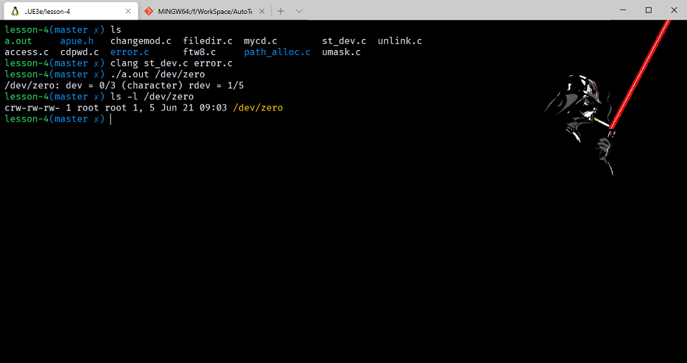
