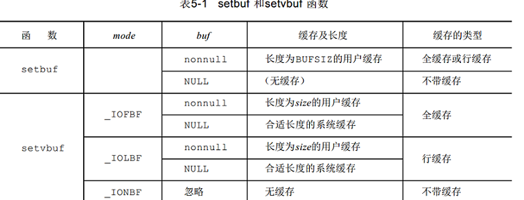
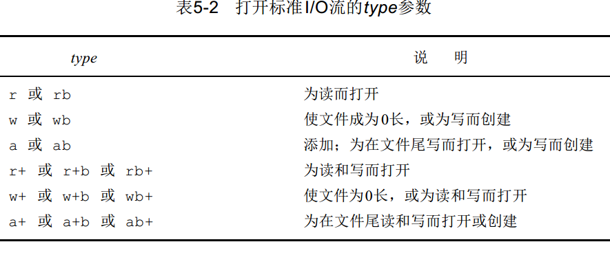
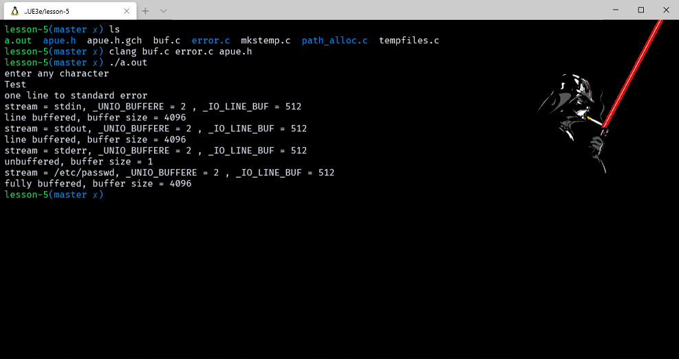
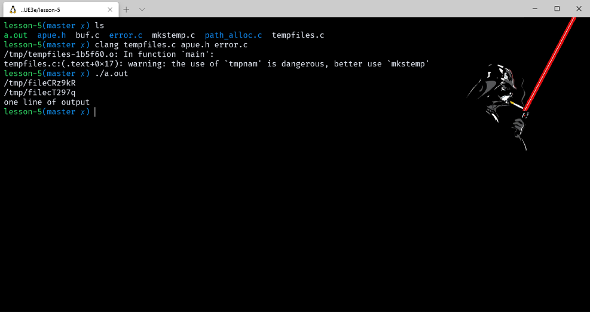
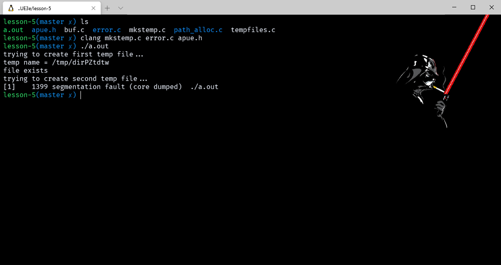

# 标准 I/O 库

- [标准 I/O 库](#标准-io-库)
  - [前言](#前言)
  - [流和 FILE 对象](#流和-file-对象)
  - [标准输入、标准输出和标准出错](#标准输入标准输出和标准出错)
  - [缓冲](#缓冲)
  - [打开流](#打开流)
  - [读和写流](#读和写流)
  - [输入函数](#输入函数)
  - [输出函数](#输出函数)
  - [每次一行 I/O](#每次一行-io)
  - [二进制 I/O](#二进制-io)
  - [定位流](#定位流)
  - [格式化 I/O](#格式化-io)
    - [格式化输出](#格式化输出)
    - [格式化输入](#格式化输入)
  - [实现细节](#实现细节)
    - [example_buf](#example_buf)
  - [临时文件](#临时文件)
    - [example_tempfiles](#example_tempfiles)
    - [example_mkstemp](#example_mkstemp)
  - [内存流](#内存流)
  - [标准 I/O 的替代软件](#标准-io-的替代软件)

> 注意：文章中使用到的源码都在我的 github 中找到，传送门：[SourceCode](https://github.com/HATTER-LONG/SourceCodeByAPUE3e)

## 前言

本章主要介绍标准 I/O 库，它由 ISO C 标准规定，在许多操作系统都对其支持。标准 I/O 库会帮助使用者处理很多细节，比如第三章前言中介绍的缓冲区优化就在此列。

## 流和 FILE 对象

标准 I/O 库的所有函数都是围绕流进行，当使用标准 I/O 库打开一个文件时，就是将一个流与一个文件关联。

流定向：决定了所读、写的字符是单字节还是多字节。当一个流别创建时，它并没有定向，如若在其上使用一个多字节的 I/O 函数，则将该流定向设置为宽定向，设置单字节 I/O 则为字节定向。

只有两个函数可以改变流定向 freopen 清除流的定向；fwide 函数可用于设置流的定向。

```cpp
#include <stdio.h>
#include <wchar.h>
int fwide(FILE *stream, int mode);
FILE *freopen( const char *path, const char *mode, FILE *stream );
```

1. 如果流的方向被确定了，那么 fwide 函数不会改变流的方向。否则，fwide 会设置流的方向；
2. 如果 mode 小于0，流将被设置为字节方向；如果 mode 大于0，流将被设置为宽方向。如果 mode 为 0，则不改变方向；
3. 无论是否改变，返回值都会存在，用于确定流的方向；

当打开一个流时，标准 I/O 函数 fopen 返回一个指向 FILE 对象的指针。该对象通常是一个结构，它包含了 I/O 库为管理该流所需要的所有信息：用于实际 I/O 的文件描述符，指向流缓存的指针，缓存的长度，当前在缓存中的字符数，出错标志等等。应用程序没有必要检验 FILE 对象。为了引用一个流，需将 FILE 指针作为参数传递给每个标准 I/O 函数。

## 标准输入、标准输出和标准出错

就像前文提到的一样，进程自动会打开三个文件描述符。我们知道文件描述符和文件关联，就像是预定义了三个文件描述符 STDIN_FILENO、STDOUT_FILENO、STDERR_FILENO，标准库也提供了预定义的 stdin、stdout、stderr 文件指针。

> <stdio.h> 中提供

## 缓冲

- 前面提到过，Unix 系统自己提供的是不带缓冲的 I/O 函数。缓冲的意义就是为了减少调用 read 和 write 的次数，标准库对每个流都自动管理缓冲，这样开发者就不会为了缓冲区到底用多大、跨平台标准不一致而苦恼了，但是也应当注意到，标准 I/O 函数库的提出已经经过很多年了，而且几乎没有改动过，所以就算是缓冲，也有很多的困扰出现。Unix 系统实现在内核中都设有高速缓冲，大多数的磁盘 IO 都通过缓冲区进行，为了保证实际文件系统的一致性，系统还提供了一些磁盘同步函数。对于标准 I/O 来说，它有三种缓冲类型:
  1. 全缓存：在这种情况下，当填满标准 I/O 缓存后才进行实际 I/O 操作。对于驻在磁盘上的文件通常是由标准 I/O 库实施全缓存的。在一个流上执行第一次 I/O 操作时，相关标准 I/O 函数通常调用 malloc（见7.8节）获得需使用的缓存。
     - > 术语刷新（ flush）说明标准 I/O 缓存的写操作。缓存可由标准 I/O 例程自动地刷新（例如当填满一个缓存时），或者可以调用函数 fflush 刷新一个流。值得引起注意的是在 UNIX 环境中，刷新有两种意思。在标准 I/O 库方面，刷新意味着将缓存中的内容写到磁盘上（该缓存可以只是局部填写的）。在终端驱动程序方面（例如在第 11 章中所述的  tcflush 函数），刷新表示丢弃已存在缓存中的数据。
  2. 行缓存。在这种情况下，当在输入和输出中遇到新行符时，标准 I/O 库执行 I/O 操作。这允许我们一次输出一个字符（用标准 I/O fputc 函数），但只有在写了一行之后才进行实际 I/O 操作。当流涉及一个终端时（例如标准输入和标准输出），典型地使用行缓存。
     - >对于行缓存有两个限制。第一个是：因为标准 I/O 库用来收集每一行的缓存的长度是固定的，所以只要填满了缓存，那么即使还没有写一个新行符，也进行 I/O 操作。第二个是：任何时候只要通过标准输入输出库要求从 ( a )一个不带缓存的流，或者 ( b )一个行缓存的流（它预先要求从内核得到数据）得到输入数据，那么就会造成刷新所有行缓存输出流。在 ( b )中带了一个在括号中的说明的理由是，所需的数据可能已在该缓存中，它并不要求内核在需要该数据时才进行该操作。很明显，从不带缓存的一个流中进行输入（( a )项）要求当时从内核得到数据。
     - >输入的流中，则相当于用 write 系统调用函数将这些字符写至相关联的打开文件上。标准出错流 stderr 通常是不带缓存的，这就使得出错信息可以尽快显示出来，而不管它们是否含有一个新行字符。
  3. 不带缓存。标准 I/O 库不对字符进行缓存。如果用标准 I/O 函数写若干字符到不带缓存。

对任何一个给定的流，如果我们并不喜欢这些系统默认，则可调用下列两个函数中的一个更改缓存类型，可以使用 setbuf 函数打开或关闭缓存机制。为了带缓存进行 I/O，参数 buf 必须指向一个长度为 BUFSIZ 的缓存：

```cpp
#include <stdio.h>
void setbuf(FILE* fp, char* buf);
int setvbuf(FILE* fp, char* buf, int mode, size_t size);
//返回：若成功则为 0，若出错则为非 0

_IOFBF 全缓存
_IOLBF 行缓存
_IONBF 不带缓存
```

如果指定一个不带缓存的流，则忽略 buf 和size 参数。如果指定全缓存或行缓存，则 buf 和size可以可选择地指定一个缓存及其长度。如果该流是带缓的，而 buf 是NULL，则标准 I/O 库将自动地为该流分配适当长度的缓存。适当长度指的是由 struct 结构中的成员 st_blksize 所指定的值（见4 . 2节）。如果系统不能为该流决定此值（例如若此流涉及一个设备或一个管道），则分配长度为 BUFSIZ 的缓存。



此外，任何时候我们都可以强制刷新一个流，使用 fflush 可以使该流所有未写入的数据都被传递至内核：

```cpp
# include  <stdio.h >
int  fflush(FILE *  fp) ;
//返回：若成功则为0，若出错则为EOF
```

## 打开流

下列三个函数可用于打开一个标准 I/O 流：

```cpp
#include <stdio.h>
FILE *fopen(const char * pathname, const char * type) ;
FILE *freopen(const char * pathname, const char * type, FILE   * fp) ;
FILE *fdopen(int   filedes , const char   *type) ;
//三个函数的返回：若成功则为文件指针，若出错则为 NULL
```

- 从字面意义上就能看出这些函数的作用，fopen 就是打开一个文件，freopen 则是在一个指定的流上重新打开文件，一般用于将文件在一个预定义流上打开，fdopen 则是将一个文件描述符打开，主要用于管道和网络通信。mode 参数指定对 IO 流的读写方式：
  1. fopen 打开路径名由 pathname 指示的一个文件。
  2. freopen 在一个特定的流上 (由 fp 指示) 打开一个指定的文件（其路径名由 pathname 指示），如若该流已经打开，则先关闭该流。此函数一般用于将一个指定的文件打开为一个预定义的流，标准输入、标准输出或标准出错。
  3. fdopen 取一个现存的文件描述符（我们可能从 open , dup , dup2 , fcntl 或 pipe 函数得到此文件描述符），并使一个标准的 I/O 流与该描述符相结合。此函数常用于由创建管道和网络通信通道函数获得的插述符。因为这些特殊类型的文件不能用标准 I/O fopen 函数打开，首先必须先调用设备专用函数以获得一个文件描述符，然后用 fdopen 使一个标准 I/O 流与该描述符相结合。就是由于文件描述符已经存在，流的模式必须兼容文件描述符，并且当使用 fclose 关闭时，文件描述符也被关闭。



```cpp
int fclose(FILE *stream);
```

很简单，就是将缓冲区内容写入磁盘并关闭文件，如果缓冲区是自动分配则会自动回收缓冲区。

## 读和写流

- 一旦打开了流，则可在三种不同类型的非格式化 I/O 中进行选择，对其进行读、写操作。（ 5.11节说明了格式化 I/O 函数，例如 printf 和 scanf。）
  1. 每次一个字符的 I/O。一次读或写一个字符，如果流是带缓存的，则标准 I/O 函数处理所有缓存。
  2. 每次一行的I/O。使用fgets和fputs一次读或写一行。每行都以一个新行符终止。当调用fgets时，应说明能处理的最大行长。 5.7节将说明这两个函数。
  3. 直接 I/O。 fread 和 fwrite函数支持这种类型的 I/O。每次 I/O 操作读或写某种数量的对象，而每个对象具有指定的长度。这两个函数常用于从二进制文件中读或写一个结构。 5.9节将说明这两个函数。

## 输入函数

以下三个函数可用于一次读一个字符。

```cpp
#include <stdio.h>
int getc(FILE *  fp) ;
int fgetc(FILE *  fp) ;
int getchar(void);
//三个函数的返回：若成功则为下一个字符，若已处文件尾端或出错则为 EOF
```

- 函数 getchar 等同于 getc(stdin)。前两个函数的区别是 getc 可被实现为宏， 而 fgetc 则不能实现为宏。这意味着：
  1. getc 的参数不应当是具有副作用的表达式。
  2. 因为 fgetc 一定是个函数，所以可以得到其地址。这就允许将 fgetc 的地址作为一个参数传送给另一个函数。
  3. 调用 fgetc 所需时间很可能长于调用 getc ,因为调用函数通常所需的时间长于调用宏。检验一下 <stdio.h> 头文件的大多数实现，从中可见 getc 是一个宏，其编码具有较高的工作效率。

注意，不管是出错还是到达文件尾端，这三个函数都返回同样的值。为了区分这两种不同的情况，必须调用 ferror 或 feof。在大多数实现的 FILE 对象中，为每个流保持了两个标志：`出错标志`和`文件结束标志`。调用 clearerr 则清除这两个标志。

```cpp
#include <stdio.h>
int ferror(FILE  * fp) ;
int feof(FILE *  fp) ;
//两个函数返回：若条件为真则为非 0（真），否则为0（假）
void clearerr(FILE * fp) ;
```

从一个流读之后，可以调用 ungetc 将字符再送回流中。

```cpp
#include <stdio.h>
int ungetc(int c, FILE * f p) ;
//返回：若成功则为C，若出错则为E O F
```

## 输出函数

- 与输入函数一样， putchar(c)  等同于 putc (c, stdout)， putc 可被实现为宏，而 fputc 则不能实现为宏。
  1. getc 的参数不应当是具有副作用的表达式，因为它可能会被计算多次。
  2. 因为 fgetc 一定是个函数，所以可以得到其地址。这就允许将 fgetc 的地址作为一个参数传送给另一个函数。
  3. 调用 fgetc 所需时间很可能比调用 getc 要长，因此调用函数所需的时间通常长于调用宏。
扩展：有副作用的表达式，指的是表达式执行后，会改变表达式中某些变量的值

```cpp
int putc(int c, FILE *stream);
int fputc(int c, FILE *stream);
int putchar(int c);
```

## 每次一行 I/O

这两个函数都指定了缓存地址，读入的行将送入其中。 gets 从标准输入读，而 fgets 则从指定的流读。gets 与 fgets 的另一个区别是，gets 并不将新行符存入缓存中。

```cpp
#include <stdio.h>
char *fgets(char  *buf, int  n， FILE *fp) ;
char *gets(char  *buf) ;
//两个函数返回：若成功则为 buf，若已处文件尾端或出错则为 NULL
```

fputs 和 puts 提供每次输出一行的功能。

```cpp
#include <stdio.h>
int fputs(const char * str, FILE * fp) ;
int puts(const char *  str) ;
//两个函数返回：若成功则为非负值，若出错则为 EOF
```

函数 fputs 将一个以 null 符终止的字符串写到指定的流，终止符 null 不写出。注意，这并不一定是每次输出一行，因为它并不要求在 null符之前一定是新行符。通常，在 null 符之前是一个新行符，但并不要求总是如此。puts 将一个以 null 符终止的字符串写到标准输出，终止符不写出。但是，puts 然后又将一个新行符写到标准输出。**如果总是使用 fgets 和 fputs, 那么就会熟知在每行终止处我们必须自己加一个新行符**。

## 二进制 I/O

有时为了可以一次读取写入一个完整的结构体，并不能使用 getc/putc（循环太慢），fgets/fputs（遇到 null、换行符就会停止），因此需要使用特殊提供的函数：

- fread 读取 nitems 个对象，每个 size 字节长，从 stream 流中读取，存储在 ptr 位置，fwrite 写入 nitems 个对象，每个 size 字节长，写到 stream 流中，从 ptr 位置读取。两句话就能说明这两个函数的作用。在一个系统上写的数据，在另一个系统上处理。在这种环境下，这两个函数可能就不能正常工作，其原因是：
  1. 在一个结构中，同一成员的位移量可能随编译程序和系统的不同而异（由于不同的对准要求）。确实，某些编译程序有一选择项，它允许紧密包装结构（节省存储空间，而运行性能则可能有所下降）或准确对齐，以便在运行时易于存取结构中的各成员。这意味着即使在单一系统上，一个结构的二进制存放方式也可能因编译程序的选择项而不同。
  2. 用来存储多字节整数和浮点值的二进制格式在不同的系统结构间也可能不同。
- 在不同系统之间交换二进制数据的实际解决方法是使用较高层次的协议。关于网络协议使用的交换二进制数据的某些技术。

```cpp
#include <stdio.h>
size_t fread(void *restrict ptr, size_t size, size_t nitems, FILE *restrict stream);
size_t fwrite(const void *restrict ptr, size_t size, size_t nitems, FILE *restrict stream);
//两个函数的返回值：读或写的对象数。
```

## 定位流

- 和 Unix 系统提供的无缓冲 IO一样，标准 C 库也提供了流定位函数
  1. ftell 和 fseek 函数。非常古老的函数，最好少用。
  2. ftello 和 fseeko 函数。只是把稳健偏移量类型从 long 换成了 off_t。
  3. fgetpos 和 fsetpos函数。被 ISO C 引入的，使用抽象文件位置记录位置，跨平台推荐使用。

除了单位不同（off_t），和 ftell、fseek 没有区别。

```cpp
#include <stdio.h>
long ftell(FILE * fp) ;
//返回：若成功则为当前文件位置指示，若出错则为－ 1 L
int fseek(FILE * fp,long offset,int  whence) ;
//返回：若成功则为 0，若出错则为非 0
void rewind(FILE * fp) ;
```

这些函数单位是都是字节，其中 whence 和 Unix 系统的 lseek 函数是一样的，rewind 就是把流设置到头位置。

```cpp
off_t ftello(FILE *stream);
int fseeko(FILE *stream, off_t offset, int whence);
int fgetpos(FILE *restrict stream, fpos_t *restrict pos);
int fsetpos(FILE *stream, const fpos_t *pos);
```

fgetops 将文件位置指示器的当前值存入由 ops 指向的对象中。

## 格式化 I/O

### 格式化输出

```cpp
int printf(const char * restrict format, ...);
int fprintf(FILE * restrict stream, const char * restrict format, ...);
int dprintf(int fd, const char * restrict format, ...);
        //3个函数返回值：若成功，返回输出字符；若出错，返回负值。
int sprintf(char * restrict str, const char * restrict format, ...);
        //返回值：若成功，返回存入数组的字符数；若编码出错，返回负值
int snprintf(char * restrict str, size_t size, const char * restrict format, ...);
        //返回值：若缓冲区足够大，返回值将要存入数组的字符数；若编码出错，返回负值。
```

printf 就是向标准输出写，fprintf 是向指定流写，dprintf 是向文件描述符写，sprintf 和 snprintf 都是是向一个字符串写，但是 snprintf 加入了 size 参数确定大小，sprintf 由于存在缓冲区溢出的隐患，所以也不建议使用了。

下面是 printf 函数族的变体，这些函数被放在 <stdarg.h> 文件中，只是将可变参数表改成了 va_list。:

```cpp
int vprintf(const char * restrict format, va_list ap);
int vfprintf(FILE * restrict stream, const char * restrict format, va_list ap);
int vsprintf(char * restrict str, const char * restrict format, va_list ap);
int vsnprintf(char * restrict str, size_t size, const char * restrict format, va_list ap);
int vdprintf(int fd, const char * restrict format, va_list ap);
```

### 格式化输入

```cpp
int scanf(const char *restrict format, ...);
int fscanf(FILE *restrict stream, const char *restrict format, ...);
int sscanf(const char *restrict s, const char *restrict format, ...);
```

与输出相同，输入函数也有对应的变体，scanf 函数用于分析输入字符串，并将字符序列转换成指定类型变量。

```cpp
int vscanf(const char *restrict format, va_list arg);
int vfscanf(FILE *restrict stream, const char *restrict format, va_list arg);
int vsscanf(const char *restrict s, const char *restrict format, va_list arg);
```

## 实现细节

实际上在 Unix 系统中，标准 C 库最终都是会调用系统提供的接口，所以在 FILE 结构体中，我们可以看到文件描述符的存在。每个标准 I/O 流都有一个与其相关联的文件描述符，可以对一个流调用 fileno 函数 以获得其描述符。

```cpp
int fileno(FILE *stream);
```

如果调用 dup 或 fcntl 等函数，则需要此函数。

### example_buf

```cpp
#include "apue.h"

void pr_stdio(const char*, FILE*);
int is_unbuffered(FILE*);
int is_linebuffered(FILE*);
int buffer_size(FILE*);

int main(void)
{
    FILE* fp;


    fputs("enter any character\n", stdout);
    if (getchar() == EOF)
        err_sys("getchar error");
    fputs("one line to standard error\n", stderr);

    pr_stdio("stdin", stdin);
    pr_stdio("stdout", stdout);
    pr_stdio("stderr", stderr);

    if ((fp = fopen("/etc/passwd", "r")) == NULL)
        err_sys("fopen error");
    if (getc(fp) == EOF)
        err_sys("getc error");
    pr_stdio("/etc/passwd", fp);
    exit(0);
}

void pr_stdio(const char* name, FILE* fp)
{
    printf("stream = %s, ", name);
    if (is_unbuffered(fp))
        printf("unbuffered");
    else if (is_linebuffered(fp))
        printf("line buffered");
    else /* if neither of above */
        printf("fully buffered");
    printf(", buffer size = %d\n", buffer_size(fp));
}

/*
 *  * The following is nonportable.
 *   */

#if defined(_IO_UNBUFFERED)

int is_unbuffered(FILE* fp)
{
    printf("_UNIO_BUFFERE = %d , _IO_LINE_BUF = %d \n", _IO_UNBUFFERED, _IO_LINE_BUF);
    return (fp->_flags & _IO_UNBUFFERED);
}

int is_linebuffered(FILE* fp) { return (fp->_flags & _IO_LINE_BUF); }

int buffer_size(FILE* fp) { return (fp->_IO_buf_end - fp->_IO_buf_base); }

#elif defined(__SNBF)

int is_unbuffered(FILE* fp)
{
    printf("__SNBF = %d ,__SLBF = %d \n ", __SNBF, __SLBF);
    return (fp->_flags & __SNBF);
}

int is_linebuffered(FILE* fp) { return (fp->_flags & __SLBF); }

int buffer_size(FILE* fp) { return (fp->_bf._size); }

#elif defined(_IONBF)

#ifdef _LP64
#define _flag __pad[4]
#define _ptr __pad[1]
#define _base __pad[2]
#endif

int is_unbuffered(FILE* fp)
{
    printf("_IONBF = %d ,_IOLBF = %d \n ", _IONBF, _IOLBF);

    return (fp->_flag & _IONBF);
}

int is_linebuffered(FILE* fp) { return (fp->_flag & _IOLBF); }

int buffer_size(FILE* fp)
{
#ifdef _LP64
    return (fp->_base - fp->_ptr);
#else
    return (BUFSIZ); /* just a guess */
#endif
}

#else

#error unknown stdio implementation!

#endif
```



[关于 FILE */usr/include/libio.h](http://blog.chinaunix.net/uid-26833883-id-3198114.html)

[关于定义的宏问题](http://blog.sina.com.cn/s/blog_7243284f01012hzn.html)

[C语言中几 #if,#if defined ,#ifdef,extern 的用法描述](http://blog.csdn.net/lw370481/article/details/7666217)

在 stdio.h 头文件中定义的缓冲区函数，程序中的#if define  和 #enif 是为了便于移植将不同系统上定义的不同缓冲区添加进来

```cpp
/* The possibilities for the third argument to `setvbuf'.  */
#define _IOFBF 0        /* Fully buffered.  */
#define _IOLBF 1        /* Line buffered.  */
#define _IONBF 2        /* No buffering.  */
```

该系统的默认是：当标准输入、输出连至终端时，它们是行缓存的。行缓存的长度是 128 字节。注意，这并没有将输入、输出的行长限制为 128 字节，这只是缓存的长度。如果要将 512 字节的行写到标准输出则要进行四次 write 系统调用。当将这两个流重新定向到普通文件时，它们就变成是全缓存的，其缓存长度是该文件系统优先选用的 I/O 长度（从 stat 结构中得到 st_blksize）。

## 临时文件

标准 I/O 库提供了两个函数以帮助创建临时文件。tmpnam 产生一个与现在文件名不同的一个有效路径名字符串。每次调用它时，它都产生一个不同的路径名，最多调用次数是 TMP_MAX。TMP_MAX 定义在 <stdio.h> 中。

```cpp
#include <stdio.h >
char *tmpnam(char *  ptr);
//返回：指向一唯一路径名的指针
FILE *tmpfile(void);
//返回：若成功则为文件指针，若出错则为NULL
```

### example_tempfiles

```cpp
#include "apue.h"

int main(void)
{
    char name[L_tmpnam], line[MAXLINE];
    FILE* fp;

    printf("%s\n", tmpnam(NULL));

    tmpnam(name);
    printf("%s\n", name);

    if ((fp = tmpfile()) == NULL) /* create temp file */
        err_sys("tmpfile error");
    fputs("one line of output\n", fp); /* write to temp file */
    rewind(fp);                        /* then read it back */
    if (fgets(line, sizeof(line), fp) == NULL)
        err_sys("fgets error");
    fputs(line, stdout); /* print the line we wrote */

    exit(0);
}
```



tmpfile 函数常用的方法是先调用 tmpnam 产生一个唯一的路径名，然后，用该路径名创建一个文件，并立即 unlink。已知只有当关闭文件时才会删除没有链接的文件。

请注意编译器提出的警告，使用 tmpnam 是危险的，推荐使用 mkstemp，该函数返回的不再是文件指针，而是临时文件的打开文件描述符。而且 tmpnam 和 tempnam 不足时在返回唯一路径和应用程序用该路径创建文件时并不是原子的，可能造成多线程问题，tempfile 和 mkstemp 不会出现此问题，推荐使用。

```cpp
char *mkdtemp(char *template);
               // 若成功，返回值指向目录名的指针；若出错，返回NULL。
int mkstemp(char *template);
               // 若成功，返回文件描述符，若出错，返回-1
```

### example_mkstemp

```cpp
#include "apue.h"
#include <errno.h>

void make_temp(char* template);

int main()
{
    char good_template[] = "/tmp/dirXXXXXX"; /* right way */
    char* bad_template = "/tmp/dirXXXXXX";   /* wrong way*/

    printf("trying to create first temp file...\n");
    make_temp(good_template);
    printf("trying to create second temp file...\n");
    make_temp(bad_template);
    exit(0);
}

void make_temp(char* template)
{
    int fd;
    struct stat sbuf;
    if ((fd = mkstemp(template)) < 0)
        err_sys("can't create temp file");
    printf("temp name = %s\n", template);
    close(fd);
    if (stat(template, &sbuf) < 0)
    {
        if (errno == ENOENT)
            printf("file doesn't exist\n");
        else
            err_sys("stat failed");
    }
    else
    {
        printf("file exists\n");
        unlink(template);
    }
}
```

第一种，因为使用了数组，名字是栈上分配的，第二种使用的是指针，这种情况下，只用指针驻留在栈上，编译器把字符串存放在可执行文件的只读段，当成 mkstemp 函数试图修改字符串时，出现了段错误。。



## 内存流

在普通的流中，是和磁盘上的实际文件关联在一起的，那么，是否存在一种虚拟的文件，将一块内存区域当做文件来读写呢，实际上，是存在的，原著中提到了三个标准库函数用于内存流的创建，但是非常遗憾，这是 glibc 专属的，没有 glibc 的系统只能自己实现，所以这里也不讲述内存流，如果有需要的朋友可以对照Linux下的手册和原著学习。

## 标准 I/O 的替代软件

> Korn和Vo〔 1991〕说明了标准I/O库的另一种代替版： sfio。这一软件包在速度上与fio相近，通常快于标准 I/O库。 sfio也提供了一些新的特征：推广了 I/O流，使其不仅可以代表文件，也可代表存储区；可以编写处理模块，并以栈方式将其压入 I/O流，这样就可以改变一个流的操作；较好的异常处理等。Krieger, Stumm和Unrau〔 1992〕说明了另一个代换软件包，它使用了映照文件—m m a p函数，我们将在1 2 . 9节中说明此函数。该新软件包称为 ASI(Alloc Stream Interface)。其程序界面类似于UNIX存储分配函数（ malloc, realloc和free，这些将在7 . 8节中说明）。与sfio软件包相同， ASI使用指针力图减少数据复制量。

标准I/O库并不完善。 Korn和Vo〔1991〕列出了它的很多不足之处—某些属于基本设计，但是大多数则与各种不同的实现有关。在标准 I/O库中，一个效率不高的不足之处是需要复制的数据量。当使用每次一行函数fgets和fputs时，通常需要复制两次数据：一次是在内核和标准 I/O缓存之间（当调用 read和write时），第二次是在标准 I/O缓存和用户程序中的行缓存之间。快速 I/O库〔 AT&T 1990a中的fio ( 3 )〕避免了这一点，其方法是使读一行的函数返回指向该行的指针，而不是将该行复制到另一个缓存中。 Hume〔 1988〕报告了由于作了这种更改， grep ( 1 )公用程序的速度增加了2倍。
