# 进程关系

- [进程关系](#进程关系)
  - [前言](#前言)
  - [终端登陆](#终端登陆)
    - [BSD 终端登陆](#bsd-终端登陆)
    - [MAC OS X 终端登录](#mac-os-x-终端登录)
    - [Linux 终端登录](#linux-终端登录)
  - [网络登录](#网络登录)
  - [进程组](#进程组)
  - [会话](#会话)
    - [example_test_setsid](#example_test_setsid)
  - [控制终端](#控制终端)
  - [函数 tcgetpgrp、tcsetpgrp 和 tcgetsid](#函数-tcgetpgrptcsetpgrp-和-tcgetsid)
  - [作业控制](#作业控制)
    - [后台作业输出到控制终端](#后台作业输出到控制终端)
  - [shell执行程序](#shell执行程序)
  - [孤儿进程组](#孤儿进程组)
    - [example_orphan3](#example_orphan3)

> 注意：文章中使用到的源码都在我的 github 中找到，传送门：[SourceCode](https://github.com/HATTER-LONG/SourceCodeByAPUE3e)

## 前言

本章主要详细说明了进程组以及 POSIX.1 引入的会话概念，还将介绍登陆 shell 和所有从登陆 shell 启动的进程之间的关系。

## 终端登陆

### BSD 终端登陆

系统管理者创建一个通常名为 /etc/ttys 的文件，其中，每个终端设备有一行，每一行说明设备名和传到 getty 程序的参数，这些参数说明了终端的波特率等，当系统自举时，内核创建进程 ID1，也就是 init 进程。init 进程使系统进入多用户状态。init 读文件 /etc/ttys , 对每一个允许登录的终端设备，init 调用一次 fork，它所生成的子进程则执行程序 getty。

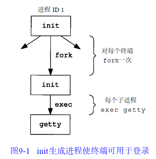

图中各个进程的实际用户 ID 和有效用户 ID 都是 0 (也就是它们都具有超级用户特权)。init 以空环境执行 getty 程序。getty 就是打开设备终端，并设置（文件描述符 0，1，2）到该设备，当用户键入了用户名后，getty 就完成了。然后它以类似于下列的方式调用 login 程序：

```cpp
execle("/usr/bin/login", "login", "-p", username, (char *) 0, envp);
```

（在 gettytab 文件(有关数据文件)中可能会有一些选择项使其调用其他程序，但系统默认是 login 程序）

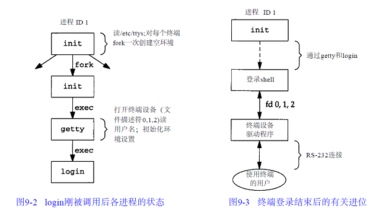

如果用户正确登录， login 就将当前工作目录更改为该用户的起始目录( chdir )。它也调用  chown 改变该终端的所有权，使该用户成为所有者和组所有者。将对该终端设备的存取许可权改变成：用户读、写和组写。调用 setgid 及 initgroups 设置进程的组 ID。然后用 login 所得到的所有信息初始化环境：起始目录( HOME )、shell ( SHELL )、用户名( USER 和 LOGNAME )，以及一个系统默认路径( PATH )。最后，login 进程改变为登录用户的用户 ID(setuid) 并调用该用户的登录 shell，其方式类似于：
execl("/bin/sh", "-sh", (char *) 0);
argv[0] 的第一个字符－是一个标志，表示该 shell 被调用为登录 shell。shell 可以查看此字符，并相应地修改其起动过程。

### MAC OS X 终端登录

基本和 BSD 登录没有区别：
1，init 的工作是由 launchd 完成的。
2，一开始提供的就是图形终端。

### Linux 终端登录

Linux 中断登录过程非常类似于 BSD，主要区别在于说明终端配置方式。
在 System V 的 init 文件格式之后，有些 Linux 发行版 init 程序使用了管理文件方式，和 BSD 配置是一样的。其他发行版则环境文件不同。

## 网络登录

作为系统起动的一部分， init 调用一个 shell，使其执行 shell 脚本 etc/rc。由此 shell 脚本起动一个守护进程 inetd。一旦此 shell 脚本终止，inetd 的父进程就变成init。inetd 等待 TCP/IP 连接请求到达主机，而当一个连接请求到达时，它执行一次 fork，然后子进程执行适当的程序。

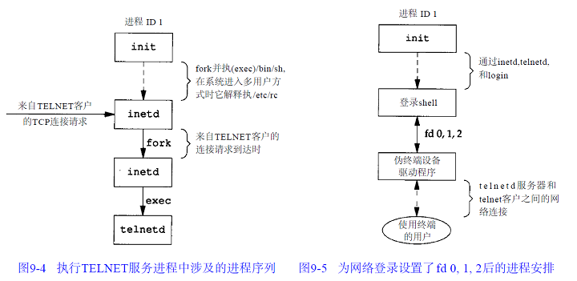

telnetd 进程打开一个伪终端设备，并用 fork 分成两个进程。父进程处理通过网络连接的通信，子进程则执行 login 程序。在调用 exec 之前，子进程使其文件描述符 0，1，2 与伪终端相连。如果登陆正确执行终端登陆章节的步骤。父进程用于处理的伪终端设备驱动与实际用户之间的通信。（19章有解释）
需要理解的重点是：当通过终端（见图9-3）或网络（见图9-5）登录时，我们得到一个登录 shell，其标准输入、输出和标准出错连接到一个终端设备或者伪终端设备上

## 进程组

每个进程除了都有一个进程 ID，还属于一个进程组。同一进程组中的各进程接受来自同一终端的各种信号。

每个进程组有一个组长进程。组长进程的标识是，其进程组 ID 等于其进程 ID。进程组组长可以创建一个进程组，创建该组中的进程，然后终止。只要在某个进程组中有一个进程存在，则该进程组就存在，这与其组长进程是否终止无关。从进程组创建开始到其中最后一个进程离开为止的时间区间称为进程组的生命期。某个进程组中的最后一个进程可以终止，也可以参加另一个进程组。

一个进程只能为它自己或它的子进程设置进程组 ID。在它的子进程调用了 exec 后，它就不再能改变该子进程的进程组 ID。

```cpp
NAME
       setpgid, getpgid, setpgrp, getpgrp - set/get process group

SYNOPSIS
       #include <sys/types.h>
       #include <unistd.h>

       int setpgid(pid_t pid, pid_t pgid);
       pid_t getpgid(pid_t pid);

       pid_t getpgrp(void);                 /* POSIX.1 version */
       pid_t getpgrp(pid_t pid);            /* BSD version */

       int setpgrp(void);                   /* System V version */
       int setpgrp(pid_t pid, pid_t pgid);  /* BSD version */

   Feature Test Macro Requirements for glibc (see feature_test_macros(7)):

       getpgid():
           _XOPEN_SOURCE >= 500
               || /* Since glibc 2.12: */ _POSIX_C_SOURCE >= 200809L

       setpgrp() (POSIX.1):
           _XOPEN_SOURCE >= 500
               || /* Since glibc 2.19: */ _DEFAULT_SOURCE
               || /* Glibc versions <= 2.19: */ _SVID_SOURCE

       setpgrp() (BSD), getpgrp() (BSD):
           [These are available only before glibc 2.19]
           _BSD_SOURCE &&
               ! (_POSIX_SOURCE || _POSIX_C_SOURCE || _XOPEN_SOURCE ||
                   _GNU_SOURCE || _SVID_SOURCE)

DESCRIPTION
       All  of  these  interfaces  are  available on Linux, and are used for getting and setting the process group ID
       (PGID) of a process.  The preferred, POSIX.1-specified ways of doing this are: getpgrp(void),  for  retrieving
       the calling process's PGID; and setpgid(), for setting a process's PGID.

       setpgid()  sets  the PGID of the process specified by pid to pgid.  If pid is zero, then the process ID of the
       calling process is used.  If pgid is zero, then the PGID of the process specified by pid is made the  same  as
       its  process ID.  If setpgid() is used to move a process from one process group to another (as is done by some
       shells when creating pipelines), both process groups must be part of the same session (see setsid(2) and  cre‐
       dentials(7)).   In  this case, the pgid specifies an existing process group to be joined and the session ID of
       that group must match the session ID of the joining process.

       The POSIX.1 version of getpgrp(), which takes no arguments, returns the PGID of the calling process.

       getpgid() returns the PGID of the process specified by pid.  If pid is zero, the process  ID  of  the  calling
       process is used.  (Retrieving the PGID of a process other than the caller is rarely necessary, and the POSIX.1
       getpgrp() is preferred for that task.)

       The System V-style setpgrp(), which takes no arguments, is equivalent to setpgid(0, 0).

       The BSD-specific setpgrp() call, which takes arguments pid and pgid, is a wrapper function that calls

           setpgid(pid, pgid)

       Since glibc 2.19, the BSD-specific setpgrp() function is no longer exposed  by  <unistd.h>;  calls  should  be
       replaced with the setpgid() call shown above.

       The BSD-specific getpgrp() call, which takes a single pid argument, is a wrapper function that calls

           getpgid(pid)

       Since  glibc  2.19,  the  BSD-specific  getpgrp() function is no longer exposed by <unistd.h>; calls should be
       replaced with calls to the POSIX.1 getpgrp() which takes no arguments (if the intent is to obtain the caller's
       PGID), or with the getpgid() call shown above.

RETURN VALUE
       On success, setpgid() and setpgrp() return zero.  On error, -1 is returned, and errno is set appropriately.

       The POSIX.1 getpgrp() always returns the PGID of the caller.

       getpgid(),  and  the  BSD-specific getpgrp() return a process group on success.  On error, -1 is returned, and
       errno is set appropriately.
```

在大多数作业控制 shell 中，在 fork 之后调用此函数，使父进程设置其子进程的进程组ID，然后使子进程设置其自己的进程组ID。这些调用中有一个是冗余的，但这样做可以保证父、子进程在进一步操作之前，子进程都进入了该进程组。如果不这样做的话，那么就产生一个竞态条件，因为它依赖于哪一个进程先执行。

## 会话

会话是一个或多个进程组的集合。

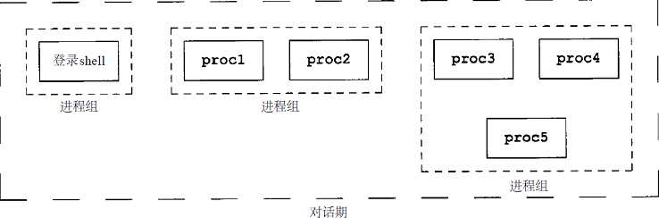

进程调用 setsid 函数就可建立一个新对话期。

```cpp
NAME
       setsid - run a program in a new session

SYNOPSIS
       setsid [options] program [arguments]

DESCRIPTION
       setsid  runs  a  program in a new session. The command calls fork(2) if already a process group leader. Other‐
       wise, it executes a program in the current process.

返回：若成功则为进程组 ID，若出错则为 -1
```

- 如果调用此函数的进程不是一个进程组的组长，则此函数创建一个新对话期，结果为：
  1. 此进程变成该新对话期的对话期首进程（ session leader，对话期首进程是创建该对话期的进程）。此进程是该新对话期中的唯一进程。
  2. 此进程成为一个新进程组的组长进程。新进程组 ID 是此调用进程的进程 ID。
  3. 此进程没有控制终端（下一节讨论控制终端）。如果在调用 setsid 之前此进程有一个控制终端，那么这种联系也被解除。
  4. 如果此调用进程已经是一个进程组的组长，则此函数返回出错。为了保证不处于这种情况，通常先调用 fork，然后使其父进程终止，而子进程则继续。因为子进程继承了父进程的进程组ID，而其进程ID则是新分配的，两者不可能相等，所以这就保证了子进程不是一个进程组的组长。

会话ID : 会话首进程的进程组ID
获取会话 ID: getsid() 函数

```cpp
NAME
       getsid - get session ID

SYNOPSIS
       #include <sys/types.h>
       #include <unistd.h>

       pid_t getsid(pid_t pid);

   Feature Test Macro Requirements for glibc (see feature_test_macros(7)):

       getsid():
           _XOPEN_SOURCE >= 500
               || /* Since glibc 2.12: */ _POSIX_C_SOURCE >= 200809L

DESCRIPTION
       getsid(0)  returns the session ID of the calling process.  getsid() returns the session ID of the process with
       process ID pid.  If pid is 0, getsid() returns the session ID of the calling process.

RETURN VALUE
       On success, a session ID is returned.  On error, (pid_t) -1 will be returned, and errno is set appropriately.
```

### example_test_setsid

```cpp
#include <stdio.h>
#include <stdlib.h>
#include <unistd.h>

int main(void)
{
    pid_t pid;

    if ((pid = fork()) < 0)
    {
        printf("fork error!");
        exit(1);
    }
    else if (pid == 0)
    {
        printf("The child process PID is %d.\n", getpid());
        printf("The Group ID of child is %d.\n", getpgid(0));
        printf("The Session ID of child is %d.\n", getsid(0));
        sleep(10);
        setsid(); // 子进程非组长进程，故其成为新会话首进程，且成为组长进程。该进程组id即为会话进程
        printf("Changed:\n");
        printf("The child process PID is %d.\n", getpid());
        printf("The Group ID of child is %d.\n", getpgid(0));
        printf("The Session ID of child is %d.\n", getsid(0));
        sleep(20);
        exit(0);
    }

    return 0;
}
```

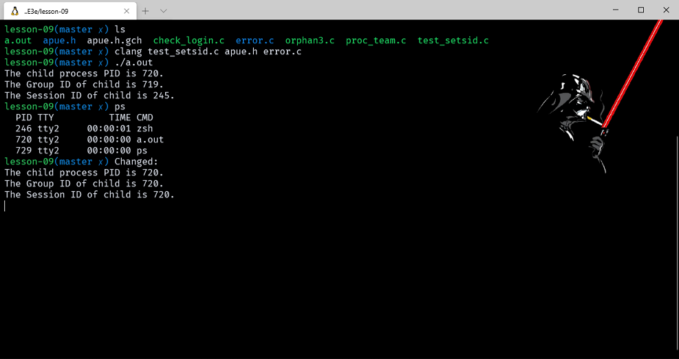

## 控制终端

- 对话期和进程组有一些其他特性：
  1. 一个对话期可以有一个单独的控制终端（ controlling terminal）。这通常是我们在其上登录的终端设备（终端登录情况）或伪终端设备（网络登录情况）。
  2. 建立与控制终端连接的对话期首进程，被称之为控制进程（ controlling process）。
  3. 个对话期中的几个进程组可被分成一个前台进程组（ foreground process group）以及一个或几个后台进程组（background process group）。
  4. 如果一个对话期有一个控制终端，则它有一个前台进程组，其他进程组则为后台进程组。
  5. 无论何时键入中断键（常常是 DELETE 或 Ctrl - C）或退出键（常常是 Ctrl - \），就会造成将中断信号或退出信号送至前台进程组的所有进程。
  6. 如果终端界面检测到调制解调器已经脱开连接，则将挂断信号送至控制进程（对话期首进程。）这些特性示于图9 - 7中。

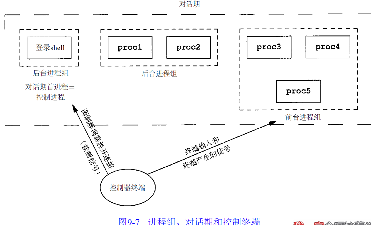

## 函数 tcgetpgrp、tcsetpgrp 和 tcgetsid

需要有一种方法来通知内核哪一个进程组是前台进程组，这样，终端设备驱动程序就能了解将终端输入和终端产生的信号送到何处。函数 tcgetpgrp 返回前台进程组 ID，它与在 filedes 上打开的终端相关。

```cpp
NAME
       tcgetpgrp, tcsetpgrp - get and set terminal foreground process group

SYNOPSIS
       #include <unistd.h>

       pid_t tcgetpgrp(int fd);

       int tcsetpgrp(int fd, pid_t pgrp);

DESCRIPTION
       The  function tcgetpgrp() returns the process group ID of the foreground process group on the terminal associ‐
       ated to fd, which must be the controlling terminal of the calling process.

       The function tcsetpgrp() makes the process group with process group ID pgrp the foreground  process  group  on
       the  terminal  associated  to  fd, which must be the controlling terminal of the calling process, and still be
       associated with its session.  Moreover, pgrp must be a (nonempty) process group belonging to the same  session
       as the calling process.

       If  tcsetpgrp() is called by a member of a background process group in its session, and the calling process is
       not blocking or ignoring SIGTTOU, a SIGTTOU signal is sent to all members of this background process group.

RETURN VALUE
       When fd refers to the controlling terminal of the calling process, the function tcgetpgrp()  will  return  the
       foreground  process  group  ID  of  that  terminal  if  there is one, and some value larger than 1 that is not
       presently a process group ID otherwise.  When fd does not refer to the controlling  terminal  of  the  calling
       process, -1 is returned, and errno is set appropriately.

       When successful, tcsetpgrp() returns 0.  Otherwise, it returns -1, and errno is set appropriately.
```

在给出 TTY 的文件描述符，通过 tcgetsid 函数 ，应用程序就能获得会话首进程的进程组 ID。

[参考BLOG](http://www.cnblogs.com/JohnABC/p/4079669.html)

## 作业控制

- 它允许在一个终端上起动多个作业(进程组)，控制哪一个作业可以存取该终端，以及哪些作业在后台运行。作业控制要求三种形式的支持：
  1. 支持作业控制的shell。
  2. 内核中的终端驱动程序必须支持作业控制。
  3. 必须提供对某些作业控制信号的支持。

- 我们可以键入一个影响前台作业的特殊字符——挂起键（一般采用Ctrl - Z）与终端进行交互作用。键入此字符使终端驱动程序将信号 SIGTSTP 送至前台进程组中的所有进程，后台进程组作业则不受影响。实际上有三个特殊字符可使终端驱动程序产生信号，并将它们送至前台进程组，它们是：
  1. 中断字符（一般采用DELETE或Ctrl - C）产生 SIGINT。
  2. 退出字符（一般采用Ctrl - \）产生 SIGQUIT。
  3. 挂起字符（一般采用Ctrl - Z）产生 SIGTSTP。

>注意只有前台作业接受终端输入，因为每一个对话只有一个前台作业。当后台试图去读取时，终端驱动会使其STOPPED信号（SIGTTIN）停止这个后台作业，而shell则向用户提供相关信息。

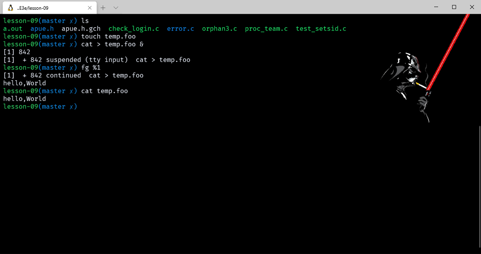

[BLOG](http://roclinux.cn/?p=161)

```cpp
作业控制命令是用来控制一个一个任务的。

1 我想把updatedb命令（用于重新建立整盘索引的命令）放在后台运行。因为我不想眼睁睁的看着机器建立索引，我还想编会儿程序呢：

# updatedb &

[1] 23336

注释：在所要执行的命令后面加上空格，再加上&符号即可实现后台执行。所返回的[1]表示这是第一个你放到后台的任务。23336是这个任务的进程号。


2 我执行updatedb时忘了加&了，这下我怎么办？有办法：

按键盘上的ctrl-z组合键，可以将前台任务扔到后台！但务必注意的是，用ctrl-z的话，这个任务到了后台可是stopped的状态。（你都无情的把它ctrl-z到后台了，它怎么可能还会任劳任怨的继续在后台工作呢？）

3 我学会了这招，我把很多程序都放到后台执行了。我想查看一下：

# jobs

[1]+  Running                 updatedb &

注释：显示出了正在后台运行的任务的列表

4 我编程结束了。想把刚才的updatedb放回前台看看。

# fg %1

注释：fg中的f就表示front，前台的意思。%1表示是在jobs命令中列出的1号任务。如果是2号任务呢，我猜你知道如何写。

5 如果你用jobs命令发现有一个显示[stopped]的任务（任务号是2），我想让这个任务继续在后台执行：

# bg %2

注释：stopped的状态通常出现在用户ctrl-z之后。

6 我想让后台的任务号是3的任务取消：

# kill %3

注释：这样就杀死了任务号为3的后台任务。
```

shell 在后台起动 cat 进程，但是当 cat 试图读其标准输入（控制终端）时，终端驱动程序知道它是个后台作业，于是将 SIGTTIN 信号送至该后台作业。shell 检测到其子进程的状态改变（回忆8 . 6节中对 wait 和 waitpid 的讨论），并通知我们该作业已被停止。然后，用 shell 的 fg 命令将此停止的作业送入前台运行。这样做使 shell 将此作业转为前台进程组（ tcsetpgrp），并将继续信号( SIGCONT )送给该进程组。因为该作业现在前台进程组中，所以它可以读控制终端。

### 后台作业输出到控制终端

这是一个我们可以允许或禁止的选择项。通常，可以用 stty ( 1 )命令改变这一选择项。

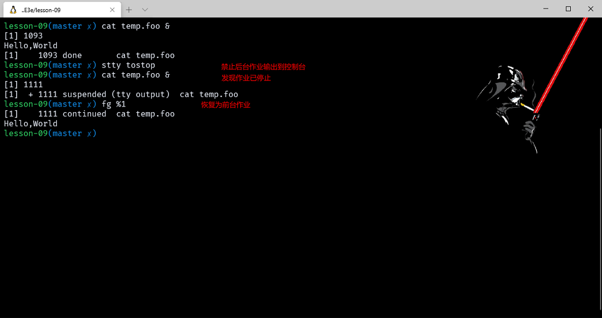

穿过终端驱动程序框的实线表示：终端 I/O 和终端产生的信号总是从前台进程组连接到实际终端。对应于 SIGTTOU 信号的虚线表示，后台进程组进程的输出是否出现在终端是可选择的。

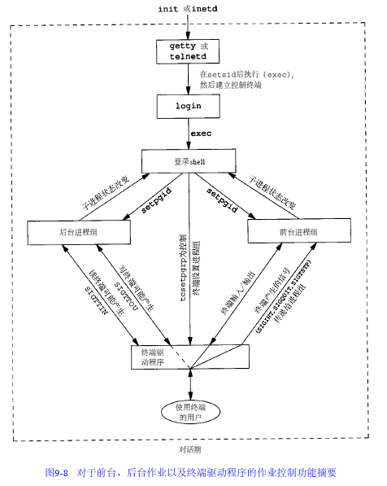

## shell执行程序

1. 首先在不支持作业控制的、BOURNE shell上运行
    - 当使用一个语句时 ps -o pid,ppid,pgid,sid,comm 从输出会发现 ps 是 shell 的子进程，这个没有问题。但是当后台执行时 ps -o pid,ppid,pgid,sid,comm &  ps 命令的进程 ID 被改变了，因为这种 shell 不知道作业控制，所以后台作业没有构成另一个进程组，也没有从后台作业处取走控制终端。
2. 执行管道命令，ps -o pid,ppid,pgid,sid,comm | cat 时可以看到父到子的顺序sh-->cat-->ps，注意，管道中的最后一个进程是shell的子进程，该管道中的第一个进程则是最后一个进程的子进程。从中可以看出，shell fork一个它的副本，然后此副本再为管道线中的每条命令各fork一个进程。
    - 后台执行这个管道命令ps -o pid,ppid,pgid,sid,comm | cat &，则只有进程 ID 改变了。因为shell并不处理作业控制，后台进程的进程组ID仍不变，如同终端进程组I D一样。
3. 如果后台进程试图读取控制终端 例如cat > temp.foo & 在没有作业控制时的处理是：如果该进程自己不重新定向标准输入，则shell自动将后台进程的标准输入重新定向到/dev/null。读/dev/null则产生一个文件结束。这就意味着后台cat进程立即读到文件尾，并正常结束。
4. 返回到Bourne shell实例，在一条管道中执行三个进程：ps -o pid,ppid,pgid,sid,comm | cat1 | cat2

    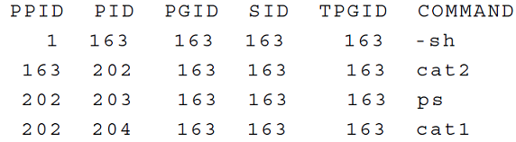

    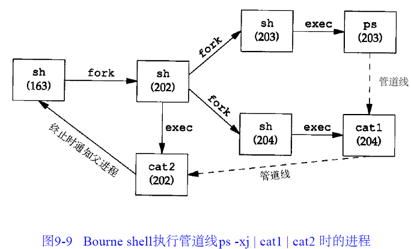

5. 使用运行在Linux上的作业控制shell来检验。ps -o pid,ppid,pgid,sid,comm，可以看到与之前不同是shell将前台作业（ps）放入它自己的进程组，ps自己是一个进程组的组长。进一步说明此进程组具有控制终端，所以它是前台进程组。我们所登陆的shell中的ps则是后台进程组（调用时更改ID放入前台）。后台调用和之前一样只不过ps是被放入了后台进程组。
6. 在一个管道中执行ps -o pid,ppid,pgid,sid,comm | cat ，输出的两个进程都在一个新进程组（前台），这里1中实现创建执行管道中的最后一条命令的进程，而此进程的第一个进程是父进程。

## 孤儿进程组

一个父进程已终止的进程称为孤儿进程(orphan process)，这种进程由 init 进程收养。现在我们要说明整个进程组也可成为孤儿，以及POSIX.1如何处理它。

### example_orphan3

```cpp
#include "apue.h"
#include <errno.h>


static void sig_hup(int signo) { printf("SIGHUP received, pid = %ld\n", (long)getpid()); }

static void pr_ids(char* name)
{
    printf("%s: pid = %ld, ppid = %ld, pgrp = %ld, tpgrp = %ld\n", name, (long)getpid(), (long)getppid(),
           (long)getpgrp(), (long)tcgetpgrp(STDIN_FILENO));
    fflush(stdout);
}

int main(void)
{
    char c;
    pid_t pid;

    pr_ids("parent");
    if ((pid = fork()) < 0)
    {
        err_sys("fork error");
    }
    else if (pid > 0)
    {
        sleep(5);
    }
    else
    {
        pr_ids("child");
        signal(SIGHUP, sig_hup);
        kill(getpid(), SIGTSTP);
        pr_ids("child");

        if (read(STDIN_FILENO, &c, 1) != 1)
            printf("read error %d on controlling TTY\n", errno);
    }
    exit(0);
}
```

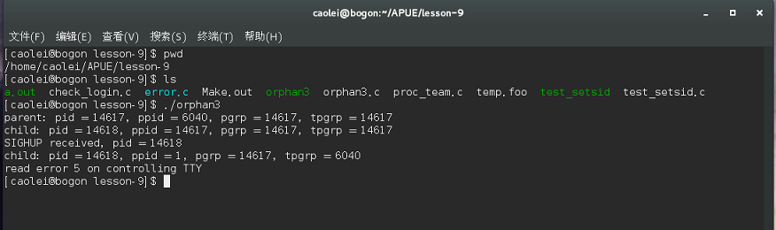

因为两个进程，登录 shell 和子进程都写向终端，所以 shell 提示符和子进程的输出一起出现。正如我们所期望的那样，子进程的父进程 ID 变成 1。注意，在子进程中调用 prids 后，程序企图读标准输入。正如前述，当后台进程组试图读控制终端时，则对该后台进程组产生 SIGTTIN。但在这里，这是一个孤儿进程组，如果内核用此信号停止它，则此进程组中的进程就再也不会继续。POSIX.1 规定，read 返回出错，其 errno设置为 EIO（在作者所用的系统中其值是5）。
最后，要注意的是父进程终止时，子进程变成后台进程组，因为父进程是由 shell 作为前台作业执行的。
