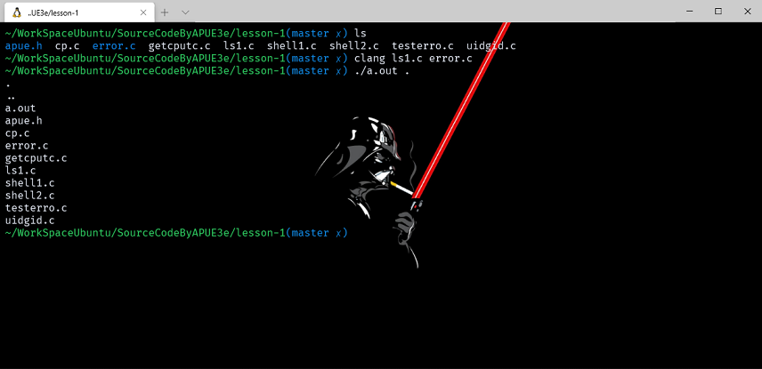
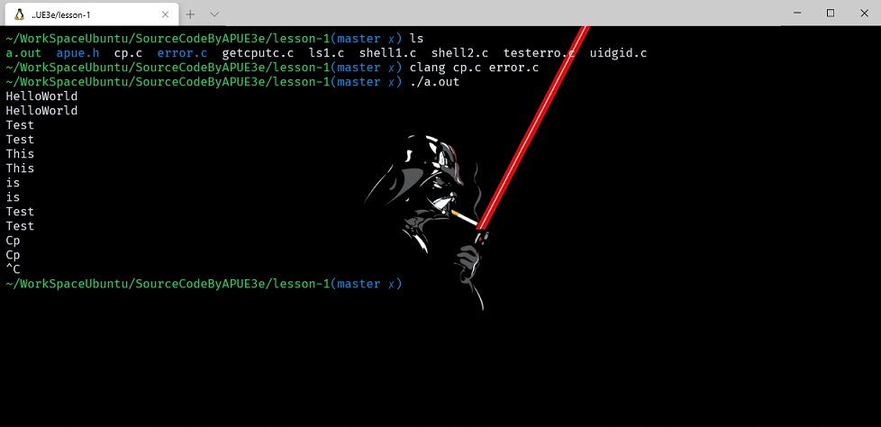
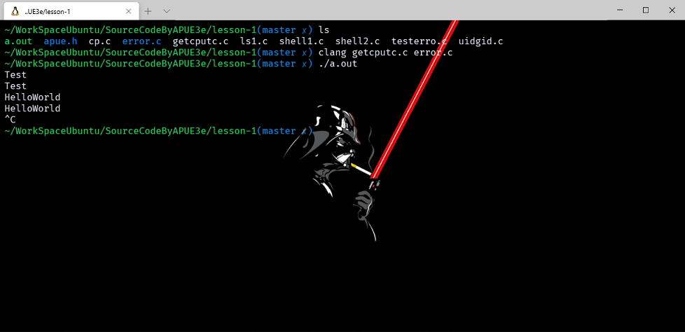
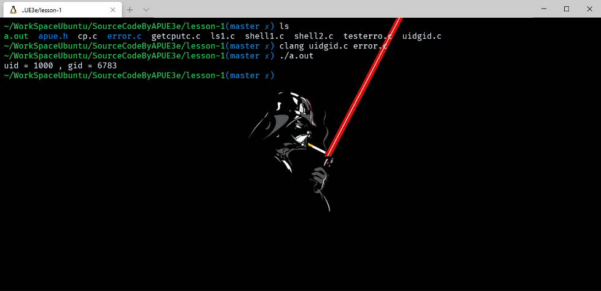
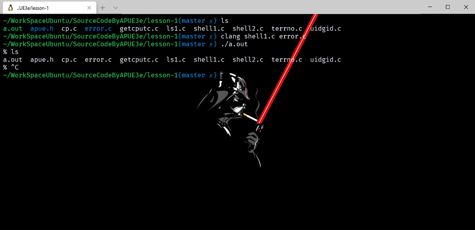
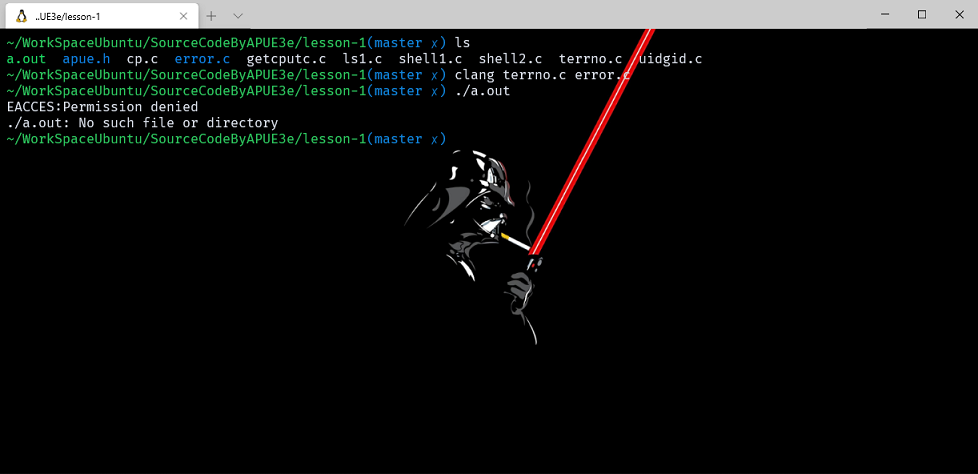
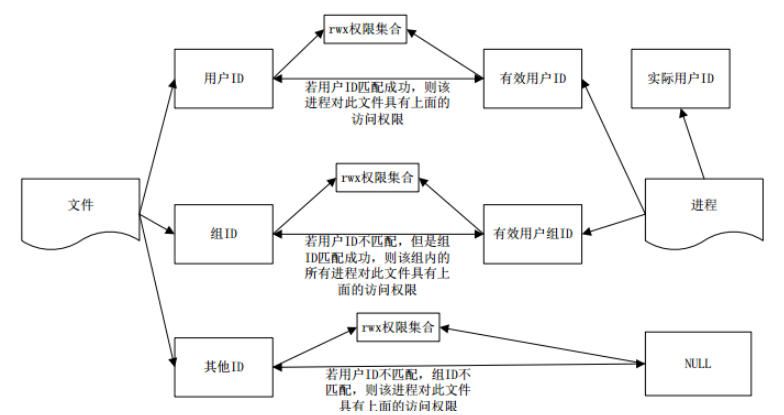
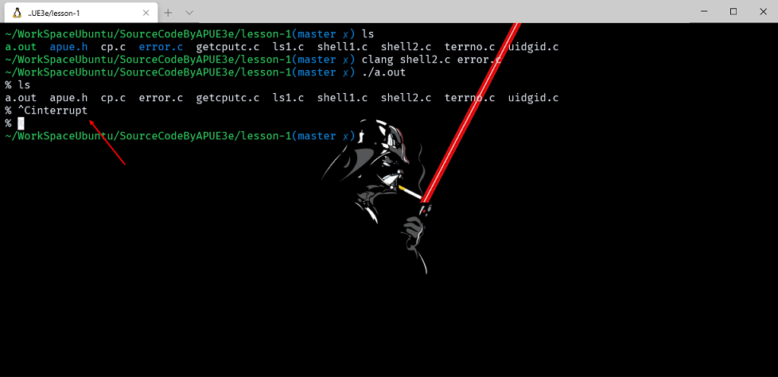

# Unix 基础知识

注意：文章中使用到的源码都在我的 github 中找到，传送门：[SourceCode](https://github.com/HATTER-LONG/SourceCodeByAPUE3e)

## 文件和目录

### 文件系统

Unix 下一个重要的思想就是万物皆文件，文件系统他所进行管理文件是根据目录和文件组成的一种层次结构，因此目录也可以看作是一种特殊的文件，它包含当前目录下的各种属性信息，权限、所有者、文件名称等等。可以使用 stat 和 fstat 函数来获取到目标目录的信息。

### 文件名

目录管理的下级就是文件喽，创建一个新的目录时会自动创建两个文件：`.` 和 `..` 分别对应当前目录和上一级目录。注意文件名称中不能包含 / 和 空(null) 操作符。

### 路径名

- 分为相对路径和绝对路径。

### example_ls1

读取目录文件信息，并列出该目录下所有文件名。

```c++
#include "apue.h"
#include <dirent.h>

int main(int argc, char* argv[])
{
    DIR* dp;
    struct dirent* dirp;

    if (argc != 2)
        err_quit("usage: ls directory_name");

    if ((dp = opendir(argv[1])) == NULL)
        err_sys("can't open %s", argv[1]);

    while ((dirp = readdir(dp)) != NULL)
        printf("%s\n", dirp->d_name);

    closedir(dp);
    exit(0);
}
```



## 输入和输出

- 每当运行一个新程序时，所有的 shell 都为其打开三个文件描述符：标准输入、标准输出以及标准出错。

- 没有缓冲的 I/O 方法： open、 read、write、lseek 以及 close 提供了没有缓冲 I/O 的函数接口些函数都用文件描述符进行工作。

### example_cp

从标准输入读取输入数据，并向标准输出写。

```c++
#include "apue.h"

#define BUFFSIZE 4096

int main(void)
{
    int n;
    char buf[BUFFSIZE];

    while ((n = read(STDIN_FILENO, buf, BUFFSIZE)) > 0)
        if (write(STDOUT_FILENO, buf, n) != n)
            err_sys("write error\n");

    if (n < 0)
        err_sys("read error\n");

    exit(0);
}
```



## 标准 I/O

- 标准 I/O 提供了一组带有缓冲的 I/O 方法。与没有缓冲的 I/O 方法最大的区别就是不用在设置 BUFFSIZE 的大小了，标准函数会自动读取(写)我们需要的数据到缓冲中。例如 fgets 函数可以读取一整行数据，而 read 只可以读取指定字节数的数据。

### example_getcputc

通过 getc 和 putc 来从标准输入读取一个字符和向标准输出写一个字符，直到数据结尾。

```c++
#include "apue.h"

int main(void)
{
    int c;

    while ((c = getc(stdin)) != EOF)
    {
        if (putc(c, stdout) == EOF)
            err_sys("output error");

        if (ferror(stdin))
            err_sys("input error");
    }
    exit(0);
}
```

- int ferror(FILE *stream);
  - ferror 函数作用：在调用各种输入输出函数时，如果出现错误除了函数返回值有所提示外，ferror 函数也可以进行检查。传入对应的文件描述符即可。



## 程序和进程

- 程序（Program）表示存放于文件系统磁盘中的可执行文件，Unix 系统通过 7 个exec 函数中的一个由内核将程序读入内存中进行运行。
- 进程与进程 ID：
  - 进程（Process）：当程序被系统运行起来后，执行的实例被称为进程。
  - 进程 ID（Process ID每个 Unix 进程都一定由一个唯一的非负整数数字标识符，称为进程 ID。
  
### example_uidgid

通过提供接口 getuid 和 getpid 获取执行程序的真实用户 ID 与进程 ID。

```c++
#include "apue.h"

int main(void)
{
    printf("uid = %ld , gid = %ld\n", (long)getuid(), (long)getpid());
    exit(0);
}
```



## 进程控制

- 主要用于控制进程的函数:
  1. exec 函数族：共有 7 中变体，统一将他们称为 exec 函数。
  2. fork 函数，复制当前调用进程一模一样的进程并从调用处开始运行，相当于同时将这个程序执行了两次。
  3. waitpid 函数会暂时停止目前进程的执行，直到有信号来到或子进程结束。

### example_shell1

通过 fgets 从标准输入读取输入的命令行，然后通过 fork 函数创建一个进程 通过exec 函数执行输入的指令，最后通过 waitpid 等待执行命令的子进程结束。

```c++
#include "apue.h"
#include <sys/wait.h>

int main(void)
{
    char buf[MAXLINE]; /* from apue.h */
    pid_t pid;
    int status;

    printf("%% "); /* print prompt
               (printf requires %% to print %) */
    while (fgets(buf, MAXLINE, stdin) != NULL)
    {
        if (buf[strlen(buf) - 1] == '\n')
            buf[strlen(buf) - 1] = 0; /* replace newline with null */

        if ((pid = fork()) < 0)
        {
            err_sys("fork error");
        }
        else if (pid == 0)
        { /* child */
            execlp(buf, buf, (char*)0);
            err_ret("couldn't execute: %s", buf);
            exit(127);
        }
        /* parent */
        if ((pid = waitpid(pid, &status, 0)) < 0)
            err_sys("waitpid error");
        printf("%% ");
    }
    exit(0);
}
```



- 调用 fork 创建一个新进程。新进程是调用进程的复制品，故称调用进程为父进程，新创建的进程为子进程。 fork 对父进程返回新子进程的非负进程 ID，对子进程则返回 0 。因为 fork 创建一新进程，所以说它被调用一次 ( 由父进程 ) ，但返回两次 ( 在父进程中和在子进程中 ) 。
- 在子进程中，调用 execlp 以执行从标准输入读入的命令。这就用新的程序文件替换了子进程。 fork 和跟随其后的 exec 的组合是某些操作系统所称的产生一个新进程。在 UNIX 中，这两个部分分成两个函数。
execlp() 函数属于 exec() 函数族（exec() 族函数用一个新的进程映像替换当前进程映像）它是 execve(2) 函数的前端 execlp（从PATH 环境变量中查找文件并执行。

> 相关函数：fork，execl，execle，execv，execve，execvp
> 头文件：
> #include<unistd.h>
> 定义函数：
> `int execlp(const char *file, const char * arg,....);`
> 函数说明：
> execlp() 会从 PATH 环境变量所指的目录中查找符合参数 file 的文件名，找到后便执行该文件。

## 线程和线程 ID

进程一般由程序、数据集合和进程控制块三部分组成。程序用于描述进程要完成的功能，是控制进程执行的指令集；数据集合是程序在执行时所需要的数据和工作区；程序控制块(Program Control Block，简称PCB)，包含进程的描述信息和控制信息，是进程存在的唯一标志。但随着 CPU 的多核心发展，多进程或线程处理可以充分利用 CPU 的资源，多进程存在最大的问题便是进程间通信比较复杂，密集运算调度开销也比较严重。因此线程诞生了，线程与进程的特性相差不大，可以称为轻量级的进程，特点是线程只能在进程内执行，如果进程被结束了那么其他的线程也都会被结束掉，不过也正是因为它这种在进程内运行的特性，多线程间的调度、交互、同步就方便很多，逻辑也更加简单

## 出错处理

- man 3 errno 查询操作手册。
- 对于 errno 两条主要规则：
  1. 如果没有出错，则它的值不会被一个进程清除。因此，仅当函数的返回值知名出错时，才可以去校验其值。
  2. 任一函数都不会将 errno 值设置为 0，在 <errno.h> 中定义的所有常数都不为 0。

### example_terrno

组一个无权限的错误标识，使用 perror 接口查看信息。

```c++
#include "apue.h"
#include <errno.h>

int main(int argc, char* argv[])
{
    fprintf(stderr, "EACCES:%s\n", strerror(EACCES));
    errno = ENOENT;
    perror(argv[0]);
    exit(0);
}
```



## [用户标识](https://www.cnblogs.com/stemon/p/5287631.html)

### 用户 ID

当用户使用账号密码登陆成功后，Unix系统就会通过口令文件登陆项中的用户 ID 项确定这个用户的 ID，这个 ID 向系统标识各个不同的用户。

### 组 ID

口令文件登陆项中同样包含用户的组 ID，组 ID 也是由系统管理员在确定用户登录名时分配的。一般来说，在口令文件中有多个记录项具有相同的组 ID。在 UNIX 下，组被用于将若干用户集合到课题或部门中去。这种机制允许同组的各个成员之间共享资源(例如文件)。组文件将组名映射为数字组 ID，它通常是 /etc/group。



## 信号

`信号是通知进程易发生某种条件的一种方法`。

> 例如，若某一进程执行除法操作，其除数为 0，则将名为 SIGFPE 的信号发送给该进程。

- 进程如何处理信号有三种选择：
  1. 忽略该信号。有些信号表示硬件异常，例如，除以0或访问进程地址空间以外的单元
等，因为这些异常产生的后果不确定，所以不推荐使用这种处理方式。
  2. 按系统默认方式处理。对于0除，系统默认方式是终止该进程。
  3. 提供一个函数，信号发生时则调用该函数。使用这种方式，我们将能知道什么时候产生了信号，并按所希望的方式处理它。

### example_shell2

首先设置捕捉 SIGINT，当信号发生后会自动调用设定的函数。然后就是通过标准输入获取命令行通过程执行。

```c++
#include "apue.h"
#include <sys/wait.h>

static void sig_int(int);

int main(void)
{
    char buf[MAXLINE]; /* from apue.h  #define    MAXLINE    4096 */

    pid_t pid;
    int status;

    if (signal(SIGINT, sig_int) == SIG_ERR)
        err_sys("signal error");

    printf("%% "); /* print prompt (printf requires %% to print %) */
    while (fgets(buf, MAXLINE, stdin) != NULL)
    {
        if (buf[strlen(buf) - 1] == '\n')
            buf[strlen(buf) - 1] = 0; /* replace newline with null */

        if ((pid = fork()) < 0)
        {
            err_sys("fork error");
        }
        else if (pid == 0)
        { /* child */
            execlp(buf, buf, (char*)0);
            err_ret("couldn't execute: %s", buf);
            exit(127);
        }
        /* parent */
        if ((pid = waitpid(pid, &status, 0)) < 0)
            err_sys("waitpid error");
        printf("%% ");
    }
    exit(0);
}
void sig_int(int signo) { printf("interrupt\n%% "); }
```



注释：：如果调用此程序，然后键入中断键，则执行此程序的进程终止。产生这种后果的原因是：对于此信号 ( SIGINT )的系统默认动作是终止此进程。该进程没有告诉系统核对此信号作何处理，所以系统按默认方式终止该进程。为了更改此程序使其能捕捉到该信号，它需要调用 signal 函数，指定当产生 SIGINT 信号时要调用的函数名。因此编写了名为 sig_int 的函数，当其被调用时，它只是打印一条消息，然后打印一个新提示符。
