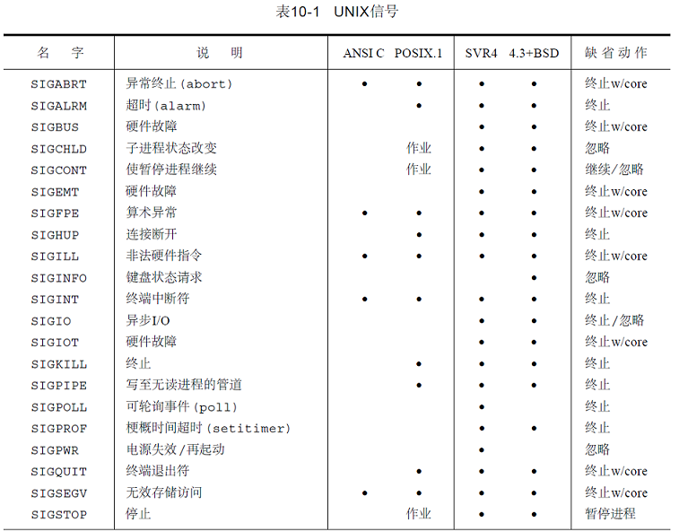
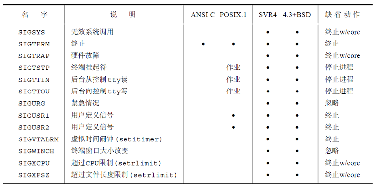
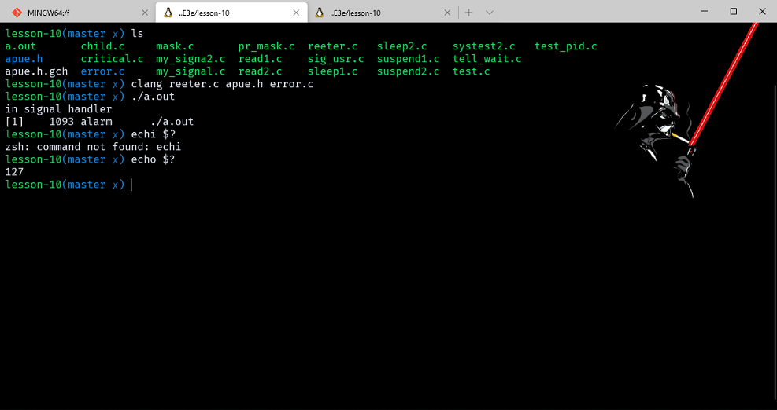
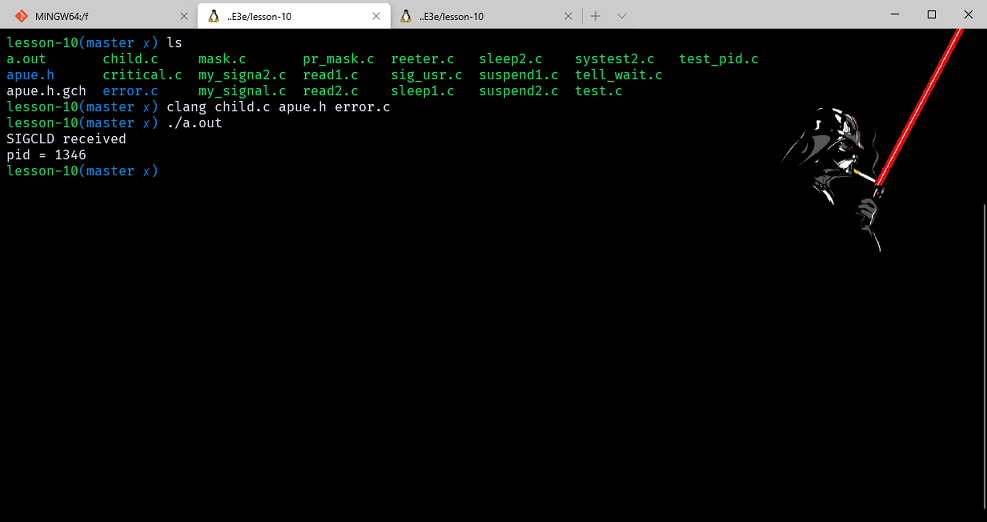
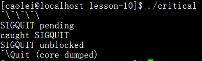

# 信号

- [信号](#信号)
  - [前言](#前言)
  - [信号概念](#信号概念)
  - [signal 函数原型](#signal-函数原型)
    - [example_sig_usr](#example_sig_usr)
  - [不可靠信号](#不可靠信号)
  - [中断系统调用](#中断系统调用)
  - [可重入函数](#可重入函数)
    - [example_reeter](#example_reeter)
  - [SIGCLD 语意](#sigcld-语意)
    - [example_child](#example_child)
  - [可靠信号术语和语义](#可靠信号术语和语义)
  - [kill 和 raise 函数原型](#kill-和-raise-函数原型)
  - [alarm 和 pause 函数原型](#alarm-和-pause-函数原型)
    - [example_sleep1](#example_sleep1)
    - [example_sleep2](#example_sleep2)
    - [example_read1](#example_read1)
    - [example_read2](#example_read2)
  - [信号集](#信号集)
  - [sigprocmask 函数原型](#sigprocmask-函数原型)
  - [sigpending 函数原型](#sigpending-函数原型)
    - [example_critical](#example_critical)
  - [sigaction 函数原型](#sigaction-函数原型)
  - [sigsetjmp 和 siglongjmp 函数原型](#sigsetjmp-和-siglongjmp-函数原型)
  - [example_mask](#example_mask)
  - [sigsuspend 函数原型](#sigsuspend-函数原型)
    - [example_suspend1](#example_suspend1)
  - [abort 函数原型](#abort-函数原型)
  - [system 函数原型](#system-函数原型)
    - [example_system](#example_system)
  - [sleep、nanosleep 和 clock_nanosleep 函数原型](#sleepnanosleep-和-clock_nanosleep-函数原型)
  - [sigqueue 函数原型](#sigqueue-函数原型)
  - [作业控制](#作业控制)

> 注意：文章中使用到的源码都在我的 github 中找到，传送门：[SourceCode](https://github.com/HATTER-LONG/SourceCodeByAPUE3e)

## 前言

信号是软件中断，很多比较重要的应用程序都需要处理信号，它提供了一种处理异步事件的方法。本章主要对信号量的概念讲解，对基本使用技巧的实例。

## 信号概念

信号时软中断，很多比较重要的应用程序都需要处理信号，信号提供了一种处理异步事件的方法。每个信号都有一个名字，以 SIG 开头，在 `<signal.h>` 头文件中定义信号类型，都是正整数（信号编号）。

- 产生信号的条件：
  1. 当用户按某些终端键时，引发终端产生的信号。
  2. 硬件异常产生信号。
  3. 进程调用 kill 函数将信号发送给另外一个进程或进程组。
  4. 用户用 kill 命令将信号发送给其他进程。
  5. 检测到某种软件条件已经发送，并将其通知有关进程时候产生信号。

- 内核在信号出现时候处理方式有：
  1. 忽略此信号；
  2. 铺捉信号；
  3. 执行系统默认动作。





## signal 函数原型

```cpp
#include <signal.h>

typedef void (*sighandler_t)(int);

sighandler_t signal(int signum, sighandler_t handler);
```

对于函数本身来说，带有两个参数，一个是 signum 信号名，handler 的值是一个函数指针。handler 可以指定 3 种参数，分别是常量 SIG_IGN、常量 SIG_DFL 或者一个函数指针。常量 SIG_IGN 表示内核忽略此信号，SIG_DFL 表示执行内核默认动作，函数指针则是当信号发生时，调用该函数，一般叫做信号处理函数。
结合前文中对 signal 函数的理解，实际上 signal 函数要求两个参数，只有一个返回值，signal 函数第一个参数是 signo 信号名，第二个参数是一个函数指针，一般是信号处理函数，最后返回这个信号处理函数指针。由于函数原型非常复杂，一般都是使用 typedef 将其简化。

```cpp
#define SIG_DFL (void (*)(int))0
#define SIG_IGN (void (*)(int))1
#define SIG_ERR ((void (*)(int))-1)
```

### example_sig_usr

```cpp
#include "apue.h"
#include <signal.h>
#include <stdio.h>


static void sig_usr(int);

int main(void)
{
    if (signal(SIGUSR1, sig_usr) == SIG_ERR)
        err_sys("can't catch  SIGUSR1");

    if (signal(SIGUSR2, sig_usr) == SIG_ERR)
        err_sys("can't catch  SIGUSR");
    for (;;)
        pause();
}

static void sig_usr(int signo)
{
    if (signo == SIGUSR1)
        printf("receivec SIGUSR1\n");
    else if (signo == SIGUSR2)
        printf("receivec SIGUSR2\n");
    else
        err_dump("receivec signal %d\n", signo);
}
```


当一个程序别执行时，所有的信号的状态都是系统默认或忽略。在 Unix 环境中最典型的一个例子就是 shell 启动其他进程，为了保证前台和后台对中断信号和退出信号的捕捉，一般都这样写:

```cpp
void sig_int(int), sig_quit(int);
if (signal(SIGINT, SIG_IGN) != SIG_IGN)
    signal(SIGINT, sig_int);
if (signal(SIGQUIT, SIG_IGN) != SIG_IGN)
    signal(SIGQUIT, sig_quit);
```

因为所有都是被子进程继承的，所以在 exec 时，父进程可以控制子进程的忽略状态，所以需要这样判断。在上面可以看出， signal 函数除了改变当前信号的处理方式以外，还会返回之前的状态，这就非常的繁琐，所以在实际中很少使用了。

## 不可靠信号

不可靠信号在这里是指，信号可能会丢失，一个信号发生了，但是进程却不知道。

## 中断系统调用

- 早期的 UNIX 系统特性是：如果在进程执行一个低速系统调用而阻塞期间捕捉到一个信号，则该系统调用就被中断不在继续执行了。该系统调用返回出错，其 errno 市值为 EINTR。
- 为了支持这种特性，将系统调用分成两类，低速系统调用和其他系统调用。低速系统调用是可能会使进程永远阻塞的一类系统调用，它们包括：
  - 在读某些类型的文件时，如果数据并不存在则可能会使调用者永远阻塞（管道、终端设备以及网络设备）。
  - 在写这些类型的文件时，如果不能立即接受这些数据，则也可能会使调用者永远阻塞。
  - 打开文件，在某种条件发生之前也可能会使调用者阻塞（例如，打开终端设备，它要等待直到所连接的调制解调器回答了电话）。
  - pause (按照定义，它使调用进程睡眠直至捕捉到一个信号)和 wait。
  - 某种 ioctl 操作。
  - 某些进程间通信函数（见第14章）。
  - 但是磁盘 I/O 操作总是很快的返回，这点不同。

可以用中断系统调用这种方法来处理的一种情况是：一个进程起动了读终端操作，而使用该终端设备的用户却离开该终端很长时间。在这种情况下进程可能处于阻塞状态几个小时甚至数天，除非系统停机，否则一直如此。

为了帮助应用程序使其不必处理被中断的系统调用， 4.2BSD 引进了某些被中断的系统调用的自动再起动。自动再起动的系统调用包括：ioctl、read、readv、write、writev、wait 和 waitpid。正如前述，其中前五个函数只有对低速设备进行操作时才会被信号中断。而 wait 和 waitpid 在捕捉到信号时总是被中断。某些应用程序并不希望这些函数被中断后再起动，因为这种自动再起动的处理方式也会带来问题，为此 4.3BSD 允许进程在每个信号各别处理的基础上不使用此功能。

引进自动再起动功能的一个理由是：有时用户并不知道所使用的输入、输出设备是否是低速设备。如果我们编写的程序可以用交互方式运行，则它可能读、写终端低速设备。如果在程序中捕捉信号，而系统却不提供再起动功能，则对每次读、写系统调用就要进行是否出错返回的测试，如果是被中断的，则再进行读、写。

## 可重入函数

信号是异步调用，进程自身执行各种正常指令序列，当接受到信号的时候，内核就会通知进程处理，而此时正常的指令序列就会被中断，很容易造成进程空间的破坏，所以现在的 Unix 实现都会提供在信号处理程序中保证安全调用的函数，通俗的说，就是异步信号安全。至于具体列表，则需要查看具体Unix实现。

在前面学习 errno 错误信息的时候讲到过，每个进程都维护了一个 errno 变量，当需要获得的时候就通过 extern int errno 的形式获取。当然实际不是这样的，因为有多线程的模型存在，所以实际情况更加复杂。当进程执行正常代码，然后调用的系统函数修改了 errno 值，如果一个信号被发送给进程，进程的信号处理函数调用了另一个系统函数修改 errno 值，结果最终返回的时候就是信号处理程序内调用得到的 errno，所以在实际开发中，如果需要调用系统函数，需要先保存 errno 值，然后调用后恢复 errno。


- 没有列入表 10-3 中的大多数函数是不可再入的，其原因为：
  1. 已知它们使用静态数据结构;
  2. 它们调用 malloc 或 free;
  3. 它们是标准 I/O 函数。标准 I/O 库的很多实现都以不可再入方式使用全局数据结构。

### example_reeter

```cpp
#include "apue.h"
#include <pwd.h>

static void my_alarm(int signo)
{
    struct passwd* rootptr;

    printf("in signal handler\n");
    if ((rootptr = getpwnam("root")) == NULL)
        err_sys("getpwnam(root) error");
    alarm(1);
}

int main(void)
{
    struct passwd* ptr;

    signal(SIGALRM, my_alarm);
    alarm(1);
    for (;;)
    {
        if ((ptr = getpwnam("caolei")) == NULL)
            err_sys("getpwnam error");
        if (strcmp(ptr->pw_name, "caolei") != 0)
            printf("return value corrupted!, pw_name = %s\n", ptr->pw_name);
    }
}
```




运行结果是随机的，一般都是在经过多次迭代后程序被 SIGSEGV 信号终止。因此若在信号处理程序中调用一个不可重入的函数，结果是不可预测的。

## SIGCLD 语意

- 本书中，介绍了早期 System V 不可靠信号中 SIGCLD 的经典语义。如在RH7.2上编译并运行该程序则一切正常(不会出现重复打印"SIGCLD received"),因为:
  1. 现今的 Unix 系统（包括Linux）都提供了可靠的信号机制.
  2. Linux(RH7.2,kernel 2.4.7) 上对 SIGCLD 的处理是: #define SIGCLD SIGCHLD.
    > btw : 现在的程序大都使用 SIGCHLD ( POSIX也是采用的该信号)，而不用 SIGCLD.

早期 System V 信号的一个问题是：捕捉到一个信号后，系统将对该信号的处理设为默认。因此很多的 signal handler 都这样写:

```cpp
sig_xxx()
{
    signal(SIGXXX, sig_xxx); /* 为捕捉下一个该信号 */
    ...
}
```

即便这样，如果在执行这句 signal 前又有一个 SIGXXX 产生，那么系统仍会按默认处理( i.e., 忽略该信号, 或终止该进程, etc. )，有可能造成信号丢失。APUE还介绍了另一个问题(请参考 section 10.4 )

- SIGCLD为什么不可靠？
  1. SIG_DFL ：默认的处理方式是不理会这个信号，但是也不会丢弃子进行状态，所以如果不用 wait，waitpid 对其子进行进行状态信息回收，会产生僵尸进程。
  2. SIG_IGN ：忽略的处理方式，这个方式和默认的忽略是不一样的语意，暂且我们把忽略定义为SIG_IGN，在这种方式下，子进程状态信息会被丢弃，也就是自动回收了，所以不会产生僵尸进程，但是问题也就来了，wait，waitpid却无法捕捉到子进程状态信息了，如果你随后调用了wait，那么会阻塞到所有的子进程结束，并返回错误ECHILD，也就是没有子进程等待。
  3. 自定义处理方式：SIGCLD会立即检查是否有子进程准好被等待，这便是SIGCLD最大漏洞了，一旦在信号处理函数中加入了信号处理方式重建的步骤，那么每次设置SIGCLD处理方式时，都会去检查是否有信号到来，如果此时信号的确到来了，先是调用自定义信号处理函数，然后是调用信号处理方式重建函数，在重建配置的时候，会去检查信号是否到来，此时信号未被处理，会再次触发自定义信号处理函数，一直循环。所以在处理SIGCLD时，应该先wait处理掉了信号信息后，再进行信号处理方式重建signal。

### example_child

```cpp
#include "apue.h"
#include <stdio.h>
#include <sys/wait.h>

static void sig_cld(int);

int main(void)
{
    pid_t pid;

    if (signal(SIGCLD, sig_cld) == SIG_ERR)
        perror("signal error");
    if ((pid = fork()) < 0)
    {
        perror("fork error");
    }
    else if (pid == 0)
    {
        sleep(2);
        _exit(0);
    }

    pause();
    exit(0);
}

static void sig_cld(int signo)
{
    pid_t pid;
    int status;

    printf("SIGCLD received\n");

    if (signal(SIGCLD, sig_cld) == SIG_ERR)
        perror("signal error");
    if ((pid = wait(&status)) < 0)
        perror("wait error");

    printf("pid = %d\n", pid);
}
```



在信号处理程序的开始处调用了 signal，内核检查是否有需要等待的子进程，所以它产生了另一个信号处理程序的调用，导致重复循环。

## 可靠信号术语和语义

当造成信号的事件发生时，为进程产生一个信号（或向一个进程发送一个信号）。在产生了信号时，内核通常在进程表中设置某种形式的一个标志。当对信号做了这种动作时，我们说向一个进程递送了一个信号。在信号产生（generation）和递送（delivery）之间的时间间隔内，称信号未决（pending）。

进程可以选用“信号递送阻塞”。如果为进程产生了一个选择为阻塞的信号，而且对该信号的动作是系统默认动作或捕捉该信号，则为该进程将此信号保持为未决状态，直到该进程( a )对此信号解除了阻塞，或者( b )将对此信号的动作更改为忽略。当递送一个原来被阻塞的信号给进程时，而不是在产生该信号时，内核才决定对它的处理方式。于是进程在信号递送给它之前仍可改变对它的动作。进程调用 sigpending 函数（见1 0 . 1 3节）将指定的信号设置为阻塞和未决。如果在进程解除对某个信号的阻塞之前，这种信号发生了多次，那么将如何呢? POSIX.1 允许系统递送该信号一次或多次。如果递送该信号多次，则称这些信号排了队。如果有多个信号要递送给一个进程，那么将如何呢?  POSIX.1 并没有规定这些信号的递送顺序。但是 POSIX.1 建议：与进程当前状态有关的信号，例如 SIGSEGV 在其他信号之前递送。

每个进程都有一个信号屏蔽字，它规定了当前要阻塞递送到该进程的信号集。对于每种可能的信号，该屏蔽字中都有一位与之对应。对于某种信号，若其对应位已设置，则它当前是被阻塞的。进程可以调用 sigprocmask（在 10.12 节中说明）来检测和更改其当前信号屏蔽字。

信号数可能会超过一个整型数所包含的二进制位数，因此 POSIX.1 定义了一个新数据类型 sigset_t，它保持一个信号集。

## kill 和 raise 函数原型

kill 函数将信号发送给进程或进程组。raise 函数则允许进程向自身发送信号。

```cpp
#include <signal.h>
int kill(pid_t pid, int signo) ;
int raise(int signo) ;
    //两个函数返回：若成功则为0，若出错则为-1
```

- 调用 `raise(signo) == kill(getpid(), signo)` 。kill 的 pid 参数有四种不同的情况：
  1. pid > 0 将信号发送给进程 ID 为 pid 的进程。
  2. pid == 0 将信号发送给其进程组 ID 等于发送进程的进程组 ID，而且发送进程有许可权向其发送信号的所有进程。这里用的术语“所有进程”不包括实现定义的系统进程集。对于大多数UNIX系统，系统进程集包括：交换进程 (pid 0)，init (pid 1) 以及页精灵进程 (pid 2)。
  3. pid < 0 将信号发送给其进程组 ID 等于 pid 绝对值，而且发送进程有许可权向其发送信号的所有进程。如上所述一样，“所有进程”并不包括系统进程集中的进程。
  4. pid == -1 将该信号发送给发送进程有权限向它们发送信号的所有进程。如上所述一样，“所有进程”并不包括系统进程集中的进程。

上面曾提及，进程将信号发送给其他进程需要**许可权**。超级用户可将信号发送给另一个进程。对于非超级用户，其基本规则是发送者的实际或有效用户 ID 必须等于接收者的实际或有效用户 ID。如果实现支持_POSIXSAVEDIDS（如SVR4所做的那样），则用保存的设置-用户- ID 代替有效用户 ID。在对许可权进行测试时也有一个特例：如果被发送的信号是 SIGCONT（进程暂停信号），则进程可将它发送给属于同一对话期的任一其他进程。

POSIX.1 将信号编号 0 定义为空信号。如果 signo 参数是 0，则 kill 仍执行正常的错误检查，但不发送信号。这常被用来确定一个特定进程是否仍旧存在。如果向一个并不存在的进程发送空信号，则 kill 返回 -1，errno 则被设置为 ESRCH。但是，应当了解，UNIX 系统在经过一定时间后会重新使用进程ID，所以一个现存的具有所给定进程ID的进程并不一定就是你所想要的进程。如果调用 kill 为调用进程产生信号，而且此信号是不被阻塞的，那么在 kill 返回之前，signo 或者某个其他未决的、非阻塞信号被传送至该进程。

## alarm 和 pause 函数原型

使用 alarm 函数可以设置一个时间值**(闹钟时间)**，在将来的某个时刻该时间值会被超过。当所设置的时间值被超过后，产生 SIGALRM 信号。如果不忽略或不捕捉此信号，则其默认动作是终止该进程。

```cpp
#include <unistd.h>
unsigned int alarm(unsigned int seconds) ;
    //返回：0或以前设置的闹钟时间的余留秒数
```

参数 seconds 的值是秒数。要了解的是，经过了指定秒后，信号由内核产生，由于进程调度的延迟，进程得到控制能够处理该信号还需一段时间。

每个进程只能有**一个闹钟时间**。如果在调用 alarm 时，以前已为该进程设置过闹钟时间，而且它还没有超时，则该闹钟时间的余留值作为本次 alarm 函数调用的值返回。以前登记的闹钟时间则被新值代换。
如果有以前登记的尚未超过的闹钟时间，而且本次调用 seconds 值是 0，则取消以前的闹钟时间，其余留值仍作为函数的返回值。虽然 SIGALRM 的默认动作是终止进程，但是大多数使用闹钟的进程捕捉此信号。如果此时进程要终止，则在终止之前它可以执行所需的清除操作。

----------------------------

pause 函数使调用进程挂起直至捕捉到一个信号。

```cpp
#include <unistd.h>
int pause(void);
    //返回：-1，errno设置为EINTR
```

只有执行了一个信号处理程序并从其返回时， pause 才返回。在这种情况下， pause 返回 -1，errno 设置为 EINTR。

### example_sleep1

使用 alarm 和 pause，进程可使自己休眠一段指定的时间。

```cpp
#include "apue.h"
#include <stdio.h>
#include <unistd.h>

static void sig_alrm(int signo) { /* nothing to do, just return to wake up the pause */ }

unsigned int sleep1(unsigned int seconds)
{
    if (signal(SIGALRM, sig_alrm) == SIG_ERR)
        return (seconds);
    alarm(seconds);
    pause();
    return (alarm(0));
}
```

- 但是有三个问题：
  1. 如果调用者已设置了闹钟，则它被 sleep1 函数中的第一次 alarm 调用擦去。
     - 可用下列方法更正这一点：检查第一次调用 alarm 的返回值，如其小于本次调用 alarm 的参数值，则只应等到该前次设置的闹钟时间超时。如果前次设置闹钟时间的超时时刻后于本次设置值，则在 sleep1 函数返回之前，再次设置闹钟时间，使其在预定时间再发生超时。
  2. 该程序中修改了对 SIGALRM 的配置。如果编写了一个函数供其他函数调用，则在该函数被调用时先要保存原配置，在该函数返回前再恢复原配置。更改这一点的方法是：保存 signal 函数的返回值，在返回前恢复设置原配置。
  3. 在调用 alarm 和 pause 之间有一个竞态条件。在一个繁忙的系统中，可能 alarm 在调用 pause 之前超时，并调用了信号处理程序。如果发生了这种情况，则在调用 pause 后，如果没有捕捉到其他信号，则调用者将永远被挂起。

### example_sleep2

sleep2 使用了 setjmp 和 longjmp 以避免竞争条件，但是还有一个问题是，它涉及到与其他信号的相互作用。如果 SIGALRM 中断了某个其他信号处理程序，则调用 longjmp 会提早终止该信号处理程序。

```cpp
#include "apue.h"
#include <setjmp.h>
#include <stdio.h>
#include <unistd.h>

static jmp_buf env_alrm;

static void sig_alrm(int signo) { longjmp(env_alrm, 1); }

unsigned int sleep2(unsigned int seconds)
{
    if (signal(SIGALRM, sig_alrm) == SIG_ERR)
        return (seconds);
    if (setjmp(env_alrm) == 0)
    {
        alarm(seconds);
        pause();
    }
    return (alarm(0));
}

static void sig_int(int);

int main(void)
{
    unsigned int unslept;

    if (signal(SIGINT, sig_int) == SIG_ERR)
        err_sys("signal (SIGINT) error");
    unslept = sleep2(5);
    printf("sleep2 returned: %u\n", unslept);
    _exit(0);
}

static void sig_int(int signo)
{
    int i, j;
    volatile int k = 0;


    printf("\nsig_int starting\n");
    for (i = 0; i < 3000; i++)
        for (j = 0; j < 4000; j++)
            k += i * j;
    printf("sig_int finished\n");
}
```


### example_read1

系统满调用时，使用 alarm 限制阻塞操作的时间：

```cpp
#include "apue.h"
#include <stdio.h>

static void sig_alrm(int);

int main(void)
{
    int n;
    char line[MAXLINE];

    if (signal(SIGALRM, sig_alrm) == SIG_ERR)
        err_sys("signal (SIGALRM) error");

    alarm(10);

    if ((n = read(STDIN_FILENO, line, MAXLINE)) < 0)
        err_sys("read error");
    alarm(0);

    write(STDOUT_FILENO, line, n);

    exit(0);
}

static void sig_alrm(int signo) { /* nothing to do, just return to interrupt the read */ }
```


- 这种代码序列在很多 UNIX 应用程序中都能见到，但是这种程序有两个问题：
  1. 在第一次 alarm 调用和 read 调用之间有一个竞态条件。如果内核在这两个函数调用之间使进程不能占用处理机运行，而其时间长度又超过闹钟时间，则 read 可能永远阻塞。大多数这种类型的操作使用较长的闹钟时间，例如 1 分钟或更长一点，使这种问题不会发生，但无论如何这是一个竞态条件。
  2. 如果系统调用是自动再起动的，则当从 SIGALRM 信号处理程序返回时， read 并不被终止。在这种情形下，设置时间限制不会起作用。
- 在这里我们确实需要终止慢速系统调用。但是，POSIX.1 并未提供一种可移植的方法实现这一点。

### example_read2

使用 Longjmp，实现带超时时间的 read。

```cpp
#include "apue.h"
#include <setjmp.h>
#include <stdio.h>

static void sig_alrm(int);
static jmp_buf env_alrm;

int main(void)
{
    int n;
    char line[MAXLINE];

    if (signal(SIGALRM, sig_alrm) == SIG_ERR)
        err_sys("signal (SIGALRM) error");
    if (setjmp(env_alrm) != 0)
        err_quit("read timeout");

    alarm(10);
    if ((n = read(STDIN_FILENO, line, MAXLINE)) < 0)
        err_sys("read error");
    alarm(0);

    write(STDOUT_FILENO, line, n);
    exit(0);
}

static void sig_alrm(int signo) { longjmp(env_alrm, 1); }
```


>下面列出了read系统调用中可能遇到的情况及其处理方法。
> --调用返回值等于count，读取的数据存放在 buf 指向的内存中，结果与预期一致。
> --调用返回一个大于 0 小于 count 的值，读取的字节数存放在buf指向的内存中。出现这种情况可能是一个信号打断了读取过程，或在读取中发生了一个错误，或读取的有效字节数大于0但不足count个，或在读入count个字节前文件已经结束。如果读取的过程被信号打断则可以再次进行读取。
> --调用返回0，说明文件已结束，没有可以读入的数据。
> --调用阻塞，说明没有可读的数据，这种情况下如果以非阻塞方式操作文件，那么会立即返回错误。
> --调用返回-1，并且errno变量被设置为EINTR，表示在读入有效字节前收到一个信号，这种情况可以重新进行读操作。
> --调用返回-1，并且errno变量被设置为EAGAIN，这说明是在非阻塞方式下读文件，并且没有可读的数据。
> --调用返回-1，并且errno变量被设置为非EINTR或EAGAIN的值，表示有其他类型的错误发生，必须根据具体情况进行处理。

## 信号集

有时需要有一个能表示多个信号——信号集（ signal set）的数据类型。将在 sigprocmask（下一节中说明）这样的函数中使用这种数据类型，以告诉内核不允许发生该信号集中的信号。如前所述，信号种类数目可能超过一个整型量所包含的位数，所以一般而言，不能用整型量中的一位代表一种信号。POSIX.1定义数据类型 sigset_t 以包含一个信号集，并且定义了下列五个处理信号集的函数。

```cpp
#include <signal.h>

int sigemptyset(sigset_t *set);

int sigfillset(sigset_t *set);

int sigaddset(sigset_t *set, int signum);

int sigdelset(sigset_t *set, int signum);

int sigismember(const sigset_t *set, int signum);

Feature Test Macro Requirements for glibc (see feature_test_macros(7)):

sigemptyset(), sigfillset(), sigaddset(), sigdelset(), sigismember():
    _POSIX_C_SOURCE0
```

函数 sigemptyset 初始化由 set 指向的信号集，使排除其中所有信号。函数 sigfillset 初始化由 set 指向的信号集，使其包括所有信号。所有应用程序在使用信号集前，要对该信号集调用sigemptyset 或 sigfillset 一次。这是因为 C 编译程序将不赋初值的外部和静态度量都初始化为 0，而这是否与给定系统上信号集的实现相对应并不清楚。

一旦已经初始化了一个信号集，以后就可在该信号集中增、删特定的信号。函数 sigaddset 将一个信号添加到现存集中， sigdelset 则从信号集中删除一个信号。对所有以信号集作为参数的函数，都向其传送信号集地址。使用这种实现，sigaddset 打开一位， sigdelset 则关闭一位，sigismember 测试一指定位。因为没有信号编号值为 0，所以从信号编号中减 1 以得到要处理的位的位编号数。

sigemptyset 和 sigfillset 这两个函数可以在< signal.h>头文件中实现为宏：

```cpp
#define sigemptyset(ptr) ( *(ptr) = 0)
#define sigfillset(ptr) ( *(ptr) = ˜(sigset_t)0, 0 )
```

注意，除了设置对应信号集中各信号的位外， sigfillset 必须返回 0，所以使用逗号算符，它将逗号算符后的值作为表达式的值返回。

```cpp
#include <errno.h>
#include <signal.h>

/*
 * <signal.h> usually defines NSIG to include signal number 0.
 */
#define SIGBAD(signo) ((signo) <= 0 || (signo) >= NSIG)

int sigaddset(sigset_t* set, int signo)
{
    if (SIGBAD(signo))
    {
        errno = EINVAL;
        return (-1);
    }
    *set |= 1 << (signo - 1); /* turn bit on */
    return (0);
}

int sigdelset(sigset_t* set, int signo)
{
    if (SIGBAD(signo))
    {
        errno = EINVAL;
        return (-1);
    }
    *set &= ~(1 << (signo - 1)); /* turn bit off */
    return (0);
}

int sigismember(const sigset_t* set, int signo)
{
    if (SIGBAD(signo))
    {
        errno = EINVAL;
        return (-1);
    }
    return ((*set & (1 << (signo - 1))) != 0);
}
```

## sigprocmask 函数原型

一个进程的信号屏蔽字规定了当前阻塞而不能递送给该进程的信号集。调用函数 sigprocmask 可以检测或更改(或两者)进程的信号屏蔽字。

```cpp
#include <signal.h>

/* Prototype for the glibc wrapper function */
int sigprocmask(int how, const sigset_t *set, sigset_t *oldset);

/* Prototype for the underlying system call */
int rt_sigprocmask(int how, const kernel_sigset_t *set,
                    kernel_sigset_t *oldset, size_t sigsetsize);

/* Prototype for the legacy system call (deprecated) */
int sigprocmask(int how, const old_kernel_sigset_t *set,
                old_kernel_sigset_t *oldset);

Feature Test Macro Requirements for glibc (see feature_test_macros(7)):

sigprocmask(): _POSIX_C_SOURCE

//返回：若成功则为0，若出错则为-1
```

oldset 是非空指针，进程的当前信号屏蔽字通过 oldset 返回。其次，若 set 是一个非空指针，则参数 how 指示如何修改当前信号屏蔽字。以下说明了 how 可选用的值。SIGBLOCK 是或操作，而 SIGSETMASK 则是赋值操作。

```cpp
sigprocmask()  is  used  to fetch and/or change the signal mask of the calling thread.  The signal mask is the
set of signals whose delivery is currently blocked for the caller (see also signal(7) for more details).

The behavior of the call is dependent on the value of how, as follows.

SIG_BLOCK
        The set of blocked signals is the union of the current set and the set argument.

SIG_UNBLOCK
        The signals in set are removed from the current set of blocked signals.  It is permissible  to  attempt
        to unblock a signal which is not blocked.

SIG_SETMASK
        The set of blocked signals is set to the argument set.
```

如果在调用 sigprocmask 后有任何未决的、不再阻塞的信号，则在 sigprocmask 返回前，至少将其中之一递送给该进程。

```cpp
#include<stdio.h>
#include <apue.h>

void pr_mask(const char* str)
{
    sigset_t sigset;
    int errno_save;

    errno_save = errno;
    if (sigprocmask(0, NULL, &sigset) < 0)
    {
        err_ret("sigprocmask error");
    }
    else
    {
        printf("%s", str);
        if (sigismember(&sigset, SIGINT)) //被设置位则返回1 。反之0
            printf(" SIGINT");
        if (sigismember(&sigset, SIGQUIT))
            printf(" SIGQUIT");
        if (sigismember(&sigset, SIGUSR1))
            printf(" SIGUSR1");
        if (sigismember(&sigset, SIGALRM))
            printf(" SIGALRM");

        printf("\n");
    }

    errno = errno_save; // retore errno
}
```

## sigpending 函数原型

sigpending 返回对于调用进程被阻塞不能递送和当前未决的信号集。该信号集通过 set 参数返回。

```cpp
#include <signal.h>

int sigpending(sigset_t *set);

Feature Test Macro Requirements for glibc (see feature_test_macros(7)):

sigpending(): _POSIX_C_SOURCE

DESCRIPTION
sigpending() returns the set of signals that are pending for delivery to the calling thread (i.e., the signals
which have been raised while blocked).  The mask of pending signals is returned in set.
```

### example_critical

```cpp
#include "apue.h"

static void sig_quit(int);

int main(void)
{
    sigset_t newmask, oldmask, pendmask;

    if (signal(SIGQUIT, sig_quit) == SIG_ERR)
        err_sys("can't catch SIGQUIT");

    /*
     * Block SIGQUIT and save current signal mask.
     */
    sigemptyset(&newmask);
    sigaddset(&newmask, SIGQUIT);
    if (sigprocmask(SIG_BLOCK, &newmask, &oldmask) < 0)
        err_sys("SIG_BLOCK error");

    sleep(5); /* SIGQUIT here will remain pending */

    if (sigpending(&pendmask) < 0)
        err_sys("sigpending error");
    if (sigismember(&pendmask, SIGQUIT))
        printf("\nSIGQUIT pending\n");

    /*
     * Restore signal mask which unblocks SIGQUIT.
     */
    if (sigprocmask(SIG_SETMASK, &oldmask, NULL) < 0)
        err_sys("SIG_SETMASK error");
    printf("SIGQUIT unblocked\n");

    sleep(5); /* SIGQUIT here will terminate with core file */
    exit(0);
}

static void sig_quit(int signo)
{
    printf("caught SIGQUIT\n");
    if (signal(SIGQUIT, SIG_DFL) == SIG_ERR)
        err_sys("can't reset SIGQUIT");
}
```

进程阻塞了 SIGQUIT 信号，保存了当前信号屏蔽字（以便以后恢复），然后睡眠 5 秒钟。在此期间所产生的退出信号都被阻塞，不递送至该进程，直到该信号不再被阻塞。在 5 秒睡眠结束后，检查是否有信号未决，然后将 SIGQUIT 设置为不再阻塞。
在睡眠期间如果产生了退出信号，那么此时该信号是未决的，但是不再受阻塞，所以在 sigprocmask 返回之前，它被递送到本进程。从程序的输出中可以看到这一点： SIGQUIT 处理程序，然后再执行 sigprocmask 之后的 printf 语句。



## sigaction 函数原型

sigaction 函数的功能是检查或修改(或两者)与指定信号相关联的处理动作。此函数取代了 UNIX 早期版本使用的 signal 函数。在本书末尾用 sigaction 函数实现了 signal。

```cpp
SYNOPSIS
#include <signal.h>

int sigaction(int signum, const struct sigaction *act,
                struct sigaction *oldact);

Feature Test Macro Requirements for glibc (see feature_test_macros(7)):

sigaction(): _POSIX_C_SOURCE

siginfo_t: _POSIX_C_SOURCE >= 199309L
```

其中，参数 signum 是要检测或修改具体动作的信号的编号数。若 act 指针非空，则要修改其动作。如果 oact 指针非空，则系统返回该信号的原先动作。此函数使用下列结构：

```cpp
The siginfo_t data type is a structure with the following fields:

siginfo_t {
    int      si_signo;     /* Signal number */
    int      si_errno;     /* An errno value */
    int      si_code;      /* Signal code */
    int      si_trapno;    /* Trap number that caused
                                hardware-generated signal
                                (unused on most architectures) */
    pid_t    si_pid;       /* Sending process ID */
    uid_t    si_uid;       /* Real user ID of sending process */
    int      si_status;    /* Exit value or signal */
    clock_t  si_utime;     /* User time consumed */
    clock_t  si_stime;     /* System time consumed */
    sigval_t si_value;     /* Signal value */
    int      si_int;       /* POSIX.1b signal */
    void    *si_ptr;       /* POSIX.1b signal */
    int      si_overrun;   /* Timer overrun count;
                                POSIX.1b timers */
    int      si_timerid;   /* Timer ID; POSIX.1b timers */
    void    *si_addr;      /* Memory location which caused fault */
    long     si_band;      /* Band event (was int in
                                glibc 2.3.2 and earlier) */
    int      si_fd;        /* File descriptor */
    short    si_addr_lsb;  /* Least significant bit of address
                                (since Linux 2.6.32) */
    void    *si_lower;     /* Lower bound when address violation
                                occurred (since Linux 3.19) */
    void    *si_upper;     /* Upper bound when address violation
                                occurred (since Linux 3.19) */
    int      si_pkey;      /* Protection key on PTE that caused
                                fault (since Linux 4.6) */
    void    *si_call_addr; /* Address of system call instruction
                                (since Linux 3.5) */
    int      si_syscall;   /* Number of attempted system call
                                (since Linux 3.5) */
    unsigned int si_arch;  /* Architecture of attempted system call
                                (since Linux 3.5) */
}

```

当更改信号动作时，如果 `sa_handler` 指向一个`信号捕捉函数`(不是常数 SIGIGN 或 SIGDFL )，则 samask 字段说明了一个信号集，在调用信号捕捉函数之前，该信号集要加到进程的信号屏蔽字中。仅当从信号捕捉函数返回时再将进程的信号屏蔽字恢复为原先值。这样，在调用信号处理程序时就能阻塞某些信号。在信号处理程序被调用时，系统建立的新信号屏蔽字会自动包括正被递送的信号。**因此保证了在处理一个给定的信号时，如果这种信号再次发生，那么它会被阻塞到对前一个信号的处理结束为止。**

1. sa_handler 此参数和 signal() 的参数 handler 相同，代表新的信号处理函数，其他意义请参考 signal() 。
2. sa_mask 用来设置在处理该信号时暂时将 sa_mask 指定的信号搁置。
3. sa_restorer 此参数没有使用。
4. sa_flags 用来设置信号处理的其他相关操作，下列的数值可用。
5. sa_falgs还可以设置其他标志：
6. SA_RESETHAND：当调用信号处理函数时，将信号的处理函数重置为缺省值SIG_DFL
7. SA_RESTART：如果信号中断了进程的某个系统调用，则系统自动启动该系统调用
8. SA_NODEFER ：一般情况下， 当信号处理函数运行时，内核将阻塞该给定信号。但是如果设置了 SA_NODEFER标记， 那么在该信号处理函数运行时，内核将不会阻塞该信号
9. act 结构的 sa_flags 字段指定对信号进行处理的各个选项 (P279)。

```cpp
#include "apue.h"
#include <stdio.h>

Sigfunc* signal_intr(int signo, Sigfunc* func)
{
    struct sigaction act, oact;

    act.sa_handler = func;
    sigemptyset(&act.sa_mask);
    act.sa_flags = 0;
#ifdef SA_INTERRUPT
    act.sa_flags |= SA_INTERRUPT;
#endif

    if (sigaction(signo, &act, &oact) < 0)
        return (SIG_ERR);
    return (oact.sa_handler);
}
```

注意，必须用 sogempty 函数初始化 act 结构的 sa_mask 成员。使用 SA_RESTART 标志是重启函数，而不希望 SIGALRM 重启函数是因为我们想象之前那样给慢系统调用 I/O 定时结束。

另一种版本，力图阻止重启。

```cpp
#include "apue.h"

/* Reliable version of signal(), using POSIX sigaction().  */
Sigfunc* signal(int signo, Sigfunc* func)
{
    struct sigaction act, oact;

    act.sa_handler = func;
    sigemptyset(&act.sa_mask);
    act.sa_flags = 0;
    if (signo == SIGALRM)
    {
#ifdef SA_INTERRUPT
        act.sa_flags |= SA_INTERRUPT;
#endif
    }
    else
    {
        act.sa_flags |= SA_RESTART;
    }
    if (sigaction(signo, &act, &oact) < 0)
        return (SIG_ERR);
    return (oact.sa_handler);
}
```

## [sigsetjmp 和 siglongjmp 函数原型](http://www.cnblogs.com/nufangrensheng/p/3516134.html)

在信号处理中也经常调用这两个来返回程序的主循环当中，而不是从该处理程序返回。之前的 10.10 sleep2 就是因此提前结束。但是当用 longjmp 跳出会导致之前加载的这个调用函数的信号（防止多次产生调用多个函数）不被恢复，一直屏蔽。因此产生了标题的这两个新函数，用来进行信号处理函数的跳转。

```cpp
SYNOPSIS
#include <setjmp.h>

int setjmp(jmp_buf env);
int sigsetjmp(sigjmp_buf env, int savesigs);

void longjmp(jmp_buf env, int val);
void siglongjmp(sigjmp_buf env, int val);

Feature Test Macro Requirements for glibc (see feature_test_macros(7)):

setjmp(): see NOTES.

sigsetjmp(): _POSIX_C_SOURCE
```

这两个函数和 setjmp，longjmp 之间的唯一区别是 sigsetjmp 增加了一个参数。如果 savesigs 非 0，则 sigsetjmp 在 env 中保存进程的当前信号屏蔽字。调用 siglongjmp 时，如果带非 0 savemask 的 sigsetjmp 调用已经保存了 env，则 siglongjmp 从其中恢复保存的信号屏蔽字。

## example_mask

此程序示例了另一种技术，只要在信号处理程序中调用 siglongjmp 就应使用这个方法，即在调用 sigsetjmp 后将变量 canjump 设置为非 0。在信号处理程序中检测此变量，仅当它为非0值时才调用siglongjmp。**这提供了一种保护机制，使得若在jmpbuf (跳转缓存)尚未由sigsetjmp初始化时调用信号处理程序，则不执行其处理动作就返回。**

在程序中使用了数据类型 sigatomict，它是由 ANSI C 定义的在写时**不会被中断的变量类型**。它意味着这种变量在具有虚存的系统上不会跨越页的边界，可以用**一条机器指令对其进行存取**。对于这种类型的变量总是包括 ANSI 类型修饰符 volatile，其原因是：`该变量将由两个不同的控制线——main函数和异步执行的信号处理程序存取`。

```cpp
#include "apue.h"
#include <errno.h>
#include <setjmp.h>
#include <time.h>

static void sig_usr1(int);
static void sig_alrm(int);
static sigjmp_buf jmpbuf;
static volatile sig_atomic_t canjump;

void pr_mask(const char* str)
{
    sigset_t sigset;
    int errno_save;

    errno_save = errno;
    if (sigprocmask(0, NULL, &sigset) < 0)
    {
        err_ret("sigprocmask error");
    }
    else
    {
        printf("%s", str);
        if (sigismember(&sigset, SIGINT)) //被设置位则返回1 。反之0
            printf(" SIGINT");
        if (sigismember(&sigset, SIGQUIT))
            printf(" SIGQUIT");
        if (sigismember(&sigset, SIGUSR1))
            printf(" SIGUSR1");
        if (sigismember(&sigset, SIGALRM))
            printf(" SIGALRM");

        printf("\n");
    }

    errno = errno_save; // retore errno
}

int main(void)
{
    if (signal(SIGUSR1, sig_usr1) == SIG_ERR)
        err_sys("signal(SIGUSR1) error");
    if (signal(SIGALRM, sig_alrm) == SIG_ERR)
        err_sys("signal(SIGALRM) error");

    pr_mask("starting main: "); /* {Prog prmask} */

    if (sigsetjmp(jmpbuf, 1))
    {

        pr_mask("ending main: ");

        exit(0);
    }
    canjump = 1; /* now sigsetjmp() is OK */

    for (;;)
        pause();
}

static void sig_usr1(int signo)
{
    time_t starttime;

    if (canjump == 0)
        return; /* unexpected signal, ignore */

    pr_mask("starting sig_usr1: ");

    alarm(3); /* SIGALRM in 3 seconds */
    starttime = time(NULL);
    for (;;) /* busy wait for 5 seconds */
        if (time(NULL) > starttime + 5)
            break;

    pr_mask("finishing sig_usr1: ");

    canjump = 0;
    siglongjmp(jmpbuf, 1); /* jump back to main, don't return */
}

static void sig_alrm(int signo) { pr_mask("in sig_alrm: "); }
```


## sigsuspend 函数原型

更改进程的信号屏蔽字可以阻塞所选的信号，或解除他们的阻塞。如果希望对一个信号解除阻塞，然后 pause 以等待以前被阻塞的信号发生，会有一个问题，在信号阻塞时产生的信号，他的传递是在解除阻塞时，有可能在pause之前，导致pause收不到信号一直阻塞。因此需要一个原子操作完成这个步骤。

```cpp
SYNOPSIS
       #include <signal.h>

       int sigsuspend(const sigset_t *mask);

   Feature Test Macro Requirements for glibc (see feature_test_macros(7)):

       sigsuspend(): _POSIX_C_SOURCE

DESCRIPTION
       sigsuspend()  temporarily replaces the signal mask of the calling process with the mask given by mask and then
       suspends the process until delivery of a signal whose action is to invoke a signal handler or to  terminate  a
       process.

       If  the  signal terminates the process, then sigsuspend() does not return.  If the signal is caught, then sig‐
       suspend() returns after the signal handler returns, and the signal mask is restored to the  state  before  the
       call to sigsuspend().

       It  is  not  possible  to  block  SIGKILL  or  SIGSTOP; specifying these signals in mask, has no effect on the
       process's signal mask.
```

进程的信号屏蔽字设置为由 mask 指向的值。在捕捉到一个信号或发生了一个会终止该进程的信号之前，该进程也被挂起。如果捕捉到一个信号而且从该信号处理程序返回，则 sigsuspend 返回，并且该进程的信号屏蔽字设置为调用 sigsuspend 之前的值。

> 注意，此函数没有成功返回值。如果它返回到调用者，则总是返回－1，并且 errno 设置为 EINTR (表示一个被中断的系统调用)。

### example_suspend1

先屏蔽 SIGINT 信号，然后调用 sigsuspend 阻塞并接触屏蔽的 SIGINT 信号，并且屏蔽 SIGUSR1 信号，当调用的信号处理程序结束后返回，**函数也返回并恢复屏蔽**。

```cpp
#include "apue.h"
#include <errno.h>

static void sig_int(int);
void pr_mask(const char* str)
{
    sigset_t sigset;
    int errno_save;

    errno_save = errno;
    if (sigprocmask(0, NULL, &sigset) < 0)
    {
        err_ret("sigprocmask error");
    }
    else
    {
        printf("%s", str);
        if (sigismember(&sigset, SIGINT))
            printf(" SIGINT");
        if (sigismember(&sigset, SIGQUIT))
            printf(" SIGQUIT");
        if (sigismember(&sigset, SIGUSR1))
            printf(" SIGUSR1");
        if (sigismember(&sigset, SIGALRM))
            printf(" SIGALRM");

        printf("\n");
    }

    errno = errno_save; // retore errno
}

int main(void)
{
    sigset_t newmask, oldmask, waitmask;

    pr_mask("program start: ");

    if (signal(SIGINT, sig_int) == SIG_ERR)
        err_sys("signal(SIGINT) error");
    sigemptyset(&waitmask);
    sigaddset(&waitmask, SIGUSR1);
    sigemptyset(&newmask);
    sigaddset(&newmask, SIGINT);

    /*
     * Block SIGINT and save current signal mask.
     */
    if (sigprocmask(SIG_BLOCK, &newmask, &oldmask) < 0)
        err_sys("SIG_BLOCK error");

    /*
     * Critical region of code.
     */
    pr_mask("in critical region: ");

    /*
     * Pause, allowing all signals except SIGUSR1.
     */
    if (sigsuspend(&waitmask) != -1)
        err_sys("sigsuspend error");

    pr_mask("after return from sigsuspend: ");

    /*
     * Reset signal mask which unblocks SIGINT.
     */
    if (sigprocmask(SIG_SETMASK, &oldmask, NULL) < 0)
        err_sys("SIG_SETMASK error");

    /*
     * And continue processing ...
     */
    pr_mask("program exit: ");

    exit(0);
}

static void sig_int(int signo) { pr_mask("\nin sig_int: "); }
```


## abort 函数原型

abort 函数的功能是使程序异常终止。

```cpp
SYNOPSIS
       #include <stdlib.h>

       void abort(void);

DESCRIPTION
       The  abort() first unblocks the SIGABRT signal, and then raises that signal for the calling process (as though
       raise(3) was called).  This results in the abnormal termination of the process unless the  SIGABRT  signal  is
       caught and the signal handler does not return (see longjmp(3)).

       If  the SIGABRT signal is ignored, or caught by a handler that returns, the abort() function will still termi‐
       nate the process.  It does this by restoring the default disposition for SIGABRT and then raising  the  signal
       for a second time.
```

此函数将 SIGABRT 信号发送给调用进程。进程不应忽略此信号。ANSI C 要求若捕捉到此信号而且相应信号处理程序返回， abort 仍不会返回到其调用者。如果捕捉到此信号，则信号处理程序不能返回的唯一方法是它调用 exit、_exit、longjmp 或 siglongjmp 。POSIX.1 也说明 abort 覆盖了进程对此信号的阻塞和忽略。让进程捕捉 SIGABRT 的意图是：**在进程终止之前由其执行所需的清除操作。如果进程并不在信号处理程序中终止自己， POSIX.1 说明当信号处理程序返回时，abort 终止该进程。**

```cpp
#include <signal.h>
#include <stdio.h>
#include <stdlib.h>
#include <unistd.h>

void abort(void) /* POSIX-style abort() function */
{
    sigset_t mask;
    struct sigaction action;

    /* Caller can't ignore SIGABRT, if so reset to default */
    sigaction(SIGABRT, NULL, &action);
    if (action.sa_handler == SIG_IGN)
    {
        action.sa_handler = SIG_DFL;
        sigaction(SIGABRT, &action, NULL);
    }
    if (action.sa_handler == SIG_DFL)
        fflush(NULL); /* flush all open stdio streams */

    /* Caller can't block SIGABRT; make sure it's unblocked */
    sigfillset(&mask);
    sigdelset(&mask, SIGABRT); /* mask has only SIGABRT turned off */
    sigprocmask(SIG_SETMASK, &mask, NULL);
    kill(getpid(), SIGABRT); /* send the signal */

    /* If we're here, process caught SIGABRT and returned */
    fflush(NULL); /* flush all open stdio streams */
    action.sa_handler = SIG_DFL;
    sigaction(SIGABRT, &action, NULL);     /* reset to default */
    sigprocmask(SIG_SETMASK, &mask, NULL); /* just in case ... */
    kill(getpid(), SIGABRT);               /* and one more time */
    exit(1);                               /* this should never be executed ... */
}
```

## system 函数原型

```cpp
SYNOPSIS
       #include <stdlib.h>

       int system(const char *command);

DESCRIPTION
       The system() library function uses fork(2) to create a child process that executes the shell command specified
       in command using execl(3) as follows:

           execl("/bin/sh", "sh", "-c", command, (char *) 0);

       system() returns after the command has been completed.

       During execution of the command, SIGCHLD will be blocked, and SIGINT and  SIGQUIT  will  be  ignored,  in  the
       process  that  calls  system()  (these  signals  will  be handled according to their defaults inside the child
       process that executes command).

       If command is NULL, then system() returns a status indicating whether a shell is available on the system.
```

### example_system

```cpp
#include "apue.h"

static void sig_int(int signo) { printf("caught SIGINT\n"); }

static void sig_chld(int signo) { printf("caught SIGCHLD\n"); }

int main(void)
{
    if (signal(SIGINT, sig_int) == SIG_ERR)
        err_sys("signal(SIGINT) error");
    if (signal(SIGCHLD, sig_chld) == SIG_ERR)
        err_sys("signal(SIGCHLD) error");
    if (system("/bin/ed") < 0)
        err_sys("system() error");
    exit(0);
}
```

用其调用 ed(1) 编辑程序。( ed 很久以来就是 UNIX 的组成部分。在这里使用它的原因是：它是一个交互式的捕捉中断和退出信号的程序。若从 shell 调用 ed，并键入中断字符，则它捕捉中断信号并打印问号。它也将对退出符的处理方式设置为忽略。)


键入中断字符可使中断信号传送给前台进程组中的所有进程。下图显示了编辑程序正在进行时的进程安排：


a.out 进程和 ed 进程捕捉该信号。但是，当用 system 行另一个程序(例如 ed )时，不应使父、子进程两者都捕捉终端产生的两个信号：中断和退出。这两个信号只应送给正在运行的程序：子进程。因为由 system 执行的命令可能是交互作用命令 (如本例中的 ed )，以及因为 system 的调用者在程序执行时放弃了控制，等待该执行程序的结束，所以 system 的调用者就不应接收这两个终端产生的信号。这就是为什么 POSIX.2 规定 system 的调用者应当忽略这两个信号的原因。

- 改进后的程序与之前的差别：
  1. 当我们键入中断字符或退出字符时，不想调用进程发送信号。
  2. 当 ed 命令终止时，不想调用进程发送 SIGCHLD 信号，而是在最后父进程中恢复信号的屏蔽后才回传递。

```cpp
#include <errno.h>
#include <signal.h>
#include <sys/wait.h>
#include <unistd.h>

int system(const char* cmdstring) /* with appropriate signal handling */
{
    pid_t pid;
    int status;
    struct sigaction ignore, saveintr, savequit;
    sigset_t chldmask, savemask;

    if (cmdstring == NULL)
        return (1); /* always a command processor with UNIX */

    ignore.sa_handler = SIG_IGN; /* ignore SIGINT and SIGQUIT */
    sigemptyset(&ignore.sa_mask);
    ignore.sa_flags = 0;
    if (sigaction(SIGINT, &ignore, &saveintr) < 0)
        return (-1);
    if (sigaction(SIGQUIT, &ignore, &savequit) < 0)
        return (-1);
    sigemptyset(&chldmask); /* now block SIGCHLD */
    sigaddset(&chldmask, SIGCHLD);
    if (sigprocmask(SIG_BLOCK, &chldmask, &savemask) < 0)
        return (-1);

    if ((pid = fork()) < 0)
    {
        status = -1; /* probably out of processes */
    }
    else if (pid == 0)
    { /* child */
        /* restore previous signal actions & reset signal mask */
        sigaction(SIGINT, &saveintr, NULL);
        sigaction(SIGQUIT, &savequit, NULL);
        sigprocmask(SIG_SETMASK, &savemask, NULL);

        execl("/bin/sh", "sh", "-c", cmdstring, (char*)0);
        _exit(127); /* exec error */
    }
    else
    { /* parent */
        while (waitpid(pid, &status, 0) < 0)
            if (errno != EINTR)
            {
                status = -1; /* error other than EINTR from waitpid() */
                break;
            }
    }

    /* restore previous signal actions & reset signal mask */
    if (sigaction(SIGINT, &saveintr, NULL) < 0)
        return (-1);
    if (sigaction(SIGQUIT, &savequit, NULL) < 0)
        return (-1);
    if (sigprocmask(SIG_SETMASK, &savemask, NULL) < 0)
        return (-1);

    return (status);
}
```

## sleep、nanosleep 和 clock_nanosleep 函数原型

```cpp
SYNOPSIS
       #include <unistd.h>

       unsigned int sleep(unsigned int seconds);

DESCRIPTION
       sleep()  causes  the calling thread to sleep either until the number of real-time seconds specified in seconds
       have elapsed or until a signal arrives which is not ignored.

RETURN VALUE
       Zero if the requested time has elapsed, or the number of seconds left to sleep, if the call was interrupted by
       a signal handler.
```

- 此函数使调用进程被挂起直到：
  1. 已经过了 seconds 所指定的墙上时钟时间。
  2. 该进程捕捉到一个信号并从信号处理程序返回。
- 如同 alarm 信号一样，由于某些系统活动，实际返回时间比所要求的会迟一些。在第 (1) 种情形，返回值是 0。当由于捕捉到某个信号 sleep 提早返回时（第 (2) 种情形），返回值是未睡足的秒数(所要求的时间减实际睡眠时间)。

举例实现：

```cpp
#include "apue.h"

static void sig_alrm(int signo) { /* nothing to do, just returning wakes up sigsuspend() */ }

unsigned int sleep(unsigned int seconds)
{
    struct sigaction newact, oldact;
    sigset_t newmask, oldmask, suspmask;
    unsigned int unslept;

    /* set our handler, save previous information */
    newact.sa_handler = sig_alrm;
    sigemptyset(&newact.sa_mask);
    newact.sa_flags = 0;
    sigaction(SIGALRM, &newact, &oldact);

    /* block SIGALRM and save current signal mask */
    sigemptyset(&newmask);
    sigaddset(&newmask, SIGALRM);
    sigprocmask(SIG_BLOCK, &newmask, &oldmask);

    alarm(seconds);
    suspmask = oldmask;

    /* make sure SIGALRM isn't blocked */
    sigdelset(&suspmask, SIGALRM);

    /* wait for any signal to be caught */
    sigsuspend(&suspmask);

    /* some signal has been caught, SIGALRM is now blocked */

    unslept = alarm(0);

    /* reset previous action */
    sigaction(SIGALRM, &oldact, NULL);

    /* reset signal mask, which unblocks SIGALRM */
    sigprocmask(SIG_SETMASK, &oldmask, NULL);
    return (unslept);
}
```

nanosleep 函数与 sleep 函数类似，但提供纳秒级的精度:

```cpp
SYNOPSIS
       #include <time.h>

       int nanosleep(const struct timespec *req, struct timespec *rem);

   Feature Test Macro Requirements for glibc (see feature_test_macros(7)):

       nanosleep(): _POSIX_C_SOURCE >= 199309L

DESCRIPTION
       nanosleep()  suspends the execution of the calling thread until either at least the time specified in *req has
       elapsed, or the delivery of a signal that triggers the invocation of a handler in the calling thread  or  that
       terminates the process.

       If  the  call  is interrupted by a signal handler, nanosleep() returns -1, sets errno to EINTR, and writes the
       remaining time into the structure pointed to by rem unless rem is NULL.  The value of *rem can then be used to
       call nanosleep() again and complete the specified pause (but see NOTES).

       The  structure timespec is used to specify intervals of time with nanosecond precision.  It is defined as fol‐
       lows:

           struct timespec {
               time_t tv_sec;        /* seconds */
               long   tv_nsec;       /* nanoseconds */
           };

       The value of the nanoseconds field must be in the range 0 to 999999999.

       Compared to sleep(3) and usleep(3), nanosleep() has the following advantages: it provides a higher  resolution
       for specifying the sleep interval; POSIX.1 explicitly specifies that it does not interact with signals; and it
       makes the task of resuming a sleep that has been interrupted by a signal handler easier.

RETURN VALUE
       On successfully sleeping for the requested interval, nanosleep() returns 0.  If the call is interrupted  by  a
       signal handler or encounters an error, then it returns -1, with errno set to indicate the error.
```

req 参数用秒和纳秒制定了时间长度。一旦休眠被中断，进程没有终止，rem 参数指向的 timespec 结构就会被设置为为休眠完的时间长度。

> 随着多个系统时钟的引入，需要使用相对于特定时钟的延时时间来挂起调用线程。
>
> #include <time.h>
> int clock_nanosleep.....P300

## [sigqueue 函数原型](https://blog.csdn.net/ctthuangcheng/article/details/9262399)

实时信号之所以是可靠的，因为在进程阻塞该信号的时间内，发给该进程的所有实时信号会排队，而非实时信号则会合并为一个信号。早期的 kill 函数只能向特定的进程发送一个特定的信号，并且早期的信号处理函数也不能接受附加数据。siqueue 和 sigaction 解决了这个问题。

- 通常一个信号带有一个位信息：信号本身。使用队列信号的前提：
  1. 使用 sigaction 函数安装信号处理程序时指定 SA_SIGINFO 标志。否则信号会延迟，但喜好是否进入队列要取决于具体实现。
  2. 在 sigaction 结构的 sa_sigaction 成员中提供信号处理程序（不是通常的 sa_handler ）。实现可能允许用户使用 sa_handler 字段，但不能获取 sigqueue 函数发送出来的额外信息。
  3. 使用 sigqueue 发送信息。

## 作业控制

- SIGCHLD 子进程已停止或终止。
- SIGCONT 如果进程已停止，则使其继续运行。
- SIGSTOP 停止信号（不能被捕捉或忽略）。
- SIGTSTP 交互停止信号。
- SIGTTIN 后台进程组的成员读控制终端。
- SIGTTOU 后台进程组的成员写控制终端。

大多数应用程序并不处理这些信号——交互式 shell（[bash 深入理解](https://blog.csdn.net/trochiluses/article/details/13767669)）通常做处理这些信号的所有工作。
