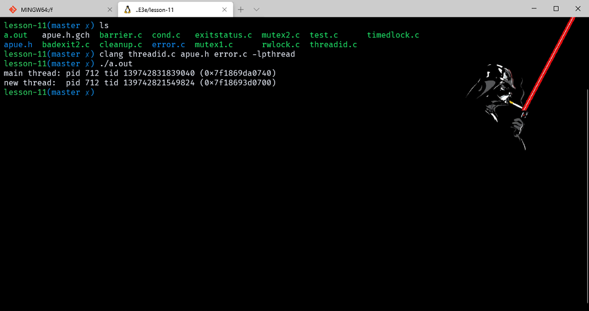
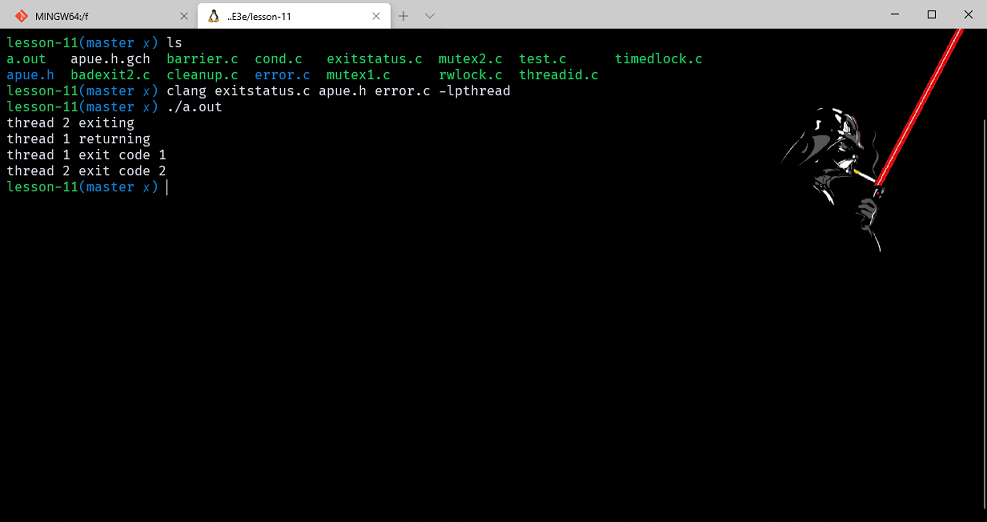
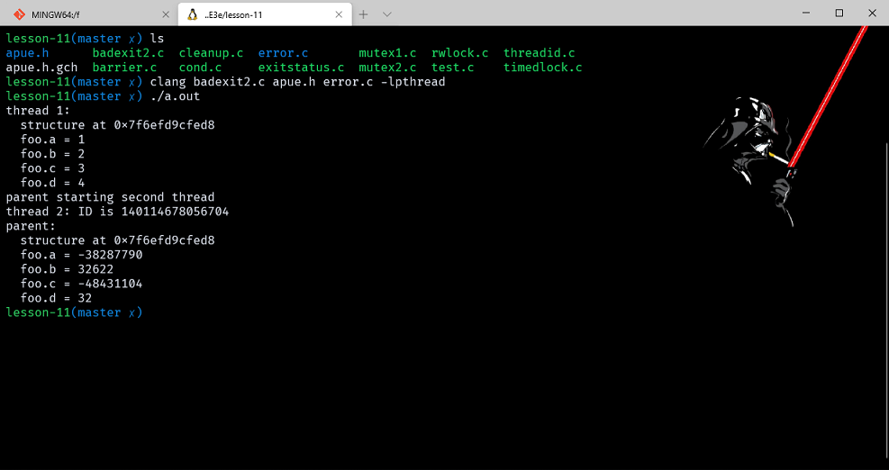
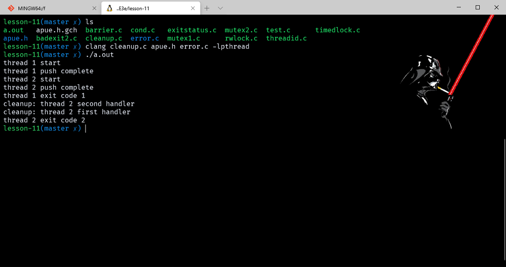
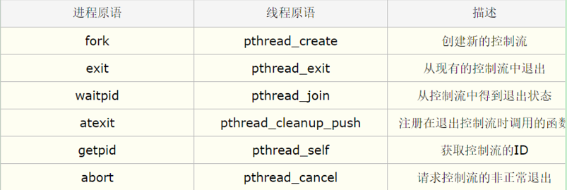
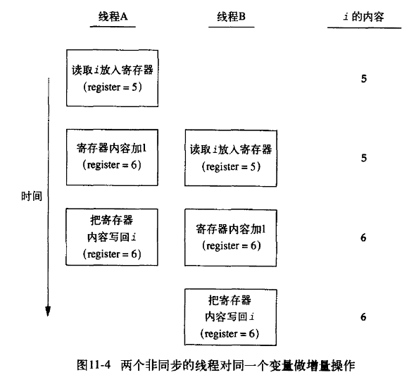
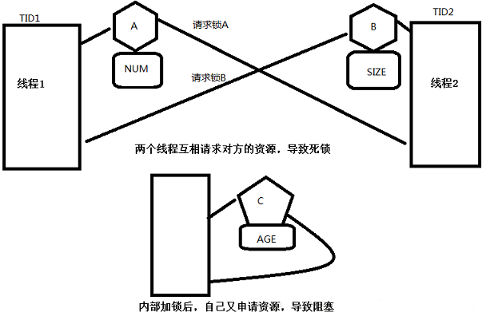
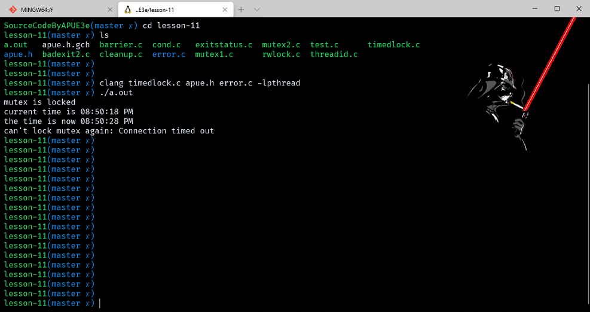
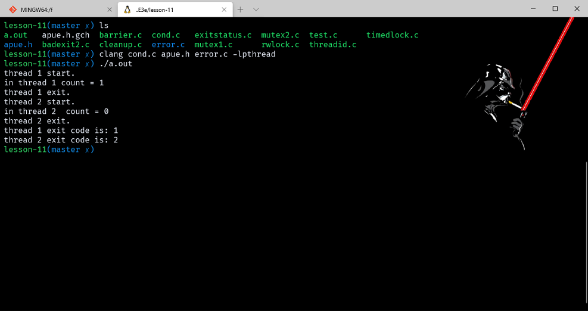

# 线程

- [线程](#线程)
  - [前言](#前言)
  - [线程概念](#线程概念)
  - [线程标识](#线程标识)
  - [线程创建](#线程创建)
    - [example_threadid](#example_threadid)
  - [线程终止](#线程终止)
    - [example_exitstatus](#example_exitstatus)
    - [example_badexit](#example_badexit)
    - [example_cleanup](#example_cleanup)
  - [线程同步](#线程同步)
  - [互斥量](#互斥量)
  - [避免死锁](#避免死锁)
  - [pthread_mutex_timedlock 函数原型](#pthread_mutex_timedlock-函数原型)
    - [example_timeoutlock](#example_timeoutlock)
  - [读写锁](#读写锁)
  - [带有超时的读写锁](#带有超时的读写锁)
  - [条件变量](#条件变量)
    - [example_cond](#example_cond)
  - [Spin lock 自旋锁](#spin-lock-自旋锁)
  - [Barriers 计数锁（屏障）](#barriers-计数锁屏障)
    - [example_barrier](#example_barrier)

> 注意：文章中使用到的源码都在我的 github 中找到，传送门：[SourceCode](https://github.com/HATTER-LONG/SourceCodeByAPUE3e)

## 前言

本章节进一步解析考察单进程换进中使用线程执行多个任务，以及解决资源在多个用户共享中的一致性问题、以及同步机制。

## 线程概念

一个进程在某一时刻只能做一件事，但是有多个控制线程以后，在程序设计时就可以把进程设计成在某一时刻能够做多件事，每个线程处理各自独立的任务。

每个线程包含又表示执行环境所必需的信息，其中包括进程中标示线程的线程 ID、一组寄存器值、栈、调度优先级和策略、信号屏蔽字、errno 变量以及线程私有数据。一个进程所有信息对该进程的所有线程都是**共享的**，包括可执行程序的代码、程序的全局内存和堆内存、栈以及文件描述符。

- 使用线程的好处：
  1. 为每种事件分配单独的线程、能够简化处理异步事件的代码；
  2. 多个线程自动地可以访问相同的存储地址空间和文件描述符；
  3. 将一个问题分解为多个程序，改善整个程序的吞吐量；
  4. 使用多线程改善交互程序的响应时间。

进程与线程关系：进程是系统中程序执行和资源分配的基本单位。每个进程有自己的数据段、代码段和堆栈段。线程通常叫做轻型的进程。线程是在共享内存空间中并发执行的多道执行路径，他们共享一个进程的资源。因为线程和进程比起来很小，所以相对来说，线程花费更少的 CPU 资源。

## 线程标识

每个线程都有自己的线程 ID。与进程 ID 的唯一性不同，线程 ID 只有在进程的上下文中才有意义。线程的 ID 类型是 pthread_t 不能将其看做整形，也就是不具备可移植性。必须用函数使用。
线程 ID 操作函数如下：

```cpp
#include <pthread.h>
int pthread_equal(pthread_t t1, pthread_t t2);//比较两个线程ID
pthread_t pthread_self(void);  //获取调用线程ID
```

当线程需要识别以线程 ID 作为标识的数据结构时，pthread_self 函数可以与 pthread_qual 函数一起使用。

## 线程创建

程序开始运行时，它也是以单进程中的单个控制线程启动的。在创建多个控制线程以前，程序的行为和传统的没有什么区别。

```cpp
SYNOPSIS
       #include <pthread.h>

       int pthread_create(pthread_t *thread, const pthread_attr_t *attr,
                          void *(*start_routine) (void *), void *arg);

       Compile and link with -pthread.
```

thread 指向的内存单元被设置为新创建线程的 ID，attr 用于指定线程属性，start_routine 是新线程开始执行的函数地址，arg 是函数参数。如果是多个参数，可以将把参数存放在一个结构中，然后将结构地址传递给 arg。线程创建时不能保证哪个线程会先运行。

### example_threadid

```cpp
#include "apue.h"
#include <pthread.h>

pthread_t ntid;

void printids(const char* s)
{
    pid_t pid;
    pthread_t tid;

    pid = getpid();
    tid = pthread_self();
    printf("%s pid %lu tid %lu (0x%lx)\n", s, (unsigned long)pid, (unsigned long)tid, (unsigned long)tid);
}

void* thr_fn(void* arg)
{
    printids("new thread: ");
    return ((void*)0);
}

int main(void)
{
    int err;

    err = pthread_create(&ntid, NULL, thr_fn, NULL);
    if (err != 0)
        err_exit(err, "can't create thread");
    printids("main thread:");
    sleep(1);
    exit(0);
}
```



## 线程终止

如果进程中的任一个线程调用了exit、_exit、_Exit函数，那么整个进程就会终止。

- 单个线程终止方式：
  1. 线程只是从启动例程中返回，返回值是线程的退出码；
  2. 线程可以被同一进程的其他线程取消；
  3. 线程调用pthread_exit函数。线程终止函数原型如下：

```cpp
void pthread_exit(void *retval);   //retval终止状态
int pthread_join(pthread_t thread, void **retval); //获取线程终止状态
//返回值：成功 0；失败，返回错误编码
```

其他线程通过调用 pthread_join 函数获取线程终止状态，调用线程将一直阻塞，直到指定的线程调用 pthread_exit、从启动例程中返回或者被取消。如果是返回 retval 就包含返回码。如果线程被取消，由 retval 指定的内存单元就设置位 PTHREAD_CANCELED。如果对返回值不感兴趣可以将 retval 设置为 NULL。

线程调用 pthread_cancel 函数来请求取消同一进程中的其他线程，并不等待线程终止，只是提出请求而已。

```cpp
SYNOPSIS
       #include <pthread.h>

       int pthread_cancel(pthread_t thread);

       Compile and link with -pthread.
```

函数功能等价于使得 tid 标识的线程调用 pthread_exit:

```cpp
SYNOPSIS
       #include <pthread.h>

       void pthread_exit(void *retval);

       Compile and link with -pthread.
```

线程可以安排它退出时需要调用的函数，这与进程在退出时可以用的atexit（7.3）是类似的。称为线程清理处理程序。线程可以建立多个清理处理程序，处理程序记录在栈中，执行顺序与注册顺序相反。函数原型如下：

```cpp
void pthread_cleanup_push(void (*routine)(void *),void *arg);   //注册清理函数
void pthread_cleanup_pop(int execute);  //删除清理程序，若execute=0，清理函数将不被调用两个函数限制：必须在线程相同的作用域中以匹配队的形式使用
```

- 当线程执行以下动作执行清理程序 routine，参数是 arg:
  1. 调用 pthread_exit 时；
  2. 响应取消请求时；
  3. 用非零 execute 参数调用 pthread_cleanup_pop 时，如果 execute=0，则清理程序不执行。

默认情况下，线程的终止状态会保存直到对该线程调用（也就是为什么cleanup.c中没有管2号线程）pthread_join。如果线程已经被分离，线程的底层存储资源可以在线程终止时立即被回收。调用 pthread_detach 分离线程

```cpp
SYNOPSIS
       #include <pthread.h>

       int pthread_detach(pthread_t thread);

       Compile and link with -pthread.
```

### example_exitstatus

```cpp
#include "apue.h"
#include <pthread.h>

void* thr_fn1(void* arg)
{
    printf("thread 1 returning\n");
    return ((void*)1);
}

void* thr_fn2(void* arg)
{
    printf("thread 2 exiting\n");
    pthread_exit((void*)2);
}

int main(void)
{
    int err;
    pthread_t tid1, tid2;
    void* tret;

    err = pthread_create(&tid1, NULL, thr_fn1, NULL);
    if (err != 0)
        err_exit(err, "can't create thread 1");
    err = pthread_create(&tid2, NULL, thr_fn2, NULL);
    if (err != 0)
        err_exit(err, "can't create thread 2");
    err = pthread_join(tid1, &tret);
    if (err != 0)
        err_exit(err, "can't join with thread 1");
    printf("thread 1 exit code %ld\n", (long)tret);
    err = pthread_join(tid2, &tret);
    if (err != 0)
        err_exit(err, "can't join with thread 2");
    printf("thread 2 exit code %ld\n", (long)tret);
    exit(0);
}
```



### example_badexit

需要注意的是 pthread_create 和 pthread_exit 函数的无类型指针参数能够传递的数值可以不止一个，该指针可以传递包含复杂信息的结构地址，这个结构必须所使用的内存必须在调用者用完以后必须仍然有效，否则会出现无法访问或非法。

```cpp
#include "apue.h"
#include <pthread.h>

struct foo
{
    int a, b, c, d;
};

void printfoo(const char* s, const struct foo* fp)
{
    printf("%s", s);
    printf("  structure at 0x%lx\n", (unsigned long)fp);
    printf("  foo.a = %d\n", fp->a);
    printf("  foo.b = %d\n", fp->b);
    printf("  foo.c = %d\n", fp->c);
    printf("  foo.d = %d\n", fp->d);
}

void* thr_fn1(void* arg)
{
    struct foo foo = {1, 2, 3, 4};

    printfoo("thread 1:\n", &foo);
    pthread_exit((void*)&foo);
}

void* thr_fn2(void* arg)
{
    printf("thread 2: ID is %lu\n", (unsigned long)pthread_self());
    pthread_exit((void*)0);
}

int main(void)
{
    int err;
    pthread_t tid1, tid2;
    struct foo* fp;

    err = pthread_create(&tid1, NULL, thr_fn1, NULL);
    if (err != 0)
        err_exit(err, "can't create thread 1");
    err = pthread_join(tid1, (void*)&fp);
    if (err != 0)
        err_exit(err, "can't join with thread 1");
    sleep(1);
    printf("parent starting second thread\n");
    err = pthread_create(&tid2, NULL, thr_fn2, NULL);
    if (err != 0)
        err_exit(err, "can't create thread 2");
    sleep(1);
    printfoo("parent:\n", fp);
    exit(0);
}
```



从结果可以看出，创建第一个线程时候，在该线程的栈中创建了一个结构，第二个线程栈覆盖了第一个线程栈，可以通过使用全局变量结构或者是使用malloc动态分配结构。

### example_cleanup

```cpp
#include "apue.h"
#include <pthread.h>

void cleanup(void* arg) { printf("cleanup: %s\n", (char*)arg); }

void* thr_fn1(void* arg)
{
    printf("thread 1 start\n");
    pthread_cleanup_push(cleanup, "thread 1 first handler");
    pthread_cleanup_push(cleanup, "thread 1 second handler");
    printf("thread 1 push complete\n");
    if (arg)
        return ((void*)1);
    pthread_cleanup_pop(0);
    pthread_cleanup_pop(0);
    return ((void*)1);
}

void* thr_fn2(void* arg)
{
    printf("thread 2 start\n");
    pthread_cleanup_push(cleanup, "thread 2 first handler");
    pthread_cleanup_push(cleanup, "thread 2 second handler");
    printf("thread 2 push complete\n");
    if (arg)
        pthread_exit((void*)2);
    pthread_cleanup_pop(0);
    pthread_cleanup_pop(0);
    pthread_exit((void*)2);
}

int main(void)
{
    int err;
    pthread_t tid1, tid2;
    void* tret;

    err = pthread_create(&tid1, NULL, thr_fn1, (void*)1);
    if (err != 0)
        err_exit(err, "can't create thread 1");
    err = pthread_create(&tid2, NULL, thr_fn2, (void*)1);
    if (err != 0)
        err_exit(err, "can't create thread 2");
    err = pthread_join(tid1, &tret);
    if (err != 0)
        err_exit(err, "can't join with thread 1");
    printf("thread 1 exit code %ld\n", (long)tret);
    err = pthread_join(tid2, &tret);
    if (err != 0)
        err_exit(err, "can't join with thread 2");
    printf("thread 2 exit code %ld\n", (long)tret);
    exit(0);
}
```



只有第二个线程的清理程序被调用了，并且是相反调用的。



## 线程同步

当一个线程可以修改的变量，其他的线程也同样可以使，就需要考虑同步问题。为了解决这个就需要锁这个感念。使得同一时间只允许一个线程访问该变量。

- 两个或更多的线程修改一个变量时也要进行同步。
  1. 从内存单元读入寄存器。
  2. 在寄存器中对变量进行增量操作。
  3. 把新的值写会内存单元。



也有可能线程 2 是在线程 1 增量完成后才进行数据取出这样值就被增加了 2 次，反正如果不同步则会有许多不确定因素（竞争），如果改为原子操作则不会产生这个影响。

除了计算机体系结构以外，程序使用变量的方式也会引起竞争，也会导致不一致的情况发生。

## 互斥量

mutex 是一种简单的加锁的方法来控制对共享资源的访问。在同一时刻只能有一个线程掌握某个互斥上的锁，拥有上锁状态的线程能够对共享资源进行访问。若其他线程希望上锁一个已经被上了互斥锁的资源，则该线程挂起（阻塞），直到上锁的线程释放互斥锁为止。
如果释放互斥量时有一个以上阻塞的线程，那么该所上的所有阻塞的线程都会变为可运行状态。
互斥量类型为 pthread_mutex_t。使用前需要进行初始化，可以把它设置为 PTHREAD_MUTEX_INITIALIZER (只适用于静态分配互斥量)，也可以通过调用 pthread_mutex_init 进行初始化。如果动态分配（例如通过 malloc），在释放内存之前调用 pthread_mutex_destroy。

```cpp
int pthread_mutex_init(pthread_mutex_t *restrict mutex,const pthread_mutex_attr_t *mutexattr);
int pthread_mutex_destroy(pthread_mutex_t *mutex);
int pthread_mutex_lock(pthread_mutex_t *mutex);   //对互斥量进行加锁
int pthread_mutex_trylock(pthread_mutex_t *mutex); //尝试对互斥量进行加锁
int pthread_mutex_unlock(pthread_mutex_t *mutex);  //对互斥量进行解锁
```

如果线程不希望被阻塞，她可以使用尝试加锁，这样就不会阻塞进程。

```cpp
// mutex1.cpp
#include "apue.h"
#include <pthread.h>
#include <stdio.h>

struct foo
{
    int f_count;
    pthread_mutex_t f_lock;
    int f_id;
};

struct foo* foo_alloc(int id)
{
    struct foo* fp;
    if ((fp = (struct foo*)malloc(sizeof(struct foo))) != NULL)
    {
        fp->f_count = 1;
        fp->f_id = id;
        if (pthread_mutex_init(&fp->f_lock, NULL) != 0)
        {
            free(fp);
            return (NULL);
        }
    }
    return (fp);
}

void foo_hold(struct foo* fp)
{
    pthread_mutex_lock(&fp->f_lock);
    fp->f_count++;
    pthread_mutex_unlock(&fp->f_lock);
}

void foo_rele(struct foo* fp)
{
    pthread_mutex_lock(&fp->f_lock);
    if (--fp->f_count == 0)
    {
        pthread_mutex_unlock(&fp->f_lock);
        pthread_mutex_destroy(&fp->f_lock);
        free(fp);
    }
    else
    {
        pthread_mutex_unlock(&fp->f_lock);
    }
}
```

## 避免死锁



如果线程试图对同一个互斥量加锁两次，那么它自身就会陷入死锁状态，还有可能是两个线程相互请求去锁住被对方已经占有的互斥量时，相互进入死锁状态。

有时需要两个互斥量时，总是让它们以相同的顺序加锁，可以避免死锁。

```cpp
// mutex2.cpp
#include <pthread.h>
#include <stdlib.h>

#define NHASH 29
#define HASH(id) (((unsigned long)id) % NHASH)

struct foo* fh[NHASH];

pthread_mutex_t hashlock = PTHREAD_MUTEX_INITIALIZER;

struct foo
{
    int f_count;
    pthread_mutex_t f_lock;
    int f_id;
    struct foo* f_next; /* protected by hashlock */
                        /* ... more stuff here ... */
};

struct foo* foo_alloc(int id) /* allocate the object */
{
    struct foo* fp;
    int idx;

    if ((fp = malloc(sizeof(struct foo))) != NULL)
    {
        fp->f_count = 1;
        fp->f_id = id;
        if (pthread_mutex_init(&fp->f_lock, NULL) != 0)
        {
            free(fp);
            return (NULL);
        }
        idx = HASH(id);
        pthread_mutex_lock(&hashlock);
        fp->f_next = fh[idx];
        fh[idx] = fp;
        pthread_mutex_lock(&fp->f_lock);
        pthread_mutex_unlock(&hashlock);
        /* ... continue initialization ... */
        pthread_mutex_unlock(&fp->f_lock);
    }
    return (fp);
}

void foo_hold(struct foo* fp) /* add a reference to the object */
{
    pthread_mutex_lock(&fp->f_lock);
    fp->f_count++;
    pthread_mutex_unlock(&fp->f_lock);
}

struct foo* foo_find(int id) /* find an existing object */
{
    struct foo* fp;

    pthread_mutex_lock(&hashlock);
    for (fp = fh[HASH(id)]; fp != NULL; fp = fp->f_next)
    {
        if (fp->f_id == id)
        {
            foo_hold(fp);
            break;
        }
    }
    pthread_mutex_unlock(&hashlock);
    return (fp);
}

void foo_rele(struct foo* fp) /* release a reference to the object */
{
    struct foo* tfp;
    int idx;

    pthread_mutex_lock(&fp->f_lock);
    if (fp->f_count == 1)
    { /* last reference */
        pthread_mutex_unlock(&fp->f_lock);
        pthread_mutex_lock(&hashlock);
        pthread_mutex_lock(&fp->f_lock);
        /* need to recheck the condition */
        if (fp->f_count != 1)
        {
            fp->f_count--;
            pthread_mutex_unlock(&fp->f_lock);
            pthread_mutex_unlock(&hashlock);
            return;
        }
        /* remove from list */
        idx = HASH(fp->f_id);
        tfp = fh[idx];
        if (tfp == fp)
        {
            fh[idx] = fp->f_next;
        }
        else
        {
            while (tfp->f_next != fp)
                tfp = tfp->f_next;
            tfp->f_next = fp->f_next;
        }
        pthread_mutex_unlock(&hashlock);
        pthread_mutex_unlock(&fp->f_lock);
        pthread_mutex_destroy(&fp->f_lock);
        free(fp);
    }
    else
    {
        fp->f_count--;
        pthread_mutex_unlock(&fp->f_lock);
    }
}
```

第二个互斥量维护着一个用于跟踪 foo 数据结构的散列列表。这样 hashlock 互斥量既可以保护 foo 数据结构中的散列表 fh，又可以保护散列链字段 f_next。这种锁分复杂，我们也可以使用散列列表锁来保护结构引用计数，将其简化。

## pthread_mutex_timedlock 函数原型

当线程试图获取一个已加锁的互斥量时，pthread_mutex_timedlock 允许绑定阻塞时长，超过时间就会返回出错 ETIMEDOUT。

```cpp
int pthread_mutex_timedlock(pthread_mutex_t *restrict mutex, const struct timespec *restrict abstime);
```

### example_timeoutlock

```cpp
#include "apue.h"
#include <pthread.h>

int main(void)
{
    int err;
    struct timespec tout;
    struct tm* tmp;
    char buf[64];
    pthread_mutex_t lock = PTHREAD_MUTEX_INITIALIZER;

    pthread_mutex_lock(&lock);
    printf("mutex is locked\n");
    clock_gettime(CLOCK_REALTIME, &tout);
    tmp = localtime(&tout.tv_sec);
    strftime(buf, sizeof(buf), "%r", tmp);
    printf("current time is %s\n", buf);
    tout.tv_sec += 10; /* 10 seconds from now */
    /* caution: this could lead to deadlock */
    err = pthread_mutex_timedlock(&lock, &tout);
    clock_gettime(CLOCK_REALTIME, &tout);
    tmp = localtime(&tout.tv_sec);
    strftime(buf, sizeof(buf), "%r", tmp);
    printf("the time is now %s\n", buf);
    if (err == 0)
        printf("mutex locked again!\n");
    else
        printf("can't lock mutex again: %s\n", strerror(err));
    exit(0);
}
```



## 读写锁

也被称之为共享-排他锁。允许多个线程获取读锁，而只能有一个线程持有写锁；而且读锁只会阻塞写锁，写锁阻塞其他所有锁，所以更适用于读多写少的场景。
注意：使用前必须初始化，在释放他们的内存之前必须销毁。

```cpp
#include <pthread.h>
int pthread_rwlock_init(pthread_rwlock_t *restrict rwlock, const pthread_rwlockattr_t *restrict attr);
int pthread_rwlock_destory(pthread_rwlock_t *rwlock);

int pthread_rwlock_rdlock(pthread_rwlock_t *rwlock);//获取读锁，同时也有tryrdlock和timedlock版本
int pthread_rwlock_rwlock(pthread_rwlock_t *rwlock);//获取写锁，同时也有tryrwlock和timedlock版本
int pthread_rwlock_unlock(pthread_rwlock_t *rwlock);//释放锁的接口是一致的
```

```cpp
// rwlock.c
#include <pthread.h>
#include <stdlib.h>

struct job
{
    struct job* j_next;
    struct job* j_prev;
    pthread_t j_id; /* tells which thread handles this job */
                    /* ... more stuff here ... */
};

struct queue
{
    struct job* q_head;
    struct job* q_tail;
    pthread_rwlock_t q_lock;
};

/*
 * Initialize a queue.
 */
int queue_init(struct queue* qp)
{
    int err;

    qp->q_head = NULL;
    qp->q_tail = NULL;
    err = pthread_rwlock_init(&qp->q_lock, NULL);
    if (err != 0)
        return (err);
    /* ... continue initialization ... */
    return (0);
}

/*
 * Insert a job at the head of the queue.
 */
void job_insert(struct queue* qp, struct job* jp)
{
    pthread_rwlock_wrlock(&qp->q_lock);
    jp->j_next = qp->q_head;
    jp->j_prev = NULL;
    if (qp->q_head != NULL)
        qp->q_head->j_prev = jp;
    else
        qp->q_tail = jp; /* list was empty */
    qp->q_head = jp;
    pthread_rwlock_unlock(&qp->q_lock);
}

/*
 * Append a job on the tail of the queue.
 */
void job_append(struct queue* qp, struct job* jp)
{
    pthread_rwlock_wrlock(&qp->q_lock);
    jp->j_next = NULL;
    jp->j_prev = qp->q_tail;
    if (qp->q_tail != NULL)
        qp->q_tail->j_next = jp;
    else
        qp->q_head = jp; /* list was empty */
    qp->q_tail = jp;
    pthread_rwlock_unlock(&qp->q_lock);
}

/*
 * Remove the given job from a queue.
 */
void job_remove(struct queue* qp, struct job* jp)
{
    pthread_rwlock_wrlock(&qp->q_lock);
    if (jp == qp->q_head)
    {
        qp->q_head = jp->j_next;
        if (qp->q_tail == jp)
            qp->q_tail = NULL;
        else
            jp->j_next->j_prev = jp->j_prev;
    }
    else if (jp == qp->q_tail)
    {
        qp->q_tail = jp->j_prev;
        jp->j_prev->j_next = jp->j_next;
    }
    else
    {
        jp->j_prev->j_next = jp->j_next;
        jp->j_next->j_prev = jp->j_prev;
    }
    pthread_rwlock_unlock(&qp->q_lock);
}

/*
 * Find a job for the given thread ID.
 */
struct job* job_find(struct queue* qp, pthread_t id)
{
    struct job* jp;

    if (pthread_rwlock_rdlock(&qp->q_lock) != 0)
        return (NULL);

    for (jp = qp->q_head; jp != NULL; jp = jp->j_next)
        if (pthread_equal(jp->j_id, id))
            break;

    pthread_rwlock_unlock(&qp->q_lock);
    return (jp);
}
```

凡是需要向队列中增加作业或者从队列中删除作业的时候，都采用了写模式来锁住队列的读写锁，搜索情况下都采用读模式上锁。

## 带有超时的读写锁

应用程序在获取读写锁时避免陷入永久阻塞状态。

```cpp
#include <pthread.h>
#include <time.h>
int pthread_rwlock_timedrdlock(pthread_rwlock_t *restrict rwlock, const struct timespec *restrict abs_time-out);
int pthread_rwlock_timedwrlock(pthread_rwlock_t *restrict rwlock, const struct timespec *restrict abs_time-out);
```

abs_time-out 参数指向结构体 timespec 结构，指定线程应该阻塞的时间。如果他们不能获取锁，那么超时到期时，这两个函数将返回 ETIMEDOUT 错误。与 pthread_mutex_timedlock 函数类似，超时指定的是绝对时间，而不是相对时间。

## 条件变量

- 条件变量的特点：
  1. 给多个线程提供了个**会合的机会**，条件变量与互斥量**一起使用**，允许线程以无竞争的方式等待特定的条件发生，条件本身是由互斥量保护。线程在改变条件状态前必须先锁住互斥量，条件变量允许线程等待特定条件发生。
  2. 通过允许线程阻塞和等待另一个线程发送信号的方法弥补了互斥锁的不足，它常和互斥锁一起使用。使用时，条件变量被用来阻塞一个线程，当条件不满足时，线程往往解开相应的互斥锁并等待条件发生变化。一旦其它的某个线程改变了条件变量，它将通知相应的条件变量唤醒一个或多个正被此条件变量阻塞的线程。这些线程将重新锁定互斥锁并重新测试条件是否满足。一般说来，条件变量被用来进行线承间的同步。
  3. 条件变量类型为 pthread_cond_t，使用前必须进行初始化，静态初始化把常量 PTHREAD_COND_INITIALIZER 赋给静态分配的条件变量，动态分布操作函数如下：

    ```cpp
    int pthread_cond_init(pthread_cond_t *restrict cond,const pthread_condattr_t *restrict attr);
    int pthread_cond_destroy(pthread_cond_t *cond);
    //两个函数成功返回0；否则返回错误编号
    //默认属性的话 attr 可以设置位 NULL

    int pthread_cond_wait(pthread_cond_t *restrict cond,pthread_mutex_t *restrict mutex); //等待条件变为真，如果在给定时间内不能完成则返回错误编码
    int pthread_cond_timedwait(pthread_cond_t *restrict cond,pthread_mutex_t *restrict mutex,const structtimespec *restrict abstime);
    int pthread_cond_broadcast(pthread_cond_t *cond);  //唤醒等待该条件的所有线程
    int pthread_cond_signal(pthread_cond_t *cond); //唤醒等待该条件的某个线程
    ```

- pthread_cond_wait 是理解条件变量的关键。该函数会发生下面过程：
  1. 解锁互斥量 mutex。
  2. 阻塞等待条件变量唤醒，关于唤醒函数后面会介绍。
  3. 加锁互斥量 mutex。

### example_cond

程序中创建两个新线程 1 和 2，线程 1 使数目增加，线程 2 使数目减少。只有当数目不为 0 时，减少才能进行，为 0 时候需要等待。

```cpp
#include <errno.h>
#include <pthread.h>
#include <stdio.h>
#include <stdlib.h>
#include <sys/types.h>
#include <unistd.h>

struct foo
{
    int f_count;
    pthread_mutex_t f_mutex;
    pthread_cond_t f_cond;
};

struct foo* foo_alloc()
{
    struct foo* fp;
    fp = (struct foo*)malloc(sizeof(struct foo));
    if (fp != NULL)
    {
        fp->f_count = 0;
        pthread_mutex_init(&fp->f_mutex, NULL);
        pthread_cond_init(&fp->f_cond, NULL);
    }
    return fp;
}
void foo_increase(struct foo* fp)
{
    pthread_mutex_lock(&fp->f_mutex);
    if (fp->f_count == 0) //发送信号，通知可以做decrease操作
        pthread_cond_signal(&fp->f_cond);
    fp->f_count++;
    pthread_mutex_unlock(&fp->f_mutex);
}
void foo_decrease(struct foo* fp)
{
    pthread_mutex_lock(&fp->f_mutex);
    while (fp->f_count == 0)                          //判断是否可以做decrease操作
        pthread_cond_wait(&fp->f_cond, &fp->f_mutex); //等待信号
    fp->f_count--;
    pthread_mutex_unlock(&fp->f_mutex);
}
void* thread_func1(void* arg)
{
    struct foo* fp = (struct foo*)arg;
    printf("thread 1 start.\n");
    foo_increase(fp);
    printf("in thread 1 count = %d\n", fp->f_count);
    printf("thread 1 exit.\n");
    pthread_exit((void*)1);
}
void* thread_func2(void* arg)
{
    struct foo* fp = (struct foo*)arg;
    printf("thread 2 start.\n");
    foo_decrease(fp);
    printf("in thread 2  count = %d\n", fp->f_count);
    printf("thread 2 exit.\n");
    pthread_exit((void*)2);
}

int main()
{
    pthread_t pid1, pid2, pid3;
    int err;
    void* pret;
    struct foo* fobj;
    fobj = foo_alloc();
    pthread_create(&pid1, NULL, thread_func1, (void*)fobj);
    pthread_create(&pid2, NULL, thread_func2, (void*)fobj);
    pthread_join(pid1, &pret);
    printf("thread 1 exit code is: %d\n", (int)pret);
    pthread_join(pid2, &pret);
    printf("thread 2 exit code is: %d\n", (int)pret);
    exit(0);
}
```



## Spin lock 自旋锁

自旋锁与互斥锁类似。只是起阻塞的方式不同。对于互斥锁而言，如果互斥锁被其他线程锁住了，那么本线程要加锁时通过睡眠方式等待。而对于自旋锁，它加锁时，如果自旋锁被其它线程加锁，则本线程以循环方式等待，也就是在那里一直循环。
自旋锁的作用是提高加锁的效率。它一般用于使用者保持锁时间较短的情况。也就是说加锁和解锁时间很短的情况。但是当线程自旋等待锁变为可用时，CPU 不能做其他的事情，这也就是自旋锁只能持有一小段时间的原因。

```cpp
#include <pthread.h>
int pthread_spin_init(pthread_spinlock_t *lock,intpshared);
int pthread_spin_destroy(pthread_spinlock_t *lock);
//Both return: 0 if OK, error number on failure

int pthread_spin_lock(pthread_spinlock_t *lock);
int pthread_spin_trylock(pthread_spinlock_t *lock);
int pthread_spin_unlock(pthread_spinlock_t *lock);
//All return: 0 if OK, error number on failure
```

## Barriers 计数锁（屏障）

屏障是用户协调多个线程并行工作的同步机制。屏障允许多个线程到达某一点后等待，直到所有合作线程都到达后继续运行，join也属于一种屏障，只不过它是等到一个线程结束后。

计数锁用 pthread_barrier_ 表示，它充当栏杆，阻塞线程，直到指定数目的线程到齐。
接口：

```cpp
#include <pthread.h>
int pthread_barrier_init(pthread_barrier_t *restrictbarrier,const pthread_barrierattr_t *restrict attr,unsigned int count);
int pthread_barrier_destroy(pthread_barrier_t *barrier);
//Both return: 0 if OK, error number on failure
```

参数count用于指定要等待的线程数目。

```cpp
#include <pthread.h>
int pthread_barrier_wait(pthread_barrier_t *barrier);
//Returns: 0 or PTHREAD_BARRIER_SERIAL_THREAD if OK, error number on failure
```

pthread_barrier_wait 用来是线程进入等待，然后检测计数锁是否满足释放条件了。对于任意个进程 wait 函数返回 PTHREAD_BARRIER_SERIAL_THREAD，剩下的其他线程返回 0。

### example_barrier

```cpp
#include "apue.h"
#include <limits.h>
#include <pthread.h>
#include <sys/time.h>

#define NTHR 8               /* number of threads */
#define NUMNUM 8000000L      /* number of numbers to sort */
#define TNUM (NUMNUM / NTHR) /* number to sort per thread */

long nums[NUMNUM];
long snums[NUMNUM];

pthread_barrier_t b;

//#ifdef SOLARIS
#define heapsort qsort
//#else
// extern int heapsort(void *, size_t, size_t,
//                    int (*)(const void *, const void *));
//#endif

/*
 * Compare two long integers (helper function for heapsort)
 */
int complong(const void* arg1, const void* arg2)
{
    long l1 = *(long*)arg1;
    long l2 = *(long*)arg2;

    if (l1 == l2)
        return 0;
    if (l1 < l2)
        return -1;
    return 1;
}

/*
 * Worker thread to sort a portion of the set of numbers.
 */
void* thr_fn(void* arg)
{
    long idx = (long)arg;

    heapsort(&nums[idx], TNUM, sizeof(long), complong);
    pthread_barrier_wait(&b);

    /*
     * Go off and perform more work ...
     */
    return ((void*)0);
}

/*
 * Merge the results of the individual sorted ranges.
 */
void merge()
{
    long idx[NTHR];
    long i, minidx, sidx, num;

    for (i = 0; i < NTHR; i++)
        idx[i] = i * TNUM;
    for (sidx = 0; sidx < NUMNUM; sidx++)
    {
        num = LONG_MAX;
        for (i = 0; i < NTHR; i++)
        {
            if ((idx[i] < (i + 1) * TNUM) && (nums[idx[i]] < num))
            {
                num = nums[idx[i]];
                minidx = i;
            }
        }
        snums[sidx] = nums[idx[minidx]];
        idx[minidx]++;
    }
}

int main()
{
    unsigned long i;
    struct timeval start, end;
    long long startusec, endusec;
    double elapsed;
    int err;
    pthread_t tid;

    /*
     * Create the initial set of numbers to sort.
     */
    srandom(1);
    for (i = 0; i < NUMNUM; i++)
        nums[i] = random();

    /*
     * Create 8 threads to sort the numbers.
     */
    gettimeofday(&start, NULL);
    pthread_barrier_init(&b, NULL, NTHR + 1);
    for (i = 0; i < NTHR; i++)
    {
        err = pthread_create(&tid, NULL, thr_fn, (void*)(i * TNUM));
        if (err != 0)
            err_exit(err, "can't create thread");
    }
    pthread_barrier_wait(&b);
    merge();
    gettimeofday(&end, NULL);

    /*
     * Print the sorted list.
     */
    startusec = start.tv_sec * 1000000 + start.tv_usec;
    endusec = end.tv_sec * 1000000 + end.tv_usec;
    elapsed = (double)(endusec - startusec) / 1000000.0;
    printf("sort took %.4f seconds\n", elapsed);
    for (i = 0; i < NUMNUM; i++)
        printf("%ld\n", snums[i]);
    exit(0);
}
```

[【Linux学习】pthread_create主线程与创建的新线程之间退出关系](https://blog.csdn.net/xiajun07061225/article/details/8976850)
