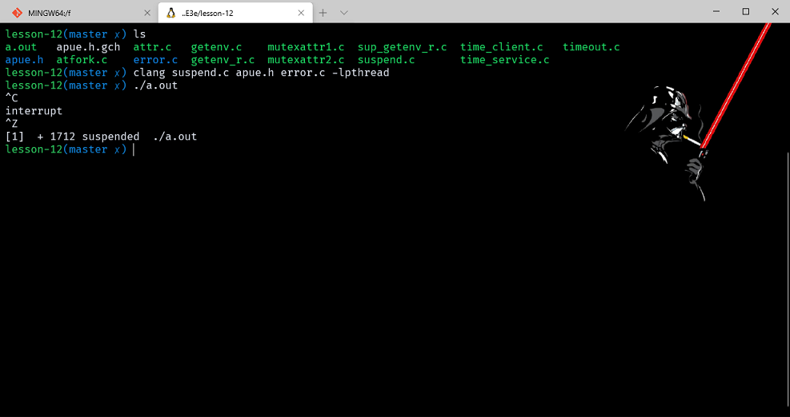

# 线程控制

- [线程控制](#线程控制)
  - [前言](#前言)
  - [线程限制](#线程限制)
  - [线程属性](#线程属性)
    - [example_attr](#example_attr)
  - [同步属性](#同步属性)
    - [互斥量属性](#互斥量属性)
      - [example](#example)
    - [读写锁属性](#读写锁属性)
    - [条件变量属性](#条件变量属性)
    - [屏障属性](#屏障属性)
  - [重入](#重入)
    - [example_getenv](#example_getenv)
  - [线程特定数据](#线程特定数据)
    - [example_getenv_r](#example_getenv_r)
  - [取消选项](#取消选项)
  - [线程和信号](#线程和信号)
    - [example_suspend](#example_suspend)

> 注意：文章中使用到的源码都在我的 github 中找到，传送门：[SourceCode](https://github.com/HATTER-LONG/SourceCodeByAPUE3e)

## 前言

讲解控制线程行为的详细内容，统一进程中多个线程如何保持数据的私有性，和基于进程系统调用与线程的交互。

## 线程限制

线程的限制可以通过 sysconf 函数进行查询。这些限制的使用是为了增强程序在不同的环境下的适用性。


## 线程属性

在调用 pthread_create 函数创建一个新线程时候可以指定线程的属性，属性类型为 pthread_attr_t。如果初始化函数分配了与属性对相关联的资源，则需要销毁函数释放，每个属性都有一个设置属性值的函数。可以使用 pthread_attr_t 结构修改线程默认属性，并把这些属性与创建的线程联系起来。

```cpp
int pthread_attr_init(pthread_attr_t *attr);   //初始化线程属性
int pthread_attr_destroy(pthread_attr_t *attr); //释放线程属性空间
```


如果对现有某个线程的终止状态不感兴趣的话，可以使用 pthread_detach 函数让操作系统在线程退出时候收回它所占用的资源。创建线程时候可以修改 pthread_attr_t 结构中的 detachstate 线程属性，让线程以分离状态启动。可以使用下面函数进程操作分离属性：

```cpp
int pthread_attr_setdetachstate(pthread_attr_t *attr, int detachstate);
int pthread_attr_getdetachstate(pthread_attr_t *attr, int *detachstate);
```

- detatchstate 取值为：
  1. PTHREAD_CREATE_DETACHED 分离状态启动。
  2. PTHREAD_CREATE_JOINABLE 正常启动，应用程序可以获取线程的终止状态。

pthread_attr_getdetachstate 主要是用来获取当前的线程属性。

```cpp
#include "apue.h"
#include <pthread.h>

int makethread(void* (*fn)(void*), void* arg)
{
    int err;
    pthread_t tid;
    pthread_attr_t attr;

    err = pthread_attr_init(&attr);
    if (err != 0)
        return (err);
    err = pthread_attr_setdetachstate(&attr, PTHREAD_CREATE_DETACHED);
    if (err == 0)
        err = pthread_create(&tid, &attr, fn, arg);
    pthread_attr_destroy(&attr);
    return (err);
}
```

对于一些操作系统来说，并不一定支持线程栈属性，可以在编译阶段检查 _POSIX_THREAD_ATTR_STACKADDR 和 _SC_THREAD_ATTR_STACKSIZE 符号来确定是否支持，或者将这两个符号传个 sysconf 函数来检查。

```cpp
int pthread_attr_setstack(pthread_attr_t *attr,void *stackaddr, size_t stacksize);
int pthread_attr_getstack(pthread_attr_t *attr,void **stackaddr, size_t *stacksize);
```

对进程来说，虚拟地址空间的大小是固定的，进程中只有一个栈如果用完了线程栈的虚拟地址空间，可以使用 malloc 或者 mmap 来为其他栈分配空间，并用 pthread_attr_setstack 函数改变新建线程的栈位置。stackaddr 线程属性为栈的最低内存地址，但不一定是栈的开始位置，有的处理器是相反处理的。

```cpp
int pthread_attr_getstacksize( const pthread_attr_t *restrict attr, size_t *restrict stacksize ); //获取栈大小
int pthread_attr_setstacksize( const pthread_attr_t *attr, size_t stacksize ); //设置栈大小
```

stacksize 不能小于 PTHREAD_STACK_MIN

```cpp
int pthread_attr_getguardsize( const pthread_attr_t *restrict attr, size_t *restrict guardsize ); //获取线程栈末尾之后用以避免栈溢出的扩展内存的大小
int pthread_attr_setguardsize( const pthread_attr_t *attr, size_t stacksize ); //设置线程栈末尾之后用以避免栈溢出的扩展内存的大小
```

guardsize 控制线程栈末尾之后用以避免栈溢出的扩展内存的大小。属性默认为 PAGESIZE 个字节。
guardsize 为 0 时不会提供警戒缓冲区，如果对线程属性 stackaddr 做的修改，系统会使警戒栈缓冲区机制无效，等同为 guardsize 为 0。

### example_attr

```cpp
#include "apue.h"
#include <pthread.h>
#include <stdio.h>

void* thread_func(void* arg)
{
    pthread_t pid;
    pthread_attr_t attr;
    int i;
    size_t v;
    void* stkaddr;
    pid = pthread_self();
    pthread_getattr_np(pthread_self(), &attr);
    pthread_attr_getdetachstate(&attr, &i);

    printf("Detachstate\t=");
    if (i == PTHREAD_CREATE_DETACHED)
        printf("PTHREAD_CREATE_DETACHED\n");
    else if (i == PTHREAD_CREATE_JOINABLE)
        printf("PTHREAD_CREATE_JOINABLE\n");

    pthread_attr_getguardsize(&attr, &v);

    printf("Guard size\t= %d bytes\n", (int)v);
    pthread_attr_getstack(&attr, &stkaddr, &v);
    printf("Stack address\t= %p\n", stkaddr);
    printf("Stack size\t= 0x%x bytes\n", (int)v);

    return ((void*)0);
}

int main(void)
{
    pthread_t pid;
    pthread_attr_t attr;
    int err;

    err = pthread_attr_init(&attr);
    if (err != 0)
    {
        printf("pthread_attr_init() error\n");
        exit(-1);
    }

    pthread_attr_setdetachstate(&attr, PTHREAD_CREATE_DETACHED);
    pthread_create(&pid, &attr, thread_func, NULL);

    sleep(2);
    return 0;
}
```


## 同步属性

### 互斥量属性

互斥量属性数据类型为 pthread_mutexattr_t 结构表示。对于非默认属性初始化通过特殊的函数进行处理：

```cpp
int pthread_mutexattr_init(pthread_mutexattr_t *attr);  //初始化
int pthread_mutexattr_destroy(pthread_mutexattr_t *attr); //回收
```

一共有三种属性：进程共享属性、健壮属性以及类型属性。使用一下函数查询和设置 pthread_mutexattr_t 结构内容，得到它的进程共享属性或者修改进程共享属性：

```cpp
int pthread_mutexattr_getpshared(const pthread_mutexattr_t *restrict attr, int *restrict pshared);  //查询进程共享属性
int pthread_mutexattr_setpshared(pthread_mutexattr_t *attr,int pshared); //设置进程共享属性
```

如果线程共享互斥量属性被设置为 PTHREAD_PROCESS_SHARED，从多个进程共享的内存区域中分配的互斥量就可以用于这些线程的同步。

互斥量健壮属性与多个进程间共享的互斥量有关，当持有互斥量的线程终止时，需要解决互斥量状态恢复问题。否则这个锁将一直处于锁定状态，其他需要这个锁的进程将会一直阻塞。

```cpp
#include <pthread.h>
int pthread_mutexattr_getrobust(const pthread_mutexattr_t * restrict attr, int * restrict robust);
int pthread_mutexattr_setrobust(pthread_mutexattr_t *attr, int robust);
//成功返回0；否则，返回错误编码。
```

健壮属性取值有两种可能情况，PTHREAD_MUTEX_STALLED 表示不作任何处理，等待锁的进程将阻塞。PTHREAD_MUTEX_ROBUST 表示调用 lock 的程序将会获得锁，如果这个锁被另一个进程持有且没有解锁，则返回 EOWNERDEAD，使用健壮属性我们必须检查三种返回值：不需要恢复的成功，需要回复的成功以及失败。

如果应用状态无法恢复，对互斥量解锁后将处于永久无法再用情况。可以使用函数避免，指明与该互斥量相关状态在互斥量解锁之前是一致的：

```cpp
int pthread_mutex_consistent(pthread_mutex_t *mutex)
//成功返回0；否则，返回错误编码。
```

函数需要在解锁互斥量操作之前进行调用，否则将会导致互斥量永久失效，其他试图获取此互斥量的线程就会得到错误码ENOTRECOVERABLE。

类型互斥量属性控制着互斥量的锁定特性。
PTHREAD_MUTEX_NORMAL 一种标准互斥量
PTHREAD_MUTEX_ERRORCHECK 此互斥量类型提供错误检查
PTHREAD_MUTEX_RECURSIVE 此互斥量类型是递归互斥量允许多次加锁。
PTHREAD_MUTEX_DEFAULT 此互斥量类型可以提供默认的特性和行为。

>PTHREAD_MUTEX_NORMAL
>这种类型的互斥锁不会自动检测死锁。如果一个线程试图对一个互斥锁重复锁定，将会引起这个线程的死锁。如果试图解锁一个由别的线程锁定的互斥锁会引发不可预料的结果。如果一个线程试图解锁已经被解锁的互斥锁也会引发不可预料的结果。
>PTHREAD_MUTEX_ERRORCHECK
>这种类型的互斥锁会自动检测死锁。如果一个线程试图对一个互斥锁重复锁定，将会返回一个错误代码。如果试图解锁一个由别的线程锁定的互斥锁将会返回一个错误代码。如果一个线程试图解锁已经被解锁的互斥锁也将会返回一个错误代码。
>PTHREAD_MUTEX_RECURSIVE
>如果一个线程对这种类型的互斥锁重复上锁，不会引起死锁，一个线程对这类互斥锁的多次重复上锁必须由这个线程来重复相同数量的解锁，这样才能解开这个互斥锁，别的线程才能得到这个互斥锁。如果试图解锁一个由别的线程锁定的互斥锁将会返回一个错误代码。如果一个线程试图解锁已经被解锁的互斥锁也将会返回一个错误代码。这种类型的互斥锁只能是进程私有的（作用域属性为PTHREAD_PROCESS_PRIVATE）。
>PTHREAD_MUTEX_DEFAULT
>这种类型的互斥锁不会自动检测死锁。如果一个线程试图对一个互斥锁重复锁定，将会引起不可预料的结果。如果试图解锁一个由别的线程锁定的互斥锁会引发不可预料的结果。如果一个线程试图解锁已经被解锁的互斥锁也会引发不可预料的结果。POSIX标准规定，对于某一具体的实现，可以把这种类型的互斥锁定义为其他类型的互斥锁。

#### example

```cpp
#include "apue.h"
#include <pthread.h>
#include <sys/time.h>
#include <time.h>


struct to_info
{
    void (*to_fn)(void*);    /* function */
    void* to_arg;            /* argument */
    struct timespec to_wait; /* time to wait */
};

#define SECTONSEC 1000000000 /* seconds to nanoseconds */

#if !defined(CLOCK_REALTIME) || defined(BSD)
#define clock_nanosleep(ID, FL, REQ, REM) nanosleep((REQ), (REM))
#endif

#ifndef CLOCK_REALTIME
#define CLOCK_REALTIME 0
#define USECTONSEC 1000 /* microseconds to nanoseconds */

void clock_gettime(int id, struct timespec* tsp)
{
    struct timeval tv;

    gettimeofday(&tv, NULL);
    tsp->tv_sec = tv.tv_sec;
    tsp->tv_nsec = tv.tv_usec * USECTONSEC;
}
#endif

int makethread(void* (*fn)(void*), void* arg)
{
    int err;
    pthread_t tid;
    pthread_attr_t attr;

    err = pthread_attr_init(&attr);
    if (err != 0)
        return (err);
    err = pthread_attr_setdetachstate(&attr, PTHREAD_CREATE_DETACHED);
    if (err == 0)
        err = pthread_create(&tid, &attr, fn, arg);
    pthread_attr_destroy(&attr);
    return (err);
}

void* timeout_helper(void* arg)
{
    struct to_info* tip;

    tip = (struct to_info*)arg;
    clock_nanosleep(CLOCK_REALTIME, 0, &tip->to_wait, NULL);
    (*tip->to_fn)(tip->to_arg);
    free(arg);
    return (0);
}

void timeout(const struct timespec* when, void (*func)(void*), void* arg)
{
    struct timespec now;
    struct to_info* tip;
    int err;

    clock_gettime(CLOCK_REALTIME, &now);
    if ((when->tv_sec > now.tv_sec) || (when->tv_sec == now.tv_sec && when->tv_nsec > now.tv_nsec))
    {
        tip = malloc(sizeof(struct to_info));
        if (tip != NULL)
        {
            tip->to_fn = func;
            tip->to_arg = arg;
            tip->to_wait.tv_sec = when->tv_sec - now.tv_sec;
            if (when->tv_nsec >= now.tv_nsec)
            {
                tip->to_wait.tv_nsec = when->tv_nsec - now.tv_nsec;
            }
            else
            {
                tip->to_wait.tv_sec--;
                tip->to_wait.tv_nsec = SECTONSEC - now.tv_nsec + when->tv_nsec;
            }
            err = makethread(timeout_helper, (void*)tip);
            if (err == 0)
                return;
            free(tip);
        }
    }

    /*
     * We get here if (a) when <= now, or (b) malloc fails, or
     * (c) we can't make a thread, so we just call the function now.
     */
    (*func)(arg);
}

pthread_mutexattr_t attr;
pthread_mutex_t mutex;

void retry(void* arg)
{
    pthread_mutex_lock(&mutex);

    /* perform retry steps ... */

    pthread_mutex_unlock(&mutex);
}

int main(void)
{
    int err, condition, arg;
    struct timespec when;

    if ((err = pthread_mutexattr_init(&attr)) != 0)
        err_exit(err, "pthread_mutexattr_init failed");
    if ((err = pthread_mutexattr_settype(&attr, PTHREAD_MUTEX_RECURSIVE)) != 0)
        err_exit(err, "can't set recursive type");
    if ((err = pthread_mutex_init(&mutex, &attr)) != 0)
        err_exit(err, "can't create recursive mutex");

    /* continue processing ... */

    pthread_mutex_lock(&mutex);

    /*
     * Check the condition under the protection of a lock to
     * make the check and the call to timeout atomic.
     */
    if (condition)
    {
        /*
         * Calculate the absolute time when we want to retry.
         */
        clock_gettime(CLOCK_REALTIME, &when);
        when.tv_sec += 10; /* 10 seconds from now */
        timeout(&when, retry, (void*)((unsigned long)arg));
    }
    pthread_mutex_unlock(&mutex);

    /* continue processing ... */

    exit(0);
}
```

PTHREAD_MUTEX_RECURSIVE 互斥量类型允许在同一个线程在互斥量解锁之前对该互斥量进程多次加锁，当对个一个量加锁两次的时候，可以避免死锁。例如用默认类型，当对一个锁加锁两次时候，会造成死锁：

```cpp
#include <errno.h>
#include <pthread.h>
#include <stdio.h>
#include <stdlib.h>
#include <sys/types.h>
#include <unistd.h>


struct foo
{
    int f_count;
    int f_addtimes;
    pthread_mutex_t f_mutex;
};

struct foo* foo_alloc()
{
    struct foo* fp;
    fp = (struct foo*)malloc(sizeof(struct foo));
    if (fp != NULL)
    {
        fp->f_count = 0;
        fp->f_addtimes = 0;
        pthread_mutex_init(&fp->f_mutex, NULL);
    }
    return fp;
}

void foo_addtimes(struct foo* fp)
{
    pthread_mutex_lock(&fp->f_mutex);
    fp->f_addtimes++;
    pthread_mutex_unlock(&fp->f_mutex);
}

void foo_add(struct foo* fp) //调用foo_addtimes对f_mutex加锁两次
{
    pthread_mutex_lock(&fp->f_mutex);
    fp->f_count++;
    foo_addtimes(fp);
    pthread_mutex_unlock(&fp->f_mutex);
}

void* thread_func1(void* arg)
{
    struct foo* fp = (struct foo*)arg;
    printf("thread 1 start.\n");
    foo_add(fp); //调用函数执行，造成死锁
    printf("in thread 1 count = %d\n", fp->f_count);
    printf("thread 1 exit.\n");
    pthread_exit((void*)1);
}

int main()
{
    pthread_t pid1;
    int err;
    void* pret;
    struct foo* fobj;
    fobj = foo_alloc();
    pthread_create(&pid1, NULL, thread_func1, (void*)fobj);
    pthread_join(pid1, &pret);
    printf("thread 1 exit code is: %d\n", (int)pret);
    exit(0);
}
```

从结果可以看出程序执行到 foo_add（）时候陷入了死锁。因为 foo_add 函数调用 foo_addtimes 函数，使得加锁两次，导致死锁。解决这个问题可以将 foo_addtimes 函数中的锁去掉，或将 foo_addtimes 函数合并到foo_add中。除了这些办法，还可以设置互斥量属性，设置为递归锁。程序如下：

```cpp
#include <errno.h>
#include <pthread.h>
#include <stdio.h>
#include <stdlib.h>
#include <sys/types.h>
#include <unistd.h>


struct foo
{
    int f_count;
    int f_addtimes;
    pthread_mutex_t f_mutex;
};
struct foo* foo_alloc()
{
    struct foo* fp;
    fp = (struct foo*)malloc(sizeof(struct foo));
    if (fp != NULL)
    {
        fp->f_count = 0;
        fp->f_addtimes = 0;
        //设置互斥量类型为递归锁，可以对已加锁再次加锁
        pthread_mutexattr_t attr;
        pthread_mutexattr_init(&attr);
        pthread_mutexattr_settype(&attr, PTHREAD_MUTEX_RECURSIVE);
        pthread_mutex_init(&fp->f_mutex, &attr);
    }
    return fp;
}
void foo_addtimes(struct foo* fp)
{
    pthread_mutex_lock(&fp->f_mutex);
    fp->f_addtimes++;
    pthread_mutex_unlock(&fp->f_mutex);
}

void foo_add(struct foo* fp)
{
    pthread_mutex_lock(&fp->f_mutex);
    fp->f_count++;
    foo_addtimes(fp);
    pthread_mutex_unlock(&fp->f_mutex);
}
void* thread_func1(void* arg)
{

    struct foo* fp = (struct foo*)arg;
    printf("thread 1 start.\n");
    foo_add(fp);
    printf("in thread 1 count = %d\n", fp->f_count);
    printf("thread 1 exit.\n");
    pthread_exit((void*)1);
}
void* thread_func2(void* arg)
{

    struct foo* fp = (struct foo*)arg;
    printf("thread 2 start.\n");
    foo_add(fp);
    printf("in thread 2 count = %d\n", fp->f_count);
    printf("thread 2 exit.\n");
    pthread_exit((void*)2);
}
int main()
{
    pthread_t pid1, pid2;
    int err;
    void* pret;
    struct foo* fobj;
    fobj = foo_alloc();
    pthread_create(&pid1, NULL, thread_func1, (void*)fobj);
    pthread_create(&pid2, NULL, thread_func2, (void*)fobj);
    pthread_join(pid1, &pret);
    printf("thread 1 exit code is: %d\n", (int)pret);
    pthread_join(pid2, &pret);
    printf("thread 2 exit code is: %d\n", (int)pret);
    exit(0);
}
```

### 读写锁属性

整体与互斥量类似：

```cpp
int pthread_rwlockattr_init(pthread_rwlockattr_t *attr);
int pthread_rwlockattr_destroy(pthread_rwlockattr_t *attr);
```

支持一个属性就是进程共享属性。和互斥量类似有一堆函数用于读写锁的进程共享属性操作。

```cpp
int pthread_rwlockattr_getpshared(const pthread_rwlockattr_t *restrict attr, int *restrict pshared);
int pthread_rwlockattr_setpshared(pthread_rwlockattr_t *attr,int pshared);
```

### 条件变量属性

条件变量有两个属性：进程共享和时钟属性。

```cpp
int pthread_condattr_init(pthread_condattr_t *attr);
int pthread_condattr_destroy(pthread_condattr_t *attr);
```

和之前类似，操作进程共享属性的函数。

```cpp
int pthread_condattr_getpshared(const pthread_condattr_t *restrict attr,int *restrict pshared);
int pthread_condattr_setpshared(pthread_condattr_t *attr,int pshared);
```

时间属性控制计算pthread_cond_timewait函数的超时参数（tspr）时采用的是哪个时钟。

```cpp
int pthread_condattr_getclock(const pthread_condattr_t *restrict attr, int * restruct pshared);
int pthread_condattr_setpshared(pthread_condattr_t *attr, int pshared);
```

### 屏障属性

>（第十章有介绍重入函数）

```cpp
#include <pthread.h>

int pthread_barrierattr_init(pthread_battierattr_t *attr);
int pthread_barrierattr_destroy(pthread_barrierattr_t *attr);
```

目前属性只用进程共享属性。然后你懂得还是有函数。

```cpp
int pthread_barrierattr_getpshared(const pthread_barrierattr_t *restrict attr, int *restrict pshared);

int pthread_barrierattr_setpshared(pthread_barrierattr_t * attr, int pshared);
```

## 重入

有了信号处理程序和多线程，多个控制线程在同一时间可能潜在的调用同一个函数，如果一个函数在同一时刻可以被多个线程安全调用，则称为函数是线程安全的。很多函数并不是线程安全的（表中的函数），因为它们返回的数据是存放在静态的内存缓冲区，可以通过修改接口，要求调用者自己提供缓冲区使函数变为线程安全的。支持线程安全函数的操作系统会在 `<unistd.h>` 中定义_POSIX_THREAD_SAFE_FUNCTIONS。应用程序可以在 sysconf 函数中传入 _SC_THREAD_SAFE_FUNCTIONS 参数检查是否支持线程安全。


可替代的安全版本：


以线程安全的方式管理 FILE 对象的方法。给对象上锁，使用 flockfile 和 ftrylockfile 获取与给定 FILE 对象关联的锁。这个锁是递归锁。

```cpp
void flockfile(FILE *filehandle);
//成功返回0；不能获取锁，返回非零
int ftrylockfile(FILE *filehandle);
void funlockfile(FILE *filehandle);
```

为了避免标准 I/O 在一次一个字符操作时候频繁的获取锁开销，出现了不加锁版本的基于字符的标准 I/O 例程。函数如下：

```cpp
int getc_unlocked(FILE *stream);
int getchar_unlocked(void);
int putc_unlocked(int c, FILE *stream);
int putchar_unlocked(int c);
```

除非被之前的函数包围，否则不要调用这几个函数，会出现未知错误。

一旦对 FILE 对象进行加锁，就可以在释放锁之前对这些函数进行多次调用。可以分摊总的锁开销。

### example_getenv

实现 getenv 函数，不可重入版本（因为调用 getenv 的线程返回的字符串都存放在同一个静态缓冲区中），程序如下：

```cpp
#include <errno.h>
#include <limits.h>
#include <pthread.h>
#include <stdio.h>
#include <stdlib.h>
#include <string.h>
#include <unistd.h>

static char envbuf[1024]; //值存放到一个静态缓冲区中，线程共享
extern char** environ;
char* mygetenv(const char* name)
{
    int i, len;
    len = strlen(name);
    for (i = 0; environ[i] != NULL; i++)
    {
        if ((strncmp(name, environ[i], len) == 0) && (environ[i][len] == '='))
        {
            strcpy(envbuf, &environ[i][len + 1]);
            return envbuf;
        }
    }
    return NULL;
}
void* thread_func1(void* arg)
{
    char* pvalue;
    printf("thread 1 start.\n");
    pvalue = mygetenv("HOME");
    printf("HOME=%s\n", pvalue);
    printf("thread 1 exit.\n");
    pthread_exit((void*)1);
}
void* thread_func2(void* arg)
{
    char* pvalue;
    printf("thread 2 start.\n");
    pvalue = mygetenv("SHELL");
    printf("SHELL=%s\n", pvalue);
    printf("thread 2 exit.\n");
    pthread_exit((void*)2);
}
int main()
{
    pthread_t pid1, pid2;
    int err;
    void* pret;
    pthread_create(&pid1, NULL, thread_func1, NULL);
    pthread_create(&pid2, NULL, thread_func2, NULL);
    pthread_join(pid1, &pret);
    printf("thread 1 exit code is: %d\n", (int)pret);
    pthread_join(pid2, &pret);
    printf("thread 2 exit code is: %d\n", (int)pret);
    exit(0);
}
```


从结果可以看出，多次执行结果，可能会发现 SHELL 环境变量的值被 HOME 环境变量的值覆盖了。这是因为共用一个静态存储变量，而两个线程执行先后顺序不同，导致结果可能被覆盖。可以修改接口，调用者提供自己的缓冲区，每个线程可以使用各自的不同的缓冲区从而避免其他线程的干扰。改进的 getenv_r 程序如下：

```cpp
#include <errno.h>
#include <limits.h>
#include <pthread.h>
#include <stdio.h>
#include <stdlib.h>
#include <string.h>
#include <unistd.h>


extern char** environ;
pthread_mutex_t env_mutex;
static pthread_once_t init_done = PTHREAD_ONCE_INIT; //一次性初始化，保证只运行一次
//初始化互斥量类型
static void thread_init(void)
{
    pthread_mutexattr_t attr;
    pthread_mutexattr_init(&attr);
    //设置为递归锁
    pthread_mutexattr_settype(&attr, PTHREAD_MUTEX_RECURSIVE);
    pthread_mutex_init(&env_mutex, &attr);
    pthread_mutexattr_destroy(&attr);
}
int mygetenv(const char* name, char* buf, int buflen)
{
    int i, len, olen;
    pthread_once(&init_done, thread_init); //初始化互斥量
    len = strlen(name);
    //加锁防止name被修改
    pthread_mutex_lock(&env_mutex);
    for (i = 0; environ[i] != NULL; i++)
    {
        if ((strncmp(name, environ[i], len) == 0) && (environ[i][len] == '='))
        {
            olen = strlen(&environ[i][len]);
            if (olen >= buflen)
            {
                pthread_mutex_unlock(&env_mutex);
                return ENOSPC;
            }
            strcpy(buf, &environ[i][len + 1]);
            pthread_mutex_unlock(&env_mutex);
            return 0;
        }
    }
    pthread_mutex_unlock(&env_mutex);
    return ENOENT;
}

void* thread_func1(void* arg)
{
    char buf[100];
    printf("thread 1 start.\n");
    mygetenv("HOME", buf, 100);
    printf("HOME=%s\n", buf);
    printf("thread 1 exit.\n");
    pthread_exit((void*)1);
}
void* thread_func2(void* arg)
{
    char buf[100];
    printf("thread 2 start.\n");
    mygetenv("SHELL", buf, 100);
    printf("SHELL=%s\n", buf);
    printf("thread 2 exit.\n");
    pthread_exit((void*)2);
}
int main()
{
    pthread_t pid1, pid2;
    int err;
    void* pret;
    pthread_create(&pid1, NULL, thread_func1, NULL);
    pthread_create(&pid2, NULL, thread_func2, NULL);
    pthread_join(pid1, &pret);
    printf("thread 1 exit code is: %d\n", (int)pret);
    pthread_join(pid2, &pret);
    printf("thread 2 exit code is: %d\n", (int)pret);
    exit(0);
}
```


要使函数可重入，并成为线程安全的需要在搜索请求的字符时保护环境不被修改。就是在 NAME 那里上锁。如果使用的是非递归的互斥量，线程从信号处理程序中调用 getenv 函数就可能出现死锁，例如当信号处理成虚在执行getenv函数时中断了该线程。那么就没有解锁，导致死锁。

## 线程特定数据

- 又名线程私有数据，是储存和查询某个特定线程相关数据的一种机制。这种阻止共享的模式主要好处：
  1. 有时候要维护给予每个线程的数据。
  2. 它提供了让基于进程的接口适应多线程环境的机制。

进程中的所有线程都可以访问进程的整个地址空间，除了使用寄存器以外，线程没有办法阻止其他线程访问它的数据，线程私有数据也不例外。管理线程私有数据的函数可以提高线程间的数据独立性。
分配线程私有数据过程：首先调用 pthread_key_create 创建与该数据关联的键，用于获取对线程私有数据的访问权，这个键可以被进程中所有线程访问，但是每个线程把这个键与不同的线程私有数据地址进行关联然后通过调用 pthread_setspecific 函数把键和线程私有数据关联起来，可以通过 pthread_getspecific 函数获取线程私有数据的地址。

首先创建键：

```cpp
int pthread_key_create(pthread_key_t *key, void (*destructor)(void*));
```

键储存在keyp指向的内存，每个线程把这个键与不同的线程特定的数据进行关联。


从上图可知:当调用 pthread_key_create 后会产生一个所有线程都可见的线程特定数据（TSD）的键值(如上图中所有的线程都会得到一个pkey[1]的值), 但是这个键所指向的真实数据却是不同的，虽然都是 pkey[1], 但是他们并不是指向同一块内存，而是指向了只属于自己的实际数据, 因此, 如果线程0更改了pkey[1]所指向的数据, 而并不能够影响到线程 n;

pthread_key_create 还可以绑定一个析构函数，用来释放线程中分配的内存。线程可以为特定数据分配多个键，每个键都有一个析构函数与之相关联。当线程结束后系统会按照特定的顺序调用析构函数，当析构函数都调用完成后，系统就会检查是否还有非空的线程特定数值与键相关联，如果有，再次调用析构函数。直到都为空，或者到达尝试次数的最大值。

对于所有的线程可以取消键与特定值之间的关联：

```cpp
int pthread_key_delete(pthread_key_t key); // 这不会激活相关联的析构函数。
```

需要确保分配的键不会由于初始化阶段的竞争发生改变，比如进行了多次初始化，防止的方法：

```cpp
pthread_once_t initflag = PTHREAD_ONCE_INIT;
int pthread_once(pthread_once_t *initflag ,void (*initflag )(void));  //避免竞争条件
//每个线程都调用once函数，系统就会保证只初始化一次。
```

在线程调用 pthread_setspecific 后会将每个线程的特定数据与 thread_key_t 绑定起来，虽然只有一个 pthread_key_t，但每个线程的特定数据是独立的内存空间，当线程退出时会执行 destructor 函数。

```cpp
void *pthread_getspecific(pthread_key_t key); //返回线程私有数据值，没有返回NULL
int pthread_setspecific(pthread_key_t key, const void *value);  //设置线程私有数据
```

如果没有线程特定数据与键关联，则 get 函数会返回一个空指针，可以根据这个判断是否要调用 pthread_setspecific。

### example_getenv_r

```cpp
#include <errno.h>
#include <pthread.h>
#include <stdio.h>
#include <stdlib.h>
#include <string.h>
#include <unistd.h>


extern char** environ;
static pthread_key_t key;
pthread_mutex_t env_mutex;
static pthread_once_t init_done = PTHREAD_ONCE_INIT;
static void thread_init(void)
{
    pthread_mutexattr_t attr;
    pthread_mutexattr_init(&attr);
    pthread_mutexattr_settype(&attr, PTHREAD_MUTEX_RECURSIVE);
    pthread_mutex_init(&env_mutex, &attr);
    pthread_mutexattr_destroy(&attr);
    pthread_key_create(&key, free);
}
char* mygetenv(const char* name)
{
    int i, len;
    char* envbuf;
    //调用thread_inti一次
    pthread_once(&init_done, thread_init);
    pthread_mutex_lock(&env_mutex);
    //获取线程中与key关联的私有数据
    envbuf = (char*)pthread_getspecific(key);
    if (envbuf == NULL)
    {
        envbuf = (char*)malloc(100);
        if (envbuf == NULL)
        {
            pthread_mutex_unlock(&env_mutex);
            return NULL;
        }
        //将envbuf设置为与key关联
        pthread_setspecific(key, envbuf);
    }
    len = strlen(name);
    for (i = 0; environ[i] != NULL; i++)
    {
        if ((strncmp(name, environ[i], len) == 0) && (environ[i][len] == '='))
        {

            strcpy(envbuf, &environ[i][len + 1]);
            pthread_mutex_unlock(&env_mutex);
            return envbuf;
        }
    }
    pthread_mutex_unlock(&env_mutex);
    return NULL;
}
void* thread_func1(void* arg)
{
    char* pvalue;
    printf("thread 1 start.\n");
    pvalue = mygetenv("HOME");
    printf("HOME=%s\n", pvalue);
    printf("thread 1 exit.\n");
    pthread_exit((void*)1);
}
void* thread_func2(void* arg)
{
    char* pvalue;
    printf("thread 2 start.\n");
    pvalue = mygetenv("SHELL");
    printf("SHELL=%s\n", pvalue);
    printf("thread 2 exit.\n");
    pthread_exit((void*)2);
}

int main()
{
    pthread_t pid1, pid2;
    int err;
    void* pret;
    pthread_create(&pid1, NULL, thread_func1, NULL);
    pthread_create(&pid2, NULL, thread_func2, NULL);
    pthread_join(pid1, &pret);
    printf("thread 1 exit code is: %d\n", (int)pret);
    pthread_join(pid2, &pret);
    printf("thread 2 exit code is: %d\n", (int)pret);
    exit(0);
}
```


这个版本的 getenv 是线程安全的，但不是异步-信号安全的，因为调用了 malloc 函数，malloc 函数本身不是异步-信号安全的。

## 取消选项

有两个线程束属性没有包含在 pthread_attr_t 结构中，取消选项包括可取消状态和可取消类型，针对线程在响应 pthread_cancel 函数（11.5）调用时候所呈现的行为。

可取消状态取值为：PTHREAD_CANCLE_ENABLE （默认的可取消状态）或 PTHREAD_CANCLE_DISABLE。取消类型也称为延迟取消，类型可以为：PTHREAD_CANCLE_DEFERRED或PTHREAD_CANCEL_ASYNCHRONOUS。通过下面函数进行设置取消状态和取消类型：

```cpp
int pthread_setcancelstate(int state, int *oldstate);
int pthread_setcanceltype(int type, int *oldtype);
void pthread_testcancel(void); //自己添加取消点
```

pthread_setcancelstate 把当前的可取消状态设置为 state，将原来的状态保存到 oldstate，这两步是一个原子操作。

pthread_cancel 调用并不会立即取消线程，他还会继续运行直到遇到取消点，检查是否取消，取消的话按照请求运行。


线程的可取消状态 PTHREAD_CANCEL_ENABLE，当设置为 PTHREAD_CANCEL_DISABLE 是，所有的取消都挂起，当还原为默认后一起处理。


处理表中的也可以自己添加取消点。

```cpp
void pthread_testcancel(void); //自己添加取消点
```

我们默认的是叫做推迟取消，也就是必须得达到取消点才取消通过以下函数改变 。

```cpp
int pthread_setcanceltype(int type, int *oldtype);
```

type 可以是 PTHREAD_CANCEL_DEFERRED，也可以是 PTHREAD_CANCEL_ASYNCHRONOUS。

## 线程和信号

每个线程都有自己的信号屏蔽字，但是信号的处理是进程中所有线程共享的。进程中的信号是传递到单个线程的，故障信号被送到引起他的线程那里，其他信号被发到任意一个线程。

进程中的信号屏蔽函数 sigprocmask 函数（10.12）在线程中没有定义，线程中必须使用 pthread_sigmask。

```cpp
#include <signal.h>
int pthread_sigmask(int how, const sigset_t *set, sigset_t *oldset);
```

set 参数包含线程用于修改信号屏蔽字中的信号集，how 的参数：SIG_BLOCK。把信号及添加到线程信号屏蔽字中;SIG_SETMASK 用信号集替换线程的信号屏蔽字；SIG_UNBLOCK 从线程信号屏蔽字中移除信号集。oset 保存旧的信号屏蔽字。

可以等待一个或多个信号出现：

```cpp
int sigwait(const sigset_t * restrict set, int *restrict sig);
```

set表示等待的信号集，返回后，sig指向的整数包含信号。

在调用wait函数前就有阻塞的信号的话，那么wait将无阻塞返回，并移除那些组的信号，如果排队就移除一个实例。在调用wait之前应该使信号阻塞，sigwait会原子的取消信号集的阻塞状态，并在返回前还原线程的信号屏蔽字。

要传送信号：

```cpp
int pthread_kill(pthread_t thread , int signo);
```

### example_suspend

```cpp
#include "apue.h"
#include <pthread.h>

int quitflag; /* set nonzero by thread */
sigset_t mask;

pthread_mutex_t lock = PTHREAD_MUTEX_INITIALIZER;
pthread_cond_t waitloc = PTHREAD_COND_INITIALIZER;

void* thr_fn(void* arg)
{
    int err, signo;

    for (;;)
    {
        err = sigwait(&mask, &signo);
        if (err != 0)
            err_exit(err, "sigwait failed");
        switch (signo)
        {
        case SIGINT:
            printf("\ninterrupt\n");
            break;

        case SIGQUIT:
            pthread_mutex_lock(&lock);
            quitflag = 1;
            pthread_mutex_unlock(&lock);
            pthread_cond_signal(&waitloc);
            return (0);

        default:
            printf("unexpected signal %d\n", signo);
            exit(1);
        }
    }
}

int main(void)
{
    int err;
    sigset_t oldmask;
    pthread_t tid;

    sigemptyset(&mask);
    sigaddset(&mask, SIGINT);
    sigaddset(&mask, SIGQUIT);
    if ((err = pthread_sigmask(SIG_BLOCK, &mask, &oldmask)) != 0)
        err_exit(err, "SIG_BLOCK error");

    err = pthread_create(&tid, NULL, thr_fn, 0);
    if (err != 0)
        err_exit(err, "can't create thread");

    pthread_mutex_lock(&lock);
    while (quitflag == 0)
        pthread_cond_wait(&waitloc, &lock);
    pthread_mutex_unlock(&lock);

    /* SIGQUIT has been caught and is now blocked; do whatever */
    quitflag = 0;

    /* reset signal mask which unblocks SIGQUIT */
    if (sigprocmask(SIG_SETMASK, &oldmask, NULL) < 0)
        err_sys("SIG_SETMASK error");

    printf("OK\n");
    exit(0);
}
```



在主线程开始时阻塞 SIGINT 和 SIGQUIT。当创建线程进行信号处理时，新建线程继承了现有的信号屏蔽字。因为 sigwait 函数会解除信号屏蔽，这样就只有这个线程可以接受信号。
