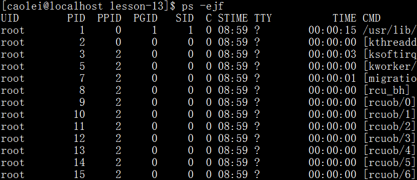
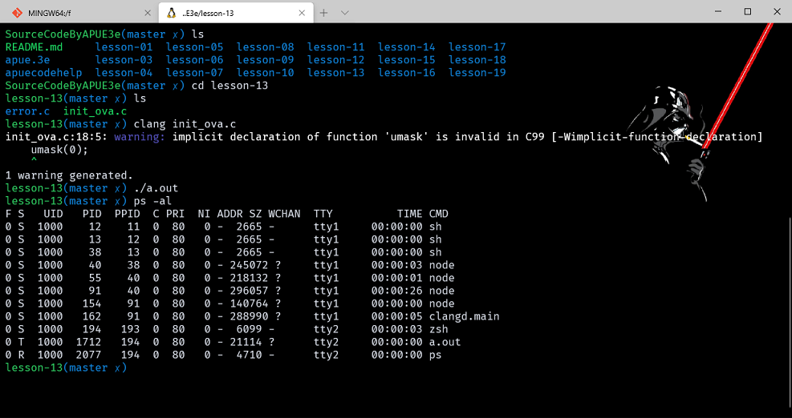
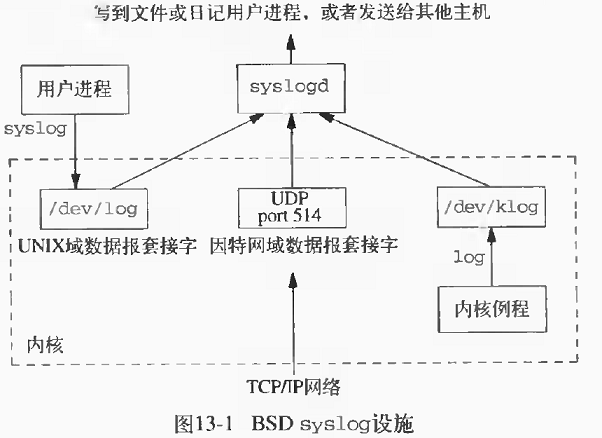
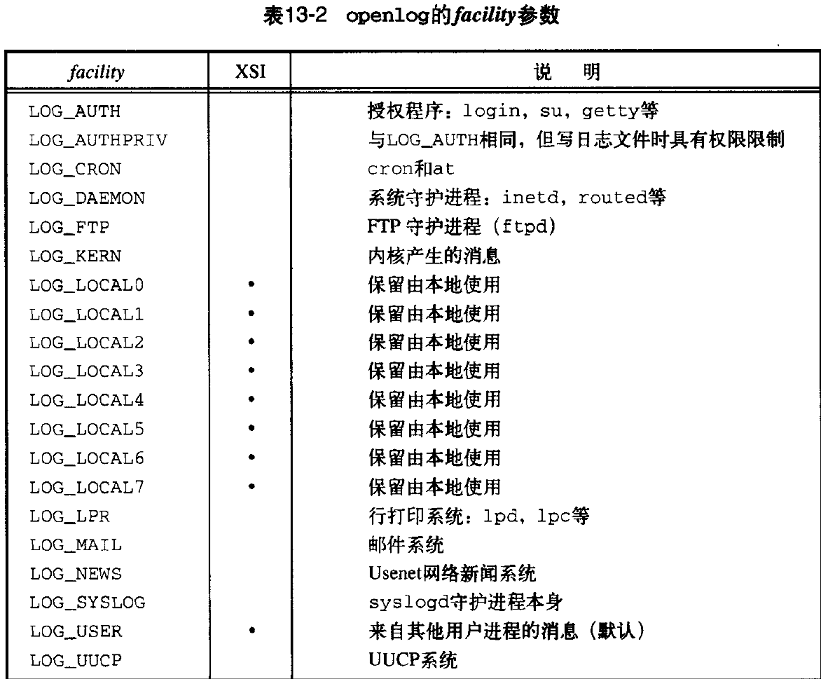
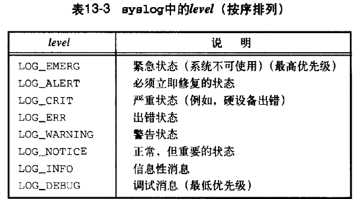
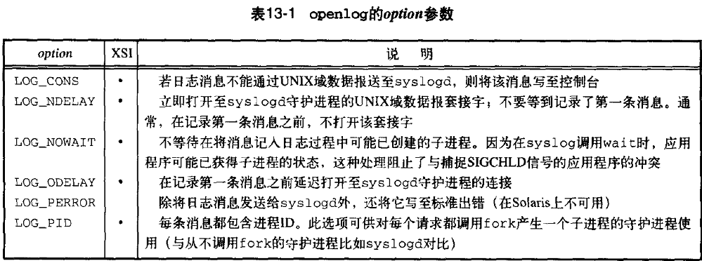
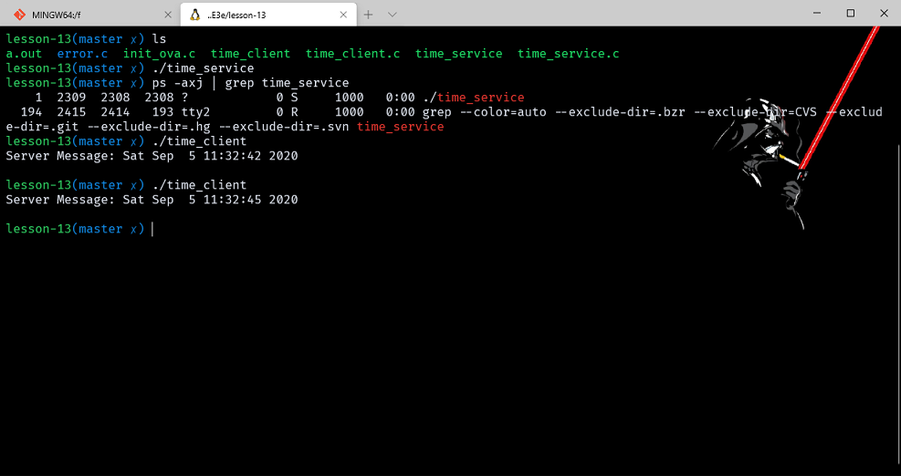

# 守护进程

- [守护进程](#守护进程)
  - [前言](#前言)
  - [守护进程的特征](#守护进程的特征)
  - [编程规则](#编程规则)
  - [出错记录](#出错记录)
    - [example](#example)
  - [单实例守护进程](#单实例守护进程)
  - [守护进程的惯例](#守护进程的惯例)
  - [客户进程-服务器进程模型](#客户进程-服务器进程模型)

> 注意：文章中使用到的源码都在我的 github 中找到，传送门：[SourceCode](https://github.com/HATTER-LONG/SourceCodeByAPUE3e)

## 前言

守护进程也称为精灵进程是一种生存期较长的一种进程。它们独立于控制终端并且周期性的执行某种任务或等待处理某些发生的事件。他们常常在系统引导装入时启动，在系统关闭时终止。unix 系统有很多守护进程，大多数服务器都是用守护进程实现的，例如 inetd 守护进程。

## 守护进程的特征

在 Unix 系统下，有很多守护进程，在基于 BSD 的系统下运行下列命令

```cpp
ps -axj
```

-a 选项显示所有进程，包括其他用户的进程，-x 显示没有控制终端的进程状态，-j 显示与作业有关的信息：会话SID、进程组ID、控制终端以及终端进程组ID。
在基于 SystemV 的系统中，对应命令是ps -efj，具体如何需要查看自己的 ps 命令说明，当然还有一些系统只允许超级用户查看到其他的用户进程，普通用户不能查看其他用户进程。

我们知道，除了用户进程以外，还有很多系统进程，比如守护进程，对于大部分 Unix 环境来说，使用的都是 SystemV 风格的 init 启动方式，首先是 Grub 引导内核启动，然后内核会查找/sbin/init程序并且启动它，init 程序会根据一系列的配置文件启动不同的脚本，最终启动守护进程。当然，目前最新的操作系统基本上都是 systemd，所以是不同的，但是基本原理还是相同的，比如同样都是 root 权限运行，所有守护进程没有控制终端。

[linux 0号进程和 1号init进程](http://blog.csdn.net/gaoxuelin/article/details/9624695)



内核守护进程 kthreadd，用来创建其他的内核进程，对于需要在进程上下文执行工作但却不被用户进程上下文调用的每一个内核组件，通常有他自己的守护进程。
例子:P373

大多数守护进程都是以超级用户权限运行的并且都没有控制终端，tty项为 ？

## 编程规则

1. 调用 umask 将文件模式创建屏蔽字设置为 0。因为进程从创建它的父进程那里继承了文件创建掩模。它可能修改守护进程所创建的文件的存取位。为防止这一点，将文件创建掩模清除：调用 umask(0)。
2. 调用 fork，然后使父进程退出。1，如果守护进程是一条简单的 shell，则父进程的退出，会让 shell 认为命名已经执行完成。2，保证子进程不是一个进程组的组长方便建立会话。
3. 调用 setsid 以创建一个新会话。这样可以使得调用进程成为新会话的首进程，成为一个新进程组的组长进程，没有控制终端。
4. 将当前工作目录更改为根目录。进程活动时，其工作目录所在的文件系统不能卸下。一般需要将工作目录改变到根目录。对于需要转储核心，写运行日志的进程将工作目录改变到特定目录如 /tmpchdir("/") 。
5. 关闭不再需要的文件描述符。进程从父进程那里继承了打开的文件描述符。如不关闭，将会浪费系统资源，造成进程所在的文件系统无法卸下以及引起无法预料的错误。
6. 某些守护进程打开 /dev/null 使其具有文件描述符 0、1 和 2。使得任何一个试图读标准输入、写标准输出或者标准出错的历程都不会产生任何效果。
7. 处理 SIGCHLD 信号 。处理 SIGCHLD 信号并不是必须的。但对于某些进程，特别是服务器进程往往在请求到来时生成子进程处理请求。如果父进程不等待子进程结束，子进程将成为僵尸进程（zombie）从而占用系统资源。如果父进程等待子进程结束，将增加父进程的负担，影响服务器进程的并发性能。在 Linux 下可以简单地将 SIGCHLD 信号的操作设为 SIG_IGN。

```cpp
#include <errno.h>
#include <fcntl.h>
#include <pthread.h>
#include <signal.h>
#include <stdio.h>
#include <stdlib.h>
#include <sys/resource.h>
#include <syslog.h>
#include <unistd.h>


void daemonize(const char* cmd)
{
    int i, fd0, fd1, fd2;
    pid_t pid;
    struct rlimit r1;
    struct sigaction sa;
    umask(0);
    //获取文件描述符最大值
    getrlimit(RLIMIT_NOFILE, &r1);
    //创建子进程
    if ((pid = fork()) < 0)
    {
        perror("fork() error");
        exit(0);
    }
    else if (pid > 0) //使父进程退出
        exit(0);
    setsid(); //创建会话
              //创建子进程避免获取终端
    sa.sa_handler = SIG_IGN;
    sigemptyset(&sa.sa_mask);
    sa.sa_flags = 0;
    sigaction(SIGHUP, &sa, NULL);
    if ((pid = fork()) < 0)
    {
        perror("fork() error");
        exit(0);
    }
    else if (pid > 0)
        exit(0);
    //修改目录
    chdir("/");
    //关闭不需要的文件描述符
    if (r1.rlim_max == RLIM_INFINITY)
        r1.rlim_max = 1024;
    for (i = 0; i < r1.rlim_max; ++i)
        close(i);
    //打开文件描述符
    fd0 = open("/dev/null", O_RDWR);
    fd1 = dup(0);
    fd2 = dup(0);
    openlog(cmd, LOG_CONS, LOG_DAEMON);
    if (fd0 != 0 || fd1 != 1 || fd2 != 2)
    {
        syslog(LOG_ERR, "unexpected file descriptors %d %d %d", fd0, fd1, fd2);
        exit(1);
    }
}

int main()
{
    daemonize("ls");
    sleep(30); //主进程休眠，以便查看守护进程状态
    exit(0);
}
```



```cpp
fd0 = open("/dev/null", O_RDWR);
fd1 = dup(0);
fd2 = dup(0);
```

这段代码，因为之前已经遍历关闭了所有的文件描述符，所有再打开就是从0开始分配编号，0，1，2。。dup是复制0的也就是null的文件描述符给了1，和2因此达到指向null的目的。

- 守护进程在一个孤儿进程组中，他不是会话首进程，因此没有分配到一个控制终端。
- 第一次调用 fork 的目的是保证调用 setsid 的调用进程不是进程组长。（而setsid函数是实现与控制终端脱离的唯一方法）；setsid 函数使进程成为新会话的会话头和进程组长，并与控制终端断开连接；第二次调用 fork 的目的是：即使守护进程将来打开一个终端设备，也不会自动获得控制终端。（因为在 SVR4 中，当没有控制终端的会话头进程打开终端设备时，如果这个终端不是其他会话的控制终端，该终端将自动成为这个会话的控制终端），这样可以保证这次生成的进程不再是一个会话头。忽略 SIGHUP 信号的原因是，当第一次生成的子进程（会话头）终止时，该会话中的所有进程（第二次生成的子进程）都会收到该信号。

## 出错记录

守护进程没有控制终端，不能将错误写到标准输错上。大多数进程使用集中的守护进程出错 syslog 设施，该设施的接口是 syslog 函数。



- 有三种产生日志消息的方法：
  1. 内核例程可以调用 log 函数。任何有个用户进程都可以读取 /dev/klog 设备来读取器这些信息。
  2. 大多数用于进程调用syslog产生日志。
  3. 无论一个用户进程是如何连接主机的，都可以将日志消息法向UDP端口514。

```cpp
#include <syslog.h>
void openlog(const char *ident, int option, int facility);
void syslog(int priority, const char *format, ...);
void closelog(void);
int setlogmask(int mask);
```

调用 openlog 是可选择的。如果不调用 openlog，则在第一次调用 syslog 时，自动调用 openlog。调用 closelog 也是也选择的——它只是关闭曾被用于与 syslog 守护进程通信的描述符。调用 openlog 我们可以指定一个 ident，将它加至每则日志消息中。ident 一般是程序的名称（例如，cron、inetd等）。option 参数是指定许多选项的位屏蔽。表13-1说明了可用的 option（选项）。若某选项在 Single UNIX Specification的openlog 定义中已包括，则其 XSI 列用一个墨点表示。

openlog 的参数 facility 可以选取表 13-2 中列举的值。注意，Single Unix Specification 只定义了 facility 参数值的一个子集，该子集是在一个给定的平台上典型地可用的。设置 facility（设施）参数的目的是可以让配置文件说明，来自不同设施的消息将以不同的方式进行处理。如果不调用 openlog，或者以 facility 为 0 来调用它，那么在调用 syslog 时，可将设施作为 priority 参数的一个部分进行说明。



调用 syslog 产生一个日志消息。其 priority 参数是 facility 和 level 的组合，它们可选取的值分别列于表 13-2 和表 13-3 中。level 值按优先级从最高到最低按序排列。





format 参数以及其他参数传至 vsprintf 函数以便进行格式化。在 format 中，每个 %m 都先被代换成对应于 errno 值的出错消息字符串（strerror）。

setlogmask 函数用于设置进程的记录优先级屏蔽字。它返回调用它之前的屏蔽字。当设置了记录优先级屏蔽字时，除非消息的优先级已在记录优先级屏蔽字中设置，否则消息不被记录。注意，试图将该屏蔽字设置为 0 并不产生任何作用。

很多系统也提供 logger（1）程序，以其作为向 syslog 设施发送日志消息的方法。logger 命令本是为了用于以非交互方式运行但又要产生日志消息的 shell 脚本的。

### example

在一个（假定的）行式打印机假脱机守护进程中，可能包含有下面的调用序列：

`openlog("lpd", LOG_PID, LOG_LPR); syslog(LOG_ERR, "open error for %s: %m", filename);`

第一个调用将 ident 字符串设置为程序名，指定打印该进程ID，并且将系统默认的 facility 设定为行式打印机系统。对 syslog 的调用指定一个出错状态和一个消息字符串。如若不调用 openlog，则第二个调用的形式可能是：

`syslog(LOG_ERR | LOG_LPR, "open error for %s: %m", filename);`

其中，将 priority 参数指定为 level 和 facility 的组合。
除了 syslog，很多平台还提供它的一种变体处理可变参数列表。

`#include <syslog.h> #include <stdarg.h> void vsyslog(int priority, const char *format, va_list arg);`

大多数 syslog 实现将使消息短时间处于队列中。如果在此段时间中到达了重复消息，那么 syslog 守护进程将不把它写到日记记录中，而是打印输出一条消息，类似于“上一条消息重复了N次”。

## 单实例守护进程

为了正常运行，某些守护进程实现为单实例的，也就是在任一时刻只运行该守护进程的一个副本。例如，该守护进程可能需要排它地访问一个设备。在 cron 守护进程情况下，如果同时有多个实例运行，那么每个副本都可能试图开始某个预定的操作，于是造成该操作的重复执行，这很可能导致出错。

如果守护进程需要访问一设备，而该设备驱动程序将阻止多次打开在 /dev 目录下的相应设备节点，那么这就达到了任何时刻只运行守护进程一个副本的要求。但是如果没有这种设备可供使用，那么我们就需要自行处理。
采用文件锁和记录锁机制可以实现单实例守护进程，如果每一个守护进程创建一个文件，并且在整个文件上加上一把锁，那就只允许创建一把这样的写锁，之后试图再创建这样的一把写锁将会失败。这样就保证守护进程只有一个副本在运行。使用文件和记录锁保证只运行某守护进程的一个副本，守护进程的每个副本都试图创建一个文件，并将其进程 ID 写到该文件中。

```cpp
#include <errno.h>
#include <fcntl.h>
#include <stdio.h>
#include <stdlib.h>
#include <string.h>
#include <sys/stat.h>
#include <syslog.h>
#include <unistd.h>

#define LOCKFILE "/var/run/daemon.pid"
#define LOCKMODE (S_IRUSR | S_IWUSR | S_IRGRP | S_IROTH)

extern int lockfile(int);

int already_running(void)
{
    int fd;
    char buf[16];

    fd = open(LOCKFILE, O_RDWR | O_CREAT, LOCKMODE);
    if (fd < 0)
    {
        syslog(LOG_ERR, "can't open %s: %s", LOCKFILE, strerror(errno));
        exit(1);
    }
    if (lockfile(fd) < 0)
    {
        if (errno == EACCES || errno == EAGAIN)
        {
            close(fd);
            return (1);
        }
        syslog(LOG_ERR, "can't lock %s: %s", LOCKFILE, strerror(errno));
        exit(1);
    }
    ftruncate(fd, 0);
    sprintf(buf, "%ld", (long)getpid());
    write(fd, buf, strlen(buf) + 1);
    return (0);
}
```

守护进程的每个副本都将试图创建一个文件，并将其进程 ID 写到该文件中。这使管理人员易于标识该进程。如果该文件已经加了锁，那么 lockfile 函数（见高级 I/O 之记录锁）将失败，errno 设置为 EACCES 或 EAGAIN，函数返回 1，这表明该守护进程已在运行。否则将文件长度截短为 0，将进程 ID 写入该文件，函数返回 0。
我们需要将文件长度截短为 0，其原因是以前守护进程实例的进程ID字符串可能长于调用此函数的当前进程的进程 ID 字符串。例如，若以前的守护进程的进程 ID 是 12345，而新实例的进程 ID 是 9999，那么将此进程 ID 写入文件后，在文件中留下的是 99995。将文件长度截短为 0 就解决了此问题。

## 守护进程的惯例

1. 若守护进程使用锁文件，那么该文件通常存放在 /var/run 目录中。名字的格式 name.pid
2. 若守护进程支持配置选项，那么配置文件通常存放在 /etc 中目录中。格式 name.conf
3. 守护进程可以用命令行启动，通常是系统初始化脚本。
4. 若一守护进程有一配置文件，那么当该守护进程启动时，读取该文件，此后一把不会在查看它。

使用 sigwait 及多线程实现守护进程重读配置文件程序如下：

```cpp
#include <stdio.h>
#include <stdlib.h>
#include <string.h>
#include <unistd.h>
#include <errno.h>
#include <signal.h>
#include <fcntl.h>
#include <syslog.h>
#include <sys/stat.h>
#include <sys/resource.h>

#define LOCKFILE "/var/run/daemon.pid"
#define LOCKMODE (S_IRUSR | S_IWUSR | S_IRGRP | S_IROTH )

sigset_t mask;
int lockfile(int fd)
{
    struct flock f1;
    f1.l_type = F_WRLCK;
    f1.l_start = 0;
    f1.l_whence = SEEK_SET;
    f1.l_len = 0;
    return fcntl(fd,F_SETLK,&f1);
}
int already_running(void)
{
    int     fd;
    char    buf[16];

    fd = open(LOCKFILE,O_RDWR|O_CREAT,LOCKMODE);
    if(fd < 0)
    {
        syslog(LOG_ERR,"can't open %s : %s",LOCKFILE,strerror(errno));
        exit(1);
    }
    if(lockfile(fd)<0)
    {
        if(errno == EACCES | errno == EAGAIN)
        {
            close(fd);
            return 1;
        }
        syslog(LOG_ERR,"can,t lock %s : %s",LOCKFILE,strerror(errno));
        exit(1);
    }
    ftruncate(fd,0);
    sprintf(buf,"%ld",(long)getpid());
    write(fd,buf,strlen(buf)+1);
    return 0;
}

void daemonize(const char *cmd)
{
    int                 i,fd0,fd1,fd2;
    pid_t               pid;
    struct rlimit       r1;
    struct sigaction    sa;
    umask(0);
    getrlimit(RLIMIT_NOFILE,&r1);
    if((pid = fork()) < 0)
    {
         perror("fork() error");
         exit(0);
    }
    else if(pid > 0)
        exit(0);
    setsid();
    sa.sa_handler = SIG_IGN;
    sigemptyset(&sa.sa_mask);
    sa.sa_flags = 0;
    sigaction(SIGHUP,&sa,NULL);
    if((pid = fork()) < 0)
    {
         perror("fork() error");
         exit(0);
    }
    else if(pid > 0)
        exit(0);
    chdir("/");
    if(r1.rlim_max == RLIM_INFINITY)
        r1.rlim_max = 1024;
    for(i=0;i<r1.rlim_max;++i)
        close(i);
    fd0 = open("/dev/null",O_RDWR);
    fd1 = dup(0);
    fd2 = dup(0);
    openlog(cmd,LOG_CONS,LOG_DAEMON);
    if(fd0 != 0 || fd1 != 1 || fd2 != 2)
    {
        syslog(LOG_ERR,"unexpected file descriptors %d %d %d",fd0,fd1,fd2);
        exit(1);
    }
}

void reread()
{
    printf("read daemon config file again.\n");
}
void * thread_func(void *arg)
{
    int err,signo;
    while(1)
    {
        sigwait(&mask,&signo);
        switch(signo)
        {
        case SIGHUP:
            syslog(LOG_INFO,"Re-reading configuration file.\n");
            reread();
            break;
        case SIGTERM:
            syslog(LOG_INFO,"got SIGTERM;exiting.\n");
            exit(0);
        default:
            syslog(LOG_INFO,"unexpected signal %d.\n",signo);
        }
    }
    return NULL;
}
int main(int argc,char *argv[])
{
    pthread_t           tid;
    char                *cmd;
    struct sigaction    sa;
    if((cmd = strrchr(argv[0],'/')) == NULL)
        cmd = argv[0];
    else
        cmd++;
    daemonize(cmd);
    if(already_running())
    {
          syslog(LOG_ERR,"daemon already running.\n");
          exit(1);
    }
    sa.sa_handler =SIG_DFL;
    sigemptyset(&sa.sa_mask);
    sa.sa_flags = 0;
    sigaction(SIGHUP,&sa,NULL);
    sigfillset(&mask);
    pthread_sigmask(SIG_BLOCK,&mask,NULL);
    pthread_create(&tid,NULL,thread_func,0);
    sleep(90);
    exit(0);
}
```

## 客户进程-服务器进程模型

守护进程常常用作服务器进程。在服务器进程中调用fork然后exec另一个程序来向客户进程提供服务是很常见的。但是其中涉及到管理文件描述符安全等问题。解决这个问题的简单方法是对所有被执行的程序不需要的文件描述符执行关闭。

```cpp
#include "apue.h"
#include <fcntl.h>

int
set_cloexec(int fd)
{
    int val;

    if ((val = fcntl(fd, F_GETFD, 0)) < 0)
        return(-1);

    val |= FD_CLOEXEC;  /* enable close-on-exec */

    return(fcntl(fd, F_SETFD, val));
}
```

[守护进程实现时间服务器](http://www.cnblogs.com/Anker/archive/2012/12/20/2826568.html)

守护进程是在后台运行不受终端控制的进程（如输入、输出等），一般的网络服务都是以守护进程的方式运行。守护进程脱离终端的主要原因有两点：
（1）用来启动守护进程的终端在启动守护进程之后，需要执行其他任务。
（2）（如其他用户登录该终端后，以前的守护进程的错误信息不应出现）由终端上的一些键所产生的信号（如中断信号），不应对以前从该终端上启动的任何守护进程造成影响。要注意守护进程与后台运行程序（即加＆启动的程序）的区别。

- 创建守护进程的过程：  
  1. 调用 fork 创建子进程。父进程终止，让子进程在后台继续执行。
  2. 子进程调用 setsid 产生新会话期并失去控制终端调用 setsid() 使子进程进程成为新会话组长和新的进程组长，同时失去控制终端。
  3. 忽略 SIGHUP 信号。会话组长进程终止会向其他进程发该信号，造成其他进程终止。
  4. 调用 fork 再创建子进程。子进程终止，子子进程继续执行，由于子子进程不再是会话组长，从而禁止进程重新打开控制终端。
  5. 改变当前工作目录为根目录。一般将工作目录改变到根目录，这样进程的启动目录也可以被卸掉。
  6. 关闭打开的文件描述符，打开一个空设备，并复制到标准输出和标准错误上。 避免调用的一些库函数依然向屏幕输出信息。
  7. 重设文件创建掩码清除从父进程那里继承来的文件创建掩码，设为 0。
  8. 用 openlog 函数建立与 syslogd 的连接。

现在要用守护进程实现一个时间服务器，呈现的功能是：服务器运行后自动成为守护进程，返回shell；客户端运行后收到服务器发来的当前时间。

```cpp
/* time_serivce.c */
#include <stdio.h>
#include <stdlib.h>
#include <string.h>
#include <unistd.h>
#include <errno.h>
#include <sys/types.h>
#include <fcntl.h>
#include <signal.h>
#include <syslog.h>
#include <sys/resource.h>
#include <sys/socket.h>
#include <netinet/in.h>
#include <arpa/inet.h>
#include <time.h>

#define MAXLINE 100

void daemon_init(const char* pname,int facility)
{
    int                 i;
    pid_t               pid;
    struct  rlimit      rl;
    struct  sigaction   sa;
    /* 清除文件模式创建掩码,使新文件的权限位不受原先文件模式创建掩码的权限位的影响*/
    umask(0);
    if(getrlimit(RLIMIT_NOFILE,&rl) < 0)
    {
        perror("getrlimit() error");
        exit(-1);
    }
    if((pid = fork()) < 0)
    {
        perror("fork() error");
        exit(-1);
    }
    else if(pid > 0)   /*父进程终止 */
        exit(0);
    setsid();         /* 子进程成为会话首进程*/
    sa.sa_handler = SIG_IGN;
    sigemptyset(&sa.sa_mask);
    sa.sa_flags = 0;
    if(sigaction(SIGHUP,&sa,NULL) < 0)
    {
        perror("sigaction() error");
        exit(-1);
    }
    if((pid = fork()) < 0)
    {
        perror("fork() error");
        exit(-1);
    }
    else if(pid > 0)
        exit(0);        /* 第一个子程进终止,保证后面操作不会分配终端 */
    if(chdir("/")<0)    /* 改变工作目录 */
    {
        perror("chdir() error");
        exit(-1);
    }
    if(rl.rlim_max == RLIM_INFINITY)
        rl.rlim_max = 1024;
    for(i=0;i<rl.rlim_max;++i)  /*关闭所有打开的文件描述字*/
        close(i);
    openlog(pname, LOG_PID, facility);  /*用syslogd处理错误*/
}

int main(int argc,char *argv[])
{
    int                 listenfd, connfd;
    socklen_t           addrlen, len;
    struct sockaddr     cliaddr;
    struct sockaddr_in  server;
    char                buff[MAXLINE];
    time_t              ticks;
    int                 n;
    bzero(&server, sizeof(server));
    bzero(&cliaddr,sizeof(cliaddr));
    server.sin_family = AF_INET;
    server.sin_port = htons(5050);
    server.sin_addr.s_addr = htonl(INADDR_ANY);
    daemon_init(argv[0], 0);
    if((listenfd=socket(AF_INET, SOCK_STREAM, 0))==-1)
    {
        syslog(LOG_NOTICE|LOG_LOCAL0,"socket error");
        exit(-1);
    }
    if (bind(listenfd, (struct sockaddr *)&server, sizeof(struct sockaddr))==-1)
    {
        syslog(LOG_NOTICE|LOG_LOCAL0,"socket error");
        exit(-1);
    }
    if(listen(listenfd,5)==-1)
    {
        syslog(LOG_NOTICE|LOG_LOCAL0,"listen error");
        exit(-1);
    }
    for ( ; ; )
    {
        len = sizeof(cliaddr);
        connfd = accept(listenfd,&cliaddr, &len);
        ticks = time(NULL);
        snprintf(buff, sizeof(buff), "%.24s\r\n", ctime(&ticks));
        if((n= write(connfd, buff, strlen(buff)))==-1)
           syslog(LOG_NOTICE|LOG_LOCAL0,"write error");
        close(connfd);
    }
}
```

```cpp
/* time_client.c */
#include <unistd.h>
#include <sys/socket.h>
#include <netinet/in.h>
#include <netdb.h>
#include <stdio.h>
#include <stdlib.h>
#include <string.h>
#define PORT            5050
#define MAXDATASIZE     100

int main(int argc, char *argv[])
{
    int                  fd, numbytes;
    char                 buf[MAXDATASIZE];
    struct sockaddr_in   server;
    if ((fd = socket(AF_INET, SOCK_STREAM, 0)) == -1)
    {
        perror("Create socket failed.");
        exit(-1);
    }
    bzero(&server, sizeof(server));
    server.sin_family = AF_INET;
    server.sin_port = htons(PORT);
    server.sin_addr.s_addr = htonl(INADDR_ANY);
    if (connect(fd, (struct sockaddr *)&server, sizeof(struct sockaddr)) == -1)
    {
        perror("connect failed.");
        exit(-1);
    }
    if( ((numbytes = recv(fd, buf, MAXDATASIZE, 0)) == -1))
    {
        perror("recv error.");
        exit(-1);
    }
    buf[numbytes] ='\0';
    printf("Server Message: %s\n",buf);
    close(fd);
}
```

