# 高级 IO

- [高级 IO](#高级-io)
  - [引言](#引言)
  - [非阻塞 I/O](#非阻塞-io)
  - [记录锁](#记录锁)
    - [example_pendlock](#example_pendlock)
    - [example_locktest](#example_locktest)
    - [example_deadlock](#example_deadlock)
  - [I/O 多路转换](#io-多路转换)
  - [函数 select 和 pselect](#函数-select-和-pselect)
  - [函数poll](#函数poll)
  - [异步I/O](#异步io)
    - [example_rot13a](#example_rot13a)
  - [函数 readv 和 writev](#函数-readv-和-writev)
    - [example_writev](#example_writev)
  - [函数 readn 和 writen](#函数-readn-和-writen)
  - [存储映射 I/O](#存储映射-io)

> 注意：文章中使用到的源码都在我的 github 中找到，传送门：[SourceCode](https://github.com/HATTER-LONG/SourceCodeByAPUE3e)

## 引言

高级 I/O 包括：非阻塞 I/O，记录锁，I/O 多路转接（select 和 poll 函数）、异步 I/O、readv 和 writev 函数以及存储映射 I/O（mmap）。本章节主要介绍这些 IO 的特点以及使用方式。

## 非阻塞 I/O

- 对低速设备 I/O 操纵可能会使进程永久阻塞，包括：
  1. 如果数据并不存在，则读文件可能会使调用者永远阻塞（例如读管道、终端设备和网络设备）。
  2. 如果数据不能立即被接受，则写这些同样的文件也会使调用者永远阻塞；
  3. 在某些条件发生之前，打开文件会被阻塞（例如以只写方式打开一个 FIFO，那么在没有其他进程已用读方式打开该 FIFO 时）；
  4. 对已经加上强制性锁的文件进行读、写；
  5. 某些 ioctl 操作；
  6. 某些进程间通信函数；

注意读写磁盘虽然会暂时阻塞调用者，但是这并不是一个低速 I/O。非阻塞 I/O 是我们可以发出 read、write 和 open 这样的操作不会永远阻塞，如果操作不能完成就会立即出错返回。

- 对一个给定的描述符有两种方法设置其为非阻塞：
  1. 如果是调用 open 以获得该描述符，则可指定 O_NONBLOCK 标志；
  2. 对于已经打开的一个描述符，则可调用 fcntl 打开 O_NONBLOCK 文件状态标志（注意：设置文件状态标志的方法）。

```cpp
#include <errno.h>
#include <fcntl.h>
#include <stdio.h>
#include <stdlib.h>
#include <sys/types.h>
#include <unistd.h>

char buf[100000];
//将描述符设置为阻塞状态
void set_fl(int fd, int flags)
{
    int val;
    val = fcntl(fd, F_GETFL, 0); //获取描述符
    val |= flags;                //添加状态
    fcntl(fd, F_SETFL, val);     //设置描述符
}
void clr_fl(int fd, int flags)
{
    int val;
    val = fcntl(fd, F_GETFL, 0);
    val &= ~flags; // 取消状态
    fcntl(fd, F_SETFL, val);
}
int main()
{
    int ntowrite, nwrite;
    char* ptr;
    ntowrite = read(STDIN_FILENO, buf, sizeof(buf));
    fprintf(stderr, "read %d bytes\n", ntowrite);
    set_fl(STDOUT_FILENO, O_NONBLOCK); //设置为阻塞状态
    ptr = buf;
    while (ntowrite > 0)
    {
        errno = 0;
        nwrite = write(STDOUT_FILENO, ptr, ntowrite);
        fprintf(stderr, "nwrite = %d,errno =%d\n", nwrite, errno);
        if (nwrite > 0)
        {
            ptr += nwrite;
            ntowrite -= nwrite;
        }
    }
    clr_fl(STDOUT_FILENO, O_NONBLOCK); //设置为非阻塞状态
    exit(0);
}
```

0、1 和 2 分别表示标准输入、标准输出和标准错误信息输出，可以用来指定需要重定向的标准输入或输出，比如 2 > a.txt 表示将错误信息输出到文件 a.txt 中。程序执行结果如下：若标准输出是普通文件，则可以期望 write 只执行一次。

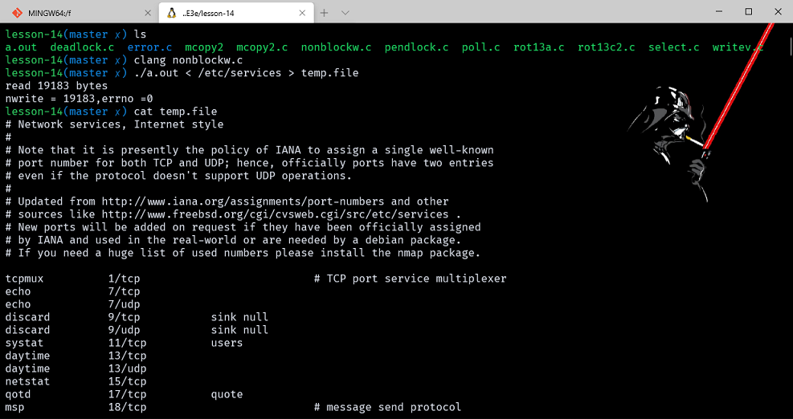

## 记录锁

记录锁的功能是：一个进程正在读或修改文件的某个部分时，可以阻止其他进程修改同一文件区。对于 UNIX 实际上，由于内核没有“记录”的概念，因此，“记录锁”实际上是“区域锁”，或者叫做字节范围锁，因为他锁定的知识文件中的一个区域（也可能是整个文件）。

```cpp
int fcntl(int fd, int cmd, ……/* struct flock *flockptr */);
```

对于记录锁，cmd 是 F_GETLK，f_SETLK 或 F_SETLKW。第三个参数是一个指向 flock 结构的指针：

```cpp
struct flock {
    short l_type; /* F_RDLCK, F_WRLCK, or F_UNLCK */
    off_t l_start;
    short l_whence;
    off_t l_len;
    pid_t l_pid;
}
```

- flock结构说明：
  - 所希望的锁类型：F_RDLCK（共享读锁）、F_WRLCK（独占性写锁）或F_UNLCK（解锁一个区域）
  - 要加锁或解锁的区域的起始地址，由l_start和l_whence两者决定。l_start 是相对位移量（字节），l_whence 则决定了相对位移量的起点。这与 lseek 函数（见3.6节）中最后两个参数类似。
  - 区域的长度，由l_len表示。

- 关于加锁和解锁区域的说明还要注意下列各点：
  - 该区域可以在当前文件尾端处开始或越过其尾端处开始，但是不能在文件起始位置之前开始或越过该起始位置。
  - 如若 l_len 为 0，则表示锁的区域从其起点（由 l_start 和 l_whence 决定）开始直至最大可能位置为止。也就是不管添写到该文件中多少数据，它都处于锁的范围。
  - 为了锁整个文件，通常的方法是将 l_start 说明为 0，l_whence 说明为 SEEK_SET，l_len 说明为 0。

上面提到了两种类型的锁：共享读锁（ l_type 为 L_RDLCK）和独占写琐（ L_WRLCK ）。基本规则是：多个进程在一个给定的字节上可以有一把共享的读锁，但是在一个给定字节上的写锁则只能由一个进程独用。更进一步而言，如果在一个给定字节上已经有一把或多把读锁，则不能在该字节上再加写锁；如果在一个字节上已经有一把独占性的写锁，则不能再对它加任何读锁。在表 12-2 中示出了这些规则。

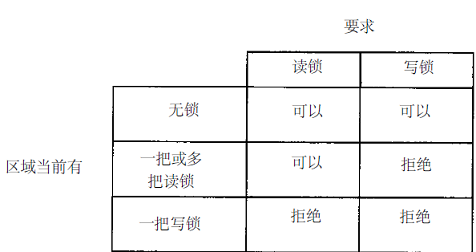

图中规则只适用于不同进程提出的锁请求，不适合单个进程提出的多个锁的请求。如果一个进程对一个文件区间已经有了一把锁，后来进程又企图在同一文件区间再加一把锁，那么新的锁就会代替原来的。

F_GETLK:决定由 flockptr 所描述的锁是否被另外一把锁所排斥（阻塞）。如果存在一把锁，它阻止创建由 flockptr 所描述的锁，则这把现存的锁的信息写到 flockptr 指向的结构中。如果不存在这种情况，则除了将 ltype 设置为 F_UNLCK 之外，flockptr 所指向结构中的其他信息保持不变。

F_SETLK:设置由 flockptr 所描述的锁。如果试图建立一把按上述兼容性规则并不允许的锁，则 fcntl 立即出错返回，此时 errno 设置为 EACCES 或 EAGAIN。此命令也用于来清除由 flockptr 所指向的锁（l_type 为 F_UNLCK）。

F_SETLKW:这是 F_SETLK 的阻塞版本（命令名中的W表示等待（wait））。如果由于存在其他锁，那么按兼容性规则由 flockptr 所要求的锁不能被创建，则调用进程睡眠。如果捕捉到信号或者请求创建的锁已经可用，则睡眠中断该进程被唤醒。

应当了解，用 F_GETLK 测试能否建立一把锁，然后用 F_SETLK 和 F_SETLKW 企图建立一把锁，这两者不是一个原子操作。在这两个操作之间可能会有另一个进程插入并建立一把相关的锁，使原来测试到的情况发生变化，如果不希望在建立锁时可能产生的长期阻塞，则应使用F_SETLK，并对返回结果进行测试，以判别是否成功地建立了所要求的锁。也就是说存在一种可能，一个写锁因为之前的一个读锁而阻塞，但是当阻塞期间不停的有读锁被加入，这样这个写锁就被饿死了，需要注意。

在设置或释放文件上的一把锁时，系统按需组合或裂开相邻区。例如，若对字节 0 ~ 99 设置一把读锁，然后对字节 0 ~ 49 设置一把写锁，则有两个加锁区： 0~49字节（写锁）及50~99（读锁）。又如，若100~199字节是加锁的区，需解锁第150字节，则内核将维持两把锁，一把用于 100~149 字节，另一把用于151~199字节。假定我们又对 150 进行加锁，那么系统就会把三个相邻的加锁区合并为一个区。

### example_pendlock

为了避免每次分配 flock 结构，然后有填入信息，可以利用如下方式：

```cpp
#include "apue.h"
#include <errno.h>
#include <fcntl.h>
int lock_reg(int fd, int cmd, int type, off_t offset, int whence, off_t len)
{
    struct flock lock;

    lock.l_type = type;     /* F_RDLCK, F_WRLCK, F_UNLCK */
    lock.l_start = offset;  /* byte offset, relative to l_whence */
    lock.l_whence = whence; /* SEEK_SET, SEEK_CUR, SEEK_END */
    lock.l_len = len;       /* #bytes (0 means to EOF) */

    return (fcntl(fd, cmd, &lock));
}
​```

因为大多数锁调用是加锁或解锁一个文件区域（命令 F_GETLK 很少使用），故通常使用下列五个宏，它们都定义在 apue.h 中。

```cpp
#define read_lock(fd,offset,whence,len) \
    lockreg((fd) , F_SETLK , F_RDLCK , (offset) , (whence) , (len))
#define readw_lock(fd,offset,whence,len) \
    lockreg((fd) , F_SETLKW , F_RDLCK , (offset) , (whence) , (len))
#define write_lock(fd,offset,whence,len) \
    lockreg((fd) , F_SETLK , F_WDLCK , (offset) , (whence) , (len))
#define writew_lock(fd,offset,whence,len) \
    lockreg((fd) , F_SETLKW , F_WDLCK , (offset) , (whence) , (len))
#define un_lock(fd,offset,whence,len) \
    lockreg((fd) , F_SETLK , F_UNLCK , (offset) , (whence) , (len))
```

我们用与lseek函数同样的顺序定义这些宏中的三个参数。

### example_locktest

```cpp
#include "apue.h"
#include <fcntl.h>

pid_t lock_test(int fd, int type, off_t offset, int whence, off_t len)
{
    struct flock lock;

    lock.l_type = type;     /* F_RDLCK or F_WRLCK */
    lock.l_start = offset;  /* byte offset, relative to l_whence */
    lock.l_whence = whence; /* SEEK_SET, SEEK_CUR, SEEK_END */
    lock.l_len = len;       /* #bytes (0 means to EOF) */

    if (fcntl(fd, F_GETLK, &lock) < 0)
        err_sys("fcntl error");

    if (lock.l_type == F_UNLCK)
        return (0);      /* false, region isn't locked by another proc */
    return (lock.l_pid); /* true, return pid of lock owner */
}
```

如果存在一把锁，它阻塞由参数说明的锁，则此函数返回持有这把现存锁的进程的 ID，否则此函数返回 0。通常用下面两个宏来调用此函数（它们也定义在 apue.h）。

```cpp
#define is_read_lock(fd,offset,whence,len) \
    (locktest((fd) , F_RDLCK , (offset) , (whence) , (len)) == 0)
#define is_write_lock(fd,offset,whence,len) \
    (locktest((fd) , F_WDLCK , (offset) , (whence) , (len)) == 0)
```

### example_deadlock

如果两个进程相互等待对方持有并且不释放（锁定）的资源时，则这两个进程就处于死锁状态。如果一个进程已经控制了文件中的一个加锁区域，然后它又试图对另一个进程控制的区域加锁，则它就会睡眠，在这种情况下，有发生死锁的可能性。

```cpp
#include "apue.h"

static volatile sig_atomic_t sigflag; /* set nonzero by sig handler */
static sigset_t newmask, oldmask, zeromask;

static void sig_usr(int signo) /* one signal handler for SIGUSR1 and SIGUSR2 */ { sigflag = 1; }

void TELL_WAIT(void)
{
    if (signal(SIGUSR1, sig_usr) == SIG_ERR)
        err_sys("signal(SIGUSR1) error");
    if (signal(SIGUSR2, sig_usr) == SIG_ERR)
        err_sys("signal(SIGUSR2) error");
    sigemptyset(&zeromask);
    sigemptyset(&newmask);
    sigaddset(&newmask, SIGUSR1);
    sigaddset(&newmask, SIGUSR2);

    /*
     * Block SIGUSR1 and SIGUSR2, and save current signal mask.
     */
    if (sigprocmask(SIG_BLOCK, &newmask, &oldmask) < 0)
        err_sys("SIG_BLOCK error");
}

void TELL_PARENT(pid_t pid) { kill(pid, SIGUSR2); /* tell parent we're done */ }

void WAIT_PARENT(void)
{
    while (sigflag == 0)
        sigsuspend(&zeromask); /* and wait for parent */
    sigflag = 0;

    /*
     * Reset signal mask to original value.
     */
    if (sigprocmask(SIG_SETMASK, &oldmask, NULL) < 0)
        err_sys("SIG_SETMASK error");
}


void TELL_CHILD(pid_t pid) { kill(pid, SIGUSR1); }

void WAIT_CHILD(void)
{
    while (sigflag == 0)
        sigsuspend(&zeromask); /* and wait for child */
    sigflag = 0;

    /*
     * Reset signal mask to original value.
     */
    if (sigprocmask(SIG_SETMASK, &oldmask, NULL) < 0)
        err_sys("SIG_SETMASK error");
}
```

```cpp
#include <errno.h>
#include <fcntl.h>
#include <signal.h>
#include <stdio.h>
#include <stdlib.h>
#include <sys/stat.h>
#include <unistd.h>

#define read_lock(fd, offset, whence, len) lock_reg((fd), F_SETLK, F_RDLCK, (offset), (whence), (len))
#define readw_lock(fd, offset, whence, len) lock_reg((fd), F_SETLKW, F_RDLCK, (offset), (whence), (len))
#define write_lock(fd, offset, whence, len) lock_reg((fd), F_SETLK, F_WRLCK, (offset), (whence), (len))
#define writew_lock(fd, offset, whence, len) lock_reg((fd), F_SETLKW, F_WRLCK, (offset), (whence), (len))
#define un_lock(fd, offset, whence, len) lock_reg((fd), F_SETLK, F_UNLCK, (offset), (whence), (len))

#define FILE_MODE (S_IRUSR | S_IWUSR | S_IRGRP | S_IROTH)

sig_atomic_t sigflag; /* set nonzero by sig handler */
sigset_t newmask, oldmask, zeromask;

//输出错误信息并退出
void error_quit(const char* str)
{
    fprintf(stderr, "%s\n", str);
    exit(1);
}

static void sig_usr(int signo) /* one signal handler for SIGUSR1 and SIGUSR2 */ { sigflag = 1; }

void TELL_WAIT(void)
{
    if (signal(SIGUSR1, sig_usr) == SIG_ERR)
        error_quit("signal(SIGUSR1) error");
    if (signal(SIGUSR2, sig_usr) == SIG_ERR)
        error_quit("signal(SIGUSR2) error");
    sigemptyset(&zeromask);
    sigemptyset(&newmask);
    sigaddset(&newmask, SIGUSR1);
    sigaddset(&newmask, SIGUSR2);

    /*
     * Block SIGUSR1 and SIGUSR2, and save current signal mask.
     */
    if (sigprocmask(SIG_BLOCK, &newmask, &oldmask) < 0)
        error_quit("SIG_BLOCK error");
}

void TELL_PARENT(pid_t pid) { kill(pid, SIGUSR2); /* tell parent we're done */ }

void WAIT_PARENT(void)
{
    while (sigflag == 0)
        sigsuspend(&zeromask); /* and wait for parent */
    sigflag = 0;

    /*
     * Reset signal mask to original value.
     */
    int temp = sigprocmask(SIG_SETMASK, &oldmask, NULL);
    if (temp < 0)
        error_quit("SIG_SETMASK error");
}

void TELL_CHILD(pid_t pid) { kill(pid, SIGUSR1); /* tell child we're done */ }

void WAIT_CHILD(void)
{
    while (sigflag == 0)
        sigsuspend(&zeromask); /* and wait for child */
    sigflag = 0;

    /*
     * Reset signal mask to original value.
     */
    int temp = sigprocmask(SIG_SETMASK, &oldmask, NULL);
    if (temp < 0)
        error_quit("SIG_SETMASK error");
}

//加锁或解锁某个文件区域
int lock_reg(int fd, int cmd, int type, off_t offset, int whence, off_t len)
{
    struct flock lock;
    lock.l_type = type;
    lock.l_start = offset;
    lock.l_whence = whence;
    lock.l_len = len;
    return fcntl(fd, cmd, &lock);
}

//锁住文件中的一个字节
void lockabyte(const char* name, int fd, off_t offset)
{
    if (writew_lock(fd, offset, SEEK_SET, 1) < 0)
        error_quit("writew_lock error");
    printf("%s: got the lock, byte %ld\n", name, offset);
}

int main(void)
{
    int fd;
    pid_t pid;

    fd = creat("templock", FILE_MODE);
    if (fd < 0)
        error_quit("create error");
    if (write(fd, "ab", 2) != 2)
        error_quit("write error");

    TELL_WAIT();
    pid = fork();
    if (pid < 0)
        error_quit("fork error");
    else if (pid == 0)
    {
        lockabyte("child", fd, 0);
        TELL_PARENT(getpid());
        WAIT_PARENT();
        lockabyte("child", fd, 1);
    }
    else
    {
        lockabyte("parent", fd, 1);
        TELL_CHILD(pid);
        WAIT_CHILD();
        lockabyte("parent", fd, 0);
    }
    return 0;
}
```

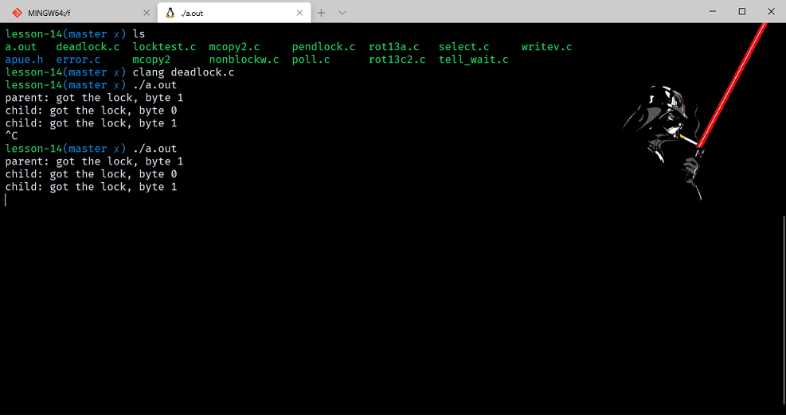

- 锁的隐含继承和释放**,关于记录锁的自动继承和释放的 3 条原则：
  1. 锁与进程、文件两方面有关。这有两重含意：第一重很明显，当一个进程终止时，它所建立的锁全部释放；第二重意思就不很明显，任何时候关闭一个描述符时，则该进程通过这一描述符可以存访的文件上的任何一把锁都被释放（这些锁都是该进程设置的）。
  2. 由fork产生的子程序不继承父进程所设置的锁。这意味着，若一个进程得到一把锁，然后调用fork，那么对于父进程获得的锁而言，子进程被视为另一个进程，对于从父进程处继承过来的任一描述符，子进程要调用fcntl以获得它自己的锁。这与锁的作用是相一致的。锁的作用是阻止多个进程同时写同一个文件（或同一文件区域）。如果子进程继承父进程的锁，则父、子进程就可以同时写同一个文件。
  3. 在执行 exec 后，新程序可以继承原执行程序的锁。

- 在文件尾端加锁
  - 在对相对于文件尾端的字节范围加锁或者解锁时需要特别小心。如果我们在文件末端上锁，writew_lock(fd, 0, SEEK_END, 0);这时会在文件末端上锁，当进行写操作后，写进的数据都是上锁的，但是当解锁时un_lock(fd, 0, SEEK_END);其作用是在对以后追加的数据，而之前的就一直在锁住。如果想要解之前的锁，那么是偏移量为-1。当对于文件的一部分加锁时，内核将指定的偏移量变成绝对文件的偏移量。

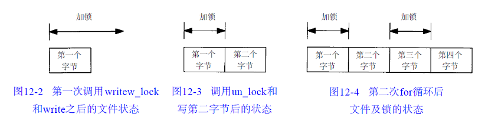

- 建议性锁和强制性锁
  - 考虑数据库存取例程序。如果该库中所有函数都以一致的方法处理记录锁，则称使用这些函数存取数据库的任何进程集为合作进程。如果这些函数是唯一的用来存取数据库的函数，那么它们使用建议性锁是可行的。但是建议性锁并不能阻止对数据库文件有写许可权的任何其他进程写数据库文件。不使用协同一致的方法（数据库存取例程库）来存取数据库的进程是一个非合作进程。
  - 强制性锁机制中，内核对每一个open、read和write都要检查调用进程对正在存取的文件是否违背了某一把锁的作用。

## I/O 多路转换

当从一个描述符读，然后又写到另一个描述符时，可以在下列形式的循环中使用阻塞 IO：

```cpp
while ((n = read(STDIN_FILENO, buf, BUFSIZE)) > 0)
    if (write(STDOUT_FILENO, buf, n) != n) err_sys("write error");
```

典型的应用就是网络守护进程，例如 Nginx 和 Telnet，这里直接拿原著中的 Telnet 讲解，telnet 由于存在两个输入两个输出，所以不能使用阻塞式的 IO 函数，开发者的第一反应，应该是 fork 函数，使用两个进程，每个进程都负责一条读写通道。

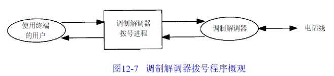

处理办法:

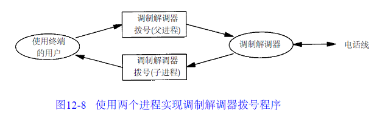

如果使用两个进程，则可使每个进程都执行阻塞read。但是就产生了如何配合问题，使用多个信号进行调节会使程序变得非常复杂。我们可以不使用两个进程，而是用一个进程中的两个线程，虽然避免了终止的复杂性，但是却要求处理两个线程之间的同步，还是复杂。

另一个方式是仍旧使用一个进程执行该程序，但调用非阻塞 I/O 读取数据，其基本思想是：将两个输入描述符都设置为非阻塞的，对第一个描述符发一个 read。如果该输入上有数据，则读数据并处理它。如果无数据可读，则 read 立即返回。然后对第二个描述符作用样的处理。在此之后，等待若干秒再读第一个描述符。这种形式的循环称为轮询。这种方法的不足之处是浪费 CPU 时间。大多数时间实际上是无数据可读，但是仍不断反复执行 read，这浪费了 CPU 时间。在每次循环后要等多长时间再执行下一轮循环也很难确定。轮询技术在支持非阻塞 I/O 的系统上都可使用，但是在多任务系统中应当避免使用。

还有一种基础称为异步 I/O。P404

一种比较好的技术是使用 I/O 多路转接（I/O multiplexing）。其基本思想是：先构造一张有关描述符的表，然后调用一个函数，它要到这些描述符中的一个已准备好进行 I/O 时才返回。在返回时，它告诉进程哪一个描述符已准备好可以进行 I/O。poll、pselect 和 select 三个函数就是这样执行的。

## 函数 select 和 pselect

- select函数使我们在SVR4和4.3+BSD之下可以执行I/O多路转接，传向select的参数告诉内核：
  1. 我们所关心的描述符。
  2. 对于每个描述符我们所关心的条件（是否读一个给定的描述符？是否想写一个给定的描述符？是否关心一个描述符的异常条件？）。
  3. 希望等待多长时间（可以永远等待，等待一个固定量时间，或完全不等待）。
- 从 select 返回时，内核告诉我们：
  1. 已准备好的描述符的数量。
  2. 哪一个描述符已准备好读、写或异常条件。
使用这种返回值，就可调用相应的 I/O 函数（一般是 read 或 write），并且确知该函数不会阻塞。

```cpp
SYNOPSIS
       /* According to POSIX.1-2001, POSIX.1-2008 */
       #include <sys/select.h>

       /* According to earlier standards */
       #include <sys/time.h>
       #include <sys/types.h>
       #include <unistd.h>

       int select(int nfds, fd_set *readfds, fd_set *writefds,
                  fd_set *exceptfds, struct timeval *timeout);

       void FD_CLR(int fd, fd_set *set);
       int  FD_ISSET(int fd, fd_set *set);
       void FD_SET(int fd, fd_set *set);
       void FD_ZERO(fd_set *set);

       #include <sys/select.h>

       int pselect(int nfds, fd_set *readfds, fd_set *writefds,
                   fd_set *exceptfds, const struct timespec *timeout,
                   const sigset_t *sigmask);

   Feature Test Macro Requirements for glibc (see feature_test_macros(7)):

       pselect(): _POSIX_C_SOURCE >= 200112L
```

先说明最后一个参数，它指定愿意等待的时间。

```cpp
struct timeval{
    long tv_sec; /* seconds */
    long tv_usec; /* and microseconds */
}；
```

- tvptr == NULL 永远等待。如果捕捉到一个信号则中断此无限期等待。当所指定的描述符中的一个已准备好或捕捉到一个信号则返回。如果捕捉到一个信号，则select返回－1， errno设置为EINTR。
- tvptr -> tv_sec= =0 && tvptr -> tv_usec==0 完全不等待。测试所有指定的描述符并立即返回。这是得到多个描述符的状态而不阻塞select函数的轮询方法。
- tvptr -> tv_sec != 0 | | tvptr -> tv_usec != 0 等待指定的秒数和微秒数。当指定的描述符之一已准备好，或当指定的时间值已经超过时立即返回。如果在超时时还没有一个描述符准备好，则返回值是0，与第一种情况一样，这种等待可被捕捉到的信号中断。
- POSIX.1允许修改timval结构中的值，所以在select返回后，不能一直确信该结构不变，在Linux中如果超时时间未到，则用剩下的时间更新结构体。

中间三个参数 readfds、writefds 和 exceptfds 是指向描述符集的指针。这三个描述符集说明了我们关心的可读、可写或处于异常条件的各个描述符。每个描述符集存放在一个 fd_set 数据类型中。这种数据类型的实现可见图12-9，它为每一可能的描述符保持了一位。

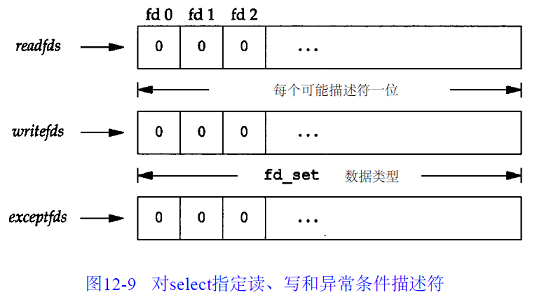

- 对 fg_set 数据类型可以进行的处理是：
  1. 分配一个这种类型的变量，
  2. 将这种类型的一个变量赋与同类型的另一个变量，
  3. 对于这种类型的变量使用下列四个宏：若 fd 在描述符集中，返回非 0 值；否则返回 0

以下列方式说明了一个描述符集后：

fd_set rset;
int fd;

必须用FD_ZERO清除其所有位：

FD_ZERO (&rset);

然后在其中设置我们关心的各位：

FD_SET (fd , &rset);
FD_SET (STDIN_FILENO , &rset);

从select返回时，用FD_ISSET测试该集中的一个给定位是否仍旧设置：

if (FD_ISSET(fd, &rset)){
. . .
}

select中间三个参数中的任意一个（或全部）可以是空指针，这表示对相应条件并不关心。如果所有三个指针都是空指针，则select提供了较sleep更精确的计时器（10.19sleep等待整数秒，而对于select，其等待的时间可以小于1秒；其实际分辨率取决于系统时钟。

select 第一个参数 maxfdp1 的意思是“最大 fd 加 1（max fd plus 1）”。在三个描述符集中找出最高描述符编号值，然后加 1，这就是第一个参数值。也可将第一个参数设置为 FD_SETSIZE，这是一个 <sys/types.h> 中的常数，它说明了最大的描述符数（经常是256或1024）。但是对大多数应用程序而言，此值太大了。确实，大多数应用程序只应用 3 ~ 10 个描述符。如果将第三个参数设置为最高描述符编号值加 1，内核就只需在此范围内寻找打开的位，而不必在数百位的大范围内搜索。

```cpp
#include <errno.h>
#include <stdio.h>
#include <stdlib.h>
#include <sys/select.h>
#include <sys/types.h>
#include <unistd.h>

int main(void)
{
    fd_set rfds;
    struct timeval tv;
    int retval;
    char buf[1024];

    for (;;)
    {
        FD_ZERO(&rfds);
        FD_SET(STDIN_FILENO, &rfds);
        tv.tv_sec = 5;
        tv.tv_usec = 0;
        retval = select(1, &rfds, NULL, NULL, &tv);

        if (retval)
        {
            printf("Data is available now.\n");
            if (FD_ISSET(STDIN_FILENO, &rfds))
            {
                read(STDIN_FILENO, buf, 1024);
                printf("Read buf is: %s\n", buf);
            }
        }
        else
        {
            printf("No data within five second.\n");
        }
    }

    exit(0);
}

```

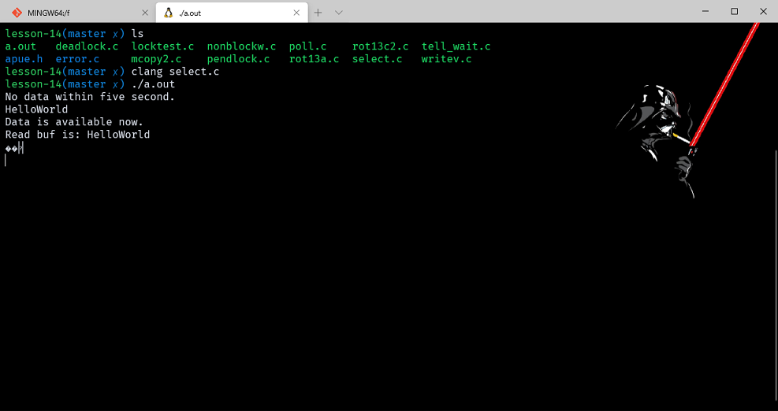

例如，若编写下列代码：

```cpp
fd_set readset, writeset;
FD_ZERO(&readset) ;
FD_ZERO(&writeset ) ;
FD_SET(0, &readset);
FD_SET(3, &readset);
FD_SET(1, &writeset);
FD_SET(2, &writeset);
​
select (4, &readset, &writeset, NULL, NULL);
```

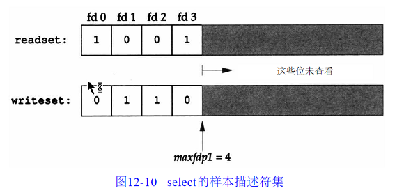

因为描述符编号从 0 开始，所以要在最大描述符编号值上加 1。第一个参数实际上是要检查的描述符数（从描述符 0 开始）。

- select 有三个可能的返回值。
  1. 返回值 －1 表示出错。这是可能发生的，例如在所指定的描述符都没有准备好时捕捉到一个信号。
  2. 返回值0表示没有描述符准备好。若指定的描述符都没有准备好，而且指定的时间已经超过，则发生这种情况。
  3. 返回一个正值说明了已经准备好的描述符数，在这种情况下，三个描述符集中仍旧打开的位是对应于已准备好的描述符位。

- 对于“准备好”的意思要作一些更具体的说明：
  1. 若对读集（readfds）中的一个描述符的read不会阻塞，则此描述符是准备好的。
  2. 若对写集（writefds）中的一个描述符的write不会阻塞，则此描述符是准备好的。
  3. 若对异常条件集（exceptfds）中的一个描述符有一个未决异常条件，则此描述符是准备好的。现在，异常条件包括： ( a )在网络连接上到达指定波特率外的数据，或者( b )在处于数据方式的伪终端上发生了某些条件。

应当理解一个描述符阻塞与否并不影响 select 是否阻塞。也就是说，如果希望读一个非阻塞描述符，并且以超时值为 5 秒调用 select，则 select 最多阻塞 5 秒。相类似，如果指定一个无限的超时值，则 select 阻塞到对该描述符数据准备好，或捕捉到一个信号。如果在一个描述符上碰到了文件结束，则 select 认为该描述符是可读的。然后调用 read，它返回 0，这是 UNIX 指示到达文件结尾处的方法。（很多人错误地认为，当到达文件结尾处时，select 会指示一个异常条件。）

有一个select的变体：

```cpp
#include <sys/select.h>

int pselect(int nfds, fd_set *readfds, fd_set *writefds,
            fd_set *exceptfds, const struct timespec *timeout,
            const sigset_t *sigmask);
//返回：准备好的描述字个数，0－超时，－1－出错。
```

- pselect 与 select 的不同之处：
  1. select 超时值用 timeval 指定，但 pselect 用 timespec 指定。timeval 是秒和微妙，timespec 是秒和纳秒所以 timespec 提供了比 timeval 更准确的超时时间。
  2. pselect 的超时值被声明为 const，这就保证调用 pselect 不会改变此值。
  3. 对于 pselect 可以使用一个可选的信号屏蔽字。若 sigmask 为空，那么在与信号有关的方面，二者相同；若 sigmask 指向一信号屏蔽字，在调用 pselect 时，以原子操作的方式安装该信号屏蔽字。在返回时恢复以前的信号屏蔽字。

## 函数poll

poll 函数类似于 select，但是接口有所不同，但是 poll 函数可用于任何类型的文件描述符。

```cpp
int poll(struct pollfd fdarray[], nfds_t nfds, int timeout);
​
struct pollfd {
    int fd; /* file descriptor */
    short events; /* requested events 等待的事件 */
    short revents; /* returned events 实际发生的事件*/
};
```

fdarray 数组元素个数由 nfds 指定。

应将 events 成员设置为表 12-5 中所示值的一个或几个。通过这些值告诉内核我们对该描述符关心的是什么。返回时，内核设置 revents 成员，以说明对该描述符发生了什么事件。（注意， poll 没有更改 events 成员，这与 select 不同，select 修改其参数以指示哪一个描述符已准备好了。）

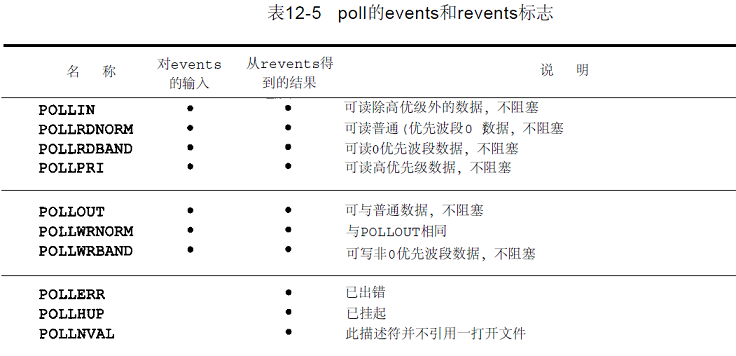

最后三行是由内核在返回时设置的。即使在 events 字段中没有指定这三个值，如果相应条件发生，则在 revents 中也返回它们。

- poll 的最后一个参数说明我们想要等待多少时间。如同 select 一样，有三种不同的情形：
  1. timeout == INFTIM 永远等待。常数INFTIM定义在 <stropts.h>,其值通常是－1。当所指定的描述符中的一个已准备好，或捕捉到一个信号则返回。如果捕捉到一个信号，则 poll 返回－1，errno 设置为 EINTR。
  2. timeout == 0 不等待。测试所有描述符并立即返回。这是得到很多个描述符的状态而不阻塞 poll 函数的轮询方法。
  3. timeout > 0 等待 timeout 毫秒。当指定的描述符之一已准备好，或指定的时间值已超过时立即返回。如果已超时但是还没有一个描述符准备好，则返回值是0。（如果系统不提供毫秒分辨率，则 timeout 值取整到最近的支持值。）

- 应当理解文件结束与挂断之间的区别。如果正在终端输入数据，并键入文件结束字符，POLLIN 被打开，于是就可读文件结束指示（read 返回 0）。POLLHUP 在 revents 中没有打开。如果读调制解调器，并且电话线已挂断，则在 revents 中将接到 POLLHUP。与 select 一样，不论一个描述符是否阻塞，并不影响 poll 是否阻塞。

[用法](http://blog.csdn.net/ithomer/article/details/6126712)

## 异步I/O

- 在用异步 I/O 的时候，要通过选择来灵活处理多个并发操作，这会使程序变得复杂。更简单的做法可能是使用多线程，使用同步模型来编写程序，并让这些线程以异步的方式运行。使用异步 I/O 口可能产生的问题：
  1. 每个异步操作有 3 处可能产生错误的地方：一处是在操作提交的部分，一处是在操作本身的结果，还有一处在用于决定一步操作状态的函数中
  2. 与 POSIX 异步 I/O 接口传统方法相比，他们本身就涉及大量的额外设置和处理规则。
  3. 从错误恢复比较困难。

- 前面讲过，非阻塞IO带来的就是轮询，前面内容包括前面的章节整合一下，可以归纳出以下主流轮询技术：
  - read，最原始，性能最低的一种，重复检查IO状态来完成完整数据的读取，也就是前面一小节的开头代码
  - select，在read基础上改进的方案，通过对文件描述符上的事件状态判断
  - poll，使用链表作为文件描述符的存储方式，和select类似
  - epoll，目前Linux下最高效的IO事件通知机制，进入轮询时候如果没有检查到IO事件就会休眠，直到事件将其唤醒
  - queue，和epoll类似，不过是FreeBSD下的

**SystemV异步IO**: SystemV中异步IO是归属给STREAMS系统的，他只能用于STREAMS设备和管道，异步IO信号是SIGPOLL。实际上由于这种机制本身的限制，目前已经找不到Unix环境会去采用它了，所以这里也不需要再讲解了。
**BSD异步IO**: 对于BSD系列的系统来说，异步IO信号是SIGIO和SIGURG信号的组合，SIGIO是通用异步IO的信号，SIGURG则是通知网络连接的数据已经到达。
**POSIX异步IO**:POSIX标准对不同类型文件异步IO提供了可移植的模型，异步IO使用AIO控制块来描述IO操作。

```cpp
struct aiocb
{
    int aio_fildes; /* File descriptor */
    off_t aio_offset; /* File offset */
    volatile void *aio_buf; /* Location of buffer */
    size_t aio_nbytes; /* Length of transfer */
    int aio_reqprio; /* Request priority offset */
    struct sigevent aio_sigevent; /* Signal number and value */
    int aio_lio_opcode; /* Operation to be performed */
};
​```

aio_fildes 就是文件描述符，读写操作从 aio_offset 指定的偏移量位置开始，对于读操作，会将数据复制到 aio_buf 的缓冲区内，对于写操作，会从这个缓冲区写入磁盘，aio_nbytes 字段指定了读写的字节数。

异步 I/O 需要显式地指定偏移量。异步 I/O 接口并不影响由操作系统维护的文件描述偏移量，只要不在同一个进程混合使用传统的 I/O 函数在同一个文件上即可。异步 I/O 已追加模式写入，则偏移量项将被忽略。

除了上面 4 个字段以外，aio_reqprio 就是异步 IO 请求的顺序，aio_sigevent 就是 IO 事件完成后如何通知，而 aio_lio_opcode 就是执行的操作。

```cpp
struct sigevent
{
    int sigev_notify; /* Notification type */
    int sigev_signo; /* Signal number */
    union sigval sigev_value; /* Signal value */
    void (*sigev_notify_function)(union sigval); /* Notification function */
    pthread_attr_t *sigev_notify_attributes; /* Notification attributes */
};
```

- sigevent 结构体是归属于 signal 信号机制模型中的数据结构，其中 sigev_notify 字段是通知类型
  - SIGEV_NONE 不通知进程
  - SIGEV_SIGNAL 异步IO完成后，产生sigev_signo指定的信号。
  - SIGEV_THREAD 异步请求完成后，由sigev_notify_function指定的函数被调用

```cpp
#include <aio.h>
int aio_read(struct aiocb *aiocbp); int aio_write(struct aiocb *aiocbp);
```

在异步 IO 之前需要先初始化 AIO 控制块，当函数返回成功时候，异步IO请求就已经被放在了等待处理队列中。这些返回值与实际IO擦做的结果没有任何关系，如果想要强制所有等待中的异步操作不等待直接写入存储，则调用aio_fsync函数

`int aio_fsync(int op , struct aiocb *aiocb);`

当然，好像aio_fsync函数并不是非常广泛，所以在使用的时候记得运行时检查。
为了获取一个异步读写的完成状态，可以调用aio_error函数

`int aio_fsync(const struct aiocb *aiocbp);`

返回如下：
返回值为 0，异步操作成功，使用 aio_return 函数获得返回值
返回值为 -1，对 aio_error 操作失败
返回值为 EINPROGRESS，读写操作仍处于等待状态

如果异步操作成功，可以调用aio_return 函数来获取异步操作

`ssize_t aio_return(struct aiocb *aiocbp);`

记住在 aio_error 检查已经成功之前，不要调用 aio_return 函数，而且需要当心每个异步操作只能调用一次 aio_return 函数。一旦调用了该函数，操作系统就可以释放掉包含了 I/O 操作返回值的记录。如果 return 函数失败返回 -1，并设置 errno。在其他情况下，他将返回一步操作结果，及 read、writer、fsync 再被成功调用时可能返回的。

如果在其他操作完成之后，异步操作还未完成，那可以使用

`int aio_suspend(const struct aiocb *const list[], int nent, const struct timespec *timeout);`

aio_suspend 函数会阻塞当前进程直到操作完成，一般情况下很少会使用。list 参数是一个指向 AIO 控制块数组的指针，nent 参数表明了数组中的条目数。数组中的空指针会被跳过，其他条目都必须指向已用于初始化异步 I/O 操作的 AIO 块。

可以使用 aio_cancel 函数来取消等待中的异步 I/O

`int aio_cancel(int fildes, struct aiocb *aiocbp);`

- fd 指定哪个未完成的异步 I/O。这个函数会返回 4 个返回值：
  - AIO_ALLDONE，所有操作已经完成
  - AIO_CANCELED，所有操作已经取消
  - AIO_NOtCANCELED，至少有一个请求没有取消
  - -1，函数本身失败

还有一个 lio_listio，该函数提交一系列由一个 AIO 控制块列表描述的 I/O 请求。

### example_rot13a

ROT-13算法，将原文中英文字符 a~z, A~Z 分别循环向右偏移 13 个字母，但不改变其他字符。

```cpp
#include "apue.h"
#include <ctype.h>
#include <fcntl.h>
#include <stdio.h>

#define BSZ 4096

unsigned char buf[BSZ];

unsigned char translate(unsigned char c)
{
    if (isalpha(c))
    {
        if (c >= 'n')
            c -= 13;
        else if (c >= 'a')
            c += 13;
        else if (c >= 'N')
            c -= 13;
        else
            c += 13;
    }
    return (c);
}

int main(int argc, char* argv[])
{
    int ifd, ofd, i, n, nw;

    if (argc != 3)
        err_quit("usage: rot13 infile outfile");
    if ((ifd = open(argv[1], O_RDONLY)) < 0)
        err_sys("can't open %s", argv[1]);
    if ((ofd = open(argv[2], O_RDWR | O_CREAT | O_TRUNC, FILE_MODE)) < 0)
        err_sys("can't create %s", argv[2]);

    while ((n = read(ifd, buf, BSZ)) > 0)
    {
        for (i = 0; i < n; i++)
            buf[i] = translate(buf[i]);
        if ((nw = write(ofd, buf, n)) != n)
        {
            if (nw < 0)
                err_sys("write failed");
            else
                err_quit("short write (%d/%d)", nw, n);
        }
    }

    fsync(ofd);
    exit(0);
}
```

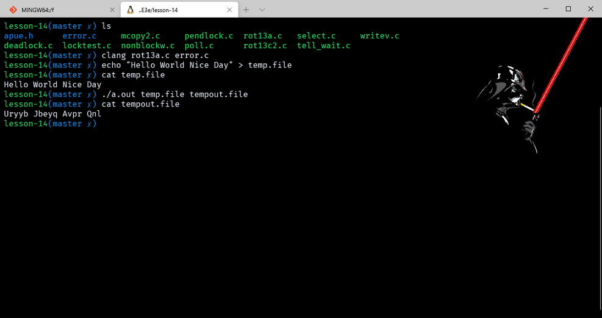

以上是简单方式，一下使用异步 I/O 函数做同样的任务。

```cpp
#include "apue.h"
#include <aio.h>
#include <ctype.h>
#include <errno.h>
#include <fcntl.h>

#define BSZ 4096
#define NBUF 8

enum rwop
{
    UNUSED = 0,
    READ_PENDING = 1,
    WRITE_PENDING = 2
};

struct buf
{
    enum rwop op;
    int last;
    struct aiocb aiocb;
    unsigned char data[BSZ];
};

struct buf bufs[NBUF];

unsigned char translate(unsigned char c)
{
    if (isalpha(c))
    {
        if (c >= 'n')
            c -= 13;
        else if (c >= 'a')
            c += 13;
        else if (c >= 'N')
            c -= 13;
        else
            c += 13;
    }
    return (c);
}

int main(int argc, char* argv[])
{
    int ifd, ofd, i, j, n, err, numop;
    struct stat sbuf;
    const struct aiocb* aiolist[NBUF];
    off_t off = 0;

    if (argc != 3)
        err_quit("usage: rot13 infile outfile");
    if ((ifd = open(argv[1], O_RDONLY)) < 0)
        err_sys("can't open %s", argv[1]);
    if ((ofd = open(argv[2], O_RDWR | O_CREAT | O_TRUNC, FILE_MODE)) < 0)
        err_sys("can't create %s", argv[2]);
    if (fstat(ifd, &sbuf) < 0)
        err_sys("fstat failed");

    /* initialize the buffers */
    for (i = 0; i < NBUF; i++)
    {
        bufs[i].op = UNUSED;
        bufs[i].aiocb.aio_buf = bufs[i].data;
        bufs[i].aiocb.aio_sigevent.sigev_notify = SIGEV_NONE;
        aiolist[i] = NULL;
    }

    numop = 0;
    for (;;)
    {
        for (i = 0; i < NBUF; i++)
        {
            switch (bufs[i].op)
            {
            case UNUSED:
                /*
                 * Read from the input file if more data
                 * remains unread.
                 */
                if (off < sbuf.st_size)
                {
                    bufs[i].op = READ_PENDING;
                    bufs[i].aiocb.aio_fildes = ifd;
                    bufs[i].aiocb.aio_offset = off;
                    off += BSZ;
                    if (off >= sbuf.st_size)
                        bufs[i].last = 1;
                    bufs[i].aiocb.aio_nbytes = BSZ;
                    if (aio_read(&bufs[i].aiocb) < 0)
                        err_sys("aio_read failed");
                    aiolist[i] = &bufs[i].aiocb;
                    numop++;
                }
                break;

            case READ_PENDING:
                if ((err = aio_error(&bufs[i].aiocb)) == EINPROGRESS)
                    continue;
                if (err != 0)
                {
                    if (err == -1)
                        err_sys("aio_error failed");
                    else
                        err_exit(err, "read failed");
                }

                /*
                 * A read is complete; translate the buffer
                 * and write it.
                 */
                if ((n = aio_return(&bufs[i].aiocb)) < 0)
                    err_sys("aio_return failed");
                if (n != BSZ && !bufs[i].last)
                    err_quit("short read (%d/%d)", n, BSZ);
                for (j = 0; j < n; j++)
                    bufs[i].data[j] = translate(bufs[i].data[j]);
                bufs[i].op = WRITE_PENDING;
                bufs[i].aiocb.aio_fildes = ofd;
                bufs[i].aiocb.aio_nbytes = n;
                if (aio_write(&bufs[i].aiocb) < 0)
                    err_sys("aio_write failed");
                /* retain our spot in aiolist */
                break;

            case WRITE_PENDING:
                if ((err = aio_error(&bufs[i].aiocb)) == EINPROGRESS)
                    continue;
                if (err != 0)
                {
                    if (err == -1)
                        err_sys("aio_error failed");
                    else
                        err_exit(err, "write failed");
                }

                /*
                 * A write is complete; mark the buffer as unused.
                 */
                if ((n = aio_return(&bufs[i].aiocb)) < 0)
                    err_sys("aio_return failed");
                if (n != bufs[i].aiocb.aio_nbytes)
                    err_quit("short write (%d/%d)", n, BSZ);
                aiolist[i] = NULL;
                bufs[i].op = UNUSED;
                numop--;
                break;
            }
        }
        if (numop == 0)
        {
            if (off >= sbuf.st_size)
                break;
        }
        else
        {
            if (aio_suspend(aiolist, NBUF, NULL) < 0)
                err_sys("aio_suspend failed");
        }
    }

    bufs[0].aiocb.aio_fildes = ofd;
    if (aio_fsync(O_SYNC, &bufs[0].aiocb) < 0)
        err_sys("aio_fsync failed");
    exit(0);
}
```

最后需要注意的是再编译 aio_read 的时候要加相应的库， -lrt

我们使用了 8 个缓冲区，每块的大小为 4096。在检查操作的返回值之前，必须确认操作已经完成。只要还有其他事情要做，就可以提交异步 I/O 操作。在把一个块写入输出文件时，我们保留了从输入文件读取数据时的偏移量。因而写的顺序不重要，这种方法仅仅试用不进行添加或删除操作输出。

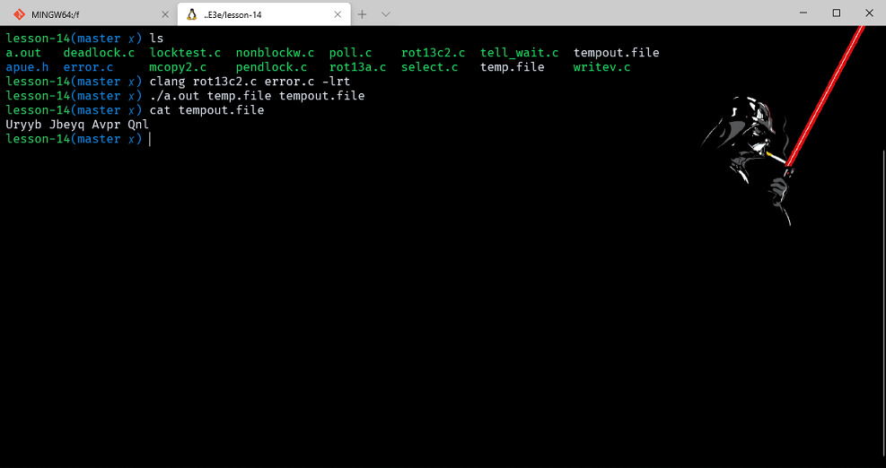

## 函数 readv 和 writev

readv 和 writev 函数用于在一次函数调用中读、写多个非连续缓冲区，又名散布读，聚合写。

```cpp
#include <sys/uio.h>
ssize_t readv(int filedes,const struct iovec *iov,int iovcnt);
ssize_t writev(int filedes,const struct iovec *iov,int iovcnt);
//参数：filedes     文件描述符
//        iov         指向iovec结构数组的一个指针。
//        iovcnt     数组元素的个数
//返回值：若成功则返回已读、写的字节数，若出错则返回-1

struct iovec {
　　void *iov_base; /* 起始地址 */
　　size_t iov_len; /* 需要传输的字节数 */
};
//iov元素数由iovcent指定，最大值为IOV_MAX。
```

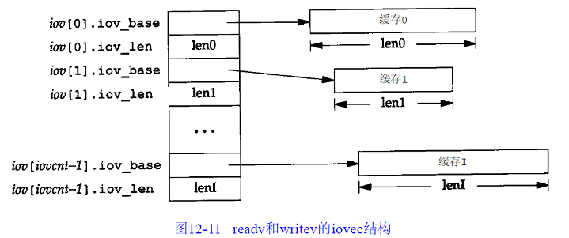

`readv()` 系统调用从文件描述符 fd 关联的文件里读取数据到 iovcnt 个由 iov 结果描述的缓存区里。(分散读)
`writev()` 系统调用把 iovcnt 个由 iov 结构描述的缓存区数据写入文件描述符 fd 关联的文件里。(聚合写)

writev以顺序 iov[0],iov[1] 至 iov[iovcnt-1] 从缓存中聚集输出数据。writev 返回输出的字节总数，它应等于所有缓存长度之和。

readv 则将读入的数据按上述同样顺序散布到缓存中。readv 总是先填满一个缓存，然后再填写下一个。readv 返回读得的总字节数。如果遇到文件结尾，已无数据可读，则返回 0。

### example_writev

```cpp
/*writev.c*/
#include <stdio.h>
#include <stdlib.h>
#include <unistd.h>
#include <errno.h>
#include <sys/uio.h>
#include <fcntl.h>
#include <string.h>
​
int main(int argc,char *argv[])
{
    int fd1,fd2;
    char *buf1 = malloc(10);
    char *buf2 = malloc(1024);
    struct iovec iov[2];
    memset(buf1,0,11);
    memset(buf2,0,1025);
    ssize_t nwritten;
    iov[0].iov_base = buf1;
    iov[0].iov_len = 10;
    iov[1].iov_base = buf2;
    iov[1].iov_len = 1024;
    readv(STDIN_FILENO,iov,2);
    printf("call readv:\n");
    printf("buf1 is: %s\tlength is: %d\n",buf1,strlen(buf1));
    printf("buf2 is: %s\tlength is: %d\n",buf2,strlen(buf2));
    printf("call writev:\n");
    iov[0].iov_base = buf1;
    iov[0].iov_len = strlen(buf1);
    iov[1].iov_base = buf2;
    iov[1].iov_len = strlen(buf2);
    nwritten = writev(STDOUT_FILENO, iov, 2);
    free(buf1);
    free(buf2);
    exit(0);
}
```

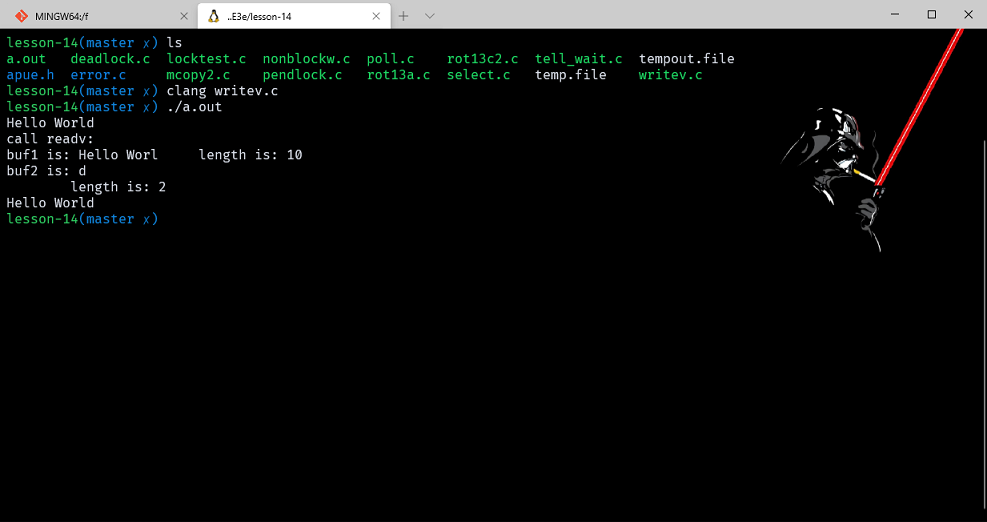

## 函数 readn 和 writen

这两个函数自己实现的。正常的read和write都会存在各种各样因为一些问题机制导致的无法读写我们所要求的数据量，这就需要 readn 和 writen 可以自动处理当出现问题后剩下的数据，他们会多次读写直到达到 N 个数据。

ssize_t readv(int d, const struct iovec *iov, int iovcnt); ssize_t writev(int fildes, const struct iovec *iov, int iovcnt);

```cpp
#include "apue.h"

ssize_t /* Read "n" bytes from a descriptor  */
readn(int fd, void* ptr, size_t n)
{
    size_t nleft;
    ssize_t nread;

    nleft = n;
    while (nleft > 0)
    {
        if ((nread = read(fd, ptr, nleft)) < 0)
        {
            if (nleft == n)
                return (-1); /* error, return -1 */
            break;           /* error, return amount read so far */
        }
        if (nread == 0)
        {
            break; /* EOF */
        }
        nleft -= nread;
        ptr += nread;
    }
    return (n - nleft); /* return >= 0 */
}
#include "apue.h"

ssize_t /* Write "n" bytes to a descriptor  */
writen(int fd, const void* ptr, size_t n)
{
    size_t nleft;
    ssize_t nwritten;

    nleft = n;
    while (nleft > 0)
    {
        if ((nwritten = write(fd, ptr, nleft)) < 0)
        {
            if (nleft == n)
                return (-1); /* error, return -1 */
            break;           /* error, return amount written so far */
        }
        if (nwritten == 0)
        {
            break;
        }
        nleft -= nwritten;
        ptr += nwritten;
    }
    return (n - nleft); /* return >= 0 */
}
```

注意，若在已经读、写了一些数据之后出错，则这两个函数返回的是已传输的数据量，而非错误。

## 存储映射 I/O

[子进程复制了父进程的什么](http://www.cnblogs.com/zhangchaoyang/articles/2317420.html)

存储映射IO能将一个磁盘文件映射到存储空间中的一个缓冲区上，于是，当从缓冲区中读取数据的时候，就等同于读取文件。

`void *mmap(void *addr, size_t len, int prot, int flags, int fd, off_t offset);`

addr 指定映射存储区的起始地址。通常为 0，也就是系统自动分配区域。fd 参数指定被映射文件的文件描述符，也就代表必须先打开这个文件。len 参数是映射的字节。off 是要映射字节在文件中的偏移量。

prot 参数指定了映射存储区的保护要求如下：
prot 说明
PROT_READ 存储区可读
PROT_WRITE 存储区可写
PROT_EXEC 存储区可执行
PROT_NONE 存储区不可访问
但是不能超过 open 模式的访问权限。
存储映射文件 ：

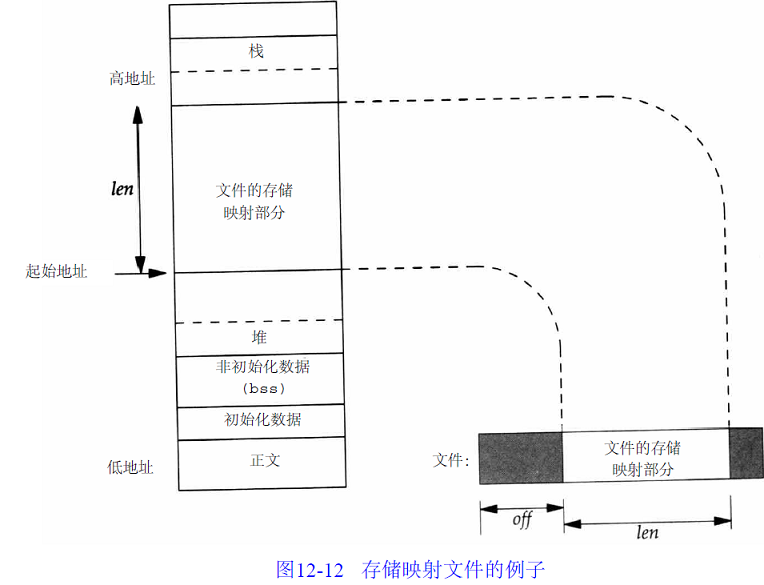

图中起始地址是mmap的返回值。映射存储区位于堆和栈之间：这属于实现细节，各种实现之间可能不同。
flag参数影响映射存储区的多种属性：
• MAP_FIXED 返回值必须等于addr。因为这不利于可移植性，所以不鼓励使用此标志。如果未指定此标志，而且addr非0，则内核只把addr视为何处设置映射区的一种建议。通过将addr指定为0可获得最大可移植性。
• MAP_SHARED 这一标志说明了本进程对映射区所进行的存储操作的配置。此标志指定存储操作修改映射文件—也就是，存储操作相当于对该文件write。必须指定本标志或下一个标志（MAPPRIVATE），但不能同时指定两者。
• MAP_PRIVATE 本标志说明，对映射区的存储操作导致创建该映射文件的一个副本。所有后来对该映射区的存访都是存访该副本，而不是原始文件。

off和addr的值（如果指定了MAPFIXED）通常应当是系统虚存页长度的倍数。因为映射文件的起动位移量受系统虚存页长度的限制，那么如果映射区的长度不是页长度的整数倍时，将如何呢？假定文件长12字节，系统页长为512字节，则系统通常提供512字节的映射区，其中后500字节被设为0。

与映射存储区相关有两个信号： SIGSEGV和SIGBUS。信号SIGSEGV通常用于指示进程试图存取它不能存取的存储区。如果进程企图存数据到用mmap指定为只读的映射存储区，那么也产生此信号。如果存取映射区的某个部分，而在存取时这一部分已不存在，则产生SIGBUS信号。

在fork之后，子进程继承存储映射区（因为子进程复制父进程地址空间，而存储映射区是该地址空间中的一部分），但是由于同样的理由，exec后的新程序则不继承此存储映射区。

调用mprotect可以更改现有映射的权限：

`int mprotect(void *addr, size_t len, int prot);`

port参数和之前的表示一样的。addr要是系统页长的整数倍数。

当使用 MAP_SHARED 标志映射到地址空间，修改过后不会立即写回文件中。他是靠相应守护进程进行调度。因此即使修改了一个字节最后也会写回一整页。当页已经修改完毕，可以调用 msync 函数冲洗到被映射的文件中。

`int msync(void *addr, size_t len, int flags);`

基本就和 fsync 函数差不多。

当进程终止的之后，自然会自动解除存储区的映射，或者可以调用 munmap 函数解除：

`int munmap(void *addr, size_t len);`

munmap 函数删除了指定地址的映射，如果继续对其进行读写会导致无效内存引用。并且这个函数不会冲洗缓冲区内容到文件，所以需要小心使用。

```cpp
#include "apue.h"
#include <fcntl.h>
#include <sys/mman.h>

#define COPYINCR (1024 * 1024 * 1024) /* 1 GB */

int main(int argc, char* argv[])
{
    int fdin, fdout;
    void *src, *dst;
    size_t copysz;
    struct stat sbuf;
    off_t fsz = 0;

    if (argc != 3)
        err_quit("usage: %s <fromfile> <tofile>", argv[0]);

    if ((fdin = open(argv[1], O_RDONLY)) < 0)
        err_sys("can't open %s for reading", argv[1]);

    if ((fdout = open(argv[2], O_RDWR | O_CREAT | O_TRUNC, FILE_MODE)) < 0)
        err_sys("can't creat %s for writing", argv[2]);

    if (fstat(fdin, &sbuf) < 0) /* need size of input file */
        err_sys("fstat error");

    if (ftruncate(fdout, sbuf.st_size) < 0) /* set output file size */
        err_sys("ftruncate error");

    while (fsz < sbuf.st_size)
    {
        if ((sbuf.st_size - fsz) > COPYINCR)
            copysz = COPYINCR;
        else
            copysz = sbuf.st_size - fsz;

        if ((src = mmap(0, copysz, PROT_READ, MAP_SHARED, fdin, fsz)) == MAP_FAILED)
            err_sys("mmap error for input");
        if ((dst = mmap(0, copysz, PROT_READ | PROT_WRITE, MAP_SHARED, fdout, fsz)) == MAP_FAILED)
            err_sys("mmap error for output");

        memcpy(dst, src, copysz); /* does the file copy */
        munmap(src, copysz);
        munmap(dst, copysz);
        fsz += copysz;
    }
    exit(0);
}
```

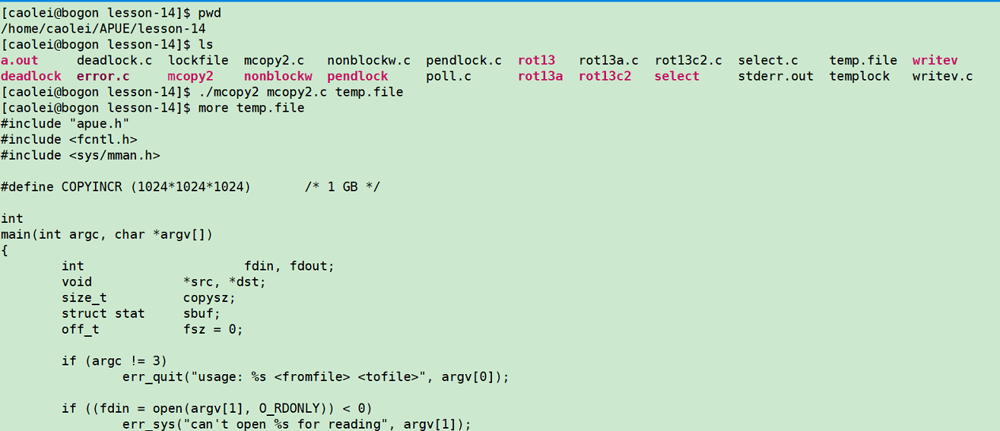

课后题1，

饿死读锁：

```cpp
#include "apue.h"
#include <fcntl.h>
#include <errno.h>
int
lock_reg(int fd, int cmd, int type, off_t offset, int whence, off_t len)
{
    struct flock    lock;
​
    lock.l_type = type;     /* F_RDLCK, F_WRLCK, F_UNLCK */
    lock.l_start = offset;  /* byte offset, relative to l_whence */
    lock.l_whence = whence; /* SEEK_SET, SEEK_CUR, SEEK_END */
    lock.l_len = len;       /* #bytes (0 means to EOF) */
​
    return(fcntl(fd, cmd, &lock));
}
​
Sigfunc *
signal_intr(int signo, Sigfunc *func)
{
    struct sigaction    act, oact;
​
    act.sa_handler = func;
    sigemptyset(&act.sa_mask);
    act.sa_flags = 0;
#ifdef  SA_INTERRUPT
    act.sa_flags |= SA_INTERRUPT;
#endif
    if (sigaction(signo, &act, &oact) < 0)
        return(SIG_ERR);
    return(oact.sa_handler);
}
​
​
void
sigint(int signo)
{
}
​
int
main(void)
{
    pid_t pid1, pid2, pid3;
    int fd;
​
    setbuf(stdout, NULL);
    signal_intr(SIGINT, sigint);
​
    /*
     * Create a file.
     */
    if ((fd = open("lockfile", O_RDWR|O_CREAT, 0666)) < 0)
        err_sys("can't open/create lockfile");
​
    /*
     * Read-lock the file.
     */
    if ((pid1 = fork()) < 0) {
        err_sys("fork failed");
    } else if (pid1 == 0) { /* child */
        if (lock_reg(fd, F_SETLK, F_RDLCK, 0, SEEK_SET, 0) < 0)
            err_sys("child 1: can't read-lock file");
        printf("child 1: obtained read lock on file\n");
        pause();
        printf("child 1: exit after pause\n");
        exit(0);
    } else {        /* parent */
        sleep(2);
    }
​
    /*
     * Parent continues ... read-lock the file again.
     */
    if ((pid2 = fork()) < 0) {
        err_sys("fork failed");
    } else if (pid2 == 0) { /* child */
        if (lock_reg(fd, F_SETLK, F_RDLCK, 0, SEEK_SET, 0) < 0)
            err_sys("child 2: can't read-lock file");
        printf("child 2: obtained read lock on file\n");
        pause();
        printf("child 2: exit after pause\n");
        exit(0);
    } else {        /* parent */
        sleep(2);
    }
​
    /*
     * Parent continues ... block while trying to write-lock
     * the file.
     */
    if ((pid3 = fork()) < 0) {
        err_sys("fork failed");
    } else if (pid3 == 0) { /* child */
        if (lock_reg(fd, F_SETLK, F_WRLCK, 0, SEEK_SET, 0) < 0)
            printf("child 3: can't set write lock: %s\n",
              strerror(errno));
        printf("child 3 about to block in write-lock...\n");
        if (lock_reg(fd, F_SETLKW, F_WRLCK, 0, SEEK_SET, 0) < 0)
            err_sys("child 3: can't write-lock file");
        printf("child 3 returned and got write lock????\n");
        pause();
        printf("child 3: exit after pause\n");
        exit(0);
    } else {        /* parent */
        sleep(2);
    }
​
    /*
     * See if a pending write lock will block the next
     * read-lock attempt.
     */
    if (lock_reg(fd, F_SETLK, F_RDLCK, 0, SEEK_SET, 0) < 0)
        printf("parent: can't set read lock: %s\n",
          strerror(errno));
    else
        printf("parent: obtained additional read lock while"
          " write lock is pending\n");
    printf("killing child 1...\n");
    kill(pid1, SIGINT);
    printf("killing child 2...\n");
    kill(pid2, SIGINT);
    printf("killing child 3...\n");
    kill(pid3, SIGINT);
    exit(0);
}
```

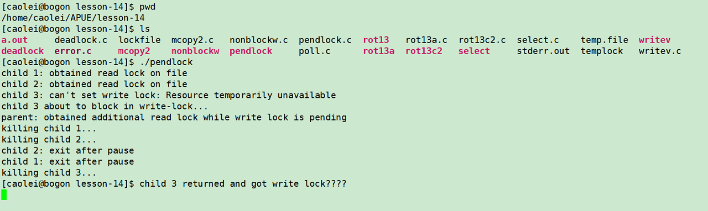
