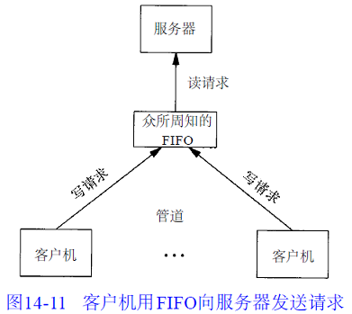

# 进程间通信

- [进程间通信](#进程间通信)
  - [引言](#引言)
  - [管道](#管道)
    - [example_pipe](#example_pipe)
    - [example_pipe2](#example_pipe2)
  - [函数 popen 和 pclose](#函数-popen-和-pclose)
    - [example_popen2](#example_popen2)
    - [popen 和 pclose 的实现](#popen-和-pclose-的实现)
    - [example_myuclc](#example_myuclc)
    - [example_popen1](#example_popen1)
  - [协同进程](#协同进程)
    - [example_add](#example_add)
  - [FIFO](#fifo)
  - [XSI IPC](#xsi-ipc)
    - [标识符和键](#标识符和键)
    - [权限结构](#权限结构)
    - [结构限制](#结构限制)
    - [优点与缺点](#优点与缺点)
  - [消息队列](#消息队列)
    - [example_msg_2](#example_msg_2)
  - [信号量](#信号量)
  - [共享存储](#共享存储)
    - [example_tshm](#example_tshm)
  - [POSIX信号量](#posix信号量)
  - [客户进程-服务器进程属性](#客户进程-服务器进程属性)
    - [第一种](#第一种)
    - [第二种](#第二种)
    - [第三种](#第三种)

> 注意：文章中使用到的源码都在我的 github 中找到，传送门：[SourceCode](https://github.com/HATTER-LONG/SourceCodeByAPUE3e)

## 引言

之前进程之间交换信息的唯一方法是经由 fork 或 exec 传送打开文件，或通过文件系统。本章将说明进程之间相互通信的其他技术 —— IPC（InterProcess Communication）。

- IPC的机制的作用：
    1. 一个软件也能更容易跟第三方软件或内核进行配合的集成或移植。如管道，在 shell 下执行 ps –aux | grep bash。
    2. 简化软件结构, 可以把一个软件划分多个进程或线程，通过IPC，集成在一起工作。如消息队列。
    3. 让操作系统各个模块交换数据，包括内核与应用程序机制。
    4. 提供进程之间或同一进程之间多线程的同步机制，如信号量。

- **两个进程之间的描述符传递**，当考虑从一个进程到另一个进程传递打开的描述符时，我们通常会想到：
  1. fork 调用返回之后，子进程共享父进程的所有打开的描述符；
  2. exec 调用执行之后，所有描述符通常保持打开状态不变；

第一个例子中，进程先打开一个描述符，再调用 fork, 然后父进程关闭这个描述符，子进程则处理这个描述符。这样一个打开的描述符就从父进程传递到子进程。然而我们也可能想让子进程打开一个描述符并把它传递给父进程。当前的 Unix 系统提供了用于从一个进程向任一其他进程传递任一打开的描述符的方法。也就是说，这两个进程之间无需存在任何亲缘关系，譬如父子进程关系。这种技术要求首先这两个进程之间创建一个 Unix 域套接字，然后使用 sendmsg 在这个套接字上发送一个特殊消息。这个消息由内核专门处理，会把打开的描述符从发送进程传递到接收进程。

- 在两个进程之间传递描述符涉及的步骤如下：
  1. 创建一个字节流的或数据报的 Unix 域套接字。建议创建字节流的 Unix 域套接字，数据报套接字可能存在数据丢失的情况。
  2. 发送进程通过调用返回描述符的任一 Unix 函数打开一个描述符，这些函数的例子有：open、pipe、mkfifo、socket 和 accept. 可以在进程之间传递的描述符不限类型，这就是我们称这种技术为“描述符传递”而不是“文件描述符传递”的原因。
  3. 发送进程创建一个 msghdr 结构，其中含有待传递的描述符。POSIX 规定描述符作为辅助数据（msghdr 结构的 msg_control 成员）发送，发送进程调用 sendmsg 通过来自步骤 1 的 Unix 域套接字发送该描述符。在发送进程调用 sendmsg 之后到接收进程调用 recvmsg 之前，该套接字仍然保持打开状态。发送一个描述符会使该描述符的引用计数加 1.
  4. 接收进程调用 recvmsg 在来自步骤 1 的 Unix 域套接字上接收这个描述符。这个描述符在接收进程中的描述符不同于它在发送进程中的描述符是正常的。传递一个描述符并不是传递一个数值，而是在接收进程中创建一个新的描述符，并把这个描述符和发送进程中的描述符指向内核中相同的文件表项。

客户端和服务器端之间必须存在某种应用协议，以便描述符的接收进程预先知道何时期待接收。如果接收进程调用 recvmsg 时没有分配用于接收描述符的空间，而且之前已有一个描述符被传递并正等着被读取，这个早先传递的描述符就会被关闭。另外，在期待接收描述符的 recvmsg 调用中应该避免使用 MSG_PEEK 标志，否则后果不可预料。

## 管道

- 管道是很古老的进程间通信机制了，基本所有的 Unix 系统或者非 Unix 系统都支持这种方式，管道有以下特性：
  - 半双工，也就是数据只能做到单向流动
  - 管道只能在具有公共祖先的两个进程之间使用。

虽然具有局限性，但是由于它的可移植性，所以目前仍然是首选的进程间通信技术，管道在shell中非常常见，我们常常使用以下命令
> command1 | command2 ... commandn
shell 使用管道将前一个进程的标准输出与后一条命令的标准输入相连，每当在管道中键入一个命令序列，让 shell 执行时，shell 会为每条命令单独创建一个进程，然后用管道将前一条命令进程的标准输出与后一条命令的标准输入相连接。

开发者调用pipe函数创建管道

```cpp
int pipe(int fildes[2]);
```

经由参数 fd 返回的两个文件描述符：fd[0] 为读而打开，fd[1] 为写而打开，fd[1] 的输出是 fd[0] 的输入。


但是在单个进程中管道几乎没有作用。通常，**调用 pipe 的进程接着调用 fork**，这样就创建了从父进程到子进程或反之的 IPC 通道。


fork 之后做什么取决于我们想要有的数据流的方向。对于从父进程到子进程的管道，父进程关闭管道的读端（fd[0]），子进程则关闭写端（fd[1]）。对于从子进程到父进程的管道，父进程关闭 fd[1]，子进程关闭 fd[0]。

- 当管道的一端被关闭后，下列规则起作用：
  1. 当读一个写端已被关闭的管道时，在所有数据都被读取后， read返回0，以指示达到了文件结束处（从技术方面考虑，管道的写端还有进程时，就不会产生文件的结束。可以复制一个管道的描述符，使得有多个进程具有写打开文件描述符。但是，通常一个管道只有一个读进程，一个写进程。下一节介绍FIFO时，我们会看到对于一个单一的FIFO常常有多个写进程）。
  2. 如果写一个读端已被关闭的管道，则产生信号SIGPIPE。如果忽略该信号或者捕捉该信号并从其处理程序返回，则write出错返回，errno设置为EPIPE。

### example_pipe

我们实际上可以将管道理解为一块内核维护的缓冲区，所以常量PIPE_BUF规定了管道的大小。

```cpp
#include "apue.h"
#include <stdio.h>

int main(void)
{
    int n;
    int fd[2];
    pid_t pid;
    char line[MAXLINE];

    if (pipe(fd) < 0)
        err_sys("pipe error");
    if ((pid = fork()) < 0)
        err_sys("fork error");
    else if (pid > 0)
    {
        close(fd[0]);
        write(fd[1], "Hello World\n", 12);
    }
    else
    {
        close(fd[1]);
        n = read(fd[0], line, MAXLINE);
        write(STDOUT_FILENO, line, n);
    }
    exit(0);
}
```


### example_pipe2

更为有益的是将管道描述符复制为标准输入和标准输出。在此之后通常子进程调用 exec，执行另一个程序，该程序从标准输入（已创建的管道）或将数据写至其标准输出（管道）。

```cpp
#include "apue.h"
#include <stdio.h>
#include <sys/wait.h>

#define DEF_PAGER "/bin/more"

int main(int argc, char* argv[])
{
    int n;
    int fd[2];
    pid_t pid;
    char *pager, *argv0;
    char line[MAXLINE];
    FILE* fp;

    if (argc != 2)
        err_quit("usage: a.out <pathname>");

    if ((fp = fopen(argv[1], "r")) == NULL)
        err_sys("can't open %s", argv[1]);
    if (pipe(fd) < 0)
        err_sys("pipe error");
    if ((pid = fork()) < 0)
        err_sys("fork error");
    else if (pid > 0)
    {
        close(fd[0]);
        while (fgets(line, MAXLINE, fp) != NULL)
        {
            n = strlen(line);
            if (write(fd[1], line, n) != n)
                err_sys("write error to pipe");
        }
        if (ferror(fp))
            err_sys("fgets error");

        close(fd[1]);

        if (waitpid(pid, NULL, 0) < 0)
            err_sys("waitpid error");
        exit(0);
    }
    else
    {
        close(fd[1]);
        if (fd[0] != STDIN_FILENO)
        {
            if (dup2(fd[0], STDIN_FILENO) != STDIN_FILENO)
                err_sys("dup2 error to stdin");
            close(fd[0]);
        }

        if ((pager = getenv("PAGER")) == NULL)
            pager = (char*)DEF_PAGER;

        if ((argv0 = strrchr(pager, '/')) != NULL)
        {

            argv0++;
            printf("\n%s\n", argv0);
        }
        else
            argv0 = pager;

        char buf[80];
        getcwd(buf, sizeof(buf));
        printf("\n%s\n", buf);
        if (execl(pager, argv0, (char*)0) < 0)
            err_sys("execl error for %s", pager);
    }
    exit(0);
}
```


其功能是每次一页显示已产生的输出：

为了避免先将所有数据写到一个临时文件中，然后再调用系统中的有关程序显示该文件，我们希望将输出通过管道直接送到分页程序。为此，先创建一个管道，一个子进程，使子进程的标准输入成为管道的读端，然后 exec 执行分页程序。
在调用 fork 之前先创建一个管道。fork 之后父进程关闭其读端，子进程关闭其写端。子进程然后调用 dup2，使其标准输入成为管道的读端，注意关闭之前的副本 fd[0]。当执行分页程序时，其标准输入将是管道的读端。
请注意，我们是如何使用环境变量 PAGER 获得用户分页程序名称的。如果这种操作没有成功，则使用系统默认值。这是环境变量的常见用法。

回忆8.8 节中的五个函数： TELL_WAIT 、TELL_PARENT 、TELL_CHILD 、WAIT_PARENT以及WAIT_CHILD。程序10-24提供了一个使用信号的实现。程序15-7则是一个使用管道的实现。

```cpp
#include "apue.h"
​
static int  pfd1[2], pfd2[2];
​
void
TELL_WAIT(void)
{
    if (pipe(pfd1) < 0 || pipe(pfd2) < 0)
        err_sys("pipe error");
}
​
void
TELL_PARENT(pid_t pid)
{
    if (write(pfd2[1], "c", 1) != 1)
        err_sys("write error");
}
​
void
WAIT_PARENT(void)
{
    char    c;
​
    if (read(pfd1[0], &c, 1) != 1)
        err_sys("read error");
​
    if (c != 'p')
        err_quit("WAIT_PARENT: incorrect data");
}
​
void
TELL_CHILD(pid_t pid)
{
    if (write(pfd1[1], "p", 1) != 1)
        err_sys("write error");
}
​
void
WAIT_CHILD(void)
{
    char    c;
​
    if (read(pfd2[0], &c, 1) != 1)
        err_sys("read error");
​
    if (c != 'c')
        err_quit("WAIT_CHILD: incorrect data");
}
```

父进程在调用 TELL_CHILD 时经由上一个管道写一个字符“P”，子进程在调用 TELL_PARENT 时，经由下一个管道写一个字符“C”。相应的 WAIT_XXX 函数调用 read 读一个字符，没有读到字符时阻塞（睡眠等待）。
注意，每一个管道都有一个额外的读取进程，这没有关系。也就是说除了子进程从 pfd1[0] 读取，父进程也有上一个管道的读端。因为父进程并没有执行对该管道的读操作，所以这不会产生任何影响。

## 函数 popen 和 pclose

除了上面的 pipe 函数以外，更常见的做法是创建一个连接到另一个进程的管道，然后读其输出或者向其输出端发送数据，为此标准 IO 库提供了 popen 和 pclose 函数

```cpp
FILE *popen(const char *cmdstring , const char *type);
//成功，返回文件指针；失败。返回NULL int pclose(FILE *stream);
//成功，返回cmdstring 的终止状态；失败，返回-1
```

函数 popen 先执行 fork，然后调用 exec 以执行 cmdstring，并且返回一个标准 I/O 文件指针。如果 type 是 "r"，则文件指针连接到 cmdstring 的标准输出（见图14-5）。


pclose 函数关闭标准 I/O 流，等待命令执行结束，然后返回 shell 的终止状态。

### example_popen2

```cpp
#include "apue.h"
#include <sys/wait.h>

#define PAGER "${PAGER:-more}" /* environment variable, or default */

int main(int argc, char* argv[])
{
    char line[MAXLINE];
    FILE *fpin, *fpout;

    if (argc != 2)
        err_quit("usage: a.out <pathname>");
    if ((fpin = fopen(argv[1], "r")) == NULL)
        err_sys("can't open %s", argv[1]);

    if ((fpout = popen(PAGER, "w")) == NULL)
        err_sys("popen error");

    /* copy argv[1] to pager */
    while (fgets(line, MAXLINE, fpin) != NULL)
    {
        if (fputs(line, fpout) == EOF)
            err_sys("fputs error to pipe");
    }
    if (ferror(fpin))
        err_sys("fgets error");
    if (pclose(fpout) == -1)
        err_sys("pclose error");

    exit(0);
}
```

​

使用  popen  精简了之前的代码。
shell命令$ { PAGER:-more}的意思是：如果shell变量PAGER已经定义，且其值非空，则使用其值，否则使用字符串more。

### popen 和 pclose 的实现

```cpp
#include "apue.h"
#include <errno.h>
#include <fcntl.h>
#include <sys/wait.h>
​
/*
 * Pointer to array allocated at run-time.
 */
static pid_t    *childpid = NULL;
​
/*
 * From our open_max(), {Prog openmax}.
 */
static int      maxfd;
​
FILE *
popen(const char *cmdstring, const char *type)
{
    int     i;
    int     pfd[2];
    pid_t   pid;
    FILE    *fp;
​
    /* only allow "r" or "w" */
    if ((type[0] != 'r' && type[0] != 'w') || type[1] != 0) {
        errno = EINVAL;
        return(NULL);
    }
​
    if (childpid == NULL) {     /* first time through */
        /* allocate zeroed out array for child pids */
        maxfd = open_max();
        if ((childpid = calloc(maxfd, sizeof(pid_t))) == NULL)
            return(NULL);
    }
​
    if (pipe(pfd) < 0)
        return(NULL);   /* errno set by pipe() */
    if (pfd[0] >= maxfd || pfd[1] >= maxfd) {
        close(pfd[0]);
        close(pfd[1]);
        errno = EMFILE;
        return(NULL);
    }
​
    if ((pid = fork()) < 0) {
        return(NULL);   /* errno set by fork() */
    } else if (pid == 0) {                          /* child */
        if (*type == 'r') {
            close(pfd[0]);
            if (pfd[1] != STDOUT_FILENO) {
                dup2(pfd[1], STDOUT_FILENO);
                close(pfd[1]);
            }
        } else {
            close(pfd[1]);
            if (pfd[0] != STDIN_FILENO) {
                dup2(pfd[0], STDIN_FILENO);
                close(pfd[0]);
            }
        }
​
        /* close all descriptors in childpid[] */
        for (i = 0; i < maxfd; i++)
            if (childpid[i] > 0)
                close(i);
​
        execl("/bin/sh", "sh", "-c", cmdstring, (char *)0);
        _exit(127);
    }
​
    /* parent continues... */
    if (*type == 'r') {
        close(pfd[1]);
        if ((fp = fdopen(pfd[0], type)) == NULL)
            return(NULL);
    } else {
        close(pfd[0]);
        if ((fp = fdopen(pfd[1], type)) == NULL)
            return(NULL);
    }
​
    childpid[fileno(fp)] = pid; /* remember child pid for this fd */
    return(fp);
}
​
int
pclose(FILE *fp)
{
    int     fd, stat;
    pid_t   pid;
​
    if (childpid == NULL) {
        errno = EINVAL;
        return(-1);     /* popen() has never been called */
    }
​
    fd = fileno(fp);
    if (fd >= maxfd) {
        errno = EINVAL;
        return(-1);     /* invalid file descriptor */
    }
    if ((pid = childpid[fd]) == 0) {
        errno = EINVAL;
        return(-1);     /* fp wasn't opened by popen() */
    }
​
    childpid[fd] = 0;
    if (fclose(fp) == EOF)
        return(-1);
​
    while (waitpid(pid, &stat, 0) < 0)
        if (errno != EINTR)
            return(-1); /* error other than EINTR from waitpid() */
​
    return(stat);   /* return child's termination status */
}
```

考虑一个应用程序，它向标准输出写一个提示，然后从标准输入读1行。使用 popen ,可以在应用程序和输入之间插入一个程序以对输入进行变换处理。图 14-7 显示了进程的安排。程序 14-6 是一个简单的过滤程序，它只是将输入复制到输出，在复制时将任一大写字符变换为小写字符。在写了一行之后，对标准输出进行了刷清（用 fflush），其理由将在下一节介绍协同进程时讨论。


### example_myuclc

```cpp
#include "apue.h"
#include <ctype.h>
#include <stdio.h>

int main(void)
{
    int c;

    while ((c = getchar()) != EOF)
    {
        if (isupper(c))
            c = tolower(c);
        if (putchar(c) == EOF)
            err_sys("output error");
        if (c == '\n')
            fflush(stdout);
    }

    exit(0);
}
```


### example_popen1

```cpp
#include "apue.h"
#include <stdio.h>
#include <sys/wait.h>

int main(void)
{
    char line[MAXLINE];
    FILE* fpin;

    if ((fpin = popen("./myuclc", "r")) == NULL)
        err_sys("popen error");
    for (;;)
    {
        fputs("prompt> ", stdout);
        fflush(stdout);
        if (fgets(line, MAXLINE, fpin) == NULL)
            break;
        if (fputs(line, stdout) == EOF)
            err_sys("fputs error to pipe");
    }
    if (pclose(fpin) == -1)
        err_sys("pclose error");
    putchar('\n');
    exit(0);
}
```


## 协同进程

UNIX 系统的过滤程序从标准输入读取数据，向标准输出写数据。几个过滤程序通常在 shell 管道中线性链接。当一个过滤程序即产生某个过滤程序输入，又读取该过滤程序的输出时，它就变成的协同进程。协同进程通常在 shell 的后台运行，其标准输入和标准输出通过管道连接到另一个程序。popen 只提供链接到另一个进程的标准输入或标准输出的一个单向管道，对于协同进程，则连接到另一个进程的两个单向管道，一个接到标准输入，一个接标准输出。

### example_add

进程创建两个管道：一个协同进程的标准输入，另一个是协同进程的标准输出。


```cpp
/*add2.c*/
#include "apue.h"

int main(void)
{
    int n, int1, int2;
    char line[MAXLINE];

    while ((n = read(STDIN_FILENO, line, MAXLINE)) > 0)
    {
        line[n] = 0; /* null terminate */
        if (sscanf(line, "%d%d", &int1, &int2) == 2)
        {
            sprintf(line, "%d\n", int1 + int2);
            n = strlen(line);
            if (write(STDOUT_FILENO, line, n) != n)
                err_sys("write error");
        }
        else
        {
            if (write(STDOUT_FILENO, "invalid args\n", 13) != 13)
                err_sys("write error");
        }
    }
    exit(0);
}
```


```cpp
/*pipe4.c*/
#include "apue.h"

static void sig_pipe(int); /* our signal handler */

int main(void)
{
    int n, fd1[2], fd2[2];
    pid_t pid;
    char line[MAXLINE];

    if (signal(SIGPIPE, sig_pipe) == SIG_ERR)
        err_sys("signal error");

    if (pipe(fd1) < 0 || pipe(fd2) < 0)
        err_sys("pipe error");

    if ((pid = fork()) < 0)
    {
        err_sys("fork error");
    }
    else if (pid > 0)
    { /* parent */
        close(fd1[0]);
        close(fd2[1]);

        while (fgets(line, MAXLINE, stdin) != NULL)
        {
            n = strlen(line);
            if (write(fd1[1], line, n) != n)
                err_sys("write error to pipe");
            if ((n = read(fd2[0], line, MAXLINE)) < 0)
                err_sys("read error from pipe");
            if (n == 0)
            {
                err_msg("child closed pipe");
                break;
            }
            line[n] = 0; /* null terminate */
            printf("The result is :");
            if (fputs(line, stdout) == EOF)
                err_sys("fputs error");
        }

        if (ferror(stdin))
            err_sys("fgets error on stdin");
        exit(0);
    }
    else
    { /* child */
        close(fd1[1]);
        close(fd2[0]);
        if (fd1[0] != STDIN_FILENO)
        {
            if (dup2(fd1[0], STDIN_FILENO) != STDIN_FILENO)
                err_sys("dup2 error to stdin");
            close(fd1[0]);
        }

        if (fd2[1] != STDOUT_FILENO)
        {
            if (dup2(fd2[1], STDOUT_FILENO) != STDOUT_FILENO)
                err_sys("dup2 error to stdout");
            close(fd2[1]);
        }
        if (execl("./add2", "add2", (char*)0) < 0)
            err_sys("execl error");
    }
    exit(0);
}

static void sig_pipe(int signo)
{
    printf("SIGPIPE caught\n");
    exit(1);
}
```


在程序中创建了两个管道，父、子进程各自关闭它们不需使用的端口。创建两个管道的理由是：一个用做协同进程的标准输入，另一个则用做它的标准输出。然后在调用 execl 之前，子进程调用dup2使管道描述符移至其标准输入和输出。

在协同进程 add2 中，使用了UNIX I/O:read和write。如果使用标准 I/O 改写该协同进程，其后果是什么呢

```cpp
#include "apue.h"

int main(void)
{
    int int1, int2;
    char line[MAXLINE];

    while (fgets(line, MAXLINE, stdin) != NULL)
    {
        if (sscanf(line, "%d%d", &int1, &int2) == 2)
        {
            if (printf("%d\n", int1 + int2) == EOF)
                err_sys("printf error");
        }
        else
        {
            if (printf("invalid args\n") == EOF)
                err_sys("printf error");
        }
    }
    exit(0);
}
```


问题出在默认的标准 I/O 缓冲机制上。当调用这个程序时，对标准输出的第一个 fgets 引起标准 I/O 库分配的一个缓冲区。因为标准输入是一个管道，默认的缓冲是全缓冲，标准输出也是如此。当发生读入阻塞时主程序从管道读也是阻塞，就造成了死锁

## FIFO

FIFO 有时被称为命名管道。未命名的管道只能由相关进程使用，它们共同的祖先进程创建了管道。但是，通过 FIFO，不相关的进程也能交换数据。第14章已经提及 FIFO 是一种文件类型。stat 结构（见4.2节）成员 stmode 的编码指明文件是否是 FIFO 类型。可以用 SISFIFO 宏对此进行测试。创建 FIFO 类类似于创建文件。FIFO 的路径存在于文件系统中。

```cpp
int mkfifo(const char *path, mode_t mode);
int mkfifoat(int fd, const char *path, mode_t mode);
```

mkfifoat 函数和 mkfifo 函数类似，但是他可以在 fd 文件描述符表示的目录相关的位置创建一个 FIFO。就像其他的*at函数。书中p445有三种情况的详细表示。
当创建完 FIFO 文件后，需要使用 open 函数打开，因为这确实是一个文件，几乎所有的正常文件 IO 函数都能操作 FIFO。

- 非阻塞标志（O_NONBLOCK）对FIFO会有以下影响：
  1. 未指定标志的时候，只读的 open 会一直阻塞到有进程写打开，只写 open 会阻塞到有进程读打开。
  2. 指定了标志，则只读 open 立刻返回。但是如果没有进程为只读打开，只写的 open 会出错。
  3. 类似于管道，若写一个尚无进程为读而打开的 FIFO，则产生信号 SIGPIPE。若某个FIFO的最后一个写进程关闭了该FIFO，则将为该FIFO的读进程产生一个文件结束标志。一个给定的FIFO有多个写进程是常见的。这就意味着如果不希望多个进程所写的数据互相穿插，则需考虑原子写操作。正如对于管道一样，常数PIPEBUF说明了可被原子写到FIFO的最大数据量。

- FIFO有两种用途：
  1. FIFO由shell命令使用以便将数据从一条管道线传送到另一条，为此无需创建中间临时文件。
  2. FIFO用于客户机-服务器应用程序中，以在客户机和服务器之间传递数据。

FIFO可被用于复制串行管道命令之间的输出流，于是也就不需要写数据到中间磁盘文件中（类似于使用管道以避免中间磁盘文件）。说白了就是建立一个管道文件。不用在使用中间文件写入读取来进行操作。

考虑这样一个操作过程，它需要对一个经过过滤的输入流进行两次处理。图14-9表示了这种安排。


tee 功能说明：读取标准输入的数据，并将其内容输出成文件。

```cpp
mkfifo fifo1
prog3 < fifo1 &
prog1 < infile | tee fifo1 | prog2
```

创建 FIFO，然后在后台起动 prog3, 它从 FIFO 读数据。然后起动 progl, 用 tee 将其输出发送到 FIFO 和 prog2。


客户-服务器使用 FIFO 进行通信服务器对应许多的客户进程，每个客户机都可将其请求写到一个该服务器创建的所有需与服务器联系的客户机都知道该 FIFO 的路径名的 FIFO 中。因为对于该 FIFO 有多个写进程，客户机发送给服务器的请求其长度要小于 PIPE_BUF 字节。这样就能避免客户机各次写之间的穿插。



但是这么做有一个问题就是服务器无法对相应的客户进程做出响应。一种解决方法是每个客户机都在其请求中发送其进程ID。然后服务器为每个客户机创建一个FIFO，所使用的路径名是以客户机的进程ID为基础的。例如，服务器可以用名字/tmp/serv1.XXXXX创建FIFO，其中XXXXX被替换成客户机的进程ID。


这种安排可以工作，但也有一些不足之处。其中之一是服务器不能判断一个客户机是否崩溃终止，这就使得客户机专用的FIFO会遗留在文件系统中。另一个是服务器必须捕捉SIGPIPE信号，因为客户机在发送一个请求后没有读取响应就可能终止，于是留下一个有写进程（服务器）而无读进程的客户机专用FIFO。

## XSI IPC

有3种称为XSI IPC的IPC：消息队列、信号量、共享存储器。

### 标识符和键

XSI IPC 在内核中存在着 IPC 结构，它们都用一个非负整数作为标识符，这点很像文件描述符，但是文件描述符永远是当前最小的开始，比如，第一个文件描述符必然是从 3 开始，然后这个文件描述符删除后，再次打开一个文件，文件描述符仍然是 3，而 IPC 结构则不会减少，会变成4，然后不断增加直到整数的最大值，然后又回转到 0。
标识符是 IPC 结构的内部名称，为了能全局使用，需要有一个键作为外部名称，无论何时创建 IPC 结构，都应当指定一个键名，这个键的数据结构是基本系统数据类型 key_t（<sys/types.h>）。

- 并且有很多种方法使客户进程和服务器进程在同一个IPC结构汇聚
  1. 服务器进程指定IPC_PRIVATE键创建一个新的IPC结构。返回的标识符被存放在一个文件中，客户端进程读取这个文件来参与IPC结构。也可以在父子进程中的进行使用，将返回的标识符给fork后的子进程然后调用exec进行传递参数给一个新的程序。
  2. 在一个公用头文件中定义一个统一的标识符，然后服务端根据这个标识符创建新的IPC结构，但是很有可能导致冲突
  3. 客户端和服务端进程认同同一个路径名和项目ID。接着调用函数ftok将这两个值变为一个键，然后在创建一个IPC结构。

```cpp
#include <sys/ipc.h>
key_t ftok(const char *path, int id);
//返回值：成功返回键；出错返回（key_t） -1
```

path参数必须是一个现有的文件，当产生键的时候，只会使用id参数低八位。ftok创建键一般依据如下行为：首先根据给定的path参数获得对应文件的stat结构中st_dev和st_ino字段，然后将他们和项目ID组合。
（以下重点）

- 三个get函数（msgget、semget和shmget）都有两个类似的参数key和一个整型的flag。如若满足下列条件，则创建一个新的IPC结构（通常由服务器创建）：
  1. key是IPC_PRIVTE，或和当前的某种类型IPC结构无关，则需要指定flag的IPC_CREAT标志位。
  2. 为访问现存的队列（通常由客户机进行），key必须等于创建该队列时所指定的关键字，并且不应指定IPC_CREAT。
  3. 绝不能使用IPC_PRIVTE作为键来引用队列，他只会创建一个新的队列，为了引用一个用IPC_PRIVTE创建的队列，一定要先知道标识符，然后就可以不用get直接引用就可以。
  4. 如果希望创建一个新的IPC结构，而且确保不冲突没有引用统一标识符的其他IPC结构，那么必须指定IPC_CREAT和IPC_EXCL位，这样做了一旦有相同的IPC结构标识符在使用就会返回报错。

### 权限结构

每个IPC结构都关联了一个ipc_perm结构，这个结构体关联了权限和所有者。

```cpp
struct ipc_perm
{
    uid_t uid;   /* [XSI] Owner's user ID */
    gid_t gid;   /* [XSI] Owner's group ID */
    uid_t cuid;  /* [XSI] Creator's user ID */
    gid_t cgid;  /* [XSI] Creator's group ID */
    mode_t mode; /* [XSI] Read/write permission */
};
```

一般来说，都会有 uid、gid、cuid、cgi、mode 这些基本的内容，而其他则是各个实现自由发挥。在创建的时候，这些字段都会被赋值，而后，如果想要修改这些字段，则必须是保证具有 root 权限或者是创建者。

mode 字段的值对于任何 IPC 结构都不存在执行权限。

```cpp
权限位
用户读、用户写（更改）0400、0200
组读、组写（更改）0040、0020
其他读、其他写（更改）0004、0002
```

### 结构限制

三种形式的系统 XSI IPC 都有我们可能会遇到的内在限制。这些限制的大多数可以通过重新配置而加以更改。当叙说每种 IPC 时，都会指出它的限制在 Linux 中可以运行 ipcs -l 来显示IPC相关的限制。其中提供了sysctl来观察与更改内核配置参数。

### 优点与缺点

IPC 结构是在系统范围内使用的，但是却没有引用计数。如果进程使用完但是没有对其进行删除就终止了，那就会导致 IPC 依然在系统中存在，而管道有引用计数，等最后一个引用管道的进程终止便会自动回收。FIFO 就算没有删除，但是等最后一个引用 FIFO 的进程终止，里面的数据已经被删除了。XSI IPC 还有一个问题就是它不是文件，我们不能使用 ls 和 rm 等文件操作函数或者命令处理它们，它们也没有文件描述符，这就限制了它们的使用，并且如果需要使用还得携带一大堆额外的 API。
因为这些 IPC 不使用文件描述符，所以不能对它们使用多路转接 I/O 函数：select 和 poll。这就使得一次使用多个 IPC 结构，以及用文件或设备 I/O 来使用 IPC 结构很难做到。

- 消息队列的其他优点是：
  1. 它们是可靠的，
  2. 流是受到控制的，
  3. 面向记录，
  4. 可以用非先进先出方式处理。


## 消息队列

消息队列是消息的链接表，存储在内核中，由消息队列标识符标识（队列ID）。

msgget 函数创建一个队列或者打开一个现有队列，msgsnd 将新数据添加到消息末尾，每个消息包含一个正的长整形字段、一个非负的长度以及实际数据字节数。msgrcv 从队列中获得消息。每个队列都有一个 msqid_ds 结构与其关联：

```cpp
struct __msqid_ds
{
    struct __ipc_perm_new msg_perm; /* [XSI] msg queue permissions */
    __int32_t msg_first; /* RESERVED: kernel use only */
    __int32_t msg_last; /* RESERVED: kernel use only */
    msglen_t msg_cbytes; /* # of bytes on the queue */
    msgqnum_t msg_qnum; /* [XSI] number of msgs on the queue */
    msglen_t msg_qbytes; /* [XSI] max bytes on the queue */
    pid_t msg_lspid; /* [XSI] pid of last msgsnd() */
    pid_t msg_lrpid; /* [XSI] pid of last msgrcv() */
    time_t msg_stime; /* [XSI] time of last msgsnd() */
    __int32_t msg_pad1; /* RESERVED: DO NOT USE */
    time_t msg_rtime; /* [XSI] time of last msgrcv() */
    __int32_t msg_pad2; /* RESERVED: DO NOT USE */
    time_t msg_ctime; /* [XSI] time of last msgctl() */
    __int32_t msg_pad3; /* RESERVED: DO NOT USE */
    __int32_t msg_pad4[4]; /* RESERVED: DO NOT USE */
}
```

每个系统实现都会在SUS标准的基础上增加自己私有的字段，所以可能和上面的有所区别。这个结构体定义了队列的当前状态。

```cpp
#include <sys/msg.h>
int msgget(key_t key, int flag);
    //返回值；成功返回消息队列；出错 -1
```

- 15.6.1注意 ftok 获取 key，以及创建于打开消息队列的区别。当创建一个新队列时，初始化msqid-ds结构的下列成员:
  - ipc_perm 结构按 15.6.2 节中所述进行初始化。该结构中 mode 按 flag 中的相应许可权位设置。
  - msg_qnum、msg_lspid、msg_lrpid、msg_stime 和 msg_rtime 都设置为 0。
  - msg_ctime 设置为当前时间。
  - msg_qbytes 设置为系统限制值。

msgctl 对队列执行多种操作，他与另外两个与信号量鸡共享存储有关函数（semctl 和 shmctl）都是 XSI IPC 的类似于 ioctl 的函数（亦是垃圾桶函数）。

```cpp
#include <sys/msg.h>
int msgctl(int msqid, int cmd, struct msqid_ds *buf);
//返回值；成功返回0；出错 -1
```

- msgctl 用于对队列进行多种操作，其中，msqid 则是消息队列 ID，cmd 参数是命令参数，可以取以下值：（这三条命令也可以用于信号量、共享存储）
  - IPC_STAT 取队列msqid_ds结构体，并且存放在buf参数指定的位置;
  - IPC_SET 将buf参数指定的结构体复制到这个队列中的结构体，需要检查root权限或者创建者权限;
  - IPC_RMID 从系统中删除消息队列;

```cpp
#include <sys/msg.h>
int msgsnd(int msqid, const void *ptr, size_t nbytes, int flag);
//返回值；成功返回0；出错 -1
```

正如前面提及的，每个消息都由三部分组成，它们是：正长整型类型字段、非负长度（nbytes）以及实际数据字节（对应于长度）。消息总是放在队列尾端。ptr 指向一个长整型数，它包含了正整型消息类型，在其后立即跟随了消息数据。（若nbytes是0，则无消息数据。）若发送的最长消息是512字节，则可定义下列结构：

```cpp
struct mymesg {
    long mtype; /* positive message type */
    char mtext[512]; /* message data，of length nbytes* /
} ;
```

于是，ptr 就是一个指向 mymesg 结构的指针。接收者可以使用消息类型以非先进先出的次序取消息。flag 的值可以指定为 IPC_NOWAIT，这点类似于文件 IO 非阻塞标志。当指定了 IPC_NOWAIT，若消息队列已满返回出错（P453）。

如果没有指定 IPC_NOWAIT，则进程阻塞直到（a）有空间可以容纳要发送的消息，或（ b）从系统中删除了此队列，或（ c）捕捉到一个信号，并从信号处理程序返回。

注意，对消息队列删除的处理不是很完善。因为对每个消息队列并没有设置一个引用计数器（对打开文件则有这种计数器），所以删除一个队列使得仍在使用这一队列的进程在下次对队列进行操作时出错返回。信号量机构也以同样方式处理其删除。删除一个文件则要等到使用该文件的最后一个进程关闭了它，才能删除文件的内容。、

和 msgsnd 一样，这个 ptr 参数指向一个长整形数，随后跟随的是存储实际区域的缓冲区。nbytes 指定数据缓冲区的长度。若返回的消息大于 nbytes，而且在 flag 中设置了 MSG_NOERROR，则该消息被截短（在这种情况下，不通知我们消息截短了）。如果没有设置这一标志，而消息又太长，则出错返回 E2BIG（消息仍留在队列中）

- 参数type则可以指定想要哪种消息:
  - type == 0 返回队列中的第一个消息。
  - type > 0 返回队列中消息类型为type的第一个消息。
  - type < 0 返回队列中消息类型值小于或等于type绝对值，而且在这种消息中，其类型值又最小的消息。

可以指定 flag 值为 IPC_NOWAIT，使操作不阻塞。这使得如果没有所指定类型的消息，则 msgrcv 出错返回 ENOMSG。如果没有指定 IPC_NOWAIT，则进程阻塞直至（a）有了指定类型的消息，或（b）从系统中删除了此队列（出错返回EIDRM），或（c）捕捉到一个信号并从信号处理程序返回（出错返回EINTR）。

### example_msg_2

```cpp
/*msg_2.c*/
#include <stdio.h>
#include <stdlib.h>
#include <string.h>
#include <sys/ipc.h>
#include <sys/msg.h>
#include <sys/types.h>
#include <unistd.h>
struct mybuf
{
    long type;
    char voltage[124];
    char ID[4];
};

int main()
{
    int msgid;
    int readret;
    struct mybuf sendbuf;
    struct mybuf recvbuf;
    msgid = msgget(IPC_PRIVATE, 0777);
    if (msgid < 0)
    {
        printf("creat share memory failure\n");
        return -1;
    }
    printf("creat message queue  success msgid = %d\n", msgid);

    system("ipcs -q");
    // init sendbuf
    sendbuf.type = 100;
    printf("please input message\n");
    fgets(sendbuf.voltage, 124, stdin);

    // start write message to message queue
    msgsnd(msgid, (void*)&sendbuf, strlen(sendbuf.voltage), 0);

    // start read message queue
    memset(recvbuf.voltage, 0, 124);
    readret = msgrcv(msgid, (void*)&recvbuf, 124, 100, 0);
    printf("recv  = %s ,", recvbuf.voltage);
    printf("readret = %d\n", readret);

    // delete message queue
    msgctl(msgid, IPC_RMID, NULL);
    system("ipcs -q");

    return 0;
}
```

## 信号量

[linux 进程通信——信号灯](http://blog.csdn.net/youqi820604/article/details/5018052)

- 信号量是一个计数器，针对多个进程提供对共享数据对象的访问。信号量的使用主要是用来保护共享资源的，使得资源在一个时刻只会被一个进程（线程）拥有。信号量的使用如下：
  - 测试控制该资源的信号量
  - 如果信号量为正，则进程可以使用该资源，这种情况下，信号量会减一，表示已经使用了一个资源。
  - 如果信号量为0，则进程进入休眠状态，直到信号量变为正，进程将会唤醒。

信号量的增减是原子操作，一般而言信号量控制的单个资源，其初始值为1.但是一般的信号量初始值可以是任意的正值，它表明有多少个共享的资源单位可以供共享应用。

内核为每个信号量集合维护着一个semid_ds结构体。

```cpp
struct semid_ds {
    struct ipc_perm sem_perm; /* see Section 15.6.2 */
    struct sem *sem_base;/* ptr to first semaphore in set */
    unsigned short sem_nsems ; /* #of semaphores in set */
    time_t sem_otime ; /* last-semop() time */
    time_t sem_ctime ; /* last-change time */
}；
```

当我们想要使用信号量的时候，使用如下函数

```cpp
#include <sys/sem.h>
int semget(key_t key, int nsems, int semflg);
    //返回值：成功返回信号俩那个ID；若出错返回-1
```

我们知道，XSI IPC实际上具有其共性，所以如同消息队列一样，这里将key变换为标识符的规则也是一样的。

- 15.6.1将key变换为标识符的规则，讨论了是否创建一个新集合，或是引用一个现存的集合。但创建一个新集合时，对semidds结构的下列成员赋初值：
  - 按节中所述，对 ipc_perm 结构赋初值。该结构中的 mode 被设置为 flag 中的相应许可权位。这些许可权是用表14-2中的常数设置的。
  - sem_otime 设置为 0。
  - sem_ctime 设置为当前时间。
  - sem_nsems 设置为 nsems。
nsems是该集合中的信号量数。如果是创建新集合（一般在服务器中），则必须指定nsems。如果引用一个现存的集合（一个客户机），则将nsems指定为0。

```cpp
#include <sys/sem.h>
int semctl(int semid, int semnum, int cmd, ...);
```

第4个参数是可选的。注意，最后一个参数是个联合（union），而非指向一个联合的指针。

```cpp
union semun {
    int val ; /* for SETVAL */
    struct semid_ds *buf ; /* for IPC_STAT and IPC_SET */
    unsigned short *array ; /* for GETALL and SETALL */
} ;
```

cmd 参数指定下列十种命令中的一种，使其在 semid 指定的信号量集合上执行此命令。其中有五条命令是针对一个特定的信号量值的，它们用 semnum 指定该集合中的一个成员。semnum 值在 0 和 nsems－1 之间（包括 0 和 nsems－1）。

- IPC_STAT 对此集合取semid_ds结构，并存放在由arg .buf指向的结构中。
- IPC_SET 按由arg .buf指向的结构中的值设置与此集合相关结构中的下列三个字段值：sem_perm.uid , sem_perm.gid和sem_perm.mode。此命令只能由下列两种进程执行：一种是其有效用户ID等于sem_perm.cuid或sem_perm.uid的进程;另一种是具有超级用户特权的进程。
- IPC_RMID 从系统中删除该信号量集合。这种删除是立即的。仍在使用此信号量的其他进程在它们下次意图对此信号量进行操作时，将出错返回EIDRM。此命令只能由下列两种进程执行：一种是具有效用户ID等于sem_perm.cuid或sem_perm.uid的进程；另一种是具有超级用户特权的进程。
- GETVAL 返回成员semnum的semval值。
- SETVAL 设置成员semnum的semval值。该值由arg.val指定。
- GETPID 返回成员semnum的sempid值。
- GETNCNT 返回成员semnum的semncnt值。
- GETZCNT 返回成员semnum的semzcnt值。
- GETALL 取该集合中所有信号量的值，并将它们存放在由arg.array指向的数组中。
- SETALL 按arg.array指向的数组中的值设置该集合中所有信号量的值。

对于 GETALL 以外的所有 GET 命令，semctl 函数都是返回相应的值。对于其他命令，若成功返回 0，出错则设置 error 并返回 -1。

还有个 semop 函数自动执行信号量集合上的操作数组

```cpp
int semop(int semid, struct sembuf *semoparray, size_t nsops);
    //返回值：成功返回0；失败返回-1
```

semoparray 是一个指针，它指向一个信号量操作数组。

```cpp
struct sembuf {
    unsigned short sem_num ; /* member # in set (0,⋯ 1,, nsems-1 */
    short sem_op ; /* operation(negative, 0,or pasitive */)
    short sem_flg ; /* IPC_NOWAIT, SEM_UNDO */
} ;
```

nops规定该数组中操作的数量（元素数）。

- 对集合中每个成员的操作由相应的 semop 规定。此值可以是负值、0 或正值。（下面的讨论将提到信号量的undo标志。此标志对应于相应semflg成员的SEM_UNDO位。）
  1. 最易于处理的情况是 semop 为正。这对应于返回进程占用的资源。semop 值加到信号量的值上。如果指定了 undo 标志，则也从该进程的此信号量调整值中减去 semop。
  2. 若 semop 为负，则表示要获取由该信号量控制的资源。如若该信号量的值大于或等于 semop 的绝对值（具有所需的资源），则从信号量值中减去 semop 的绝对值。这保证信号量的结果值大于或等于 0。如果指定了 undo 标志，则 semop 的绝对值也加到该进程的此信号量调整值上。

**exit时的信号量调整**:正如前面提到的，如果在进程终止时，它占用了经由信号量分配的资源，那么就会成为一个问题。无论何时只要为信号量操作指定了 SEM_UNDO 标志，然后分配资源（sem_o p值小于0），那么内核就会记住对于该特定信号量，分配给我们多少资源（ sem_op 的绝对值）。当该进程终止时，不论自愿或者不自愿，内核都将检验该进程是否还有尚未处理的信号量调整值，如果有，则按调整值对相应量值进行调整。如果用带 SETVAL 或 SETALL 命令的 semctl 设置一信号量的值，则在所有进程中，对于该信号量的调整值都设置为 0。

## 共享存储

共享存储允许两个或多个进程共享一给定的存储区。因为数据不需要在客户机和服务器之间复制，所以这是最快的一种 IPC。使用共享存储的唯一窍门是多个进程之间对一给定存储区的同步存取。若服务器将数据放入共享存储区，则在服务器做完这一操作之前，客户机不应当去取这些数据。通常，信号量被用来实现对共享存储存取的同步。也可以用记录锁或者互斥量。同样的内核为共享存储段维护者一个结构。

shmatt_t 类型定义为无符号整形，他至少与 unsigned short 一样大。

```cpp
#include <sys/shm.h>
int shmget(key_t key, size_t size, int shmflg);
//返回值：成功返回共享存储ID；失败返回 -1
```

key 不用多讲，和前面的一样。size 是共享存储段的长度，以字节为单位。实现上通常将其扩充为系统页的整倍数。但是，若指定的 size 值并非为系统页长的整数倍，那么最后扩充的部分是不用的。

```cpp
#include <sys/shm.h>
int shmctl(int shmid, int cmd, struct shmid_ds *buf);
//返回值：成功返回0；失败返回-1
```

cmd 参数指定下列 5 种命令中一种，使其在 shmid 指定的段上执行。

- IPC_STAT 对此段取 shmid_ds 结构，并存放在由 buf 指向的结构中。
- IPC_SET 按 buf 指向的结构中的值设置与此段相关结构中的下列三个字段：shmperm.uid、shmperm.gid 以及 shmperm.mode。此命令只能由下列两种进程执行：一种是其有效用户 ID 等于 shmperm.cuid 或 shmperm.uid 的进程；另一种是具有超级用户特权的进程。
- IPC_RMID 从系统中删除该共享存储段。因为每个共享存储段有一个连接计数（shm_nattch在shmid_ds结构中）,所以除非使用该段的最后一个进程终止或与该段脱接，否则不会实际上删除该存储段。不管此段是否仍在使用，该段标识符立即被删除 , 所以不能再用 shmat 与该段连接。此命令只能由下列两种进程执行:一种是其有效用户 ID 等于 shmperm.cuid 或 shmperm.uid 的进程；另一种是具有超级用户特权的进程。
- SHM_LOCK 锁住共享存储段。此命令只能由超级用户执行。
- SHM_UNLOCK 解锁共享存储段。此命令只能由超级用户执行。

一旦创建了一个共享存储段，进程就可调用 shmat 将其连接到它的地址空间中。

```cpp
#include <sys/shm.h>
void *shmat(int shmid, const void *shmaddr, int shmflg);
//返回值：成功返回指向共享存储段的指针； 出错返回-1
```

共享存储段连接到调用进程的哪个地址上与 addr 参数以及在 flag 中是否指定 SHMRND 位有关。

推荐：

1. 如果 addr 为 0，则此段连接到由内核选择的第一个可用地址上。
2. 如果 addr 非 0，并且没有指定 SHM_RND，则此段连接到addr所指定的地址上。
3. 如果 addr 非 0，并且指定了 SHM_RND，则此段连接到（ addr－(addr mod SHMLBA)）所表示的地址上。SHM_RND命令的意思是：取整。SHMLBA 的意思是：低边界地址倍数，它总是2的乘方。该算式是将地址向下取最近1个SHMLBA的倍数。

由于架构的不同和平台不同，为了保持可移植性，我们不应当去指定共享存储段的地址，而是由系统自行分配，最终返回的就是共享存储段的地址

如果在 flag 中指定了 SHM_RDONLY 位，则以只读方式连接此段。否则以读写方式连接此段。成功会将 shmid_ds 结构中的 shm_nattch 计数器 +1。

当操作完成后，我们需要使用shmdt函数将其分离。但是不会删除其标识符以及其相关的数据结构。

```cpp
#include <sys/shm.h>
int shmdt(const void *shmaddr);
//返回值：成功返回0； 出错返回-1
```

addr 参数是以前调用 shmat 时的返回值。成功会将 shmid_ds 结构中的 shm_nattch 计数器 -1。

### example_tshm

```cpp
/*tshm.c*/
#include "apue.h"
#include <sys/shm.h>

#define ARRAY_SIZE 40000
#define MALLOC_SIZE 100000
#define SHM_SIZE 100000
#define SHM_MODE 0600 /* user read/write */

char array[ARRAY_SIZE]; /* uninitialized data = bss */

int main(void)
{
    int shmid;
    char *ptr, *shmptr;

    printf("array[] from %p to %p\n", (void*)&array[0], (void*)&array[ARRAY_SIZE]);
    printf("stack around %p\n", (void*)&shmid);

    if ((ptr = malloc(MALLOC_SIZE)) == NULL)
        err_sys("malloc error");
    printf("malloced from %p to %p\n", (void*)ptr, (void*)ptr + MALLOC_SIZE);

    if ((shmid = shmget(IPC_PRIVATE, SHM_SIZE, SHM_MODE)) < 0)
        err_sys("shmget error");
    if ((shmptr = shmat(shmid, 0, 0)) == (void*)-1)
        err_sys("shmat error");
    printf("shared memory attached from %p to %p\n", (void*)shmptr, (void*)shmptr + SHM_SIZE);

    if (shmctl(shmid, IPC_RMID, 0) < 0)
        err_sys("shmctl error");

    exit(0);
}
```


​

mmap函数（14.8），它可将一个文件的若干部分映射到进程地址空间。这与shmat是相类似的。唯一的不同只是mmap与文件有关联，shmat没有。
实例2：

```cpp
#include "apue.h"
#include <fcntl.h>
#include <sys/mman.h>

#define NLOOPS 1000
#define SIZE sizeof(long) /* size of shared memory area */

static int update(long* ptr) { return ((*ptr)++); /* return value before increment */ }

int main(void)
{
    int fd, i, counter;
    pid_t pid;
    void* area;

    if ((fd = open("/dev/zero", O_RDWR)) < 0)
        err_sys("open error");
    if ((area = mmap(0, SIZE, PROT_READ | PROT_WRITE, MAP_SHARED, fd, 0)) == MAP_FAILED)
        err_sys("mmap error");
    close(fd); /* can close /dev/zero now that it's mapped */

    TELL_WAIT();

    if ((pid = fork()) < 0)
    {
        err_sys("fork error");
    }
    else if (pid > 0)
    { /* parent */
        for (i = 0; i < NLOOPS; i += 2)
        {
            if ((counter = update((long*)area)) != i)
                err_quit("parent: expected %d, got %d", i, counter);

            TELL_CHILD(pid);
            WAIT_CHILD();
        }
    }
    else
    { /* child */
        for (i = 1; i < NLOOPS + 1; i += 2)
        {
            WAIT_PARENT();

            if ((counter = update((long*)area)) != i)
                err_quit("child: expected %d, got %d", i, counter);

            TELL_PARENT(getppid());
        }
    }

    exit(0);
}
```

共享存储可由两个不相关的进程使用。但是，如果进程是相关的，则某些实现提供了不同的技术。

它打开此/dev/zero设备，然后指定一个长整型调用mmap。注意，一旦该存储区被映射了，就能关闭此设备。然后，进程创建一个子进程。因为在调用mmap时指定了MAP_SHARED，所以一个进程写到存储映照区的数据可由另一进程见到。以上述方式使用/dev/zero的优点是：在调用mmap创建映射区之前，无需存在一个实际文件。映射/dev/zero自动创建一个指定长度的映射区。这种技术的缺点是：它只能由相关进程使用,但是在相关进程间可能使用线程更加的放便。

匿名存储设备：类似于上面的zero设施称为匿名存储映射。详情P465

## POSIX信号量

[Posix信号量](http://www.cnblogs.com/Anker/archive/2013/01/13/2858765.html)
信号量（semaphore）是一种用于提供不同进程间或一个给定进程的不同线程间同步手段的原语。信号量的使用主要是用来保护共享资源，使得资源在一个时刻只有一个进程（线程）所拥有。

POSIX信号量接口意义在于解决XSI信号量接口的几个缺陷。P465

POSIX信号量有两种形式：命名的和未命名的。他们的差异在于创建和销毁的形式上，未命名信号量只存在于内存中，并要求能使用信号量的进程必须可以访问内存。这意味着只能应用于同一进程中的线程，或者不同进程中已经映射相同内存内容到他们的地址空间中的线程。相反，命名信号量可以通过名字访问，因此可以被任何已知他们名字的进程中的线程使用。

由sem_open来创建一个新的信号量或打开一个已存在的信号量。

```cpp
#include <semaphore.h>
sem_t *sem_open(const char * name, int oflag, .../*mode_t mode, unsigned int value */);
//返回值：成功返回指向信号量的指针 ； 出错返回SEM_FAILED
```

- 在我们使用信号量时，只需要指定两个参数name 和 oflag 。
- oflag 参数：可以是 0、O_CREAT 或 O_CREAT|O_EXCL。如果指定 O_CREAT 标志而没有指定 O_EXCL，那么只有当所需的信号量尚未存在时才初始化它。但是如果所需的信号量已经存在也不会出错。 但是如果在所需的信号量存在的情况下指定 O_CREAT|O_EXCL 却会报错。
- mode 参数：指定权限位。
- value 参数 ：指定信号量的初始值。该初始值不能超过 SEM_VALUE_MAX（这个常值必须至少为 32767）.二值信号量的初始值通常为 1，计数信号量的初始值则往往大于 1。

- 为了增加可移植性，在选择信号量命名时包含一些规则：
  1. 名字的第一个字符应该是斜杠 /
  2. 名字不应包含其他斜杠以此避免实现定义的行为
  3. 信号量名字的最大长度是实现定义的（不应超过 _POSIX_NAME_MAX）

当完成信号量操作后，使用close函数来关闭信号量指针。

```cpp
#include <semaphore.h>
int sem_close(sem_t *sem);
//返回值：成功返回0；失败返回-1
```

如果进程没有关闭信号量指针就退出，内核会自动关闭打开的信号量指针。当然，也能使用 sem_unlink 函数销毁一个命名信号量。

```cpp
#include <semaphore.h>
int sem_unlink(const char *name);
//返回值：成功返回0；失败返回-1
```

他是删除一个信号量的名字，但是不是立即的，只有当最后一个打开的引用被关闭后。在这里我们能看出来，POSIX 信号量的命名信号量和文件很像。不像 XSI 信号量，POSIX 信号量的值只能通过一个函数调用来调节，也就是 sem_wait 函数

```cpp
#include <semaphore.h>
int sem_wait(sem_t *sem); int sem_trywait(sem_t *sem);
//返回值：成功返回0；失败返回-1
```

使用 sem_wait 时，如果信号量计数是 0，就会发生阻塞。直到成功使信号 -1，或者被信号中断后才返回。使用 sem_trywait 不会阻塞，如果信号量计数是 0，返回 -1 并将 errno 置为 EAGAIN。

还有一个超时版本。

```cpp
#include <semaphore.h>
#include <time.h>
int sem_timewait(sem_t *sem, const struct timespec * restrict tsptr);
//返回值：成功返回0；失败返回-1
```

指定的时间是实时系统时间（CLOCK_REALTIME），也就是说有可能指定的是一个过去的时间，但是 -1 操作还是会成功。如果超过了时间没有 -1 那么会返回 -1 并将 errno 设置为 ETIMEDOUT。

```cpp
#include <semaphore.h>
int sem_post(sem_t *sem);
//返回值：成功返回0；失败返回-1
```

对于未命名信号量，只能使用在单进程或者单线程中，是非常容易的，我们只需要使用 sem_init 函数创建，然后使用 sem_destroy 函数销毁。

```cpp
#include <semaphore.h>
int sem_init(sem_t *sem, int pshared, unsigned int value);
//返回值：成功返回0；失败返回-1
```

pshared 参数表示是否在多个进程中（应该是指 fork，execl 等生成的其他进程），如果是设置为一个非 0 值。value 参数指明信号量的初始值。

```cpp
#include <semaphore.h>
int sem_destroy(sem_t *sem);
//返回值：成功返回0；失败返回-1
```

sem_getvalue 函数可以用来检索信号量值

```cpp
#include <semaphore.h>
int sem_getvalue(sem_t *sem, int * valp);
//返回值：成功返回0；失败返回-1
```

成功后，valp 指向的整数指向的整数值将包含信号量值。但请注意信号量被竞争改变。平台不同步。

实例：
二进制信号量可以像互斥量一样来使用。假设我们将要创建自己的锁，这种锁能被一个线程加锁而被另一个线程解锁，那么他的结构可能为：

```cpp
#include <fcntl.h>
#include <limits.h>
#include <semaphore.h>
#include <sys/stat.h>

struct slock
{
    sem_t* semp;
    char name[_POSIX_NAME_MAX];
};

struct slock* s_alloc();
void s_free(struct slock*);
int s_lock(struct slock*);
int s_trylock(struct slock*);
int s_unlock(struct slock*);


#include "slock.h"
#include <errno.h>
#include <stdio.h>
#include <stdlib.h>
#include <unistd.h>

struct slock* s_alloc()
{
    struct slock* sp;
    static int cnt;

    if ((sp = malloc(sizeof(struct slock))) == NULL)
        return (NULL);
    do
    {
        snprintf(sp->name, sizeof(sp->name), "/%ld.%d", (long)getpid(), cnt++);
        sp->semp = sem_open(sp->name, O_CREAT | O_EXCL, S_IRWXU, 1);
    } while ((sp->semp == SEM_FAILED) && (errno == EEXIST));
    if (sp->semp == SEM_FAILED)
    {
        free(sp);
        return (NULL);
    }
    sem_unlink(sp->name);
    return (sp);
}

void s_free(struct slock* sp)
{
    sem_close(sp->semp);
    free(sp);
}

int s_lock(struct slock* sp) { return (sem_wait(sp->semp)); }

int s_trylock(struct slock* sp) { return (sem_trywait(sp->semp)); }

int s_unlock(struct slock* sp) { return (sem_post(sp->semp)); }

```

进程ID和计数器用来创建名字。不需要考虑计数器竞争的问题，因为当以同一个名字进行了申请，只有一个能成功，另一个只需要重新进行常识即可。

注意，我们断开了链接，这个操作销毁了名字，所以导致其他进程无法再次访问到他，简化后期操作。

## 客户进程-服务器进程属性

下面详细说明客户进程和服务器进程的某些属性，这些属性受到它们之间所使用的IPC类型的影响。最简单的关系类型是使客户调用fork然后调用exec执行所希望的服务器进程。

### 第一种

在fork之前先创建两个半双工管道使数据可在两个方向传输,被执行的服务器程序可能是设置用户ID的程序，这使它具有了特权。服务器进程查看客户进程的实际用户ID就可以决定客户进程的身份。
进程权限问题：[Linux进程权限问题](http://blog.csdn.net/xin15200793067/article/details/42488031)

在这种安排下，可以构筑一个开放式服务器（open server）。它为客户进程打开文件而不是客户进程自己调用open函数。这样就可以在正常的UNIX用户/组/其他权限之上或之外，增加附加的权限检查。假定服务器进程执行的是设置用户ID程序，这给予了它附加的权限（很可能是root权限）。服务器进程用客户进程的实际用户ID以决定是否给予它对所请求文件的访问权限。使用这种方式，可以构筑一个服务器进程，它允许某种用户获得通常没有的访问权限。

### 第二种


另一种类型的服务器进程。这种服务器进程是一个守护进程，所有客户进程用某种形式的IPC与其联系。对于这种形式的客户进程-服务器进程关系，不能使用管道。要求使用命名的IPC，例如FIFO或消息队列。对于FIFO，如果服务器进程必须将数据送回客户进程，则对每个客户进程都要有单独使用的FIFO。如果客户进程-服务器进程应用程序只有客户进程向服务器进程发送数据，则只需要一个众所周知的FIFO。

### 第三种

使用消息队列则存在多种可能性：

- 在服务器进程和所有客户进程之间只使用一个队列，使用消息的类型字段指明谁是消息的接收者。例如，客户进程可以用类型字段1发送它们的消息。在请求之中应包括客户进程的进程ID。此后，服务器进程在发送响应消息时，将类型字段设置为客户进程的进程ID。服务器进程只接收类型字段为1的消息（msgrcv的第四个参数），客户进程则只接收类型字段等于它进程ID的消息。

- 另一种方法是每个客户进程使用一个单独的消息队列。在向服务器进程发送第一个请求之前，每个客户进程先创建它自己的消息队列，创建时使用键IPC_PRIVATE。服务器进程也有它自己的队列，其键或标识符是所有客户进程都知道的。客户进程将其第一个请求送到服务器的众所周知的队列上，该请求中应包含其客户进程消息队列的队列ID。服务器进程将其第一个响应送至客户进程队列，此后的所有请求和响应都在此队列上交换。

使用这种技术的一个问题是：每个客户进程专用队列通常只有一个消息在其中——或者是对服务器的一个请求，或者是对客户进程的响应。这似乎是对有限的系统资源（消息队列）的浪费，为此可以用一个FIFO来代替。另一个问题是服务器进程需从多个队列读消息。对于消息队列，select和poll都不起作用。

使用消息队列的这两种技术都可以用共享存储段和同步方法（信号量或记录锁）实现。

这种类型的客户进程-服务器进程关系（客户进程和服务器进程是无关系进程）的问题是：服务器进程如何准确地标识客户进程？除非服务器进程正在执行一种非特权操作，否则服务器进程知道客户进程的身份是很重要的。例如，若服务器进程是一个设置用户ID程序，就有这种要求。虽然，所有这几种形式的IPC都经由内核，但是它们并未提供任何措施使内核能够标识发送者。

对于消息队列，如果在客户进程和服务器进程之间使用一个专用队列（于是一次只有一个消息在该队列上），那么队列的msg_lspid包含了对方进程的进程ID。但是当客户进程将请求发送给服务器进程时，我们想要的是客户进程的有效用户ID，而不是它的进程ID。现在还没有一种可移植的方法，在已知进程ID的情况下可以得到有效用户ID。（内核在进程表项中自然地保持有这两种值，但是除非彻底检查内核存储空间，否则已知一个，无法得到另一个。）

使服务器进程可以标识客户进程：这一技术既可使用FIFO、消息队列或信号量，也可使用共享存储。我们假定

[进程间通信之FIFO](http://www.cnblogs.com/nufangrensheng/p/3561632.html)

图15-12使用了FIFO。客户进程必须创建它自己的FIFO，并且设置该FIFO的文件访问权限，使得只允许用户读，用户写。假定服务器进程具有超级用户特权（或者它很可能并不关心客户进程的真实标识），所以服务器进程仍可读、写此FIFO。当服务器进程在众所周知的FIFO上接收到客户进程的第一个请求时（它应当包含客户进程的专用FIFO的标识），服务器进程调用针对客户进程专用FIFO的stat或fstat。服务器进程假设客户进程的有效用户ID是FIFO的所有者（stat结构的st_uid字段）。服务器进程验证该FIFO只有用户读、用户写权限。服务器进程还应检查该FIFO的三个时间量（stat结构中的st_atime，st_mtime和st_ctime字段），要检查它们与当前时间是否很接近（例如 不早于当前时间15s或30s）。如果一个有预谋的客户进程可以创建一个FIFO，使另一个用户成为其所有者，并且设置该文件的权限为用户读和用户写，那么在系统中就存在了其他基础性的安全问题。
为了用XSI IPC实现这种技术，与每个消息队列、信号量以及共享存储段相关的ipc_perm结构，其中cuid和cgid字段标识IPC结构的创建者。以FIFO为例，服务器进程应当要求客户进程创建该IPC结构，并使客户进程将访问权限设置为只允许用户读和用户写。服务器进程也应检验与该IPC相关的时间值与当前时间是否很接近（因为这些IPC结构在显式地删除之前一直存在）。
