# 网络套接字 IPC

- [网络套接字 IPC](#网络套接字-ipc)
  - [引言](#引言)
  - [套接字描述符](#套接字描述符)
  - [寻址](#寻址)
    - [字节序](#字节序)
    - [地址格式](#地址格式)
    - [地址查询](#地址查询)
    - [example_findsvc](#example_findsvc)
    - [将套接字与地址关联](#将套接字与地址关联)
  - [建立连接](#建立连接)
  - [数据传输](#数据传输)
    - [example_timesvr](#example_timesvr)
  - [套接字选项](#套接字选项)
    - [example_initsrv2](#example_initsrv2)
  - [带外数据](#带外数据)
  - [非阻塞和异步IO](#非阻塞和异步io)

> 注意：文章中使用到的源码都在我的 github 中找到，传送门：[SourceCode](https://github.com/HATTER-LONG/SourceCodeByAPUE3e)

## 引言

前一章介绍的的进程间通信 (IPC)：管道、FIFO、消息队列、信号量以及共享存储。这些机制可以在同一台计算机上运行的进程之间通信，但是对于不同计算机的不同进程通信是无法使用这种技术的，所以就有了网络间新进程通信的机制。而网络套接字就是一种非常实用的技术，将套接字绑定在端口上，通过该接口与其他进程通信。

## 套接字描述符

就如同文件描述符，套接字也有描述符，在文件系统中，套接字也被认为是一种文件，所以套接字描述符在 Unix 系统中也能被当做是一种文件描述符，并且许多处理文件描述符的函数（read 和 write 等）都可以用来处理套接字描述符。调用 socket 函数创建一个套接字

```cpp
#include <sys/socket.h>
int socket(int domain,int type,int protocol);
//返回值：若成功返回文件描述符；失败返回-1
```

参数 domain（域）确定通信的特性，包括地址格式。下图总结了 POSIX.1 指定的各个域，每个域都有自己表示地址的格式（17.2有AF_UNIX）

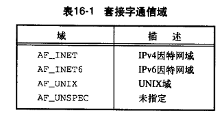

参数 type 确定套接字的类型，在实现中可以自由的添加其他类型的支持。

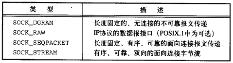

参数 protocol 通常是 0，表示为给定的域和套接字类型选择默认协议。一般情况下，都只支持单协议，当域和套接字支持多协议的时候，可以使用 protocol 参数给定一个特定协议，每个系统都有自己实现的协议。IPV4 域 (AF_INET) 下 SOCK_DGRAM默认 是 UDP，SOCK_STREAM 默认是 TCP。

其中，用的最多的就是 TCP 和 UDP 协议，也就是 SOCK_STREAM 和 SOCK_DGRAM。

当使用数据报（SOCK_DGRAM）的时候，不需要连接建立，因此数据报是一种面向无连接的服务。字节流（SOCK_STREAM）会要求在交换数据（本地与目标）之前建立连接，所以这是面向连接的服务。 SOCK_STREAM 提供字节流服务，所以应用程序分辨不出报文的界限。这意味者最终获得发送过来的数据需要经过多次调用才能得到。SOCK_SEQPACKET 套接字和 SOCK_STREAM 套接字类似，但是他是基于报文的服务，也就是说接受收到的数据量于对方发送的是一致的。SOCK_RAW 套接字提供一个数据报接口，用于直接访问下层的网络层（IP层），可以自己创建协议头部，绕过了传输协议（如TCP和UDP）。

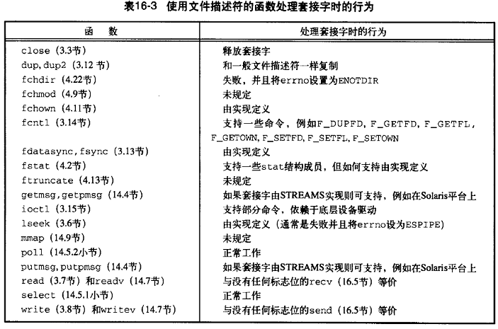

套接字通信是双向的。可以采用 shutdown 函数来禁止一个套接字的 I/O

```cpp
#include <sys/socket.h>
int shutdown(int sockfd,int how);
返回值：成功返回0；失败返回-1
```

如果how是SHUT_RD（关闭读端），那么无法从套接字读取数据。
如果how是SHUT_WR（关闭写端），那么无法使用套接字发送数据。
如果how是SHUT_RDWR，则既无法读取数据，又无法发送数据。

使用close函数直到关闭了最后一个引用它的文件描述符才会释放这个套接字，而shutdown允许使用一个套接字处于不活动状态，和引用它的文件描述符数目无关。

## 寻址

- 进程标识由两部分组成：
  1. 计算机的网络地址，通信需要。
  2. 该计算机上的端口号表示的服务，标识特定的进程。

### 字节序

<判断机器储存是否为小尾端>

```cpp
#include <inttypes.h>
#include <stdio.h>
#include <stdlib.h>

int main(void)
{
    uint32_t i = 0x04030201;
    unsigned char* cp = (unsigned char*)&i;

    if (*cp == 1)
        printf("little-endian\n");
    else if (*cp == 4)
        printf("big-endian\n");

    return 0;
}
```

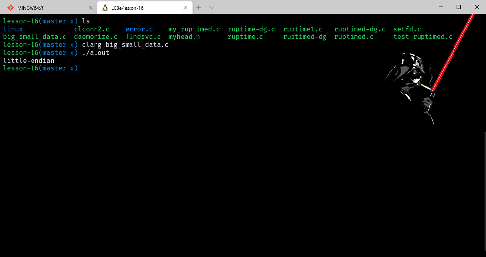

网络协议指定了字节序，因此异构计算机能够交换协议信息，不受大小端问题的干扰。TCP/IP 协议栈使用的是大端字节序。对于 TCP/IP 应用程序，有 4 个用来处理处理器字节序和网络字节序之间实施转换的函数

```cpp
#include <arpa/inet.h>
uint32_t htonl(unit32_t hostint32); //返回值：以网络字节序表示的32位整数
uint16_t htons(unit16_t hostint16); //返回值：以网络字节序表示的16位整数
uint32_t ntohl(unit32_t netint32); //返回值：以主机字节序表示的32位整数
uint32_t ntons(unit16_t netint16); //返回值：以主机字节序表示的16位整数
```

### 地址格式

对于一个端对端的通信，最重要的一步就是寻找目标位置，我们知道，TCP/IP 协议包含了网络层和传输层，其中网络层是 IP 协议，而传输层是  TCP 协议、UDP 协议和 ICMP 协议，IP 地址是标志了一台主机的位置，而 port  部分则是标志了传输层目标位置，也就是说，port是传输层对网络的封装。我们知道，TCP/IP协议实际上是一个非常抽象良好的分层架构，每一层只对上一层负责，而无需了解上层内容，同时也屏蔽了上层对下层的了解，所以，有一些东西是需要注意的，比如字节序、地址格式、地址查询，
一个地址标识一个特定通信域的套接字端点，地址格式与这个特定的通信域相关。为使不同的格式地址能够传入到套接字函数，地址会被强制转换成一个通用的地址结构 sockaddr (Linux中的定义)：

```cpp
struct sockaddr
{
    sa_family_t sa_family;
    char sa_data[14];//可以自由的改变大小
};
```

因特网地址定义在 `<netinet/in.h>` 头文件中。在 IPv4 因特网域中，套接字地址用结构 sockaddr_in 表示：

```cpp
struct in_addr{
in_addr_t s_addr; //uint16_t
};
​
struct sockaddr_in{
    sa_family_t sin_family;
    in_port_t sin_port; //uint32_t
    struct in_addr sin_addr; //IPV4 address
};
```

IPv6 因特网域套接字地址用结构 sockaddr_in6表示：

```cpp
struct in6_addr{
    uint8_t s6_addr[16];
};
​
struct sockaddr_in6{
    sa_family_t sin6_family;
    in_port_t sin6_port;
    uint32_t sin6_flowinfo;
    struct in6_addr sin6_addr;
    uint32_t sin6_scope_id;
};
```

下面两个函数用于二进制地址格式与十进制字符表示（a.b.c.d）之间的相互转换：

```cpp
#include <arpa/inet.h>
const char * inet_ntop (int domain, const void * restrict addr, char * restrict str, socklen_t size);
//返回值：若成功返回地址字符串的指针；失败返回NULL
int inet_pton ( int domain, const char * restrict str, void * restrict addr);
//返回值：若成功返回1；若格式无效返回0；失败返回-1
```

ntop 将网络二进制地址转化为字符串格式。pton 将文本字符串转化为网络地址二进制。domain 只支持 AF_INET 和 AF_INET6。size用来指定保存文本字符串的 str 大小。通常 INET_ADDRSTRLEN 表示 IPV4 的字符串大小。INET6_ADDRSTRLEN 表示 IPV6 的。

### 地址查询

通过调用gethostend，可以找到给定计算机系统的主机信息

```cpp
#include <netdb.h>
struct hostent *gethostent(void);
//返回值：若成功返回指针；若出错返回NULL
void sethostent(int stayopen);
void endhostent(void);
```

如果主机数据库文件没有打开，gethostent会打开它。函数gethostent返回文件中的下一个条目。函数sethostent会打开文件，如果文件已经被打开，那么将其回绕。当stayopen参数设置为非0值时，调用gethostent后文件依然是打开的。endhostent关闭文件。调用完后会返回一个指向hostent结构的指针，hostent结构如下至少包含以下成员：

```cpp
struct hostent
{
    char *h_name; /* official name of host */
    char **h_aliases; /* alias list */
    int h_addrtype; /* host address type */
    int h_length; /* length of address */
    char **h_addr_list; /* list of addresses */
};
```

我们可以用以下函数在协议名字和协议编号之间进行映射：

```cpp
#include <netdb.h> 
struct protoent *getprotobyname(const char *name);
struct protoent *getprotobynumber(int proto);
struct protoent *getprotoent(void);
//三个函数的返回值：若成功返回指针；若失败返回NULL
void setprotoent(int stayopen);
void endprotoent(void);
```

POSIX.1 定义的 protoent 结构至少包含以下成员：

```cpp
struct protoent
{
    char *p_name; /* official protocol name */
    char **p_aliases; /* alias list */
    int p_proto; /* protocol number */
};
```

服务是由地址的端口号部分表示的，每个服务由一个唯一的众所周知的端口来支持。可以使用函数 getservbyname 将一个服务名映射到一个端口号，使用函数 getservbyport 将一个端口号映射到一个服务名，使用函数 getservent 顺序扫描服务数据库。

```cpp
#include <netdb.h>
struct servent *getservbyname(const char *name,const char *proto);
struct servent *getservbyport(int port,const char *proto);
//3 个函数对的返回值：若成功，返回指针；若失败，返回NULL
struct servent *getservent(void);
void setservent(int stayopen);
void endservent(void);
```

servent结构至少包含以下成员：

```cpp
struct servent
{
    char *s_name; /* official service name */
    char **s_aliases; /* alias list */
    int s_port; /* port number */
    char *s_proto; /* protocol to use */
};
```

POSIX.1 定义了若干新的函数，允许一个应用程序将一个主机名和一个服务器名映射到一个地址

```cpp
#include <sys/socket.h>
#include <netdb.h>
int getaddrinfo(const char *restrict host,
                const char *restrict service,
                const struct addrinfo *restrict hint, struct addrinfo **restrict res);
//返回值：如成功返回 0；失败返回非 0 的错误代码
void freeaddrinfo(struct addrinfo *ai);
```

需要提供主机名、服务名，或者两者都提供。函数返回一个链表结构 addrinfo，可以用 freeaddrinfo 来释放一个或多个这种结构。
addrinfo结构的定义至少包含以下成员：

```cpp
 struct addrinfo
{
    int ai_flags;
    int ai_family;
    int ai_socktype;
    int ai_protocol;
    socklen_t ai_addrlen;
    struct sockaddr *ai_addr;
    char *ai_canonname;
    struct addrinfo *ai_next;
};
```

可以提供一个可选的 hint 来选择符合特定条件的地址。hint 是一个用于过滤地址的模板包括了ai_flags、ai_flags、ai_protocol、ai_socktype字段，其余的字段设置为0，指针为NULL。

[addrinfo结构体详解](http://blog.csdn.net/yanheifeng715000/article/details/6448833)

如果 getaddrinfo 失败，需要调用 gai_strerror 将返回的错误码转换成错误消息

```cpp
#include <netdb.h>
const char *gai_strerror(int error);
//返回值：成功返回0；出错返回非0的值
```

getnameinfo 函数将一个地址转换成一个主机名和一个服务名

```cpp
#include <sys/socket.h>
#include <netdb.h>
int getnameinfo(const struct sockaddr *restrict addr,
                socklen_t alen, char *restrict host,
                socklen_t hostlen, char *restrict service,
                socklen_t servlen,int flags);
//返回值：成功返回0；出错返回非0的值
```

套接字地址被翻译为一个主机名和一个服务名。flags 参数提供了一些控制翻译的方式，下图总结了支持的标志

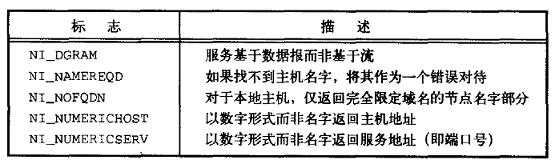

### example_findsvc

```cpp
#include "apue.h"
#if defined(SOLARIS)
#include <netinet/in.h>
#endif
#include <arpa/inet.h>
#include <netdb.h>
#if defined(BSD)
#include <netinet/in.h>
#include <sys/socket.h>
#endif

void print_family(struct addrinfo* aip)
{
    printf(" family ");
    switch (aip->ai_family)
    {
    case AF_INET:
        printf("inet");
        break;
    case AF_INET6:
        printf("inet6");
        break;
    case AF_UNIX:
        printf("unix");
        break;
    case AF_UNSPEC:
        printf("unspecified");
        break;
    default:
        printf("unknown");
    }
}

void print_type(struct addrinfo* aip)
{
    printf(" type ");
    switch (aip->ai_socktype)
    {
    case SOCK_STREAM:
        printf("stream");
        break;
    case SOCK_DGRAM:
        printf("datagram");
        break;
    case SOCK_SEQPACKET:
        printf("seqpacket");
        break;
    case SOCK_RAW:
        printf("raw");
        break;
    default:
        printf("unknown (%d)", aip->ai_socktype);
    }
}

void print_protocol(struct addrinfo* aip)
{
    printf(" protocol ");
    switch (aip->ai_protocol)
    {
    case 0:
        printf("default");
        break;
    case IPPROTO_TCP:
        printf("TCP");
        break;
    case IPPROTO_UDP:
        printf("UDP");
        break;
    case IPPROTO_RAW:
        printf("raw");
        break;
    default:
        printf("unknown (%d)", aip->ai_protocol);
    }
}

void print_flags(struct addrinfo* aip)
{
    printf("flags");
    if (aip->ai_flags == 0)
    {
        printf(" 0");
    }
    else
    {
        if (aip->ai_flags & AI_PASSIVE)
            printf(" passive");
        if (aip->ai_flags & AI_CANONNAME)
            printf(" canon");
        if (aip->ai_flags & AI_NUMERICHOST)
            printf(" numhost");
        if (aip->ai_flags & AI_NUMERICSERV)
            printf(" numserv");
        if (aip->ai_flags & AI_V4MAPPED)
            printf(" v4mapped");
        if (aip->ai_flags & AI_ALL)
            printf(" all");
    }
}

int main(int argc, char* argv[])
{
    struct addrinfo *ailist, *aip;
    struct addrinfo hint;
    struct sockaddr_in* sinp;
    const char* addr;
    int err;
    char abuf[INET_ADDRSTRLEN];

    if (argc != 3)
        err_quit("usage: %s nodename service", argv[0]);
    hint.ai_flags = AI_CANONNAME;
    hint.ai_family = 0;
    hint.ai_socktype = 0;
    hint.ai_protocol = 0;
    hint.ai_addrlen = 0;
    hint.ai_canonname = NULL;
    hint.ai_addr = NULL;
    hint.ai_next = NULL;
    if ((err = getaddrinfo(argv[1], argv[2], &hint, &ailist)) != 0)
        err_quit("getaddrinfo error: %s", gai_strerror(err));
    for (aip = ailist; aip != NULL; aip = aip->ai_next)
    {
        print_flags(aip);
        print_family(aip);
        print_type(aip);
        print_protocol(aip);
        printf("\n\thost %s", aip->ai_canonname ? aip->ai_canonname : "-");
        if (aip->ai_family == AF_INET)
        {
            sinp = (struct sockaddr_in*)aip->ai_addr;
            addr = inet_ntop(AF_INET, &sinp->sin_addr, abuf, INET_ADDRSTRLEN);
            printf(" address %s", addr ? addr : "unknown");
            printf(" port %d", ntohs(sinp->sin_port));
        }
        printf("\n");
    }
    exit(0);
}
```

说明了getaddrinfo的使用方法

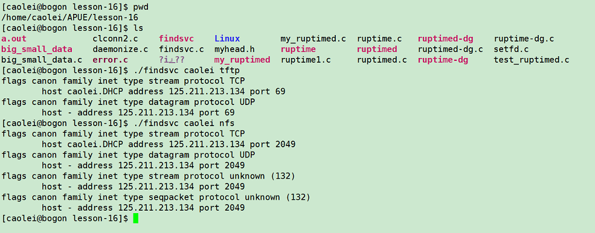

### 将套接字与地址关联

socket 编程对于服务器和客户端是不一样的，服务器需要固定一个端口，然后一直侦听端口，客户端则不需要侦听固定端口，只需要在进行联系的时候随意分配一个即可，所以这一小节实际上应当是属于服务端开发的内容。我们可以使用 bind 函数来将套接字和地址绑定在一起

```cpp
#include <sys/socket.h>
int bind(int socket, const struct sockaddr *address, socklen_t address_len);
//返回值：成功返回0；出错返回-1
```

限制：
1，地址必须有效
2，地址和创建套接字的地址组支持的格式相同
3，一般只能一对一的绑定，有些其他的允许多重绑定

可以调用 getsockname 函数来发现绑定到套接字上的地址。

```cpp
#include <sys/socket.h>
int getsocketname(int sockfd, struct sockaddr *restrict addr, socklent * restrict alenp);
//返回值：成功返回0；出错返回-1
```

调用getsockname之前，设置alenp为一个指向整数的指针，该整数指定缓冲区sockaddr的大小。返回时，该整数会被设置成返回地址的大小。如果套接字已经和对方连接，调用getpeername来找到对方的地址

```cpp
#include <sys/socket.h>
int getpeername(int sockfd,struct sockaddr *addr,socklen_t *alenp)
//返回值：成功返回0；出错返回-1
```

除了返回的是对方的地址，其他于上面的一样。

## 建立连接

在处理面向连接的网络服务(SOCK_STREAM 或 SOCK_SEQPACKET)，在开始交换数据之前，需要在请求服务的进程套接字(客户端)和提供服务的进程套接字（服务器端）之间建立一个连接。

```cpp
#include <sys/socket.h>
int connect(int sockfd,const struct sockaddr *addr,socklen_t len)
//返回值：成功返回0；出错返回-1
```

addr 是我们想要通信的服务器地址。
如果 sockfd 没有绑定到一个地址，connect 会给调用者一个默认的地址。

```cpp
#include "apue.h"
#include <sys/socket.h>

#define MAXSLEEP 128

int connect_retry(int domain, int type, int protocol, const struct sockaddr* addr, socklen_t alen)
{
    int numsec, fd;

    /*
     * Try to connect with exponential backoff.
     */
    for (numsec = 1; numsec <= MAXSLEEP; numsec <<= 1)
    {
        if ((fd = socket(domain, type, protocol)) < 0)
            return (-1);
        if (connect(fd, addr, alen) == 0)
        {
            /*
             * Connection accepted.
             */
            return (fd);
        }
        close(fd);

        /*
         * Delay before trying again.
         */
        if (numsec <= MAXSLEEP / 2)
            sleep(numsec);
    }
    return (-1);
}
```

连接服务器过程中有许多可能出现错误，客户端必须能够处理这些错误。这个函数展示的是指针补偿算法。调用connect函数失败，进程会休眠一段时间，时间长短按指数级增加，直到最大的2分钟。如果connect失败，想要重试，必须打开一个新的套接字。否则在有些系统不支持直接重用connect。

如果套接字描述符处于非阻塞状态（16.8），那么链接不会马上建立，connect 会返回 -1 并将 errno 置为 EINORIGRESS。应用程序可以使用 select 和 poll 来测试什么时候可写，如果可写，则连接完成。

socket 参数是一个套接字，如果类型是 SOCK_DGRAM，connect 函数调用就会指定套接字关联的对方的地址为 address 参数，每次在传输报文不需要在给定地址，并且在接收的时候只能接收此地址传过来的数据。如果套接字是 SOCK_STREAM 类型，函数调用将会尝试连接另一个套接字，另一个套接字通过 address 参数对应的地址连接，对于 UDP 数据报来说，可以多次调用这个函数用于改变对应地址，而 TCP 流则只能使用一次用于建立连接。对于服务端进程来说，只需要调用 listen 命令侦听套接字就行了。

```cpp
#include <sys/socket.h>
int listen(int socket, int backlog);
//返回值：成功返回0；出错返回-1
```

这个 backlog 参数是用来定义阻塞请求队列的最大长度的，如果超出了这个范围，就会有 ECONNREFUSED 提示。一旦服务器调用 listen，所用的套接字就能接收连接请求，使用 accept 函数获得连接请求并建立连接。

```cpp
#include <sys/socket.h>
int accept(int socket, struct sockaddr *restrict address, socklen_t *restrict address_len);
//返回值：若成功，返回文件（套接字）描述符；若出错返回-1
```

上面 accept 函数接收一个 socket 参数，一个 address 参数，一个 address_len 参数，其中，socket 参数是一个已经创建的套接字描述符，并且使用 bind 函数将其绑定到了端口上，并且正在使用 listen 函数侦听端口，accept 函数取出请求队列中的第一个请求，然后生成与 socket 参数相同属性的一个套接字，并且为其分配一个新的文件描述符。如果调用时候请求队列没有任何请求，并且套接字没有被标记为非阻塞，则 accept 函数将会阻塞当前进程直到连接到来，而原始的 socket 参数套接字将会继续侦听端口。

```cpp
#include "apue.h"
#include <errno.h>
#include <sys/socket.h>
int initserver(int type, const struct sockaddr* addr, socklen_t alen, int qlen)
{
    int fd;
    int err = 0;
    if ((fd = socket(addr->sa_family, type, 0)) < 0)
        return (-1);
    if (bind(fd, addr, alen) < 0)
    {
        err = errno;
        goto errout;
    }
    if (type == SOCK_STREAM || type == SOCK_SEQPACKET)
    {
        if (listen(fd, qlen) < 0)
        {
            err = errno;
            goto errout;
        }
    }
    return (fd);
errout:
    close(fd);
    errno = err;
    return (-1);
}
```

## 数据传输

套接字属于文件描述符，那么当套接字描述符存在的时候，就能使用 read 和 write 等文件 IO 函数对其读写，这样就能简化操作（16.4小字部分）最简单的是 send，它和 write 很像，但是可以指定标志来改变处理传输数据的方式

```cpp
#include <sys/socket.h>
ssize_t send(int socket, const void *buffer, size_t length, int flags);
//返回值：成功返回发送的字节；失败：返回-1
```

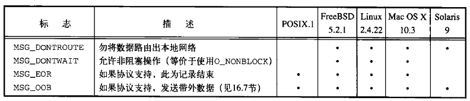

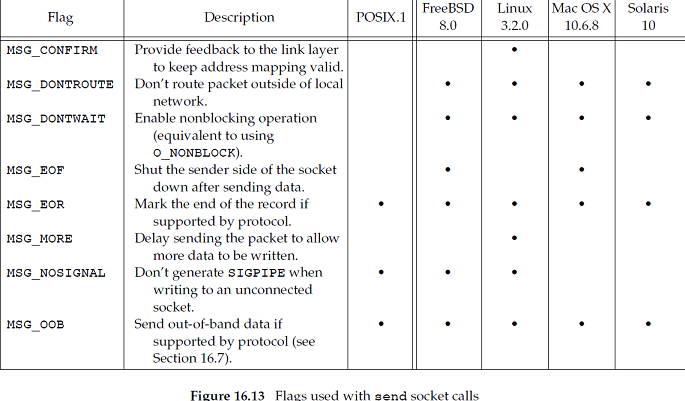

参数 socket 需要建立连接，buffer 和 length 于 write 一样，唯独 flags 是特殊的。

send 的成功返回不代表对方可以接收到数据，仅仅是发送到网络驱动程序上是没有错误的。如果是支持报文边界的协议，当超过边界 send 报错，并将 errno 设置为 EMSGSIZE。函数 sendto 和 send 很类似，区别在于 sendto 可以在无连接的套接字上指定一个目标地址

```cpp
#include <sys/socket.h>
ssize_t sendto(int socket, const void *buffer, size_t length, int flags, const struct sockaddr *dest_addr, socklen_t dest_len);
//返回值：成功返回发送的字节；失败：返回-1
```

对于面向连接的套接字，目标地址是被忽略的，因为连接中隐含了地址。对于无连接套接字除非先调用了 connect，否则只能使用 sendto。通过套接字发送数据时，还有一个选择。可以调用带有 msghdr 结构的sendmsg来指定多重缓冲区传输数据。

```cpp
#include <sys/socket.h>
ssize_t sendmsg(int socket, const struct msghdr *message, int flags);
//返回值：成功返回发送的字节；失败：返回-1

struct msghdr
{
    void* msg_name;        /* optional address */
    socklen_t msg_namelen; /* size of address */
    struct iovec* msg_iov; /* scatter/gather array */
    size_t msg_iovlen;     /* # elements in msg_iov */
    void* msg_control;     /* ancillary data, see below */
    size_t msg_controllen; /* ancillary data buffer len */
    int msg_flags;         /* flags on received message */
};

```

函数 recv 和 read 相似，但是 recv 可以指定标志来控制如何接收数据

```cpp
#include <sys/socket.h>
ssize_t recv(int socket, void *buffer, size_t length, int flags);
//返回值：返回数据的字节长度；若无可用数据或对等方已经按序结束，返回0；若出错返回-1.
```

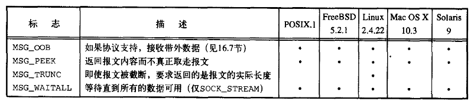

MSG_CMSG_CLOEXEC:为UNIX域套接字上接收的文件描述符设置执行时关闭的标志

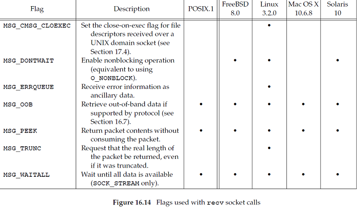

MSG_PEEK 是查看下一个数据包但是不取走，知道调用 read, recv 之后会返回刚才查看的数据。
对于 SOCK_STREAM 套接字，接收的数据可以比预期的少。MSG_WAITALL 标志会阻止这种行为，直到所有的数据全部返回，recv 才会返回。对于 SOCK_DGRAM 和 SOCK_SEQPACKET 套接字， MSG_WAITALL 标志没有改变什么行为，因为这些是以一次报文将所有数据返回。

如果有兴趣定位发送者，可以使用 recvfrom 来得到数据发送者的源地址

```cpp
#include <sys/socket.h>
ssize_t recvfrom(int socket, void *restrict buffer, size_t length, int flags, struct sockaddr *restrict address, socklen_t *restrict address_len);
//返回值：返回数据的字节长度；若无可用数据或等待对方已经按序结束，返回0；若出错，返回-1
```

如果 addr 非空，它将包含数据发送者的套接字端点地址。通常用于无连接的套接字。为了将接收到的数据送入多个缓冲区，或者想接收辅助数据，可以使用 recvmsg

```cpp
#include <sys/socket.h>
ssize_t recvmsg(int socket, struct msghdr *message, int flags);
//返回值：返回数据的字节长度；若无可用数据或等待对方已经按序结束，返回0；若出错，返回-1
```

msghdr 结构被用来指定接收数据的输入缓冲区。返回时，msghdr 结构中的 msg_flags 字段都被设为所接收数据的特征。flag 可以改变默认行为。

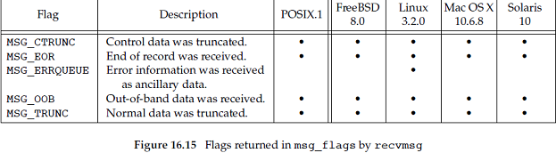

### example_timesvr

用于得到服务器发送的时间的客户端程序；

橙色表示会引起进程阻塞的低速系统调用。

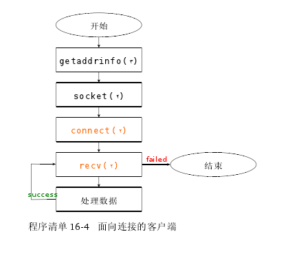

```cpp
#include "apue.h"
#include <errno.h>
#include <netdb.h>
#include <sys/socket.h>

#define BUFLEN 128

extern int connect_retry(int, int, int, const struct sockaddr*,
                         socklen_t); //这个函数使用的是前面的函数16.4

void print_uptime(int sockfd)
{
    int n;
    char buf[BUFLEN];

    while ((n = recv(sockfd, buf, BUFLEN, 0)) > 0)
        write(STDOUT_FILENO, buf, n);
    if (n < 0)
        err_sys("recv error");
}

int main(int argc, char* argv[])
{
    struct addrinfo *ailist, *aip;
    struct addrinfo hint;
    int sockfd, err;

    if (argc != 2)
        err_quit("usage: ruptime hostname");
    memset(&hint, 0, sizeof(hint));
    hint.ai_socktype = SOCK_STREAM;
    hint.ai_canonname = NULL;
    hint.ai_addr = NULL;
    hint.ai_next = NULL;
    if ((err = getaddrinfo(argv[1], "ruptime", &hint, &ailist)) != 0)
        err_quit("getaddrinfo error: %s", gai_strerror(err));
    for (aip = ailist; aip != NULL; aip = aip->ai_next)
    {
        if ((sockfd = connect_retry(aip->ai_family, SOCK_STREAM, 0, aip->ai_addr, aip->ai_addrlen)) < 0)
        {
            err = errno;
        }
        else
        {
            print_uptime(sockfd);
            exit(0);
        }
    }
    err_exit(err, "can't connect to %s", argv[1]);
}
```

测试下面的实验时，失败的话，关闭守护进程，查看是否bind出现错误返回99，显示端口被占用，断开Linux网络，构成回环网络在测试。[参考1](http://blog.csdn.net/tennysonsky/article/details/44057585)，[参考2](http://blog.csdn.net/suxinpingtao51/article/details/11809011)。

有意思的小问题，使用127.0.0.回环地址无法进行访问，cat /etc/hosts 发现

有一个IPV4和IPV6。再次执行不使用回环地址，使用 : :1。IPV6的地址，成功了。[参考1](http://www.codesky.net/article/201106/148876.html)，[参考2](http://www.aichengxu.com/view/891)

服务器端程序:

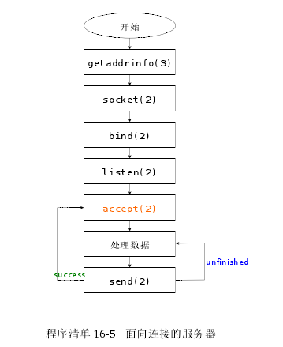

```cpp
#include "apue.h"
#include <errno.h>
#include <netdb.h>
#include <sys/socket.h>
#include <syslog.h>

#define BUFLEN 128
#define QLEN 10

#ifndef HOST_NAME_MAX
#define HOST_NAME_MAX 256
#endif
#include <fcntl.h>
#include <sys/resource.h>
#include <syslog.h>

void daemonize(const char* cmd)
{
    int i, fd0, fd1, fd2;
    pid_t pid;
    struct rlimit rl;
    struct sigaction sa;

    /*
     * Clear file creation mask.
     */
    umask(0);

    /*
     * Get maximum number of file descriptors.
     */
    if (getrlimit(RLIMIT_NOFILE, &rl) < 0)
        err_quit("%s: can't get file limit", cmd);

    /*
     * Become a session leader to lose controlling TTY.
     */
    if ((pid = fork()) < 0)
        err_quit("%s: can't fork", cmd);
    else if (pid != 0) /* parent */
        exit(0);
    setsid();

    /*
     * Ensure future opens won't allocate controlling TTYs.
     */
    sa.sa_handler = SIG_IGN;
    sigemptyset(&sa.sa_mask);
    sa.sa_flags = 0;
    if (sigaction(SIGHUP, &sa, NULL) < 0)
        err_quit("%s: can't ignore SIGHUP", cmd);
    if ((pid = fork()) < 0)
        err_quit("%s: can't fork", cmd);
    else if (pid != 0) /* parent */
        exit(0);

    /*
     * Change the current working directory to the root so
     * we won't prevent file systems from being unmounted.
     */
    if (chdir("/") < 0)
        err_quit("%s: can't change directory to /", cmd);

    /*
     * Close all open file descriptors.
     */
    if (rl.rlim_max == RLIM_INFINITY)
        rl.rlim_max = 1024;
    for (i = 0; i < rl.rlim_max; i++)
        close(i);

    /*
     * Attach file descriptors 0, 1, and 2 to /dev/null.
     */
    fd0 = open("/dev/null", O_RDWR);
    fd1 = dup(0);
    fd2 = dup(0);

    /*
     * Initialize the log file.
     */
    openlog(cmd, LOG_CONS, LOG_DAEMON);
    if (fd0 != 0 || fd1 != 1 || fd2 != 2)
    {
        syslog(LOG_ERR, "unexpected file descriptors %d %d %d", fd0, fd1, fd2);
        exit(1);
    }
}
int initserver(int type, const struct sockaddr* addr, socklen_t alen, int qlen)
{
    int fd;
    int err = 0;

    if ((fd = socket(addr->sa_family, type, 0)) < 0)
        return (-1);
    if (bind(fd, addr, alen) < 0)
    {
        printf("bind error");
        goto errout;
    }
    if (type == SOCK_STREAM || type == SOCK_SEQPACKET)
    {
        if (listen(fd, qlen) < 0)
            goto errout;
    }
    return (fd);

errout:
    err = errno;
    close(fd);
    errno = err;
    printf("err: errno = %d", errno);
    return (-1);
}


void serve(int sockfd)
{
    int clfd;
    FILE* fp;
    char buf[BUFLEN];

    set_cloexec(sockfd);
    for (;;)
    {
        if ((clfd = accept(sockfd, NULL, NULL)) < 0)
        {
            syslog(LOG_ERR, "ruptimed: accept error: %s", strerror(errno));
            exit(1);
        }
        set_cloexec(clfd);
        if ((fp = popen("/usr/bin/uptime", "r")) == NULL)
        {
            sprintf(buf, "error: %s\n", strerror(errno));
            send(clfd, buf, strlen(buf), 0);
        }
        else
        {
            while (fgets(buf, BUFLEN, fp) != NULL)
                send(clfd, buf, strlen(buf), 0);
            pclose(fp);
        }
        close(clfd);
    }
}

int main(int argc, char* argv[])
{
    struct addrinfo *ailist, *aip;
    struct addrinfo hint;
    int sockfd, err, n;
    char* host;

    if (argc != 1)
        err_quit("usage: ruptimed");
    if ((n = sysconf(_SC_HOST_NAME_MAX)) < 0)
        n = HOST_NAME_MAX; /* best guess */
    if ((host = malloc(n)) == NULL)
        err_sys("malloc error");
    if (gethostname(host, n) < 0)
        err_sys("gethostname error");
    daemonize("ruptimed");
    memset(&hint, 0, sizeof(hint));
    hint.ai_flags = AI_CANONNAME;
    hint.ai_socktype = SOCK_STREAM;
    hint.ai_canonname = NULL;
    hint.ai_addr = NULL;
    hint.ai_next = NULL;
    if ((err = getaddrinfo(host, "ruptime", &hint, &ailist)) != 0)
    {
        syslog(LOG_ERR, "ruptimed: getaddrinfo error: %s", gai_strerror(err));
        exit(1);
    }
    for (aip = ailist; aip != NULL; aip = aip->ai_next)
    {
        if ((sockfd = initserver(SOCK_STREAM, aip->ai_addr, aip->ai_addrlen, QLEN)) >= 0)
        {
            serve(sockfd);
            exit(0);
        }
    }
    exit(1);
}
```

>为了找到它的地址，服务器需要获得其运行时的主机名。
>2016/11/11 14:23就是这里，接着上面的问题，当hosts重写，删除：：1之后重启网络服务，在使用127.0.0.1就OK了，应该是IPV6在服务器获得主机名是被首先使用了，删除掉IPV6，127.0.0.1就可以工作了。因为bind绑定时就没有指定，应该就是默认的地址，127.0.0.1这类的。端口同理。

另一个面向链接的服务器:

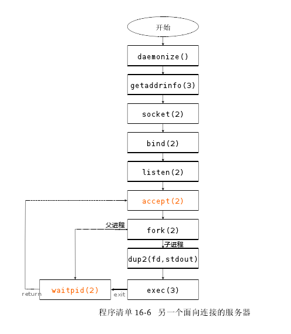

```cpp
#include "apue.h"
#include <errno.h>
#include <fcntl.h>
#include <netdb.h>
#include <sys/socket.h>
#include <sys/wait.h>
#include <syslog.h>
#define QLEN 10
#ifndef HOST_NAME_MAX
#define HOST_NAME_MAX 256
#endif
extern int initserver(int, struct sockaddr*, socklen_t, int);
void serve(int sockfd)
{
    int clfd, status;
    pid_t pid;
    for (;;)
    {
        clfd = accept(sockfd, NULL, NULL);
        if (clfd < 0)
        {
            syslog(LOG_ERR, "ruptimed: accept error: %s", strerror(errno));
            exit(1);
        }
        if ((pid = fork()) < 0)
        {
            syslog(LOG_ERR, "ruptimed: fork error: %s", strerror(errno));
            exit(1);
        }
        else if (pid == 0)
        { /* child */
            /*
             * The parent called daemonize ({Prog daemoninit}), so
             * STDIN_FILENO, STDOUT_FILENO, and STDERR_FILENO
             * are already open to /dev/null.  Thus, the call to
             * close doesn't need to be protected by checks that
             * clfd isn't already equal to one of these values.
             */
            if (dup2(clfd, STDOUT_FILENO) != STDOUT_FILENO || dup2(clfd, STDERR_FILENO) != STDERR_FILENO)
            {
                syslog(LOG_ERR, "ruptimed: unexpected error");
                exit(1);
            }
            close(clfd);
            execl("/usr/bin/uptime", "uptime", (char*)0);
            syslog(LOG_ERR, "ruptimed: unexpected return from exec: %s", strerror(errno));
        }
        else
        { /* parent */
            close(clfd);
            waitpid(pid, &status, 0);
        }
    }
}
int main(int argc, char* argv[])
{
    struct addrinfo *ailist, *aip;
    struct addrinfo hint;
    int sockfd, err, n;
    char* host;
    if (argc != 1)
        err_quit("usage: ruptimed");
#ifdef _SC_HOST_NAME_MAX
    n = sysconf(_SC_HOST_NAME_MAX);
    if (n < 0) /* best guess */
#endif
        n = HOST_NAME_MAX;
    host = malloc(n);
    if (host == NULL)
        err_sys("malloc error");
    if (gethostname(host, n) < 0)
        err_sys("gethostname error");
    daemonize("ruptimed");
    hint.ai_flags = AI_CANONNAME;
    hint.ai_family = 0;
    hint.ai_socktype = SOCK_STREAM;
    hint.ai_protocol = 0;
    hint.ai_addrlen = 0;
    hint.ai_canonname = NULL;
    hint.ai_addr = NULL;
    hint.ai_next = NULL;
    if ((err = getaddrinfo(host, "ruptime", &hint, &ailist)) != 0)
    {
        syslog(LOG_ERR, "ruptimed: getaddrinfo error: %s", gai_strerror(err));
        exit(1);
    }
    for (aip = ailist; aip != NULL; aip = aip->ai_next)
    {
        if ((sockfd = initserver(SOCK_STREAM, aip->ai_addr, aip->ai_addrlen, QLEN)) >= 0)
        {
            serve(sockfd);
            exit(0);
        }
    }
    exit(1);
}
```

服务器没有从 uptime 命令中读取输出并发送到客户端，而是将 uptime 命令的标准输出和标准错误安排成为链接到客户端的套接字端点。
[关于dup与dup2](http://blog.chinaunix.net/uid-2282111-id-2113348.html)

在 server 中因为父进程变成了守护进程。会关闭所有的描述符。这时的 0，1，2 都是指向NULL，所以创建一个子进程，用来重定向输出到客户端的链接套接字上。因此父进程可以安全的关闭连接到客户端的文件描述符，因为子进程会保持其开启。

没有连接的套接字，是无序的，每次传输的数据要一次传输完。而且还容易丢失，有两种选择，面对丢失的情况。
1，对每个数据包进行编号，然后请求重传，并且要求去重。
2，通过用户再次尝试重传。

面向链接的套接字也有缺陷，需要更多的时间和工作来建立一个连接，并且每个连接都需要消耗较多的系统资源。

无连接的客户端程序：

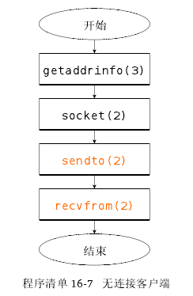

使用alarm函数避免调用recvfrom时的无限期阻塞。

```cpp
#include "apue.h"
#include <errno.h>
#include <netdb.h>
#include <sys/socket.h>

#define BUFLEN 128
#define TIMEOUT 20

void sigalrm(int signo) {}

void print_uptime(int sockfd, struct addrinfo* aip)
{
    int n;
    char buf[BUFLEN];

    buf[0] = 0;
    if (sendto(sockfd, buf, 1, 0, aip->ai_addr, aip->ai_addrlen) < 0)
        err_sys("sendto error");
    alarm(TIMEOUT);
    if ((n = recvfrom(sockfd, buf, BUFLEN, 0, NULL, NULL)) < 0)
    {
        if (errno != EINTR)
            alarm(0);
        err_sys("recv error");
    }
    alarm(0);
    write(STDOUT_FILENO, buf, n);
}

int main(int argc, char* argv[])
{
    struct addrinfo *ailist, *aip;
    struct addrinfo hint;
    int sockfd, err;
    struct sigaction sa;

    if (argc != 2)
        err_quit("usage: ruptime hostname");
    sa.sa_handler = sigalrm;
    sa.sa_flags = 0;
    sigemptyset(&sa.sa_mask);
    if (sigaction(SIGALRM, &sa, NULL) < 0)
        err_sys("sigaction error");
    memset(&hint, 0, sizeof(hint));
    hint.ai_socktype = SOCK_DGRAM;
    hint.ai_canonname = NULL;
    hint.ai_addr = NULL;
    hint.ai_next = NULL;
    if ((err = getaddrinfo(argv[1], "ruptime", &hint, &ailist)) != 0)
        err_quit("getaddrinfo error: %s", gai_strerror(err));

    for (aip = ailist; aip != NULL; aip = aip->ai_next)
    {
        if ((sockfd = socket(aip->ai_family, SOCK_DGRAM, 0)) < 0)
        {
            err = errno;
        }
        else
        {
            print_uptime(sockfd, aip);
            exit(0);
        }
    }

    fprintf(stderr, "can't contact %s: %s\n", argv[1], strerror(err));
    exit(1);
}
```

服务器端程序:

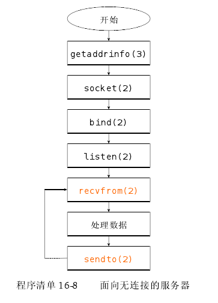

```cpp
#include "apue.h"
#include <errno.h>
#include <netdb.h>
#include <sys/socket.h>
#include <syslog.h>

#define BUFLEN 128
#define MAXADDRLEN 256

#ifndef HOST_NAME_MAX
#define HOST_NAME_MAX 256
#endif

int initserver(int type, const struct sockaddr* addr, socklen_t alen, int qlen)
{
    int fd;
    int err = 0;

    if ((fd = socket(addr->sa_family, type, 0)) < 0)
        return (-1);
    if (bind(fd, addr, alen) < 0)
        goto errout;
    if (type == SOCK_STREAM || type == SOCK_SEQPACKET)
    {
        if (listen(fd, qlen) < 0)
            goto errout;
    }
    return (fd);

errout:
    err = errno;
    close(fd);
    errno = err;
    return (-1);
}

extern void daemonize(const char*);


void serve(int sockfd)
{
    int n;
    socklen_t alen;
    FILE* fp;
    char buf[BUFLEN];
    char abuf[MAXADDRLEN];
    struct sockaddr* addr = (struct sockaddr*)abuf;

    set_cloexec(sockfd);
    for (;;)
    {
        alen = MAXADDRLEN;
        if ((n = recvfrom(sockfd, buf, BUFLEN, 0, addr, &alen)) < 0)
        {
            syslog(LOG_ERR, "ruptimed: recvfrom error: %s", strerror(errno));
            exit(1);
        }
        if ((fp = popen("/usr/bin/uptime", "r")) == NULL)
        {
            sprintf(buf, "error: %s\n", strerror(errno));
            sendto(sockfd, buf, strlen(buf), 0, addr, alen);
        }
        else
        {
            if (fgets(buf, BUFLEN, fp) != NULL)
                sendto(sockfd, buf, strlen(buf), 0, addr, alen);
            pclose(fp);
        }
    }
}

int main(int argc, char* argv[])
{
    struct addrinfo *ailist, *aip;
    struct addrinfo hint;
    int sockfd, err, n;
    char* host;

    if (argc != 1)
        err_quit("usage: ruptimed");
    if ((n = sysconf(_SC_HOST_NAME_MAX)) < 0)
        n = HOST_NAME_MAX; /* best guess */
    if ((host = malloc(n)) == NULL)
        err_sys("malloc error");
    if (gethostname(host, n) < 0)
        err_sys("gethostname error");
    daemonize("ruptimed");
    memset(&hint, 0, sizeof(hint));
    hint.ai_flags = AI_CANONNAME;
    hint.ai_socktype = SOCK_DGRAM;
    hint.ai_canonname = NULL;
    hint.ai_addr = NULL;
    hint.ai_next = NULL;
    if ((err = getaddrinfo(host, "ruptime", &hint, &ailist)) != 0)
    {
        syslog(LOG_ERR, "ruptimed: getaddrinfo error: %s", gai_strerror(err));
        exit(1);
    }
    for (aip = ailist; aip != NULL; aip = aip->ai_next)
    {
        if ((sockfd = initserver(SOCK_DGRAM, aip->ai_addr, aip->ai_addrlen, 0)) >= 0)
        {
            serve(sockfd);
            exit(0);
        }
    }
    exit(1);
}
```

## 套接字选项

- 套接字机制提供了设置跟查询套接字选项的接口。可以获取或设置以下 3 种选项:
  1. 通用选项，工作在所有套接字类型上
  2. 在套接字层次管理的选项，但是依赖于下层协议的支持
  3. 特定于某协议的选项，每个协议独有的

可以使用 setsockopt 函数来设置套接字选项

```cpp
#include <sys/socket.h>
int setsockopt(int sockfd, int level, int option, const void *val, socklen_t len);
//返回值：成功返回0；出错返回-1
```

level 标识了选项应用的协议：
如果选项是通用的套接字层次选项，则 level 设置为 SOL_SOCKET ，否则，level 设置成控制这个选项的协议编号。对于 TCP 选项，level 是 IPPROTO_TCP，对于 IP，level 是 IPPROTO_IP。下面总结了Single UNIX Specification中定义的通用套接字层次选项

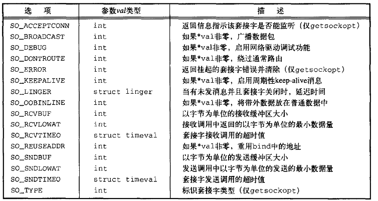

参数 var 根据选项的不同指向一个数据结构或者一个整数。一些选项是 on/off 开关。如果整数非 0，则启用选项，反之禁止。参数 len 指定了 var 指向的对象的大小。

可以使用 getsockopt 函数来查看选项的当前值

```cpp
#include <sys/socket.h> int getsockopt(int sockfd, int level, int option, void *restrict val, socklen_t restrict lenp);
//返回值：成功返回0；出错返回-1
```

参数 lenp 是一个指向整数的指针。在调用 getsockopt 之前，设置该整数为复制选项缓冲区的长度。

当前面的服务器程序重启，并不能立即绑定原先的地址，一般要等到超时，否则 TCP 的实现不允许绑定同一地址。使用这一节的设置函数更改选项行为。

### example_initsrv2

```cpp
#include "apue.h"
#include <errno.h>
#include <sys/socket.h>
int initserver(int type, const struct sockaddr* addr, socklen_t alen, int qlen)
{
    int fd, err;
    int reuse = 1;
    if ((fd = socket(addr->sa_family, type, 0)) < 0)
        return (-1);
    if (setsockopt(fd, SOL_SOCKET, SO_REUSEADDR, &reuse, sizeof(int)) < 0)
    {
        err = errno;
        goto errout;
    }
    if (bind(fd, addr, alen) < 0)
    {
        err = errno;
        goto errout;
    }
    if (type == SOCK_STREAM || type == SOCK_SEQPACKET)
    {
        if (listen(fd, qlen) < 0)
        {
            err = errno;
            goto errout;
        }
    }
    return (fd);
errout:
    close(fd);
    errno = err;
    return (-1);
}
```

## 带外数据

带外数据可能翻译不准确，原文是 out-of-band data，也就是超范围数据，各层会对上层数据封装，比如使用限定字符将数据限定范围，然后前后加上头尾，组成一个封包，某些通信协议支持带外数据，允许其作为更高优先级传输，至于具体内容，可以看原著讲解，因为这小节实际上并不是特别重要。带外数据是一些通信协议所支持的可选特征，允许更加高级的数据比普通数据优先传输。TCP将带外数据称为紧急数据。 TCP 仅支持一个字节的紧急数据，但是允许紧急数据在普通数据传递机制数据流之外传输。为了产生紧急数据，在三个 send 函数中任何一个指定标志 MSG_OOB。如果带 MSG_OOB 标志传输字节超过一个时，最后一个字节被作为紧急数据字节。

如果安排发生套接字信号，当接收到紧急数据时，那么发送信号 SIGURG 信号。可以通过调用以下函数安排进程接收套接字的信号：

`fcntl(sockfd,F_SETTOWN,pid);`

F_GETOWN命令可以用来获取当前套接字所有权

`owner=fcntl(sockfd,F_GETOWN,0);`

将返回 owner，如果值为正，则等于配置为接受套接字信号的进程的 ID。返回负值，其绝对值为接受套接字信号的进程组的ID。

TCP 支持紧急标记，在普通的数据流中紧急数据所在的位置。如果采用套接字 SO_OOBINLINE，那么可以在普通数据中接受紧急数据。为帮助判断是否已经达到紧急标记，可以使用函数 sockatmark

`#include <sys/socket.h> int sockatmark(int sockfd);`

当下一个要读取的字节在紧急标志处时，sockatmark 返回 1。当有带外数据出现时，select 函数会返回一个文件描述符并且有一个待处理的异常。可以在普通数据流中接受，也可以在其中一个 recv 函数中采用 MSG_OOB 标志在其它队列之前接受到紧急数据流。

## 非阻塞和异步IO

recv 在没有数据可用的情况下会阻塞等待，而套接字没有足够空间发送的情况下 send 也会阻塞等待。如果在套接字创建的时候指定非阻塞，行为就会改变。这样函数就不会阻塞而是会直接返回失败，并且设置errno。我们也知道，套接字描述符和文件描述符基本可以等价，那么我们是不是可以使用 select 和 poll 这种函数来判断文件描述符是否已经准备完毕。
在基于套接字异步 I/O 中，当能够从套接字中读取数据，或者套接字写队列中的空间变得可用时，可以安排发送信号 SIGIO。通过两个步骤来使用异步 I/O：
1） 建立套接字拥有者关系，信号可以被传送到合适的进程。
2） 通知套接字当 I/O 操作不会阻塞时发信号告知。

- 可以使用三种方式来完成第一个步骤：
  1. 在 fcntl 使用 F_SETOWN 命令
  2. 在 ioctl 中作用 FIOSETOWN 命令
  3. 在 ioctl 中使用 SIOCSPGRP 命令。

要完成第二个步骤，有两个选择：
A、 在 fcntl 中使用 F_SETFL 命令并且启用文件标志 O_ASYNC。
B、 在 ioctl 中使用 FIOASYNC。
