# 文件 I/O

- [文件 I/O](#文件-io)
  - [前言](#前言)
  - [文件描述符](#文件描述符)
  - [open 函数](#open-函数)
    - [example_openat](#example_openat)
  - [creat 函数原型](#creat-函数原型)
  - [close 函数原型](#close-函数原型)
  - [lseek 函数原型](#lseek-函数原型)
    - [example_hole](#example_hole)
  - [read 函数原型](#read-函数原型)
  - [write 函数原型](#write-函数原型)
  - [文件共享](#文件共享)
  - [原子操作：最小单位的操作](#原子操作最小单位的操作)
  - [dup 和 dup2 函数原型](#dup-和-dup2-函数原型)
    - [example_dup](#example_dup)
  - [sync、fsync 和 fdatasync 函数原型](#syncfsync-和-fdatasync-函数原型)
  - [fcntl 函数原型](#fcntl-函数原型)
    - [example_fileflags](#example_fileflags)
    - [example_setfl](#example_setfl)
  - [ioctl 函数原型](#ioctl-函数原型)
  - [/dev/fd](#devfd)

> 注意：文章中使用到的源码都在我的 github 中找到，传送门：[SourceCode](https://github.com/HATTER-LONG/SourceCodeByAPUE3e)

## 前言

- 本章主要讲解了文件 I/O 操作的一些函数--打开文件、读文件、写文件等等。讲解了大多数 Unix 文件 I/O 操作主要需要五个函数：open、read、write、lseek 以及 close。而这些函数都是`不带缓冲 I/O (Unbuffer I/O)`，不带缓冲指的是每个 read 或者 write 都会调用一个内核中的系统调用。其次讲解了多进程间的数据共享和原子操作。
  - 不带缓冲 I/O 操作与带有缓冲 I/O 操作的区别：
    - 内核存储缓冲区：以 write 与 fwrite 为例，前者为不带缓冲 I/O ，而后者则带有缓冲。首先要明确一个概念就是当我们向文件写入数据时无论调用这两个哪个接口最终都会将数据写到 Unix 系统在内核中设定的一个缓冲存储器，只有到这个缓冲存储器满了或者内核需要对其刷新时，才会真正的把数据排入输出队列写到文件中去。
    - 假设内核缓存时 100 个字节，调用 write 每次写 10 个字节，当写第 10 次时，才会导致内核缓存区满从而将数据写到硬盘中，而在这个过程中相当于足足调用了 9 次系统调用却没有达到实质的效果，反而增加了用户态与内核态切换的开销。而带有缓冲 I/O 操作的 fwrite 会维护一个处于用户态的缓冲区，它会优化调用系统接口的频率，减少多余开销。

## 文件描述符

- **文件表述符主要通过 open() 或者 creat() 函数返回**。注意这个 creat 没有 e，主要还是 Unix 历史原因，感兴趣的可以去百度下。

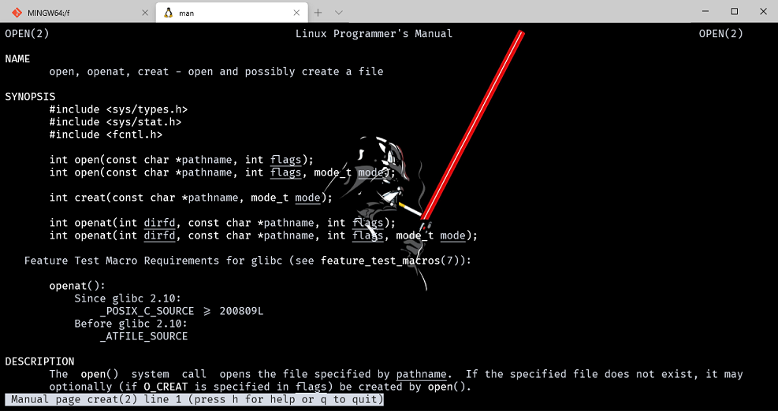

对于内核来说，想要使用 read、write 等对文件的操作必须通过文件描述符，它是一个非负整数，每个程序都有一个自己的文件描述符表，从 0 开始每次 +1，一般每个进程对会有 shell 默认的 0，1，2 三个文件描述符，分别是标准输入、标准输出、标准错误输出。当进程再通过 open 函数打开文件返回的文件描述符就是 3。

一般魔数 0、1、2 都应该使用宏定义 `STDIN_FILENO`、`STDOUT_FILENO` 和 `STDERR_FILENO`。这些宏定义在头文件 <unistd.h> 中。

```cpp
/* Standard file descriptors.  */
#define STDIN_FILENO    0   /* Standard input.  */
#define STDOUT_FILENO   1   /* Standard output.  */
#define STDERR_FILENO   2   /* Standard error output.  */
```

- 有一个问题，当进程同时打开同一个文件两次会发生什么？
  - 答案就是你会得到两个文件描述符，因此在使用完成时要注意分别对两个文件描述符 close()，更有意思的是，这两个文件描述符的 seek 都是不同的，详情可以参考这篇[BLOG](https://www.cnblogs.com/stephen-init/archive/2012/08/29/2661555.html)，有一点需要注意的是，当你在父进程打开一个文件后，fork 出来的子进程由于是将父进程所有资源都复制的所以也包含这个文件描述符，注意关闭。

## open 函数

```cpp
#include <fcntl.h>
int open(const char *pathname,int flags,.../*, mode_tmode*/) ;
int openat(int dirfd, const char *pathname, int flags,.../*, mode_tmode*/);
//返回：若成功为文件描述符，若出错为- 1
```

> openat 函数的目的是加强路径的选择，可以使用相对路径来进行操作。

### example_openat

首先通过 open 上一级目录文件，然后将目录文件描述符传递给 openat 并创建一个 stderr.out 文件写入数据。同时再用 openat 再次打开文件观察文件描述符增长规律。

```cpp
#include <fcntl.h>
#include <stdio.h>
#include <stdlib.h>
#include <sys/stat.h>
#include <unistd.h>


int main()
{

    char* dir_path = "./..";
    char* relative_path = "stderr.out";
    char buf[20] = {"0"};
    int dir_fd;
    int fd;
    int flags;
    int fd1;
    mode_t mode;

    dir_fd = open(dir_path, O_RDONLY);
    if (dir_fd < 0)
    {
        perror("open");
        exit(EXIT_FAILURE);
    }

    flags = O_CREAT | O_RDWR;
    mode = 0777;
    fd = openat(dir_fd, relative_path, flags, mode);
    if (fd < 0)
    {
        perror("openat");
        exit(EXIT_FAILURE);
    }

    if (write(fd, "HELLO", 5) != 5)
        printf("write error!!\n");

    fd1 = openat(dir_fd, relative_path, O_RDWR, mode);
    lseek(fd, 0, SEEK_SET);

    printf("fd=%d\tfd1=%d\n", fd, fd1);
    if (read(fd, buf, sizeof(buf)) != 5)
        printf("read error!!\n");
    printf("%s\n", buf);
    close(fd);
    close(dir_fd);
    return 0;
}
```

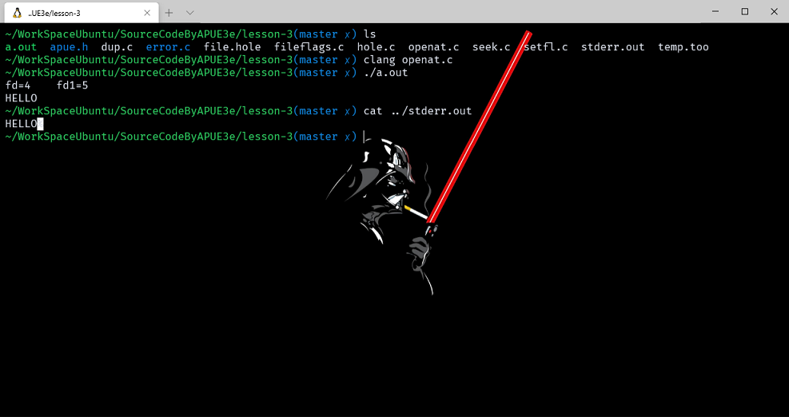

## creat 函数原型

与 open 函数使用 O_CREAT|O_WRONLY|O_TRUNC 标志位类似，创建一个文件并返回新创建的文件描述符。

```cpp
#include <fcntl.h>
int creat(const char * pathname, mode_tmode) ;
        //返回：若成功为只写打开的文件描述符，若出错为- 1
        //注意，此函数等效于：
open(pathname, O_WRONLY ｜O_CREAT｜O_TRUNC,mode) ;
```

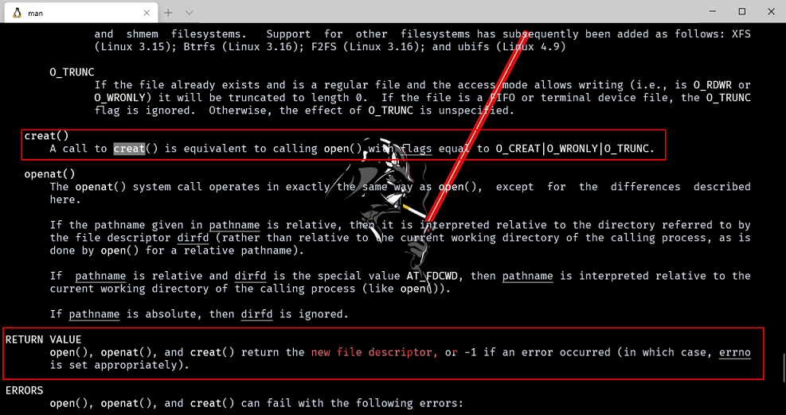

## close 函数原型

使用 close 函数关闭一个打开的文件，关闭一个文件时也释放该进程加在该文件上的所有记录锁，一个进程终止时，内核自动关闭他所有的打开文件。

```cpp
#include <unistd.h>
int close (int filedes);
```

## lseek 函数原型

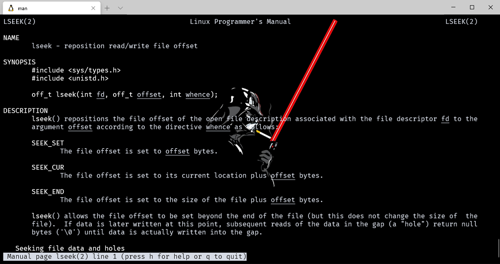

每个打开文件都有一个与其相关联的**当前文件位移量**。它是一个非负整数，用以度量从文件开始处计算的字节数。通常，读、写操作都从当前文件位移量处开始，并使位移量增加所读或写的字节数。按系统默认，当打开一个文件时，除非指定 O_APPEND 选择项，否则该位移量被设置为 0。

- 注意当写完一个文件，没有重新打开，就需要使用 lseek 将位移量移动回想要读的位置才可以。就像 openat 的示范程序。如果关闭文件后示范如下。

```cpp
#include <stdio.h>  
#include <sys/stat.h>  
#include <fcntl.h>  
#include <stdlib.h>  
#include <unistd.h>  
  
int main()  
{  
    char *dir_path = "./..";
    char *relative_path = "stderr.out";
    char buf[20] = {"0"};
    int dir_fd;  
    int fd;  
    int flags;  
    mode_t mode;  
  
    dir_fd = open(dir_path, O_RDONLY);  
    if (dir_fd < 0)
    {  
        perror("open");  
        exit(EXIT_FAILURE);  
    }  
  
    flags = O_CREAT | O_RDWR;  
    mode = 0777;  
    fd = openat(dir_fd, relative_path, flags, mode);  
    if (fd < 0)
    {  
        perror("openat");  
        exit(EXIT_FAILURE);  
    }  
  
    if(write(fd, "HELLO", 5) != 5)
        printf("write error!!\n");
//  lseek(fd, 0, SEEK_SET);  //这里关闭文件，不在需要 lseek 重新定位
    close(fd);
    fd = openat(dir_fd, relative_path, flags, mode);  
    if(read(fd , buf, sizeof(buf)) != 5)
        printf("read error!!\n");
    printf("%s\n",buf);
    close(fd);  
    close(dir_fd);  
    return 0;  
}  
```

若 lseek 成功执行后，会返回新的文件位移量，因此可以用下列的方式来确定一个打开文件的当前位移量：

```cpp
off_t currpos;
currpos = lseek(fd, 0, SEEK_CUR);
```

- 这种方法也可用来确定所涉及的文件是否可以设置位移量。如果文件描述符引用的是一个管道或 FIFO，则 lseek 返回 －1，并将 errno 设置为 EPIPE。注意因为偏移量在某些设备上可以负偏移，在判断返回值时不能 < 0，应该为 == -1 。

### example_hole

lseek 仅将当前的文件位移量记录在内核内，它并不引起任何 I/O 操作，该位移量用于下一个读或写操作。文件位移量可以大于文件的当前长度，在这种情况下，对该文件的下一次写将延长该文件，并在文件中构成一个空洞，这一点是允许的。位于文件中但没有写过的字节都被读为 0。文件中的空洞不占用磁盘，但当写入数据超过源文件的尾端，则对于新写入的数据需要分配内存，但是原尾端与新数据之间的的 0 不需要分配磁盘。

```cpp
#include "apue.h"
#include <fcntl.h>

char buf1[] = "abcdefghij";
char buf2[] = "ABCDEFGHIJ";

int main(void)
{
    int fd;

    int byte;
    if ((fd = creat("file.hole", FILE_MODE)) < 0)
        err_sys("creat error");

    if ((byte = write(fd, buf1, 10)) && byte != 10)
        err_sys("buf1 write error");
    /* offset now = 10 */

    printf("byte = %d\n", byte);
    if (lseek(fd, 16384, SEEK_SET) == -1)
        err_sys("lseek error");
    /* offset now = 16384 */

    if (write(fd, buf2, 10) != 10)
        err_sys("buf2 write error");
    /* offset now = 16394 */

    //printf("buf1 = %s , buf2 = %s\n");
    exit(0);
}
```

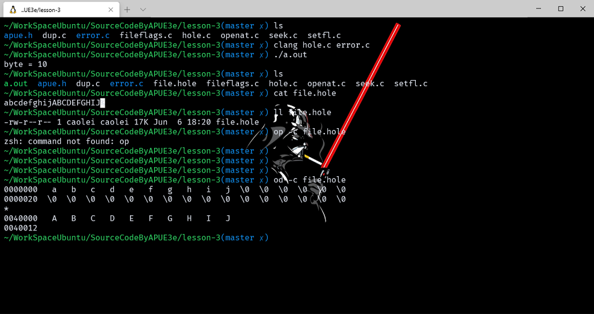

od -c 文件 可以查看文件的实际内容。

## read 函数原型

使用 read 函数从打开文件中读取数据。

```cpp
#include <unistd.h>
ssize_t read(int filedes, void * buff, size_t  nbytes) ;
//返回：读到的字节数，若已到文件尾为 0，若出错为- 1
```

- 有多种情况可使实际读到的字节数少于要求读取的字节数：
  1. 读普通文件时，再读到要求字节数之前已到达了文件尾端。
  2. 当从终端设备读时，通常一次最多读一行。
  3. 当从网络读时，网络中的缓冲机构可能造成返回值小于所要求读的字节数。
  4. 某些面向记录的设备，例如磁带、一次最多返回一个记录。

## write 函数原型

用 write 函数向打开文件写数据。

```cpp
#include <unistd.h>
ssize_t write(int fd, const void *buf, size_t count);;
//返回：若成功为已写的字节数，若出错为- 1
```

其返回值通常与参数 count 的值相同，否则表示出错。write 出错的一个常见原因是：磁盘已写满，或者超过了对一个给定进程的文件长度限制 (见7 . 11节及习题10.11)。对于普通文件，写操作从文件的当前位移量处开始。如果在打开该文件时，指定了 O_APPEND 选择项，则在每次写操作之前，将文件位移量设置在文件的当前结尾处。在一次成功写之后，该文件位移量增加实际写的字节数。

## 文件共享

`Unix 系统支持在不同进程间共享打开的文件。`

- 文件描述符的本质就是一个指向内核中用来描述打开文件的结构，在进程和内核中一共有三个数据结构为了完成这项任务：
  1. 进程中有一个进程表，其中有一个记录项包含着一张打开文件描述符表，这个文件描述符需要干的事情就是指向一个**文件表项**的指针。
  2. 内核中会有一张文件表，包含着：
     1. 文件状态标志（读、写、增写、同步、非阻塞等）。
     2. 当前文件位移量。
     3. 指向该文件 v 节点表项的指针。
  3. 每个打开文件（或设备）都有一个`V节点`结构。V 节点包含了**文件类型**和对此文件进行**各种操作的函数和指针信息**。这些信息是在打开文件时从盘上读入内存的，所以所有关于文件的信息都是快速可供使用的。

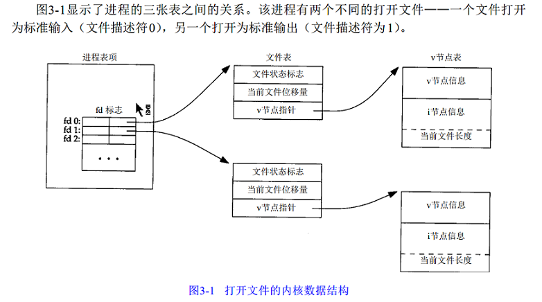

当两个独立进程打开统一文件：

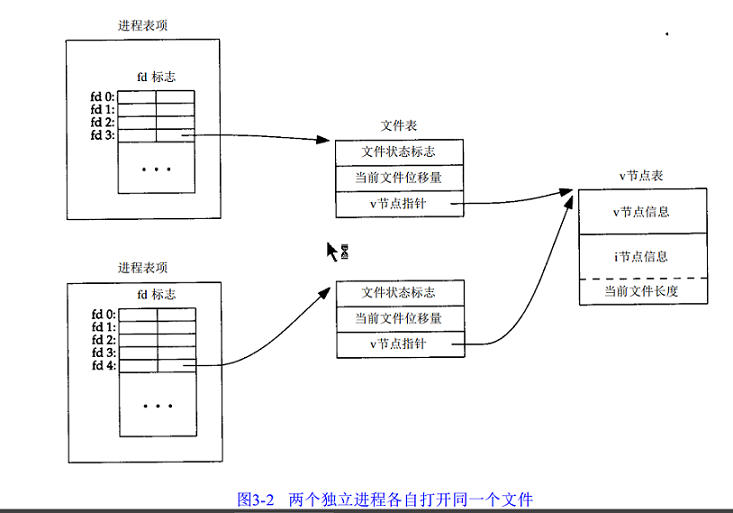

- 打开此文件的**每个进程都得到一个文件表项**，但对一个给定的文件只有一个 v 节点表项。
- 每个进程都有自己的文件表项的一个理由是：这种安排使每个进程都有它自己的对该文件的当前位移量。
  - **write 操作写入同时会同步 i 节点中文件偏移量到当前写到的位置上**，如果写的数据超过了文件原本的大小，则 i 节点中文件长度项的值也会改变。O_APPEND 标志的功能也就是如此实现的，就是将这些信息设置道文件表项中来实现，但是注意一点就是这个文件标志位会实时的更新文件表项，每次写操作开始时就会重新更新文件表项来完成偏移。
- 文件描述符标志和文件状态标志，一个是作用于进程中的文件描述符，一个是内核中对应的文件表项中。

## 原子操作：最小单位的操作

1. 将多个分开的操作用一个最小单位的操作实现，要么一步都不执行，执行的话必然会完成多步操作，执行期间不存在其他窗口期。
    - 例如：写文件操作，当我们 lseek 更改了偏移量到尾端准备写，但是这时有其他的进程（线程）恰巧对该文件进行了写操作，导致之后的写覆盖了之前的数据（时间轮片在多个进程（线程）之间快速切换，无法预判当前 cpu 在执行哪个进程操作）。
    - unix 系统提供的原子操作办法，及再打开文件时设置了 O_APPEND 标志，这样内核在每次写操作时都会自动的同步进程的当前文件偏移量到该文件的末尾不需要 lseek 了。或者用一种函数，可以先指定偏移量然后进行写操作，操作完成后偏移地址不改变。
    - 或者使用一种函数，可以先制定偏移量然后进行写操作，**操作完成后偏移地址不改变**。
  
    ```cpp
    #include <unistd.h>
    ssize_t  pread(int  fd , void  *buf , size_t  nbytes ,  off_t  offset)
    //返回值：读到的字节数，若已到文件尾，返回0 ， 若出错，返回-1.
    ssize_t  pwrite(int  fd , const void *buf ,size_t   nbytes , iff_t  offset)
    //返回值：若成功，返回已写的字节数，若出错，返回-1
    ```

2. 创建一个文件，对 open 函数中当同时指定这两个选择项 O_CREAT 和 O_EXCL，而该文件又已经存在时，open 将失败。这也是一种原子操作。

## dup 和 dup2 函数原型

这两个函数可用来复制一个现存的文件描述符：

```cpp
#include <unistd.h>
int dup(int  filedes);
int dup2(int filedes, int   filedes2);
//两函数的返回：若成功为新的文件描述符，若出错为- 1
```

- 它们经常用来重定向进程的 stdin、stdout 和 stderr。利用函数 dup，我们可以复制一个描述符。传给该函数一个既有的描述符，它就会返回一个新的描述符，这个新的描述符是传给它的描述符的拷贝。这意味着，这两个描述符共享同一个数据结构。例如，如果我们对一个文件描述符执行 lseek 操作，得到的第一个文件的位置和第二个是一样的。
- 对于 dup2，可以用 fd2 参数指定新的文件描述符值，如果 fd2 已经打开就先将它关闭。

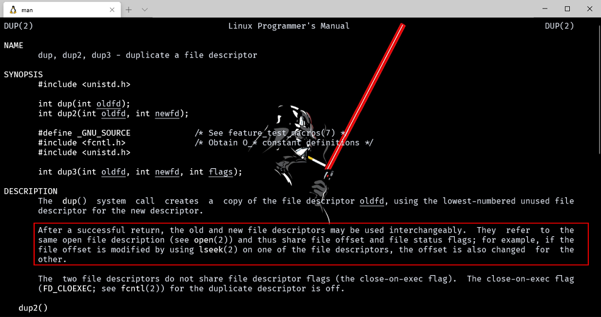

### example_dup

调用 dup2 函数，参数为 oldfd 和 STDOUT_FILENO，这会导致用我们新打开的文件描述符替换掉标准输出描述符。

```cpp
#include "apue.h"
#include <fcntl.h>

int main(void)
{
    int oldfd;
    oldfd = open("app_log", O_RDWR | O_CREAT, 0644);
    dup2(oldfd, STDOUT_FILENO);
    close(oldfd);
    printf("oldfd = %d\n", oldfd);
    return 0;
}
```

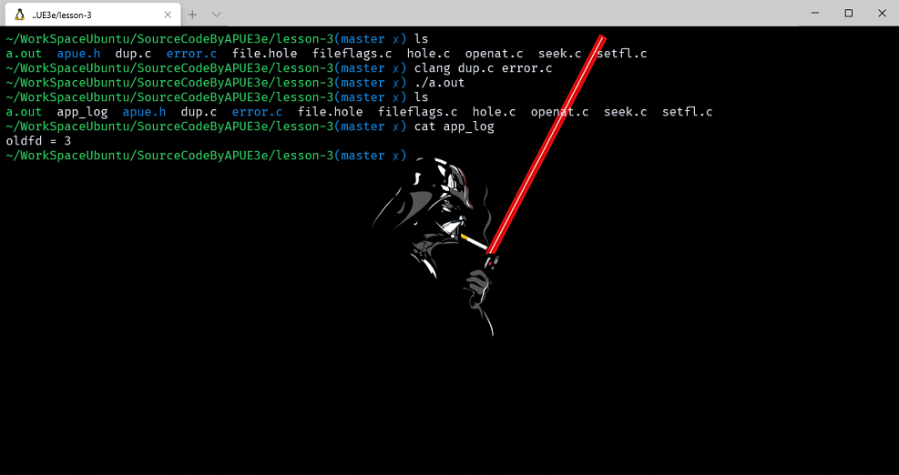

## sync、fsync 和 fdatasync 函数原型

前面介绍过 Unix 缓冲区的概念，主要确保磁盘读写性能的速度与稳定性。大多数情况下我们都使用带有缓冲的 I/O 函数，但是某些情况需要立刻将缓冲区内数据写入到磁盘，Unix 系统提供了 sync、fsync 和 fdatasync 三个函数，但是在 FreeBSD 系 Unix 实现不包含 fdatasync 函数。

```cpp
#include <unistd.h>
void sync(void);
int fsync(int fd);
int fdatasync(int fd);
```

1. sync 只是将所有修改过的块的缓存排入写队列，然后就返回，它并不等待实际 I/O 操作结束。
2. 函数 fsync 只引用单个文件(由文件描述符 fd 指定)，它等待 I/O 结束，然后返回。fsync 可用于数据库这样的应用程序，它确保修改过的块立即写到磁盘上。
3. fdatasync 和 fsync 类似，但是只操作文件的数据部分，而 fsync 还会同步更新文件属性。

## fcntl 函数原型

fcntl 函数可以改变已经打开文件的性质。

```cpp
#include <sys/types.h>
#include <unistd.h>
#include <fcntl.h>
int fcntl(int   filedes, int  cmd,.../* intarg * / ) ;
        //返回：若成功则依赖于 cmd(见下)，若出错为- 1
```

- fcntl函数有五种功能：
  1. 复制一个现存的描述符（ cmd＝F_DUPFD）。
  2. 获得/设置文件描述符标记（ cmd = F_GETFD或F_SETFD）。
  3. 获得/设置文件状态标志（ cmd =F_GETFL或F_SETFL）。
  4. 获得/设置异步I / O有权（cmd = F_GEOWN或F_SEOWN）。
  5. 获得/设置记录锁（ cmd =F_GETLK , F_SETLK或F_SETLKW）。

### example_fileflags

使用 fcntl 获取目标文件的权限状态。

```cpp
#include "apue.h"
#include <fcntl.h>

int main(int argc, char* argv[])
{
    int val;

    if (argc != 2)
        err_quit("usage: a.out <descriptor#>");

    if ((val = fcntl(atoi(argv[1]), F_GETFL, 0)) < 0)
        err_sys("fcntl error for fd %d", atoi(argv[1]));

    switch (val & O_ACCMODE)
    {
    case O_RDONLY:
        printf("read only");
        break;

    case O_WRONLY:
        printf("write only");
        break;

    case O_RDWR:
        printf("read write");
        break;

    default:
        err_dump("unknown access mode");
    }

    if (val & O_APPEND)
        printf(", append");
    if (val & O_NONBLOCK)
        printf(", nonblocking");
    if (val & O_SYNC)
        printf(", synchronous writes");
#if !defined(_POSIX_C_SOURCE) && defined(O_FSYNC) && (O_FSYNC != O_SYNC)
    if (val & O_FSYNC)
        printf(", synchronous writes");
#endif

    putchar('\n');
    exit(0);
}
```

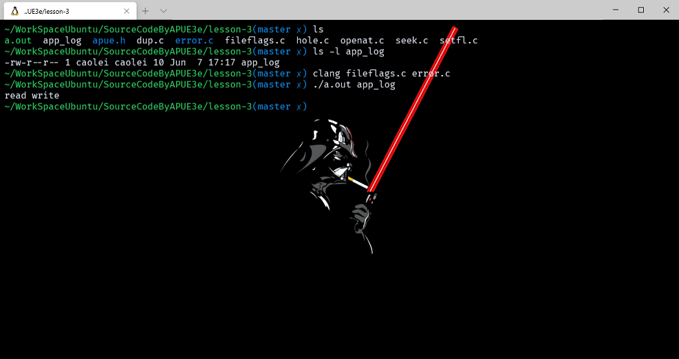

### example_setfl

在修改文件描述符标志或文件状态标志时必须谨慎，先要取得现在的标志值，然后按照希望修改它，最后设置新标志值。不能只是执行 F_SETFD 或 F_SETFL 命令，这样会关闭以前设置的标志位。

```cpp
#include "apue.h"
#include <fcntl.h>

void set_fl(int fd, int flags)
{
    int val;

    if ((val = fcntl(fd, F_GETFL, 0)) < 0)
        err_sys("fcntl F_GETFL error");

    val |= flags;

    if (fcntl(fd, F_SETFL, val) < 0)
        err_sys("fcntl F_SETFL error");
}

int main(void)
{
    const int BUFFSIZE = 8192;

    int n;
    char buf[BUFFSIZE];

    set_fl(STDOUT_FILENO, O_SYNC); // 开启同步写标志

    while ((n = read(STDIN_FILENO, buf, BUFFSIZE)) > 0)
    {
        if (write(STDOUT_FILENO, buf, n) != n)
        {
            err_sys("write error");
        }
    }

    if (n < 0)
        err_sys("read error");

    exit(0);
}
```

这就造成每次 write 都要等待，直至数据已写到磁盘上再返回。在 UNIX 中，通常 write 只是将数据排入队列，而实际的 I/O 操作则可能在以后的某个时刻进行。数据库系统很可能需要使用 O_SYNC，这样一来，在系统崩溃情况下，它从 write 返回时就知道数据已确实写到了磁盘上。

## ioctl 函数原型

ioctl 函数是 I/O 操作的工具箱。

```cpp
#include <unistd.h> /* System V */
#include <sys/ioctl.h> /* Linux+BSD * /
    int ioctl(int filedes, int  request, . . . ) ;
//返回：若出错则为- 1，若成功则为其他值
```

在 Unix 手册中，ioctl 函数被用于一些底层设备参数的设置和获取，ioctl 函数可以控制一些特殊字符设备文件。但是实际上 I/O 操作不能杂类都是归给这个函数，正如说明文件中说的，终端可能是使用这个函数最多的地方，但是随着标准推进，更多的终端操作函数被提出来用于替代 ioctl，实际上很少用到这个函数。

## /dev/fd

在大多数的 Unix 实现中，都提供了 /dev/fd 文件夹，里面有若干个文件，打开这些文件，等同于复制文件描述符，实际上由于 Linux 系统和 Unix 系统很多不同的实现，在操作这个设备文件的时候需要非常小心，在实际开发中我们有更好的方式来复制文件描述符，正如原著所说，/dev/fd 文件夹更多的被使用在 shell 脚本中。

某些系统提供路径名 /dev/stdin，/dev/stdout 和 /dev/stderr。这些等效于 /dev/fd/0，/dev/fd/1 和 /dev/fd/2。/dev/fd 文件主要由 shell 使用，这允许程序以对待其他路径名一样的方式使用路径名参数来处理标准输入和标准输出。

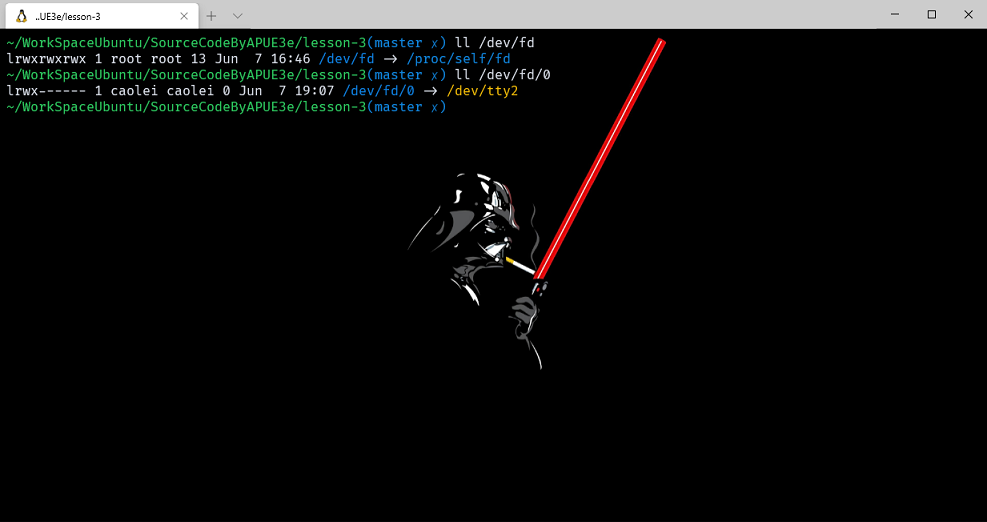

正如图中所示，/dev/fd 一般是对应当前执行进程的 /proc/self/fd 资源。
