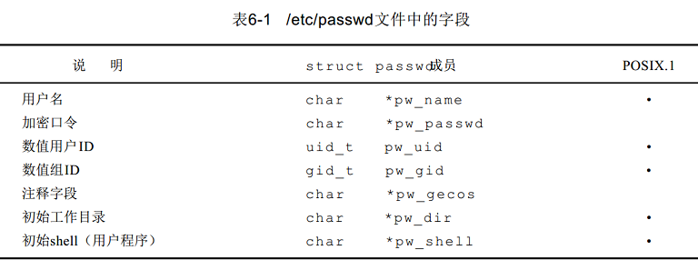
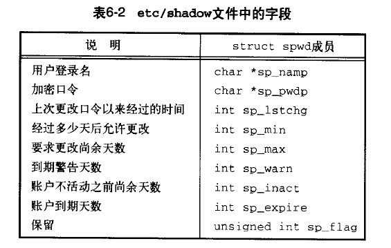
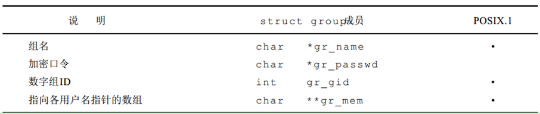
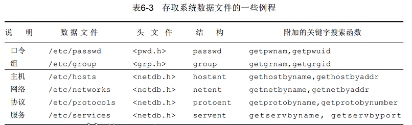
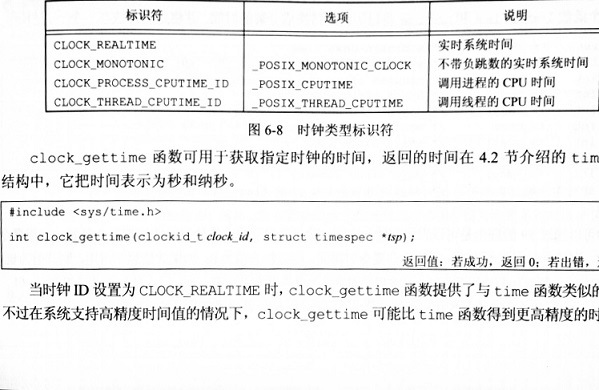
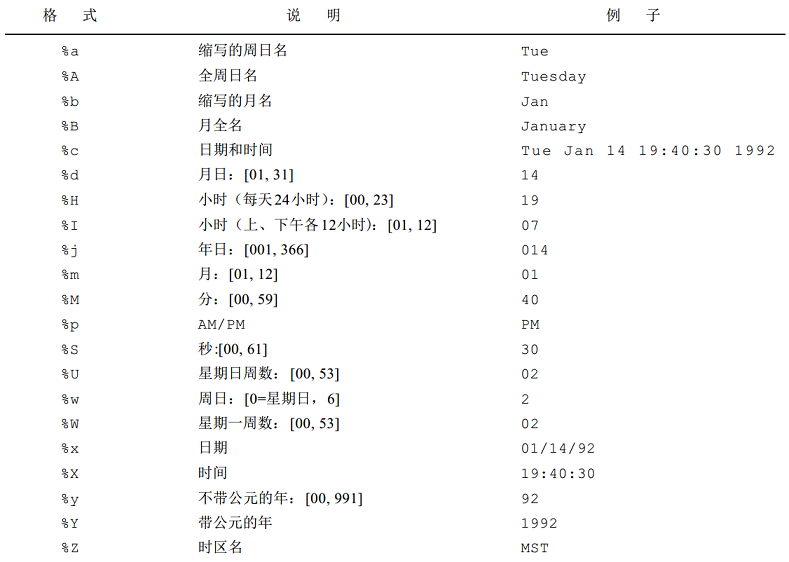
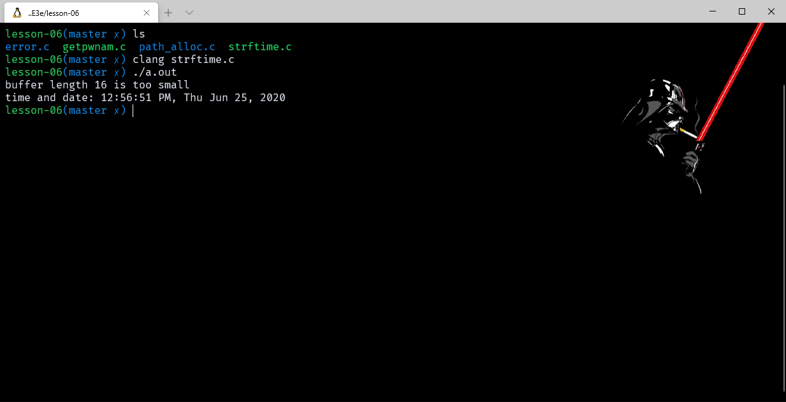

# 系统数据文件和信息

- [系统数据文件和信息](#系统数据文件和信息)
  - [前言](#前言)
  - [口令文件](#口令文件)
    - [example_getpwnam](#example_getpwnam)
  - [阴影口令](#阴影口令)
  - [组文件](#组文件)
  - [附属组 ID](#附属组-id)
  - [其他数据文件](#其他数据文件)
  - [登陆账户记录](#登陆账户记录)
  - [系统标识](#系统标识)
  - [时间和日期例程](#时间和日期例程)
    - [example_time](#example_time)

> 注意：文章中使用到的源码都在我的 github 中找到，传送门：[SourceCode](https://github.com/HATTER-LONG/SourceCodeByAPUE3e)

## 前言

Unix 系统的正常运行需要使用大量与系统有关的数据文件，并向应用程序提供了处理相关文件的接口，本章主要介绍操作这些文件的接口以及系统标识函数、时间和日期函数。

## 口令文件

UNIX 口令文件 (POSIX . 1则将其称为用户数据库) 包含了表 6-1 中所示的各字段，这些字段包含在 <pwd.h> 中定义的 passwd 结构中。



POSIX.1 只定义了两个存取口令文件中信息的函数。在给出用户登录名或数值用户 ID 后，这两个函数就能查看相关记录:

```cpp
#include <pwd.h>
struct passwd *getpwuid(uid_t uid);
struct passwd *getpwnam(const char *login);
```

这两个函数都返回一个指向 passwd 结构的指针，该结构已由这两个函数在执行时填入了所需的信息，通常是在相关函数内的静态变量，只要调用相关函数其内容就会被重写。如果要查看的只是一个登录名或用户 ID，那么这两个 POSIX.1 函数能满足要求，但是也有些程序要查看整个口令文件。下列三个函数则可用于此。

```cpp
#include <sys/types.h>
#include <pwd.h>
struct passwd *getpwent(void);
        //返回：若成功则为指针，若出错或到达文件尾端则为NULL
void setpwent(void);
void endpwent(void);
```

- 调用 getpwent 时，它返回口令文件中的下一个记录。如同上面所述的两个 POSIX.1 函数一样，它返回一个由它填写好的 password 结构的指针。每次调用此函数时都重写该结构。在第一次调用该函数时，它打开它所使用的各个文件。在使用本函数时，对口令文件中各个记录安排的顺序并无要求。
- 函数 setpwent 读写地址指回密码文件开头
- endpwent 则关闭这些文件。在使用 getpwent 查看完口令文件后，一定要调用 endpwent 关闭这些文件。 getpwent 知道什么时间它应当打开它所使用的文件 (第一次被调用时)，但是它并不能知道何时关闭这些文件。

### example_getpwnam

```cpp
#include <pwd.h>
#include <stddef.h>
#include <string.h>

struct passswd* mygetpwnam(const char* name)
{
    struct passwd* ptr;

    setpwent();//避免之前有已经打开的相关文件，先反绕到文件开始处
    while ((ptr = getpwent()) != NULL)
        if (strcmp(name, ptr->pw_name) == 0)
            break; /* found a match */
    endpwent();
    return (ptr); /* ptr is NULL if no match found */
}
```

## 阴影口令

加密口令是经单向加密算法处理过的口令副本，为使企图这样做的人难以获得原始资料 (加密口令)，某些系统将加密口令存放在另一个通常称为阴影口令 (shadow password) 的文件中。



阴影口令文件不应是一般用户可以读取的，仅有少数几个程序需要存取加密口令，有了阴影口令后，普通口令文件 /etc/passwd 可由各用户自由访问。

与访问口令文件的函数组类似的有用于访问阴影口令文件的函数组:

```cpp
#include <shadow.h>

struct spwd* getspnam(const char* name);
struct spwd* getspent(void);
    //函数返回值：若成功返回指针，出错返回 NULL

void setspent(void);
void endspent(void);
```

## 组文件

UNIX 组文件 (POSIX.1 称其为组数据库) 包含了下表中所示字段。这些字段包含在 <grp.h> 中所定义的 group 结构中。



```cpp
#include <sys/types.h>
#include <grp.h>
struct group *getgrgid(gid_t   gid) ;
struct group *getgrnam(const char *  name) ;
//两个函数返回：若成功则为指针，若出错则为 NULL

//用法和对口令操作是一样的。想搜索整个组文件函数如下
structgroup *getgrent(void);
            //若成功，返回指针，若出错，返回NULL
voidsetgrent(void);
voidendgrent(void);
```

## 附属组 ID

在早期 Unix 系统实现中，是不存在附属组的。直到后来 BSD 的一个版本引入了附属组 ID 的概念，这样在权限检查的时候也需要检查附属组 ID 的权限，使用添加组 ID 的优点是不必再显式地经常更改组。一个用户常常会参加多个项目，因此也就要同时属于多个组。

```cpp
#include <sys/types.h>
#include <unistd.h>
int getgroups(int  gidsetsize, gid_t  grouplist[ ] ) ;
        //返回：若成功则为添加的组 I D数，若出错则为-1
int setgroups(int   ngoups, const gid_t  grouplist[ ] ) ;
int initgroups(const char *   username, gid_t    basegid) ;
        //两个函数返回：若成功则为 0，若出错则为-1
```

- getgroups 函数将进程所属用户的附属组 ID 放入 grouplist 参数中，groupsize 参数用于确定放入的大小，但是实际上，我们可以将 groupsize 设置为 0，然后函数会返回实际的附属组个数，然后就可以很方便的分配 grouplist 数组，用不着去猜测究竟应该分配多少。
- setgroups 是一个 root 权限操作，用于为进程设置附属组 ID。
- initgroups 是一系列操作的集合，实际上用到的机会极少，如果有需要的朋友可以自行观看系统手册。

## 其他数据文件

- 一般情况下每个数据文件至少有三个函数：
  1. get 函数：读下一个记录，如果需要还打开该文件。此种函数通常返回指向一个结构的指针。当已达到文件尾端时返回空指针。大多数 get 函数返回指向一个静态存储类结构的指针，如果要保存其内容，则需复制它。
  2. set 函数：打开相应数据文件 (如果尚末打开 )，然后反绕该文件。如果希望在相应文件起始处开始处理，则调用此函数。
  3. end 函数：关闭相应数据文件。正如前述，在结束了对相应数据文件的读、写操作后，总应调用此函数以关闭所有相关文件。



## 登陆账户记录

在实际的运维中，经常会需要查看用户的登录日志，所以系统也有相关的数据文件和接口函数用于开发使用。大多数 UNIX 系统都提供下列两个数据文件： utmp 文件，它记录当前登录进系统的各个用户； wtmp 文件，它跟踪各个登录和注销事件。 V7 中，包含下列结构的一个二进制记录写入这两个文件中：

```cpp
struct utmp {
    char ut_line[8]; /* tty line: "ttyh0", "ttyd0", "ttyp0", ... */
    char ut_name[8]; /* login name */
    long ut_time; /* seconds since Epoch */
} ;
```

登录时， login 程序填写这样一个结构，然后将其写入到 utmp 文件中，同时也将其添写到 wtmp 文件中。注销时， init 进程将 utmp 文件中相应的记录擦除 (每个字节都填以 0 )，并将一个新记录添写到 wtmp 文件中。读 wtmp 文件中的该注销记录，其 ut_name 字段清除为 0。在系统再启动时，以及更改系统时间和日期的前后，都在 wtmp 文件中添写特殊的记录项。 who( 1 ) 程序读 utmp 文件，并以可读格式打印其内容。后来的 UNIX 版本提供 last ( 1 )命令，它读 wtmp 文件并打印所选择的记录。大多数 UNIX 版本仍提供 utmp 和 wtmp 文件，但其中的信息量却增加了。

## 系统标识

POSIX.1 定义了 uname 函数，它返回与主机和操作系统有关的信息。 通过该函数的参数向其传递一个 utsname 结构的地址，然后该函数填写此结构。

```cpp
#include <sys/utsname.h>
int uname(struct utsname *name) ;
//返回：若成功则为非负值，若出错则为- 1

struct  utsname {
        char    sysname[_SYS_NAMELEN];  /* [XSI] Name of OS */
        char    nodename[_SYS_NAMELEN]; /* [XSI] Name of this network node */
        char    release[_SYS_NAMELEN];  /* [XSI] Release level */
        char    version[_SYS_NAMELEN];  /* [XSI] Version level */
        char    machine[_SYS_NAMELEN];  /* [XSI] Hardware type */
};
```

所有的成员都是以 null 字节结尾，并且 BSD 派生系统也提供了 gethostname 函数

```cpp
int gethostname(char *name, size_t namelen);
```

实际上还有一个 sethostname 函数，但是这里也不多讲，除此以外，上面的一些函数实际上有一些已经被移到标准 C 库中了，所以也能作为跨平台开发使用。

## 时间和日期例程

- UNIX在这方面与其他操作系统的区别是：
  1. 以国际标准时间而非本地时间计时；
  2. 可自动进行转换，例如变换到夏日制；
  3. 将时间和日期作为一个量值保存。 time 函数返回当前时间和日期。

```cpp
#include <time.h>
time_t time(time_t *   calptr) ;
          //返回：若成功则为时间值，若出错则为- 1
```

时钟可以通过 clockid_t 类型进行标识。



```cpp
#include <time.h>
struct tm *gmtime(const time_t *  calptr) ;
struct tm *localtime(const time_t * calptr) ;
//两个函数返回：指向t m结构的指针
```

localtime 和 gmtime 之间的区别是:  localtime 将日历时间变换成本地时间 (考虑到本地时区和夏时制标志)，而 gmtime 则将日历时间变换成国际标准时间的年、月、日、时、分、秒、周日。函数 mktime 以本地时间的年、月、日等作为参数，将其变换成 time_t 值。

```cpp
#include <time.h>
time_t mktime(struct tm   * tmptr) ;
//返回：若成功则为日历时间，若出错则为- 1
```

asctime 和 ctime 函数产生形式的2 6字节字符串，这与 date(1) 命令的系统默认输出形式类似：

```cpp
#include <time.h>
char *asctime(const struct tm  *tmptr) ;
char *ctime(const time_t  *calptr) ;
```

两个函数返回：指向 null 结尾的字符串
asctime 的参数是指向年、月、日等字符串的指针，而 ctime 的参数则是指向日历时间的指针。
最后一个时间函数是 strftime，它是非常复杂的 printf 类的时间值函数。

```cpp
#include <time.h>
size_t strftime(char * buf, size_t maxsize, const char  * format,const struct tm *tmptr) ;
size_t  strftime_l(char  *restrict  buf , size_t  maxsize ,  const  char  *restrict  format ,const struct tm *tmptr,locale_t  locale)
//返回：若有空间，则存入数组的字符数，否则为 0
```

最后一个参数是要格式化的时间值，由一个指向一个年、月、日、时、分、秒、周日时间值的指针说明。格式化结果存放在一个长度为 maxsize 个字符的 buf 数组中，如果 buf 长度足以存放格式化结果及一个 null 终止符，则该函数返回在 buf 中存放的字符数 (不包括 null 终止符)，否则该函数返回 0。
format 参数控制时间值的格式。如同 printf 函数一样，变换说明的形式是百分号之后跟一个特定字符。 format 中的其他字符则按原样输出。两个连续的百分号在输出中产生一个百分号。与print f函数的不同之处是，每个变换说明产生一个定长输出字符串，在 format字符串中没有字段宽度修饰符。表6 - 4中列出了2 1种ANSI C规定的变换说明。



### example_time

```cpp
#include <stdio.h>
#include <stdlib.h>
#include <time.h>

int main(void)
{
    time_t t;
    struct tm* tmp;
    char buf1[16];
    char buf2[64];

    time(&t);
    tmp = localtime(&t);
    if (strftime(buf1, 16, "time and date: %r, %a %b %d, %Y", tmp) == 0)
        printf("buffer length 16 is too small\n");
    else
        printf("%s\n", buf1);
    if (strftime(buf2, 64, "time and date: %r, %a %b %d, %Y", tmp) == 0)
        printf("buffer length 64 is too small\n");
    else
        printf("%s\n", buf2);
    exit(0);
}
```



strptime 函数是strftime 的反过来的版本，把字符串时间转化为分解时间。
