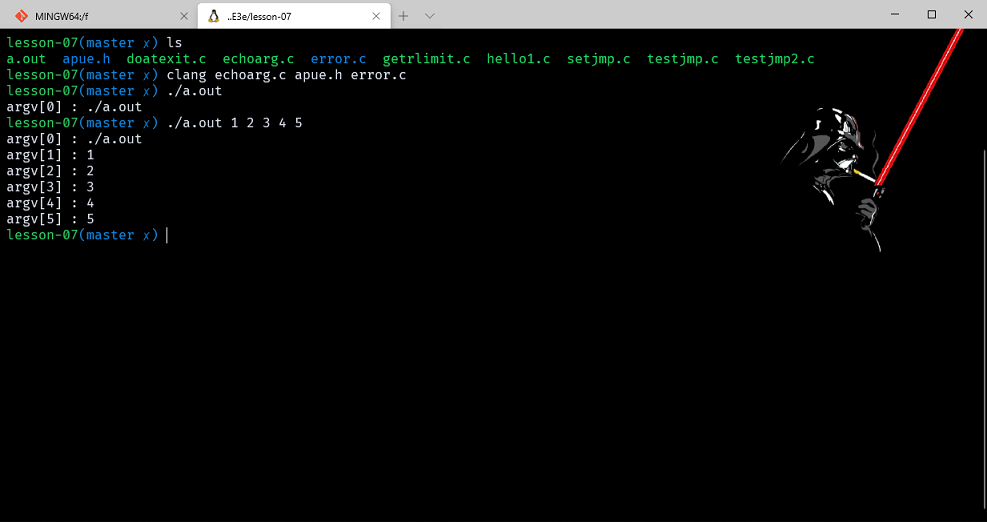

# 进程环境

- [进程环境](#进程环境)
  - [引言](#引言)
  - [main 函数](#main-函数)
  - [进程终止](#进程终止)
    - [退出函数](#退出函数)
      - [example_hello1](#example_hello1)
    - [atexit 函数](#atexit-函数)
      - [example_doatexit](#example_doatexit)
  - [命令行参数](#命令行参数)
    - [example_echoarg](#example_echoarg)
  - [环境表](#环境表)
  - [C 语言的存储空间布局](#c-语言的存储空间布局)
  - [共享库](#共享库)
  - [储存空间分配](#储存空间分配)
    - [替代的储存空间分配程序](#替代的储存空间分配程序)
  - [环境变量](#环境变量)
  - [函数 setjmp 和 longjmp](#函数-setjmp-和-longjmp)
    - [example_setjmp](#example_setjmp)
    - [自动变量、寄存器变量和易失变量_testjmp](#自动变量寄存器变量和易失变量_testjmp)
    - [自动变量的潜在问题](#自动变量的潜在问题)
  - [函数 getrlimit 和 setrlimit](#函数-getrlimit-和-setrlimit)
    - [example_getrlimit](#example_getrlimit)

> 注意：文章中使用到的源码都在我的 github 中找到，传送门：[SourceCode](https://github.com/HATTER-LONG/SourceCodeByAPUE3e)

## 引言

本章将会介绍进程环境，当执行程序时，其 main 函数是如何被调用的，命令行参数是如何传送给执行程序的，典型的存储器布局是什么样式，如何分配另外的存储空间，进程如何使用环境变量，进程终止的不同方式等。 最后还将说明 longjmp 和 setjmp 函数以及它们与栈的交互作用。

## main 函数

C 程序总是从 main 函数开始执行。 main 函数的原型是：

```c++
int main(int argc, char* argv[]);
```

其中， argc 是命令行参数的数目， argv 是指向参数的各个指针所构成的数组。

当内核起动 C 程序时，在调用 main 前先调用一个特殊的起动例程，glibc 的程序入口 _start，这个入口是由 ld 链接器默认的链接脚本指定的，而链接器程序则由 C 编译程序(通常是 cc )调用。起动例程从内核取得命令行参数和环境变量值，然后为调用 main 函数作好安排。

## 进程终止

- 系统有 8 种进程终止行为：
    1. 从 main 返回。
    2. exit 函数。
    3. _exit 或者 `_Exit`。
    4. 最后一个线程退出
    5. 最后一个线程调用 pthread_exit 函数。

- 下面的就是异常退出：
    1. 调用 abort。
    2. 接收到一个信号。
    3. 最后一个线程对取消请求作出相应。

### 退出函数

```c++
#include <stdlib.h>
void exit(int status);//先执行一些清理处理，然后返回内核。
void _Exit(int status); //立即结束进入内核。
#include <unistd.h>
void _exit(int status);//同上。
```

前两个是标准 C 库中的函数，后一个是 BSD 系统调用库。exit 和 _exit 都带一个整型参数，称之为终止状态（exit status）这三个函数都接受一个 status 参数，也叫作退出状态。如果调用这三个函数不带参数，或者 main 函数执行 return，或者 main 函数没有返回值，那么就不会定义返回状态。但是如果 main 返回值是 int 类型，并且有显式返回行为，那么进程返回状态就是 0。

#### example_hello1

```c++
#include <stdio.h>

main() { printf("hello , world\n"); }
```


### atexit 函数

一个进程可以登记多至 32 个函数，这些函数将由 exit 自动调用。我们称这些函数为终止处理程序（ exit handler），并用 atexit 函数来登记这些函数。其中，atexit 的参数是一个函数地址，当调用此函数时无须传递任何参数，该函数也不能返回值，atexit 函数称为终止处理程序注册程序，注册完成以后，当函数终止是 exit() 函数会主动的调用前面注册的各个函数，但是 exit 函数调用这些函数的顺序于这些函数登记的顺序是相反的。同时如果一个函数被多次登记，那么该函数也将多次的执行。我们知道 exit 是在 main 函数调用结束以后调用，因此这些函数的执行肯定在 main 函数之后，这也是上面面试题的解决方法。即采用 atexit 函数登记相关的执行函数即可。[BLOG](http://blog.chinaunix.net/uid-20937170-id-3447901.html)

```c++
#include <stdlib.h>
int atexit(void (* func) (void) ) ;
          //返回：若成功则为 0，若出错则为非 0
```


#### example_doatexit

```c++
#include "apue.h"

static void my_exit1(void);
static void my_exit2(void);

int main(void)
{
    if (atexit(my_exit2) != 0)
        err_sys("can't register my_exit2");

    if (atexit(my_exit1) != 0)
        err_sys("can't register my_exit1");
    if (atexit(my_exit1) != 0)
        err_sys("can't register my_exit1");

    printf("main is done\n");
    //
    // return(0);
    exit(0);
}

static void my_exit1(void) { printf("first exit handler\n"); }

static void my_exit2(void) { printf("second exit handler\n"); }
```


## 命令行参数

内核想要执行一个程序，只有通过 exec 函数族，而且当启动一个进程的时候，main 函数都会要求命令行参数和环境变量。前面也提到过，启动进程的时候实际上是启动了一个小程序，然后由它来传递各种参数给 main 函数，而开发者在实际开发的时候只需要关心 main 函数作为入口点的代码就行了。

### example_echoarg

```c++
#include "apue.h"

int main(int argc, char* argv[])
{
    int i;
    for (i = 0; i < argc; i++)
        printf("argv[%d] : %s\n", i, argv[i]);
    exit(0);
}
```



## 环境表

每个程序都接收到一张环境表。与参数表一样，环境表也是一个字符指针数组，其中每个指针包含一个以 null 结束的字符串的地址。全局变量 environ 则包含了该指针数组的地址。

```c++
extern char **environ;
```


在历史上，大多数 UNIX 系统对 main 函数提供了第三个参数，它就是环境表地址：

```c++
int main(int argc, char * argv[], char * envp[] );
```

因为 ANSI C 规定 main 函数只有两个参数，而且第三个参数与全局变量 environ 相比也没有带来更多益处，所以 POSIX.1 也规定应使用 environ 而不使用第三个参数。

## C 语言的存储空间布局

- 由于历史原因，C 程序一直由下列几部分组成：
  1. 正文段。这是主要用于执行的部分，而且由于正文段的频繁读取执行，所以正文段一般都是只读的，防止误操作导致破坏或者被恶意程序窃取。前面讲解的保存正文位保存的就是这一段
  2. 初始化数据段。这一段实际上是在 C 语言中以明确的语句初始化的变量。例如：int i = 0;
  3. 未初始化数据段。也叫作 bss 段，也就是语句中没有明确赋予初值的变量。
  4. 栈。自动变量以及函数调用的场景信息都被放在这里，栈具有先进后出的特性，非常适合函数调用和变量分配空间，回收空间的行为。并且，这些都是由系统自动管理的。
  5. 堆。堆通常用于用户自行分配空间，也就是开发者通常的 malloc 分配。


size(1) 命令报告正文段、数据段和 bss 段的长度(单位：字节)。

## 共享库

- 共享库使得可执行文件中不再需要包含常用的库函数，而只需在所有进程都可存取的存储区中保存这种库例程的一个副本。程序第一次执行或者第一次调用某个库函数时，用动态连接方法将程序与共享库函数相连接。这减少了每个可执行文件的长度，但增加了一些运行时间开销。共享库的另一个优点是可以用库函数的新版本代替老版本而无需对使用该库的程序重新连接编辑。
- 静态库和动态库区别就在于是否将实际代码链接到二进制文件。不同的编译系统可能会有不同的参数用于说明是否要使用动态库。一般编译出来的都很大，但是不需要动态库就可以运行。

## 储存空间分配

ISO C有三个分配存储空间的函数：

```c++
void *malloc(size_t size);
void *calloc(size_t count, size_t size);
void *realloc(void *ptr, size_t size);
                //三个函数返回：若成功则为非空指针，若出错则为NULL
void free(void *ptr);
```

这三个分配函数所返回的指针一定是适当对齐的，使其可用于任何数据对象。例如，在一个特定的系统上，如果最苛刻的对齐要求是 double，则对齐必须在 8 的倍数的地址单元处，那么这三个函数返回的指针都应这样对齐。

因为这三个 alloc 函数都返回类属指针 void*，如果在程序中包括了<stdlib.h> (包含了函数原型)，那么当我们将这些函数返回的指针赋与一个不同类型的指针时，不需要作类型强制转换。

### 替代的储存空间分配程序

作为 malloc 和 free 的替代，实际上有不少系统和类库都提供了相关的函数，现在有 libmalloc、vmalloc、quick-fit、jemalloc、tcmalloc 和 alloca 等，但是根据性能对比，jemalloc 和 tcmalloc实际上是最好的两个，在实际开发中都能有效的提升内存管理的效率。

## 环境变量

环境变量主要的形式就是 name=value 键值对，对于 Unix 本身来说并不关心，但是环境变量可以让应用程序以最快捷方便的形式进行读取信息，所以 ISO C 标准也规定了相关的函数

```c++
char *getenv(const char *name);
        //返回：指向与name关联的value的指针，若未找到则为NULL
int putenv(char *string);
int setenv(const char *name, const char *value, int overwrite);
int unsetenv(const char *name);
```

## 函数 setjmp 和 longjmp

c 中，goto 语句不能跨越函数，而执行这种类型跳转功能的是函数 setjmp 和 longjmp。这两个函数对于处理发生在很深嵌套的函数调用中的出错情况非常有用。他们不是不同的在一个函数内实施跳转，而是在栈上跳过若干调用帧，返回到当前函数调用路径上的某个函数中。

```c++
#include <setjmp.h>

int setjmp(jmp_buf env);
int sigsetjmp(sigjmp_buf env, int savesigs);

void longjmp(jmp_buf env, int val);
void siglongjmp(sigjmp_buf env, int val);
```


在希望返回到的位置调用 setjmp，它的参数 env 是一个特殊类型，需要在调用 longjmp 的位置访问到。

### example_setjmp

处理标准输入的命令，当输入正整数会自动跳转，输入负数则会正确在 while 中执行。

```c++
#include "apue.h"
#include <setjmp.h>

#define TOK_ADD 5

jmp_buf jmpbuffer;

void do_line(char*);

void cmd_add(void);

int get_token(void);

int main(void)
{
    char line[MAXLINE];

    if (setjmp(jmpbuffer) != 0)
        printf("double setJmp cause error\n");

    printf("Jmp\n");
    while (fgets(line, MAXLINE, stdin) != NULL)
        do_line(line);
    exit(0);
}

char* tok_ptr;

void do_line(char* ptr)
{
    int cmd;
    tok_ptr = ptr;
    while ((cmd = get_token()) > 0)
    {
        switch (cmd)
        {
        case TOK_ADD:
            cmd_add();
            break;
        }
    }
}

void cmd_add(void)
{
    int token;

    token = get_token();

    if (token == TOK_ADD)
        longjmp(jmpbuffer, 1);
}

int get_token(void)
{
    printf("cmd = %s\n", tok_ptr);
    if (atoi(tok_ptr) < 0)
        return -1;

    return TOK_ADD;
}
```


### 自动变量、寄存器变量和易失变量_testjmp

longjmp 造成栈的改动，但是对于数据是否会回滚的改变不确定，声明为全局变量或静态变量的值在执行 longjmp 时保持不变。

```c++
#include "apue.h"
#include <setjmp.h>

static void f1(int, int, int, int);
static void f2(void);

static jmp_buf jmpbuffer;
static int globval;

int main(void)
{
    int autoval;
    register int regival;
    volatile int volaval;
    static int statval;

    globval = 1;
    autoval = 2;
    regival = 3;
    volaval = 4;
    statval = 5;

    if (setjmp(jmpbuffer) != 0)
    {
        printf("after longjmp:\n");
        printf("globval = %d, autoval = %d, regival = %d,"
               " volaval = %d, statval = %d\n",
               globval, autoval, regival, volaval, statval);
        exit(0);
    }

    /*
     * Change variables after setjmp, but before longjmp.
     */
    globval = 95;
    autoval = 96;
    regival = 97;
    volaval = 98;
    statval = 99;

    f1(autoval, regival, volaval, statval); /* never returns */
    exit(0);
}

static void f1(int i, int j, int k, int l)
{
    printf("in f1():\n");
    printf("globval = %d, autoval = %d, regival = %d,"
           " volaval = %d, statval = %d\n",
           globval, i, j, k, l);
    f2();
}

static void f2(void) { longjmp(jmpbuffer, 1); }
```


如果需要编写一个使用非局部跳转的可移植程序，必须使用 volatile 属性。

### 自动变量的潜在问题

```c++
#include <stdio.h>

FILE* open_data(void)
{
    FILE* fp;
    char databuf[BUFSIZ]; /* setvbuf makes this the stdio buffer */

    if ((fp = fopen("datafile", "r")) == NULL)
        return (NULL);
    if (setvbuf(fp, databuf, _IOLBF, BUFSIZ) != 0)
        return (NULL);
    return (fp); /* error */
}
```

打开了一个标准 I/O 流，然后为该流设置缓冲，当函数返回时，他在栈上所使用的空间将有下一个被调用的函数的栈帧使用，当时标准 I/O 流仍将其作为缓冲区，这就产生了混乱，所以应在全局储存空间静态地或者动态的为数组 databuf 分配空间。

## 函数 getrlimit 和 setrlimit

每个进程都有一组资源限制，其中一些可以用这两个函数查询和修改。这两个函数的每次调用都指定一个资源以及一个指向结构的指针。

```c++
struct rlimit {
    rlim_t rlim_cur;  /* Soft limit */
    rlim_t rlim_max;  /* Hard limit (ceiling for rlim_cur) */
};

 #include <sys/time.h>
#include <sys/resource.h>

int getrlimit(int resource, struct rlimit *rlim);
int setrlimit(int resource, const struct rlimit *rlim);

int prlimit(pid_t pid, int resource, const struct rlimit *new_limit,
                                           struct rlimit *old_limit);

```

- 更改资源限制时，需要遵顼三条条例：
  1. 任何一个进程都可将一个软限制值改为小于或等于其硬限制值。
  2. 任何一个进程都可降低其硬限制值，但它必须大于或等于其软限制值。这种降低对普通用户不可逆。
  3. 只有超级用户进程和以提高硬限制值。

常量 RLIM_INFINITY 指定了一个无限制量的限制。

### example_getrlimit

```c++
#include "apue.h"
#include <sys/resource.h>

#define doit(name) pr_limits(#name, name)

static void pr_limits(char*, int);

int main(void)
{
#ifdef RLIMIT_AS
    doit(RLIMIT_AS);
#endif

    doit(RLIMIT_CORE);
    doit(RLIMIT_CPU);
    doit(RLIMIT_DATA);
    doit(RLIMIT_FSIZE);

#ifdef RLIMIT_MEMLOCK
    doit(RLIMIT_MEMLOCK);
#endif

#ifdef RLIMIT_MSGQUEUE
    doit(RLIMIT_MSGQUEUE);
#endif

#ifdef RLIMIT_NICE
    doit(RLIMIT_NICE);
#endif

    doit(RLIMIT_NOFILE);

#ifdef RLIMIT_NPROC
    doit(RLIMIT_NPROC);
#endif

#ifdef RLIMIT_NPTS
    doit(RLIMIT_NPTS);
#endif

#ifdef RLIMIT_RSS
    doit(RLIMIT_RSS);
#endif

#ifdef RLIMIT_SBSIZE
    doit(RLIMIT_SBSIZE);
#endif

#ifdef RLIMIT_SIGPENDING
    doit(RLIMIT_SIGPENDING);
#endif

    doit(RLIMIT_STACK);

#ifdef RLIMIT_SWAP
    doit(RLIMIT_SWAP);
#endif

#ifdef RLIMIT_VMEM
    doit(RLIMIT_VMEM);
#endif

    exit(0);
}

static void pr_limits(char* name, int resource)
{
    struct rlimit limit;
    unsigned long long lim;

    if (getrlimit(resource, &limit) < 0)
        err_sys("getrlimit error for %s", name);
    printf("%-14s  ", name);
    if (limit.rlim_cur == RLIM_INFINITY)
    {
        printf("(infinite)  ");
    }
    else
    {
        lim = limit.rlim_cur;
        printf("%10lld  ", lim);
    }
    if (limit.rlim_max == RLIM_INFINITY)
    {
        printf("(infinite)");
    }
    else
    {
        lim = limit.rlim_max;
        printf("%10lld", lim);
    }
    putchar('\n');
}
```

doit宏中使用了字符串创建算符（#），例如： doit(R); 由宏改变为 pr_limits("R", R);

