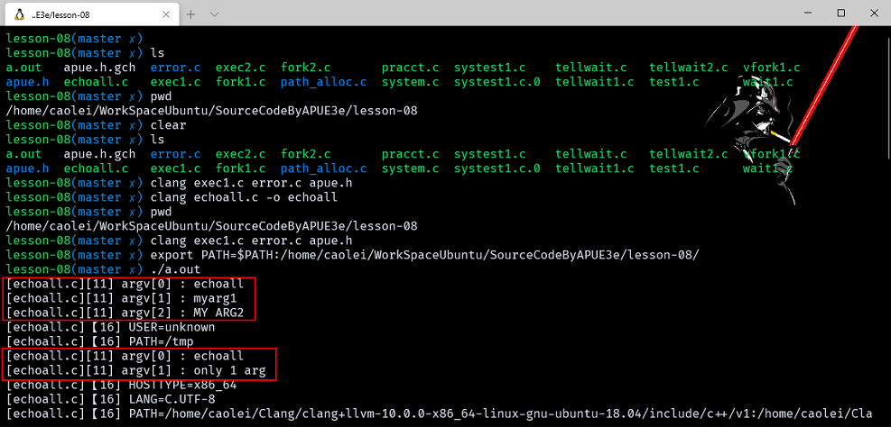

# 进程控制

- [进程控制](#进程控制)
  - [进程标识](#进程标识)
  - [函数 fork](#函数-fork)
    - [example_fork](#example_fork)
  - [函数 vfork](#函数-vfork)
    - [example_vfork1](#example_vfork1)
  - [函数 exit](#函数-exit)
  - [函数 wait 和 waitpid](#函数-wait-和-waitpid)
    - [example_fork2](#example_fork2)
  - [竞争条件](#竞争条件)
    - [example_tellwait](#example_tellwait)
    - [example_tellwait2](#example_tellwait2)
  - [函数 exec](#函数-exec)
    - [example_exec1](#example_exec1)
  - [更改用户 ID 和更改组 ID](#更改用户-id-和更改组-id)
  - [解释器文件](#解释器文件)
    - [example_exec2](#example_exec2)
  - [system 函数](#system-函数)
    - [example_systest1](#example_systest1)
  - [进程会计](#进程会计)
  - [用户标识](#用户标识)
  - [进程调度](#进程调度)
    - [example_nice](#example_nice)
  - [进程时间](#进程时间)
    - [example_times1](#example_times1)

> 注意：文章中使用到的源码都在我的 github 中找到，传送门：[SourceCode](https://github.com/HATTER-LONG/SourceCodeByAPUE3e)

## 进程标识

- 每个进程都有一个非负整型的唯一进程 ID。因为进程 ID 标识符总是唯一的，常将其用做其他标识符的一部分以保证其唯一性。
  - 进程 ID 0 是调度进程，常常被称为交换进程 (swapper)。
  - 进程 ID 1 通常是 init 进程，在自举过程结束时由内核调用。init 通常读与系统有关的初始化文件( /etc/rc*文件)，并将系统引导到一个状态 (例如多用户)。init 进程决不会终止。它是一个普通的用户进程 (与交换进程不同，它不是内核中的系统进程 )，但是它以超级用户特权运行。除了进程 ID，每个进程还有一些其他标识符。

下列函数返回这些标识符：

```c++
#include <sys/types.h>
#include <unistd.h>
    pid_t getpid(void); //返回：调用进程的进程 ID
    pid_t getppid(void); //返回：调用进程的父进程 ID
    uid_t getuid(void); //返回：调用进程的实际用户 ID
    uid_t geteuid(void); //返回：调用进程的有效用户 ID
    gid_t getgid(void); //返回：调用进程的实际组 ID
    gid_t getegid(void); //返回：调用进程的有效组 ID
```

## 函数 fork

一个现有进程可以调用 fork 函数创建一个新的进程。

```c++
#include <unistd.h>
pid_t fork(void);
         //返回：子进程中为 0，父进程中为子进程 ID，出错为- 1
```

子进程和父进程继续执行 fork 之后的指令。子进程是父进程的复制品。如，子进程获得父进程数据空间、堆和栈的复制品。注意，这是子进程所拥有的拷贝。父、子进程并不共享这些存储空间部分。如果正文段：是只读的，则父、子进程共享正文段。

### example_fork

```c++
#include "apue.h"

int globvar = 6;
char buf[] = "a write to stdout!\n";

int main(void)
{
    int var;
    pid_t pid;

    var = 88;
    if (write(STDOUT_FILENO, buf, sizeof(buf) - 1) != sizeof(buf) - 1)
        err_sys("write error!!\n");
    printf("before fork!!\n");

    if ((pid = fork()) < 0)
    {
        err_sys("fork error!!\n");
    }
    else if (pid == 0)
    {
        globvar++;
        var++;
    }
    else
    {
        sleep(2);
    }

    printf("pid = %ld,glob = %d, var = %d\n", (long)getpid, globvar, var);
    exit(0);
}
```


效果就是，父进程打印出来的数据并没有被修改，证明了共享数据段是不会被改变的，改变的仅仅是相对应的副本。sizeof(buf)-1 是为了防止将 NULL 输出，strlen 计算不包括 null 字节的字符串长度，而 sizeof 则计算包括终止 null 字节的缓冲区长度。

标准 I/O 库是带缓冲的，如果连接到的是终端设备，它是由换行符冲洗，则它是行缓冲，否则它是全缓冲的。这也就是当直接输出得到一次打印 printf，而重定向则会将缓存中的打印也拷贝到子进程中一份，当进程结束，缓存输出就会出现两次打印。

- fork 主要用法：
  1. 一个父进程复制自己，使父进程和子进程同时执行不同的代码段。
  2. 一个进程要执行另一个不同的程序，在 fork 后就调用 exec。有些操作系统将这个操作整合为一个叫做 spawn。

## 函数 vfork

它用于创建一个新进程，返回和 fork 一样，只不过他主要是用与调用 exec 来执行一个其他的程序。他不会将父进程的代码完全复制，在子进程调用 exec 之前会在父进程的空间中运行。Vfork 保证子进程先运行，在他调用 exit 等函数后主进程才会继续运行。

### example_vfork1

```c++
#include "apue.h"

int globvar = 6; /* external variable in initialized data */

int main(void)
{
    int var; /* automatic variable on the stack */
    pid_t pid;

    var = 88;
    printf("before vfork\n"); /* we don't flush stdio */
    if ((pid = vfork()) < 0)
    {
        err_sys("vfork error");
    }
    else if (pid == 0)
    {              /* child */
        globvar++; /* modify parent's variables */
        var++;
        exit(0); /* child terminates */
    }

    /* parent continues here */
    printf("pid = %ld, glob = %d, var = %d\n", (long)getpid(), globvar, var);
    _exit(0);
}
```


## 函数 exit

- 一个进程的结束有五种正常终止方式，和三种异常终止，不论如何终止，最后都会执行内核中的同一段代码，用来释放它所占用的各种资源（或者关闭文件表示符）。对于每一种退出我们都希望可以通知这个进程的父进程，它是如何终止的！！在任意一种情况下父进程使用 wait 或者 waitpid 函数可以获得子进程的终止信息和释放资源。但如果父进程在子进程结束之前结终止，则这些子进程就会变成孤儿进程，然后被 init 收养（pid = 1）。过程：
  - 在一个进程终止时，内核逐渐检查所有活动进程，以判断它是否是正要终止的进程的子程序，如果是则就将子程序父进程 ID 改为 1，而且当子进程结束后，init 会自动掉用 wait 函数取得其终止态。
  - 如果子进程是在父进程之前结束，内核会帮助保存一些子进程的基本信息，这时只需要父进程调用 waitpid 或 wait 函数就可以得到，并且释放子进程资源。
  - 一个进程终止、但是其父进程尚未对其进行善后处理（获取终止子进程的有关信息、释放它仍占用的资源）的进程被称为僵死进程。ps 打印状态为Z。

## 函数 wait 和 waitpid

- 当一个进程结束时会给他的父进程发送一个 17 号的信号，调用 wait 和 waitpid 之后：
  1. 如果所有的子进程都在运行则阻塞。（waitpid 有参数可以控制是否阻塞，和他要等待的进程）。
  2. 如果一个子进程已经结束，调用函数返回子进程信息。
  3. 如果他没有子进程了，则立即返回出错。

```c++
#include <sys/types.h>
#include <sys/wait.h>
pid_t wait(int *statloc) ;
pid_t waitpid(pid_t pid , int *statloc,int options);
    //两个函数返回：若成功则为进程I D，若出错则为-1
```

- 这两个函数的区别是：
  - 在一个子进程终止前， wait 使其调用者阻塞，而 waitpid 有一选择项，可使调用者不阻塞。
  - waitpid 并不等待第一个终止的子进程—它有若干个选择项，可以控制它所等待的进程。

如果一个子进程已经终止，是一个僵死进程，则 wait 立即返回并取得该子进程的状态，否则 wait 使其调用者阻塞直到一个子进程终止。如调用者阻塞而且它有多个子进程，则在其一个子进程终止时，wait 就立即返回。因为 wait 返回终止子进程的进程 ID，所以它总能了解是哪一个子进程终止了。这两个函数的参数 statloc 是一个整型指针。如果 statloc 不是一个空指针，则终止进程的终止状态就存放在它所指向的单元内。如果不关心终止状态，则可将该参数指定为空指针。


- waitpid 函数提供了 wait 函数没有提供的三个功能：
  1. waitpid 等待一个特定的进程(而 wait 则返回任一终止子进程的状态)。在讨论 popen 函数时会再说明这一功能。
  2. waitpid 提供了一个 wait 的非阻塞版本。有时希望取得一个子进程的状态，但不想阻塞。
  3. waitpid 支持作业控制（以 WUNTRACED 选择项）。

### example_fork2

```c++
#include "apue.h"
#include <sys/wait.h>

int main(void)
{
    pid_t pid;

    if ((pid = fork()) < 0)
    {
        err_sys("fork error");
    }
    else if (pid == 0)
    { /* first child */
        if ((pid = fork()) < 0)
            err_sys("fork error");
        else if (pid > 0)
            exit(0); /* parent from second fork == first child */

        /*
         * We're the second child; our parent becomes init as soon
         * as our real parent calls exit() in the statement above.
         * Here's where we'd continue executing, knowing that when
         * we're done, init will reap our status.
         */
        sleep(2);
        printf("second child, parent pid = %ld\n", (long)getppid());
        exit(0);
    }

    if (waitpid(pid, NULL, 0) != pid) /* wait for first child */
        err_sys("waitpid error");

    /*
     * We're the parent (the original process); we continue executing,
     * knowing that we're not the parent of the second child.
     */
    exit(0);
}
```


如果不想父进程等待子进程阻塞，或者不希望子进程僵死直到父进程终止，可以调用 fork 两次，使 init 变成第二个子进程的父进程。

## 竞争条件

当多个程序都企图对共享的数据进行某种修改，而最后的结果却取决于到底是哪个进程最后执行过修改，这种现象就是发生了竞争条件。这是多进程\线程经常出现的问题。

### example_tellwait

```c++
#include "apue.h"

static void charatatime(char*);

int main(void)
{
    pid_t pid;

    if ((pid = fork()) < 0)
    {
        err_sys("fork error");
    }
    else if (pid == 0)
    {
        charatatime("output from child\n");
    }
    else
    {
        charatatime("output from parent\n");
    }
    exit(0);
}

static void charatatime(char* str)
{
    char* ptr;
    int c;

    setbuf(stdout, NULL); /* set unbuffered */
    for (ptr = str; (c = *ptr++) != 0;)
        putc(c, stdout);
}
```


一个由子进程输出，一个由父进程输出，因为输出依赖于内核让这两个进程哪个先输出，就会产生竞争条件。setbuf 将标准输出的缓冲置空，可以方便看到结果。

### example_tellwait2

为例避免这种问题，我们使用需要一种同步机制。

```c++
#include "apue.h"

static void charatatime(char*);

int main(void)
{
    pid_t pid;

    TELL_WAIT();

    if ((pid = fork()) < 0)
    {
        err_sys("fork error");
    }
    else if (pid == 0)
    {
        WAIT_PARENT(); /* parent goes first */
        charatatime("output from child\n");
    }
    else
    {
        charatatime("output from parent\n");
        TELL_CHILD(pid);
    }
    exit(0);
}

static void charatatime(char* str)
{
    char* ptr;
    int c;

    setbuf(stdout, NULL); /* set unbuffered */
    for (ptr = str; (c = *ptr++) != 0;)
        putc(c, stdout);
}
```

WAIT_PARENT 会轮询等待父进程的信号，直到父进程调用 TELL_CHILD 向 pid 子进程发送一个信号。


## 函数 exec

当进程调用 exec 函数时，该进程执行的程序将会被完全替换为新程序，但是它并不是创建新的程序，前后的进程 ID 不会变，它是用新进程的正文段、数据段、堆段和栈段替换当前执行进程。

```c++
#include <unistd.h>

extern char **environ;

int execl(const char *path, const char *arg, ...
                /* (char  *) NULL */);
int execlp(const char *file, const char *arg, ...
                /* (char  *) NULL */);
int execle(const char *path, const char *arg, ...
                /*, (char *) NULL, char * const envp[] */);
int execv(const char *path, char *const argv[]);
int execvp(const char *file, char *const argv[]);
int execvpe(const char *file, char *const argv[],
                char *const envp[]);
```

execl、execv、execle 这几个第一个参数表示程序路径。

execlp、execvp、execvpe 第一个参数是 filename 也就是文件名。它就涉及到环境变量中的路径。如果 filename 中有/则将其看做路径，否则就按照 PATH 中指定的环境变量路径搜索可执行文件。
PATH=/bin:/usr/bin:/usr/local/bin:.
指定在四个目录中进行搜索。最后一个. 是当前路径（路径之间用：分隔）

如果 execlp 和 execvp 中的任意一个使用路径前缀中的一个找到了一个可执行文件，但是该文件不是由连接编辑程序产生的机器可执行代码文件，则就认为该文件是一个shell脚本，于是试着调用/bin/sh，并以该 filename 作为 shell 的输入。

- 这些函数都属于 exec 函数族，函数名的后缀有四种，分别是 l、p、v、和 e。
  1. 后缀有 l（list）： 函数传参方式是命令行参数列表
  2. 后缀有p（path）： 搜索 file 时使用 PATH 环境变量
  3. 后缀有v（vector）： 函数传参方式是传命令行参数数组的地址 argv
  4. 后缀有e（environment）： 使用环境变量数组envp[]，不使用进程原有的环境变量，设置新加载程序运行的环境变量。

fexecve 以文件描述符通过调用进程进行验证和调用。


（老版的图有些差异）

- 在执行 exec 后，进程的 ID 没有改变。但是新进程从调用进程继承了下列属性：
  - 进程 ID 和父进程 ID。
  - 实际用户 ID 和实际组 ID。
  - 添加组 ID。
  - 进程组 ID。
  - 对话期 ID。
  - 控制终端。
  - 闹钟尚余留的时间。
  - 当前工作目录。
  - 根目录。
  - 文件方式创建屏蔽字。
  - 文件锁。
  - 进程信号屏蔽。
  - 未决信号。
  - 资源限制。
  - tms_utime, tms_stime, tms_cutime 以及 tms_ustime 值。

对打开文件的处理与每个描述符的 exec 关闭标志值有关，例如函数中的 FD_CLOEXEC 标志位，来关闭传递的文件描述符 [[参考BlOG](fcntl设置FD_CLOEXEC标志作用)]：

```c++
#include "apue.h"
#include <fcntl.h>

int set_cloexec(int fd)
{
    int val;

    if ((val = fcntl(fd, F_GETFD, 0)) < 0)
        return (-1);

    val |= FD_CLOEXEC; /* enable close-on-exec */

    return (fcntl(fd, F_SETFD, val));
}
```

### example_exec1

exec1 中先调用 execle，他要求一个路径名和一个特定的环境。下一个调用的是 execlp，它是一个文件名，然后在 PATH 查找路径中文件夹下的文件并执行。

```c++
#include "apue.h"
#include <sys/wait.h>

char* env_init[] = {"USER=unknown", "PATH=/tmp", NULL};

int main(void)
{
    pid_t pid;

    if ((pid = fork()) < 0)
    {
        err_sys("fork error");
    }
    else if (pid == 0)
    { /* specify pathname, specify environment */
        if (execle("/home/caolei/WorkSpaceUbuntu/SourceCodeByAPUE3e/lesson-08/echoall", "echoall", "myarg1", "MY ARG2",
                   (char*)0, env_init) < 0)
            err_sys("execle error");
    }

    if (waitpid(pid, NULL, 0) < 0)
        err_sys("wait error");

    if ((pid = fork()) < 0)
    {
        err_sys("fork error");
    }
    else if (pid == 0)
    { /* specify filename, inherit environment */
        if (execlp("echoall", "echoall", "only 1 arg", (char*)0) < 0)
            err_sys("execlp error");
    }

    exit(0);
}

//echoall.c
#include "apue.h"

int main(int argc, char* argv[])
{
    int i;
    char** ptr;
    extern char** environ;

    for (i = 0; i < argc; i++)
    {
        printf("[%s][%d] argv[%d] : %s\n", __FILE__, __LINE__, i, argv[i]);
    }

    for (ptr = environ; *ptr != 0; ptr++)
    {
        printf("[%s]【%d] %s\n", __FILE__, __LINE__, *ptr);
    }

    exit(0);
}
```



## 更改用户 ID 和更改组 ID

特权以及访问控制，是基于用户 ID 和组 ID 的。当程序需要增加特权，或需要访问当前并不允许访问的资源时需要增加权限，反之保护时需要降低权限。


```c++
#include <sys/types.h>
#include <unistd.h>

int setreuid(uid_t ruid, uid_t euid);
int setregid(gid_t rgid, gid_t egid);

Feature Test Macro Requirements for glibc (see feature_test_macros(7)):

setreuid(), setregid():
    _XOPEN_SOURCE >= 500
        || /* Since glibc 2.19: */ _DEFAULT_SOURCE
        || /* Glibc versions <= 2.19: */ _BSD_SOURCE
```

一个非特权用户总能交换实际用户 ID 和有效用户 ID。这就允许一个设置 - 用户 - ID程序转换成只具有用户的普通许可权，以后又可再次转换回设置 - 用户 - ID 所得到的额外许可权。POSIX.1 引进了保存的设置 - 用户 - ID 特征后，其作用也相应加强，它也允许一个非特权用户将其有效用户 ID 设置为保存的设置 - 用户 - ID。

```c++
#include <sys/types.h>
#include <unistd.h>

int seteuid(uid_t euid);
int setegid(gid_t egid);

Feature Test Macro Requirements for glibc (see feature_test_macros(7)):

seteuid(), setegid():
    _POSIX_C_SOURCE >= 200112L
        || /* Glibc versions <= 2.19: */ _BSD_SOURCE
```

只更改有效用户 ID 和有效组 ID。


## 解释器文件

所有现今的 UNIX 系统都支持解释器文件（interpreter file）（也可称为解释器脚本）。这种文件是文本文件，其起始行格式是：

`#! pathname [optional-argument]`

感叹号和 pathname 之间的空格是可选的。最常见的解释器文件以下列行开始：

`#!/bin/sh`

**pathname 通常是绝对路径名**，对它不进行什么特殊的处理（即不使用 PATH 进行路径搜索）。对这种文件的识别是由内核作为 exec 系统调用处理的一部分来完成的。内核调用 exec 函数的进程实际执行的并不是该解释器文件，而是该解释器文件第一行中 pathname 所指定的文件。一定要将解释器文件（文本文件，它以#!开头）和解释器（由该解释器文件第一行中的pathname指定）区分开来。（我们可以认为：解释器文件就是在首行指定了其所使用的解释器的文本文件。）

### example_exec2

```c++
#include "apue.h"
#include <sys/wait.h>

int main(void)
{
    pid_t pid;

    if ((pid = fork()) < 0)
    {
        err_sys("fork error");
    }
    else if (pid == 0)
    { /* child */
        if (execl("/home/caolei/WorkSpaceUbuntu/SourceCodeByAPUE3e/lesson-08/testinterp", "testinterp", "myarg1",
                  "MY ARG2", (char*)0) < 0)
            err_sys("execl error");
    }
    if (waitpid(pid, NULL, 0) < 0) /* parent */
        err_sys("waitpid error");
    exit(0);
}
```


[参考 BLOG](http://www.cnblogs.com/nufangrensheng/p/3511768.html)

## system 函数

可以再程序中执行一个命令字符串。

```c++
SYNOPSIS
       #include <stdlib.h>

       int system(const char *command);

DESCRIPTION
       The system() library function uses fork(2) to create a child process that executes the shell command specified
       in command using execl(3) as follows:

           execl("/bin/sh", "sh", "-c", command, (char *) 0);

       system() returns after the command has been completed.

       During execution of the command, SIGCHLD will be blocked, and SIGINT and  SIGQUIT  will  be  ignored,  in  the
       process  that  calls  system()  (these  signals  will  be handled according to their defaults inside the child
       process that executes command).

       If command is NULL, then system() returns a status indicating whether a shell is available on the system.
```

- 因为 system 在其实现中调用了 fork、exec  和 waitpid，因此有三种返回值：
  1. 如果 fork 失败或者 waitpid 返回除 EINTR 之外的出错，则 system 返回－1，而且 errno 中设置了错误类型。
  2. 如果 exec 失败(表示不能执行 shell)，则其返回值如同 shell 执行了 exit (127) 一样。
  3. 否则所有三个函数( fork,exec 和 waitpid)都成功，并且 system 的返回值是 shell 的终止状态，其格式已在 waitpid 中说明。

### example_systest1

```c++
#include "apue.h"
#include <errno.h>
#include <sys/wait.h>
void pr_exit(int status)
{

    if (WIFEXITED(status))
        printf("normal termination , exut status = %d\n", WEXITSTATUS(status));
    else if (WIFSIGNALED(status))

        printf("normal termination , exut status = %d\n", WTERMSIG(status)
#ifdef WCOREDUMP
                                                              ,
               WCOREDUMP(status) ? " (core file generated)" : "");
#else
        );
#endif

    else if (WIFSTOPPED(status))
        printf("child stopped, signal number = %d\n", WSTOPSIG(status));
}

int m_system(const char* cmdstring) /* version without signal handling */
{
    pid_t pid;
    int status;

    if (cmdstring == NULL)
        return (1); /* always a command processor with UNIX */

    if ((pid = fork()) < 0)
    {
        status = -1; /* probably out of processes */
    }
    else if (pid == 0)
    { /* child */
        execl("/bin/sh", "sh", "-c", cmdstring, (char*)0);
        _exit(127); /* execl error */
    }
    else
    { /* parent */
        while (waitpid(pid, &status, 0) < 0)
        {
            if (errno != EINTR)
            {
                status = -1; /* error other than EINTR from waitpid() */
                break;
            }
        }
    }

    return (status);
}


int main(void)
{
    int status;

    if ((status = m_system("date")) < 0)
        err_sys("system() error");

    pr_exit(status);

    if ((status = m_system("nosuchcommand")) < 0)
        err_sys("system() error");

    pr_exit(status);

    if ((status = m_system("who; exit 44")) < 0)
        err_sys("system() error");

    pr_exit(status);

    exit(0);
}
```


当我们给予一个程序超级用户权限在 system 中执行了 fork 和 exec 之后仍然保存了下来。也就是说当设置用户 ID 或组 ID 时会更改权限执行操作，如果程序中调用了 system 创建了 fork 等新的进程都是 root 权限，这就会引发漏洞。

## 进程会计

进程会计会在一个进程结束时内核就会写一个记录表，记录这个进程的运行信息。唯一使用这一函数的是 SVR4 和 4.3+BSD 的 accton(8) 命令。超级用户执行一个带路径名参数的 accton 命令起动会计处理。该路径名通常是 /var/adm/pacct（早期系统中为 /usr/adm/acct）。执行不带任何参数的 accton 命令则停止会计处理。会计记录结构定义在头文件 <sys/acct.h>。
会计记录对应于进程而不是程序。在 fork 之后，内核为子进程初始化一个记录，而不是在一个新程序被执行时。虽然 exec 并不创建一个新的会计记录，但相应记录中的命令名改变了， AFORK 标志则被清除。这意味着，如果一个进程顺序执行了三个程序(A exec B,B exec C, 最后C exit)，但只写一个会计记录。在该记录中的命令名对应于程序 C，但 CPU 时间是程序 A、B、C之和。

注意：
    1，永不终止的进程不会产生会计记录。（init 进程 ）
    2，在会计文件中记录的顺序对应于进程的终止顺序。

p220

## 用户标识

任一进程都可以得到其实际和有效用户 ID 及组 ID。但是有时希望找到运行该程序的用户的登录名。我们可以调用 getpwuid (getuid())，但是如果一个用户有多个登录名，这些登录名又对应着同一个用户 ID，那么又将如何呢?（一个人在口令文件中可以有多个登录项，它们的用户 ID相同，但登录 shell 则不同。）系统通常保存用户的登录名（见6 . 7节），用 getlogin 函数可以存取此登录名。

```c++
NAME
       getlogin, getlogin_r, cuserid - get username

SYNOPSIS
       #include <unistd.h>

       char *getlogin(void);
       int getlogin_r(char *buf, size_t bufsize);

       #include <stdio.h>

       char *cuserid(char *string);

   Feature Test Macro Requirements for glibc (see feature_test_macros(7)):

       getlogin_r(): _POSIX_C_SOURCE >= 199506L

       cuserid():
           Since glibc 2.24:
               (_XOPEN_SOURCE && ! (_POSIX_C_SOURCE >= 200112L)
               || __GNU_SOURCE
           Up to and including glibc 2.23:
               _XOPEN_SOURCE

DESCRIPTION
       getlogin() returns a pointer to a string containing the name of the user logged in on the controlling terminal
       of the process, or a null pointer if this information cannot be determined.  The string  is  statically  allo‐
       cated and might be overwritten on subsequent calls to this function or to cuserid().

       getlogin_r() returns this same username in the array buf of size bufsize.

       cuserid()  returns  a  pointer  to a string containing a username associated with the effective user ID of the
       process.  If string is not a null pointer, it should be an array that can hold at least L_cuserid  characters;
       the  string  is  returned in this array.  Otherwise, a pointer to a string in a static area is returned.  This
       string is statically allocated and might be overwritten on subsequent calls to this function or to getlogin().

       The macro L_cuserid is an integer constant that indicates how long an array you might need to  store  a  user‐
       name.  L_cuserid is declared in <stdio.h>.

       These  functions  let  your  program  identify  positively the user who is running (cuserid()) or the user who
       logged in this session (getlogin()).  (These can differ when set-user-ID programs are involved.)

       For most purposes, it is more useful to use the environment variable LOGNAME to find  out  who  the  user  is.
       This is more flexible precisely because the user can set LOGNAME arbitrarily.

RETURN VALUE
       getlogin()  returns a pointer to the username when successful, and NULL on failure, with errno set to indicate
       the cause of the error.  getlogin_r() returns 0 when successful, and nonzero on failure.
```

如果调用此函数的进程没有链接到用户登录时所用的终端，则本函数会失效。例如守护进程。

当给出了登录名，就可用 getpwnam 在口令文件中查找到用户的相应记录，从而确定其登陆 shell 等。

## 进程调度

 UNIX 系统对进程只提供粗粒度的调度控制，真正的策略和优先级是由**内核决策**。进程可以通过调整 nice 值选择以更低的优先级运行（即友好的）。只有特权进程允许提高优先调度。nice值越小优先级越高。

 ```c++
 NAME
       nice - run a program with modified scheduling priority

SYNOPSIS
       nice [OPTION] [COMMAND [ARG]...]

DESCRIPTION
       Run  COMMAND  with an adjusted niceness, which affects process scheduling.  With no COMMAND, print the current
       niceness.  Niceness values range from -20 (most favorable to the  process)  to  19  (least  favorable  to  the
       process).

       Mandatory arguments to long options are mandatory for short options too.

       -n, --adjustment=N
              add integer N to the niceness (default 10)

       --help display this help and exit

       --version
              output version information and exit

       NOTE:  your  shell  may  have  its  own  version of nice, which usually supersedes the version described here.
       Please refer to your shell's documentation for details about the options it supports.
```

### example_nice

两个进程并行运行，各自增加自己的计数器，父进程使用了默认的 nice 值 ，子进程以可选命令参数调整后的 nice 值运行，通过timeval时间来计时退出并打印计数器。

```c++
#include "apue.h"
#include <errno.h>
#include <sys/time.h>

#if defined(MACOS)
#include <sys/syslimits.h>
#elif defined(SOLARIS)
#include <limits.h>
#elif defined(BSD)
#include <sys/param.h>
#endif

unsigned long long count;
struct timeval end;

void checktime(char* str)
{
    struct timeval tv;

    gettimeofday(&tv, NULL);
    if (tv.tv_sec >= end.tv_sec && tv.tv_usec >= end.tv_usec)
    {
        printf("%s count = %lld\n", str, count);
        exit(0);
    }
}

int main(int argc, char* argv[])
{
    pid_t pid;
    char* s;
    int nzero, ret;
    int adj = 0;

    setbuf(stdout, NULL);
#if defined(NZERO)
    nzero = NZERO;
#elif defined(_SC_NZERO)
    nzero = sysconf(_SC_NZERO);
#else
#error NZERO undefined
#endif
    printf("NZERO = %d\n", nzero);
    if (argc == 2)
        adj = strtol(argv[1], NULL, 10);
    gettimeofday(&end, NULL);
    end.tv_sec += 10; /* run for 10 seconds */

    if ((pid = fork()) < 0)
    {
        err_sys("fork failed");
    }
    else if (pid == 0)
    { /* child */
        s = "child";
        printf("current nice value in child is %d, adjusting by %d\n", nice(0) + nzero, adj);
        errno = 0;
        if ((ret = nice(adj)) == -1 && errno != 0)
            err_sys("child set scheduling priority");
        printf("now child nice value is %d\n", ret + nzero);
    }
    else
    { /* parent */
        s = "parent";
        printf("current nice value in parent is %d\n", nice(0) + nzero);
    }
    for (;;)
    {
        if (++count == 0)
            err_quit("%s counter wrap", s);
        checktime(s);
    }
}
```


## 进程时间

有三种时间：墙上时钟(现实真实时间)，用户 CPU 时间和系统 CPU 时间。使用 times 函数可以获取任一进程它自己以及终止了的子进程上述时间。

```c++
NAME
       times - get process times

SYNOPSIS
       #include <sys/times.h>

       clock_t times(struct tms *buf);

DESCRIPTION
       times()  stores  the current process times in the struct tms that buf points to.  The struct tms is as defined
       in <sys/times.h>:

           struct tms {
               clock_t tms_utime;  /* user time */
               clock_t tms_stime;  /* system time */
               clock_t tms_cutime; /* user time of children */
               clock_t tms_cstime; /* system time of children */
           };

       The tms_utime field contains the CPU time spent executing instructions of the calling process.  The  tms_stime
       field  contains the CPU time spent executing inside the kernel while performing tasks on behalf of the calling
       process.

       The tms_cutime field contains the sum of the tms_utime and tms_cutime values  for  all  waited-for  terminated
       children.   The  tms_cstime  field  contains the sum of the tms_stime and tms_cstime values for all waited-for
       terminated children.

       Times for terminated children (and their descendants) are added in at the moment wait(2) or waitpid(2) returns
       their process ID.  In particular, times of grandchildren that the children did not wait for are never seen.

       All times reported are in clock ticks.

RETURN VALUE
       times()  returns the number of clock ticks that have elapsed since an arbitrary point in the past.  The return
       value may overflow the possible range of type clock_t.  On error, (clock_t) -1 is returned, and errno  is  set
       appropriately.
```

### example_times1

将每个命令行参数作为 shell 命令串执行，对每个命令计时，并打印从 tms 结构取得的值。

```c++
#include "apue.h"
#include <sys/times.h>

static void pr_times(clock_t, struct tms*, struct tms*);
static void do_cmd(char*);

int main(int argc, char* argv[])
{
    int i;

    setbuf(stdout, NULL);
    for (i = 1; i < argc; i++)
        do_cmd(argv[i]); /* once for each command-line arg */
    exit(0);
}

static void do_cmd(char* cmd) /* execute and time the "cmd" */
{
    struct tms tmsstart, tmsend;
    clock_t start, end;
    int status;

    printf("\ncommand: %s\n", cmd);

    if ((start = times(&tmsstart)) == -1) /* starting values */
        err_sys("times error");

    if ((status = system(cmd)) < 0) /* execute command */
        err_sys("system() error");

    if ((end = times(&tmsend)) == -1) /* ending values */
        err_sys("times error");

    pr_times(end - start, &tmsstart, &tmsend);
    pr_exit(status);
}

static void pr_times(clock_t real, struct tms* tmsstart, struct tms* tmsend)
{
    static long clktck = 0;

    if (clktck == 0) /* fetch clock ticks per second first time */
        if ((clktck = sysconf(_SC_CLK_TCK)) < 0)
            err_sys("sysconf error");

    printf("  real:  %7.2f\n", real / (double)clktck);
    printf("  user:  %7.2f\n", (tmsend->tms_utime - tmsstart->tms_utime) / (double)clktck);
    printf("  sys:   %7.2f\n", (tmsend->tms_stime - tmsstart->tms_stime) / (double)clktck);
    printf("  child user:  %7.2f\n", (tmsend->tms_cutime - tmsstart->tms_cutime) / (double)clktck);
    printf("  child sys:   %7.2f\n", (tmsend->tms_cstime - tmsstart->tms_cstime) / (double)clktck);
}
```


